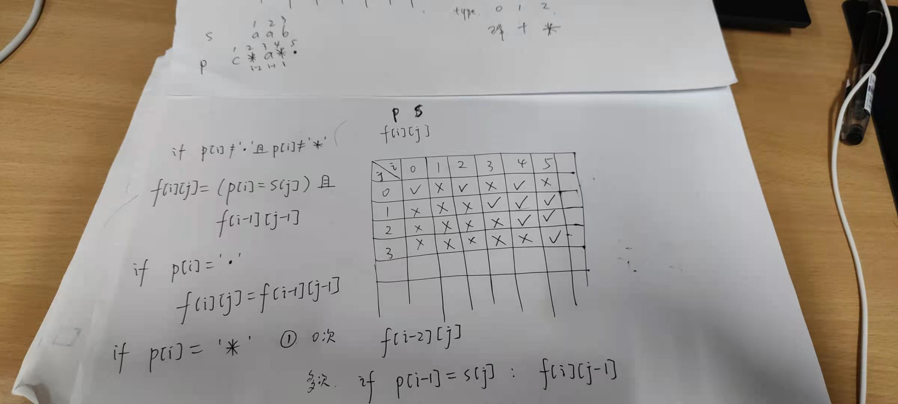

# 10. 正则表达式匹配
https://leetcode-cn.com/problems/regular-expression-matching/

感觉这题和面试腾讯的时候的括号匹配那题挺像的。

3月5号创建的，现在都24号了。。。

直接看题解吧，没什么思路。

可能是动态规划。

```
s=aab
p=c*a*b
```

`f[i][j]`表示p中前i个字符与s中前j个字符是否匹配。

```cpp

#include "leetcode.h"

class Solution {
public:
    bool isMatch(string s, string p) {
        vector<pair<char, char>> P;
        for (size_t i = 0; i < p.size(); i++) {
            if (i + 1 < p.size() && !isalpha(p[i+1])) {
                P.emplace_back(p[i], p[i+1]);
                i++;
                continue;
            }
            P.emplace_back(p[i], ' ');
        }
        P.emplace(P.begin(), ' ', ' ');
        s.insert(s.begin(), ' ');
        size_t sn = s.size(), pn = P.size();
        vector<vector<bool>> f(pn, vector<bool>(sn, false));
        f[0][0] = true;
        for (int i = 1; i <= pn; i++) {
            for (int j = 0; j <= sn; j++) {
                if (P[i].second == ' ') {
                    // p[i] match s[j]
                    if (j > 0 && P[i].first == s[j]) f[i][j] = f[i-1][j-1]; 
                } else if (P[i].second == '+') {
                    // p[i] match (1 or more) s[j]
                } else if (P[i].second == '*') {

                }
            }
        }
    }
};

int main() {
    
    return 0;
}

```


啊啊啊啊，我傻了。

没有加号，只有点号和星号。

终于过了呀呀呀呀，还是很容易理解的。

```cpp
#include "leetcode.h"

class Solution {
public:
    bool isMatch(string s, string p) {
        p.insert(p.begin(), ' ');
        s.insert(s.begin(), ' ');
        size_t sn = s.size(), pn = p.size();
        vector<vector<bool>> f(pn, vector<bool>(sn, false));
        f[0][0] = true;
        for (size_t i = 1; i < pn; i++) {
            if (p[i] == '*') f[i][0] = f[i-2][0];
            for (size_t j = 1; j < sn; j++) {
                if (p[i] == '.') {
                    f[i][j] = f[i-1][j-1];
                } else if (p[i] == '*') {
                    f[i][j] = f[i-2][j]; // match 0 times
                    if (s[j] == p[i-1] || p[i-1] == '.') f[i][j] = f[i][j] || f[i][j-1]; // match more times
                } else {
                    f[i][j] = (p[i] == s[j]) && f[i-1][j-1];
                }
            }
        }
        return f[pn-1][sn-1];
    }
};

int main() {
    assert(!Solution().isMatch("aa", "a"));
    assert(Solution().isMatch("aa", "a*"));
    assert(Solution().isMatch("ab", ".*"));
    assert(Solution().isMatch("aab", "c*a*b"));
    assert(Solution().isMatch("aab", "c*a*."));
    assert(!Solution().isMatch("mississippi", "mis*is*p*."));
    assert(Solution().isMatch("aasdfasdfasdfasdfas", "aasdf.*asdf.*asdf.*asdf.*s"));
    return 0;
}

```


草稿留念。



