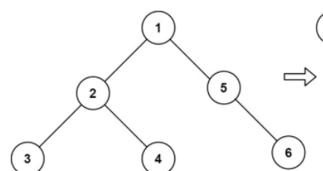
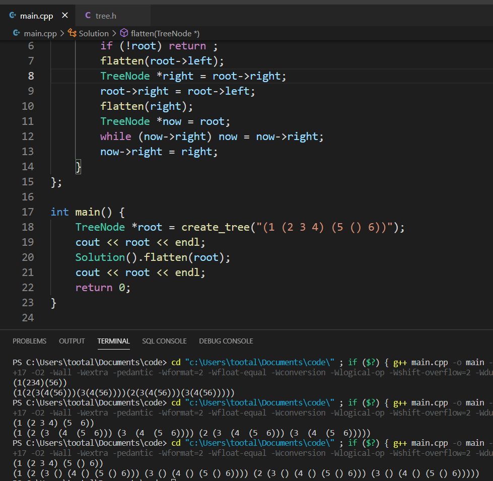
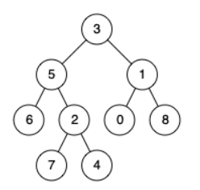

# 二叉树
## 结构体定义

```cpp
struct TreeNode {
    int val;
    TreeNode *left;
    TreeNode *right;
    TreeNode() : val(0), left(nullptr), right(nullptr) {}
    TreeNode(int x) : val(x), left(nullptr), right(nullptr) {}
    TreeNode(int x, TreeNode *left, TreeNode *right) : val(x), left(left), right(right) {}
};
```

## 打印二叉树

在控制台打印二叉树确实有些难度。

初步决定采用[方框绘制字符](https://zh.wikipedia.org/wiki/方框绘制字符)。（[万维百科-方框绘制字符](https://www.wanweibaike.com/wiki-方框绘制字符)）

效果如下所示：

```
      10
  ┌───┴───┐
  20      30
┌─┴─┐   ┌─┴─┐
40  50  60  70
```

按完全二叉树进行打印，缺少的位置空着。节点编号最大支持三位数。

## 输入二叉树

这个还是挺有难度的，毕竟是一个非线性结构，还是按照常规的套路来输入吧。

可以有提示符。



就输入每个节点的父节点编号吧，1~n默认。

比如这个就输入：

```
1 (2 3 4) (5 () 6)
```

用括号来表示也算挺直观的吧。。

主要是在控制台写图形界面太难写了，要考虑好多。。

就先这样写了。

效果差不多这个样子，感觉还行。。至少输入输出统一了。




详细描述如下：

二叉树T可以按如下方式表示：

1. 若T为空树，可表示为`()`。
2. 若T只包含一个节点，则可表示为一个数字。
3. 设T的左子树表示为L，右子树表示为R，T的数字为N，则T可表示为`(N L R)`。
4. 最终结果的最外层括号可以省略。



例如，上图可以表示为`3 (5 6 (2 7 4)) (1 0 8)`。可以很容易的在二者之间进行转换。

