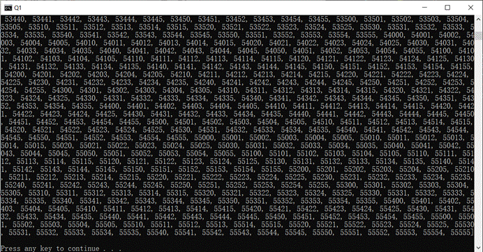
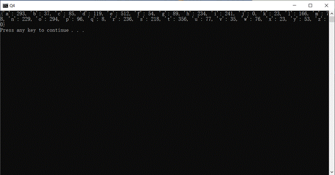
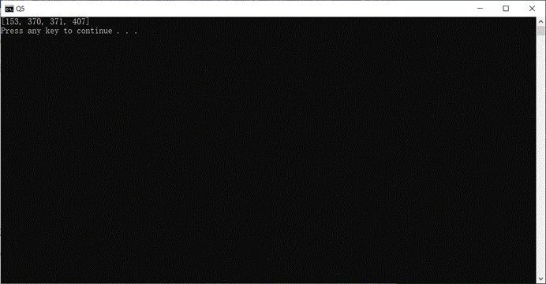

# 20190903Python实验二
            
## 一

###  问题描述

写一段程序得到由0、1、2、3、4、5组成的互不相同的合理的5位数，其中每个数字可以重复出现。

###  解题思路

使用5重循环枚举所有位。

###  源代码
```py
def valid_number():
    """
    :rtype: 结果返回为List[int]
    """
    r=[]
    for a in range(1,6):
    	for b in range(0,6):
    		for c in range(0,6):
    			for d in range(0,6):
    				for e in range(0,6):
    					r.append(a*10000+b*1000+c*100+d*10+e)
    return r
print(valid_number())
```

###  运行结果



## 二

###  问题描述

写一段程序用于移除字符串前端和后端连续的空白，空白包括空格，`\n`，`\t`。请使用字符串的**切片**实现，不能直接调用字符串的`strip`函数。请自行给出满足要求的字符串并验证所写程序。

###  解题思路

设定左右标记，过滤空白字符，再切片返回。

###  源代码
```py
def strip(string):
	"""
	:type string: str
	:rtype: str
	"""
	esp=" \n\t"
	l,r=0,len(string)
	while string[l] in esp:l+=1
	while string[r-1] in esp:r-=1
	if l>=r:return ""
	else:return string[l:r]

a=[
"abcd",
"  adsf",
"  asldkf 	",
"\n sdf\t  \t\n\n",
"\n\nsdf\n\t\n\tsdf\n  \n\t"
]
print(list(map(strip,a)))
```

###  运行结果


## 三.
###  问题描述
`Q3.py`中是一个简单的模拟洗牌发牌程序，请根据要求补全程序。

###  解题思路
使用嵌套的推导式生成所有的扑克牌，先每人发17张牌，再随机选择一个地主发最后三张牌。

###  源代码
```py
import random

def poker_game():
    """
    :rtype: List[List[str]]
    """

    # 红桃, 黑桃, 梅花, 方块
    suit = ['H', 'S', 'C', 'D']
    nums = [str(i) for i in range(1, 11)] + ['J', 'Q', 'K']

    # print(nums)

    # 请使用推导式生成所有的扑克牌，形如[H1, H2, ..., HK, S1, S2, ..., DK]
    all_cards = [str(x+y) for x in suit for y in nums]

    # 加入大小王
    all_cards += ['RJ', "BJ"]

    # 洗牌
    random.shuffle(all_cards)

    # print(all_cards)

    # 请自行设计发牌规则，为3个玩家发牌。
    # 最终结果保存在results中，其中每个list保存一个玩家的扑克牌
    results = [[] for _ in range]

    # 发牌代码写在下方

    # 采用类似斗地主发牌规则，最后三张为底牌
    for i in range:
        results[i]=all_cards[slice(i*17,(i+1)*17)]
    # 随机选择一人为地主
    results[random.randint(0,2)]+=all_cards[-3:]
    return results
print(poker_game())
```

###  运行结果


## 四
###  问题描述
统计文件`Q4.txt`中26个英文字母出现的次数并输出，文件读取代码已给出在`Q4.py`中。

###  解题思路
不区分大小写，因此先用lower转换成小写。使用字典推导式，key是a~z，对于ascii码97~122，统计采用内置函数count

###  源代码
```py
# 统计text中26个英文字母(不区分大小写)出现的次数，并输出。
def count_letter():
    """
    :rtype: 返回一个dict，其中key为英文字母，value为字母出现的次数
    """

    with open("./Q4.txt", "r") as f:
        text = f.read().lower()
        return {chr(x):text.count(chr(x)) for x in range(97,123)}
print(count_letter())
```

###  运行结果


## 五
###  问题描述
水仙花数是指一个3位数，它的每个位上的数字的3次幂之和等于它本身，例如：$1^3+5^3+3^3=153$。请编写程序求出100到999之间的所有水仙花数。代码文件命名为`Q5.py`。

###  解题思路
使用列表推导式，枚举每一位，判断是否符合。

###  源代码
```py
# 求出所有的水仙花数，并输出。
def narcissistic_number():
    """

    rtype: 返回一个list，其中包含了所有的水仙花数
    """
    return [x*100+y*10+z for x in range(1,10)
    					 for y in range(0,10)
    					 for z in range(0,10)
    		if x**3+y**3+z**3==x*100+y*10+z]
print(narcissistic_number())
```

###  运行结果

