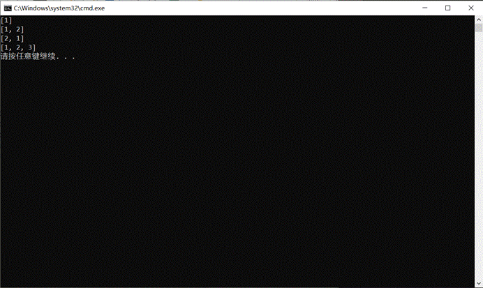
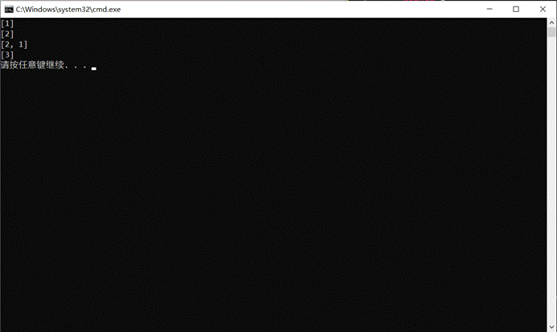
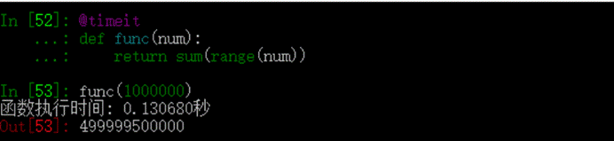
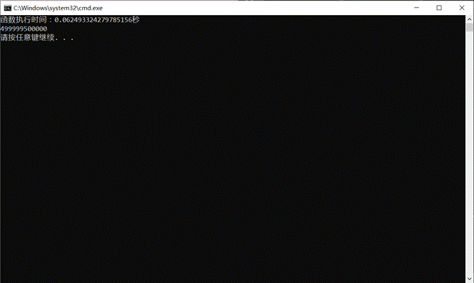

# 20190909Python实验三            
## 一
### 问题描述
1. 实现一个生成器，参数为一个可迭代对象，生成的是对该可迭代对象无限重复的数据流。比如，以字符串`'abc'`作为参数输入，最终返回的数据流为`a`，`b`，`c`，`a`，`b`，`c`....，无限循环。函数名为`cycle`，已定义在`Q1.py`文件中。
### 解题思路
先用一个无限循环，在内部遍历可迭代对象，使用yield返回
### 源代码
```py
def cycle(iterable):
	"""
	实现一个循环迭代iterable的生成器
	:type iterable: 任何可迭代的对象，可能为字符串、list等
	"""
	while True:
		for i in iterable:
			yield i
a=cycle('abc')
while True:
	print(next(a),end='')
```

### 运行结果


## 二
## 问题描述
2. 重新实现第二次实验中的第二题，定义`strip`函数，要求实现以下功能。

- 由参数`side`控制去除左侧(left)、右侧(right)或者两侧(both)的空白字符，默认为去除两侧空白字符。

- 由参数`blanks`表示哪些字符为空白字符，默认为`\["\t", "\n", " "]`

​ 请自行在`Q2.py`中定义函数，函数名为`strip`，返回对象为字符串，使用样例如下：

```python

strip(" abc ") \# 返回值为"abc"

strip(" abc ", "both") \# 返回值为"abc"

strip(" abc ", "left") \# 返回值为"abc "

strip(" abc ", side="right") \# 返回值为" abc"

strip("aaadefccc ", blanks=\["a", "c", " "\]) \# 返回值为"def"

```
## 解题思路
定义函数，使用三个参数，str、side、blanks，指定默认值。

### 源代码
```py
def strip(str,side='both',blanks=" \n\t"):
	l,r=0,len(str)
	if side=='both' or side=='left':
		while str[l] in blanks:l+=1
	if side=='both' or side=='right':
		while str[r-1] in blanks:r-=1
	return str[l:r]
print(strip("  abc   ")                        	)
print(strip("  abc   ", "both")                	)
print(strip("  abc   ", "left")                	)
print(strip("  abc   ", side="right")          	)
print(strip("aaadefccc  ", blanks=["a", "c", " "])  	)


```

### 运行结果


## 三
### 问题描述
3.运行`Q3.py`中的程序，查看结果，分析结果。
### 解题思路
运行结果：



分析：

一开始我的预期输出是：

[1]
[2]
[2,1]
[3]

运行后发现不对，从结果来看，Python函数使用默认函数参数时一直使用的是同一个。使用id函数查看b的地址：

代码：
```py
def func(a, b=[]):
    print(id(b))
    b.append(a)
    return b

if __name__ == '__main__':
    print(func(1))
    print(func(2))
    print(func(1, \[2\]))
    print(func(3))
```
运行结果：


可以发现，当使用默认参数时，一直会用同一个参数（内存地址不变）
那如何实现开始设想的结果呢？
参考：[https://www.cnblogs.com/crazyrunning/p/6867849.html](https://www.cnblogs.com/crazyrunning/p/6867849.html)
可以使用None参数，在函数内部赋值实现。
代码：
```py
def func(a, b=None):
    if b==None:b=[]
    b.append(a)
    return b
 
if __name__ == '__main__':
    print(func(1))
    print(func(2))
    print(func(1, [2]))
    print(func(3))
```
运行结果：



## 四
### 问题描述
1. 实现一个装饰器，用于计算一个函数的运行时间，并输出。装饰器函数名为`timeit`，已定义在`Q4.py`文件中。使用样例如下：



### 解题思路
分析：定义一个装饰器，内部函数统计func的运行时间，同时处理参数和返回值。
### 源代码
```py
import time

def timeit(func):
	"""
	:type func: 一个函数
	"""
	def inner(num):
		start=time.time()
		ret=func(num)
		end=time.time()
		print('函数执行时间：'+str(end-start)+'秒')
		return ret
	return inner


@timeit
def func(num):
	return sum(range(num))

print(func(1000000))
```

### 运行结果


