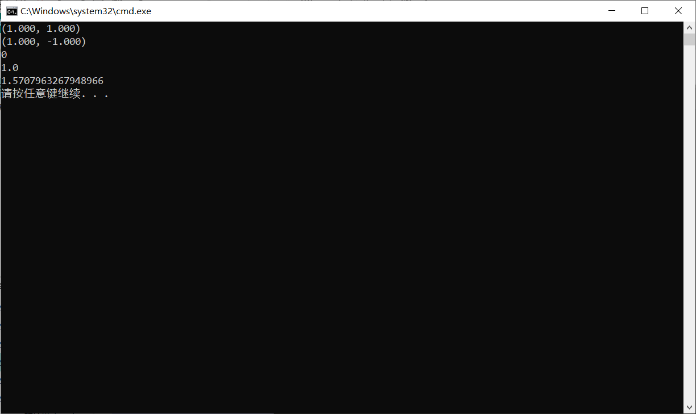
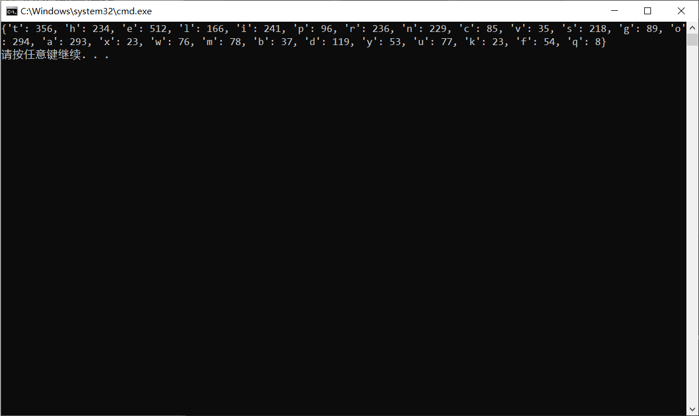
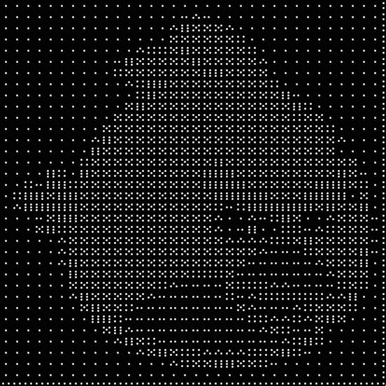
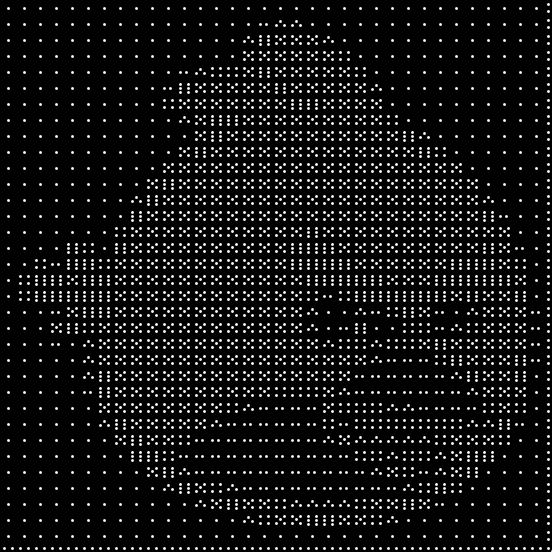
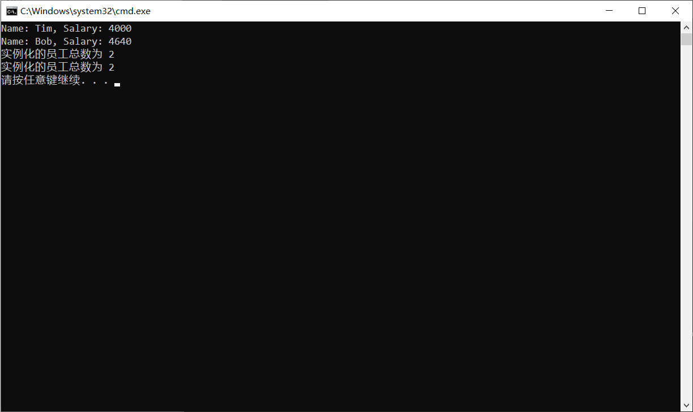

# 20190918Python实验四
## 实验一
### 问题描述
实现一个二维向量类，类名为`Vector2D`。该类由两个变量`x`、`y`初始化，表示当前向量的坐标。根据以下要求定制`Vector2D`类：

   - 实现`__add__`方法：实现向量的加法
   - 实现`__sub__`方法：实现向量的减法
   - 实现`__mul__`方法：实现向量的数量积
   - 实现`__abs__`方法：返回向量的模长
   - 实现`__str__`方法：返回`Vector2D`对象的字符串表示

   另外`Vector2D`类还应该包含有以下方法：

   - `angle(Vector2D)`：该方法以弧度制返回两个向量的夹角，参数类型为`Vector2d`

### 解题思路
按描述定义类，并设计一些测试数据测试。

### 源代码
```py
import math
class Vector2D:
	def __init__(self,x=0,y=0):
		self.x=x
		self.y=y

	def __add__(self,other):
		return Vector2D(self.x+other.x,self.y+other.y)
	
	def __sub__(self,other):
		return Vector2D(self.x-other.x,self.y-other.y)
	
	def __mul__(self,other):
		return self.x*other.x+self.y*other.y
	
	def __abs__(self):
		return math.sqrt(self.x*self.x+self.y*self.y)

	def __str__(self):
		return '(%.3f, %.3f)'%(self.x,self.y)

	def angle(self,other):
		return math.acos(self*other/abs(self)/abs(other))

a=Vector2D(1,0)
b=Vector2D(0,1)
print(a+b)
print(a-b)
print(a*b)
print(abs(a))
print(a.angle(b))
```

### 运行结果
  

## 实验二
### 问题描述
使用`Collections.Counter`重做第二次实验中的第四题。
### 解题思路
直接用Counter统计所有字符出现次数，再剔除非字母字符。  
### 源代码
```py
from collections import Counter
# 使用Collections.Counter统计text中26个英文字母(不区分大小写)出现的次数，并输出。
def count_letter():
	"""
	:rtype: 返回一个dict，其中key为英文字母，value为字母出现的次数
	"""
	with open("./Q2.txt", "r") as f:
		c=dict(Counter(f.read().lower()))
		return {x:c[x] for x in c if x.isalpha()}
print(count_letter())
```
### 运行结果
  

## 实验三
### 问题描述
使用`PIL`模块将`Q3`文件夹中的图片1-6模拟画出图片`bird.jpg`。效果如下：
  
  

### 解题思路
先读入图片文件，转化为灰度图，再读入6个替换图片文件，将图片转换为numpy数组，将图片按16*16大小分割，计算每一块平均值（使用numpy.mean)，转换到0-5，六个等级上，用对应图片替换。  
### 源代码
```py
import numpy
from PIL import Image
im=Image.open("Q3/bird.jpg").convert(mode='L')
ims=[]
for i in range(6):
	ims.append(Image.open('Q3/'+str(i+1)+'.jpg'))
a=numpy.array(im)
for i in range(0,im.size[0],16):
	for j in range(0,im.size[1],16):
		box=(i,j,i+16,j+16)
		reg=im.crop(box)
		lv=int(5-numpy.mean(numpy.array(reg))//43)
		im.paste(ims[lv],box)
im.save('Q3/convert_bird.jpg')
```

### 运行结果
  

## 实验四
### 问题描述
定义一个`Employee`类，该类有个全局变量`empCount`，有两个基本属性`name`和`salary`，有个`displayCount`函数，用于输出该类实例化对象的个数，有个`displayEmployee`函数，用于输出实例化对象的`name`和`salary`，请补齐`Q4.py`并运行得到结果。

### 解题思路
使用Employee.empCount访问类内全局变量。  
### 源代码
```py
class Employee(object):
    "所有员工的基类"
    empCount = 0  # 全局变量，用于统计实例化的员工总数

    def __init__(self, name, salary):
        # 请补齐该函数，每初始化一个实例，empCount要自增1
        Employee.empCount+=1
        self.name=name
        self.salary=salary

    def displayCount(self):
        print("实例化的员工总数为 %d" % Employee.empCount)  # 输出实例化的员工总数

    def displayEmployee(self):
        print("Name: {0}, Salary: {1}".format(self.name, self.salary))  # 输出实例化对象的信息


# 创建Employee类的第一个对象
emp1 = Employee("Tim", 4000)
# 创建Employee类的第二个对象
emp2 = Employee("Bob", 4640)
# 输出Tim的信息
emp1.displayEmployee()
# 输出Bob的信息
emp2.displayEmployee()
# 输出Employee类实例化的对象总数
emp1.displayCount()
emp2.displayCount()

```

### 运行结果
  
