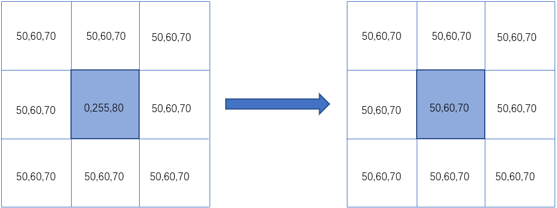
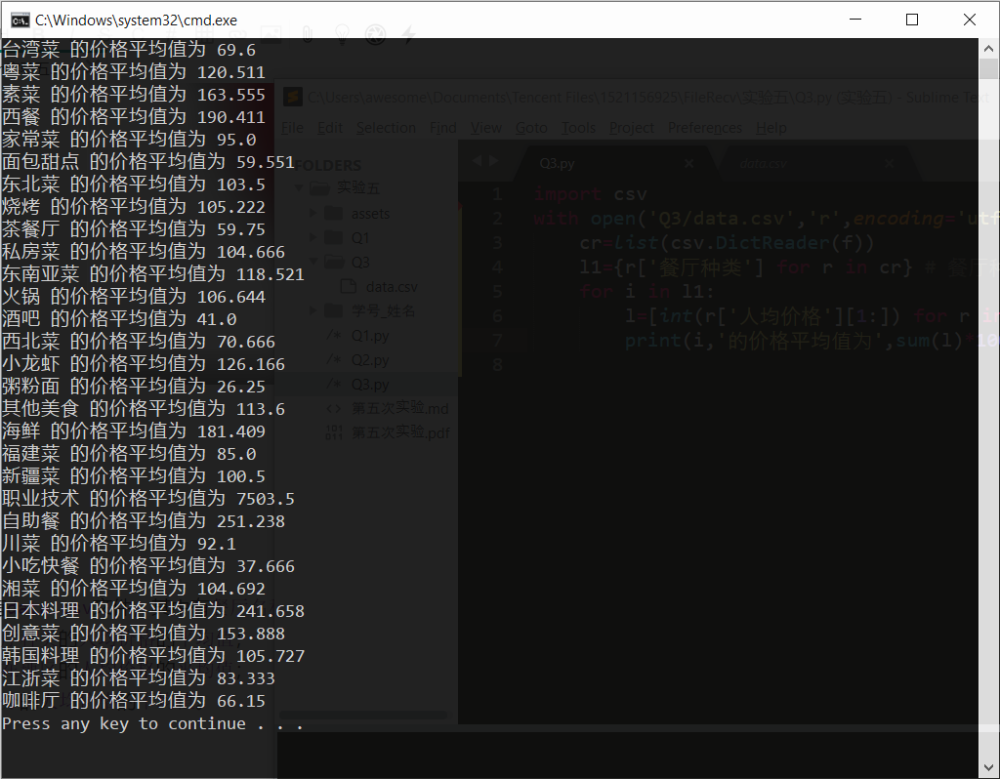
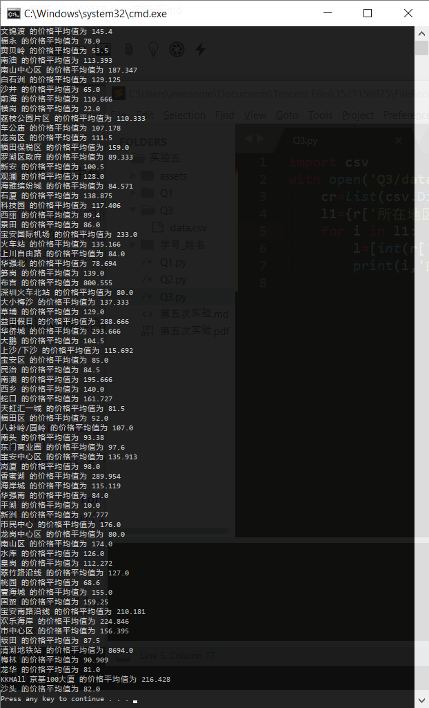
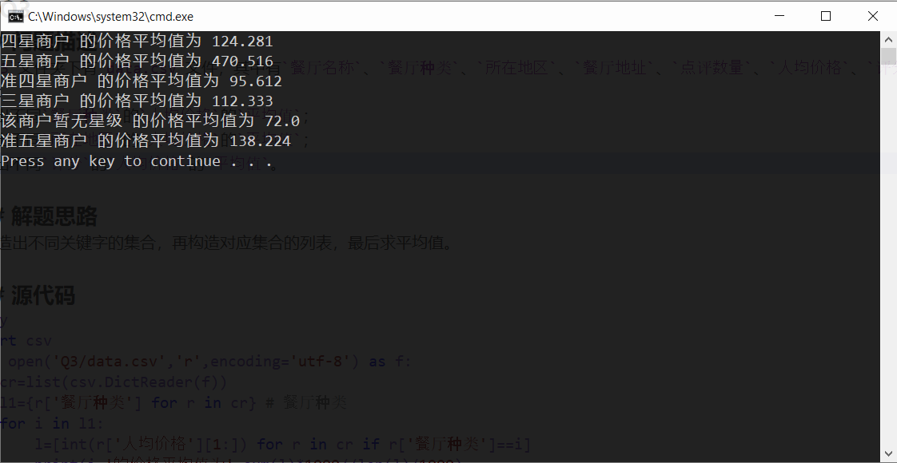

# 20190925Python实验五
## Q1
### 问题描述

1. 可以使用`numpy`直接将`PIL.Image`对象转为像素矩阵，得到的是一个三维矩阵，代码如下：

   ```python
   from PIL import Image
   import numpy as np
   pixel_mat = np.array(Image.open("bird.jpg"))
   ```

   同时也可以将`ndarray`对象转为`Image`对象，

   ```python
   img = Image.fromarray(pixel_mat)
   img.show()
   ```

   读取`Q1`文件夹中的图像`bird.jpg`，转为`ndarray`对象，分别对其进行如下操作，查看图像效果：

   - 对`ndarray`对象执行`sort`函数
   - 对`ndarray`对象执行`transpose((0, 1, 2))`
   - 使用`255`减去`ndarray`对象（反相效果）
   - 等等（自行探索）

### 解题思路
按照提示进行。

### 源代码
```py
from PIL import Image
import numpy as np
pixel_mat=np.array(Image.open("Q1/bird.jpg"))
# pixel_mat.sort()
# pixel_mat.transpose((0,1,2))
img=Image.fromarray(255-pixel_mat)
img.show()
```

### 运行结果
  
  
  


## Q2
### 问题描述
2. 高斯模糊的简单原理可以看作是每一个像素都取周围像素的平均值，如果这个选取的半径越大，得到的效果越模糊。如下图，左边中间的像素值经过高斯模糊计算得到右边的结果。
  


   实现一个函数，可以对图像进行高斯模糊。函数已经定义在`Q2.py`文件中，参数`pixels`是一个表示图像的`ndarray`对象，参数`radius`表示高斯模糊的程度，类型为`int`，要求返回值依然为一个表示图像的`ndarray`对象。

### 解题思路
对矩阵中每一个元素计算平均值。  

### 源代码
```py
from PIL import Image
import numpy as np


def gaussian_blur(pixels, radius):
	ret=pixels.copy()
	area=(2*radius+1)*(2*radius+1)
	for k in range(pixels.shape[2]):
		for i in range(pixels.shape[0]):
			for j in range(pixels.shape[1]):
				s=0
				for rx in range(-radius,radius+1):
					for ry in range(-radius,radius+1):
						try:s=s+pixels[i+rx][j+ry][k]
						except IndexError:pass
				ret[i][j][k]=(s-pixels[i][j][k])//(area-1)
	return ret

img_mat=np.array(Image.open('Q1/bird.jpg'))
Image.fromarray(gaussian_blur(img_mat,1)).show()
```
### 运行结果
  

  

  
  

## Q3
### 问题描述
3. `Q3`文件夹下有`data.csv`文件，其中有`餐厅名称`、`餐厅种类`、`所在地区`、`餐厅地址`、`点评数量`、`人均价格`、`评分`七个字段，现要求：
1.输出不同`餐厅种类`的`人均价格`的`平均值`；
2.输出不同`所在地区`的`人均价格`的`平均值`；
3.输出不同`评分`的`人均价格`的`平均值`。

### 解题思路
先构造出不同关键字的集合，再构造对应集合的列表，最后求平均值。  

### 源代码
```py
import csv
with open('Q3/data.csv','r',encoding='utf-8') as f:
	cr=list(csv.DictReader(f))
	l1={r['餐厅种类'] for r in cr} # 餐厅种类
	for i in l1:
		l=[int(r['人均价格'][1:]) for r in cr if r['餐厅种类']==i]
		print(i,'的价格平均值为',sum(l)*1000//len(l)/1000)
```
剩余两问只需把餐厅种类改成所在地区和评分即可。  

### 运行结果
  


  
  
