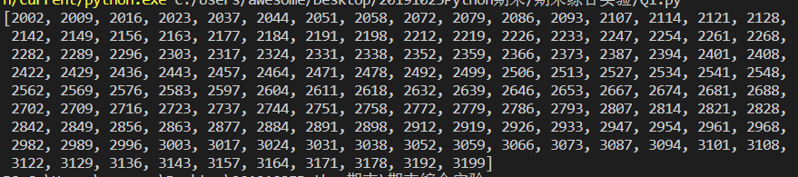
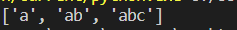
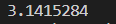
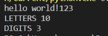
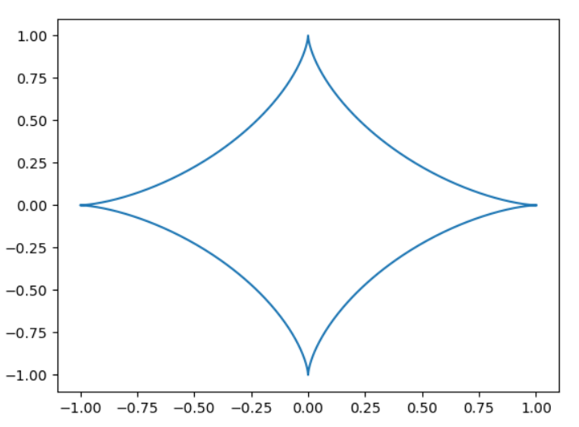

# 20191025Python期末综合实验
## 1
### 问题描述
1. 编写一个程序，找出$[2000,3200]$之间所有能被7整除但不是5的倍数的数字，返回列表。

### 解题思路
使用for循环遍历2000到3200内的所有整数，逐个判断添加到列表中。

### 源代码
```py
def div_7_mul_5(begin=2000, end=3200):
    l = []
    for i in range(begin,end+1):
        if i%7==0 and i%5!=0:
            l.append(i)
    return l
print(div_7_mul_5())
```
### 运行结果


## 2
### 问题描述

2. 使用`python`实现选择排序，要求是非原地排序，顺序由小到大。函数命名为`selection_sort`，已定义在`Q2.py`文件中。该函数返回一个`list`，含有排序后的所有元素。该函数第一个参数`iterable`为要求被排序的对象，是一个可迭代对象。第二个参数`comparator`为一个函数对象，该函数对象接受两个参数，比如`x`和`y`。如果该函数对象调用后返回值小于0，说明`x < y`；如果返回值等于0，说明`x == y`，否则`x > y`。具体实例：

   ```python
   selection_sort(["ab", "abc", "a"], comparator=lambda x,y: len(x)-len(y))
   # 返回值：["a", "ab", "abc"]
   ```

### 解题思路
首先使用copy将列表复制一份到新列表r，用n表示列表长度，接着循环n-1次，第i次找出后n-i+1个中最小的元素交换到最前面。

### 源代码
```py
def selection_sort(iterable, *, comparator):
    """
    :type iterable: 可迭代对象
    :type comparator: 接受两个参数的函数对象
    :rtype: list
    """
    r=iterable.copy()
    n=len(r)
    for i in range(n-1):
        t=i
        for j in range(i+1,n):
            if comparator(r[j],r[t])<0:
                t=j
        r[i],r[t]=r[t],r[i]
    return r
print(selection_sort(["ab", "abc", "a"], comparator=lambda x,y: len(x)-len(y)))
# print(selection_sort([2,5,4,3,1], comparator=lambda x,y: y-x))
# 返回值：["a", "ab", "abc"]

```
### 运行结果


## 3
### 问题描述

3. 定义一个类`InputOutString`，该类有两种方法：1.`getString`，用于从终端得到用户输入的字符串(利用input)；2.`printString`，将得到的字符串以大写形式打印出来(利用print)。

### 解题思路
定义一个成员变量str存储字符串，使用upper转换成大写。

### 源代码
```py
class InputOutString(object):
    def __init__(self):
        self.str=''
    def getString(self):
        self.str=input()
    def printString(self):
        print(self.str.upper())


strObj = InputOutString()  # 实例化
strObj.getString()  # 从终端输入字符串，例如gone with the wind
strObj.printString()  # 以大写形式打印出字符串，例如GONE WITH THE WIND

```
### 运行结果


## 4
### 问题描述

4. 有一种粗略的求解$\pi$的方法，是一种基于蒙特卡洛的方法：往一个正方形中多次随机的撒点，最终统计落在该正方形的内切圆中的点的比例，从而可以得到该内切圆的面积，然后根据公式$S=\pi r^2$可以求得$\pi$的近似值。请使用内置模块`random`或者`numpy.random`写一段模拟程序，求解$\pi$的近似值。函数`get_pi`已经定义在`Q4.py`中，返回值为一个浮点数。

### 解题思路
使用random生成times次随机点的x,y坐标（在0~1中），落在长度为1的正方形中，统计在内切圆中的点的数目count，根据面积比例得出$\pi=\frac{4\times count}{times}$。
### 源代码
```py
from random import random
from math import sqrt
def get_pi():
    """
    :rtype: float
    """
    times=10000000 # 模拟次数
    count=0
    for _ in range(times):
        x,y=random(),random()
        if sqrt((x-0.5)*(x-0.5)+(y-0.5)*(y-0.5))<=0.5:
            count+=1
    return 4*count/times
print(get_pi())
```
### 运行结果


## 5
### 问题描述

5.  编写一个程序，从终端输入一个句子，并计算字母和数字的数量。 假设输入为：

   ~~~
   hello world! 123
   ~~~

   则输出为：

   ~~~
   LETTERS 10
   DIGITS 3
   ~~~

### 解题思路
读入字符串s，利用ASCII码依次判断字符类型进行统计。

### 源代码
```py
s=input()
letters=0
digits=0
for i in s:
    if ord(i)>=ord('0') and ord(i)<=ord('9'):digits+=1
    if ord(i)>=ord('a') and ord(i)<=ord('z'):letters+=1
    if ord(i)>=ord('A') and ord(i)<=ord('Z'):letters+=1
print('LETTERS',letters)
print('DIGITS',digits)
```
### 运行结果


## 6
### 问题描述

6. 使用`numpy`及`matplotlib`模块绘制星形线(圆内旋轮线)，该曲线的公式如下：

$$
x = acos^3(\theta) \\
y = asin^3(\theta) \\
0 \leq \theta \leq 2\pi \\
a = 1
$$
​       函数`plot_star`已经定义在`Q6.py`文件中。
### 解题思路
使用np.linspace生成0~2 $\pi$的均匀序列（1000个），再计算出对应的x，y值，调用plt.plot画图。

### 源代码
```py
import numpy as np
import matplotlib.pyplot as plt
def plot_star():
    pi=3.1415926
    a=1
    theta=np.linspace(0,2*pi,1000)
    x=a*np.cos(theta)*np.cos(theta)*np.cos(theta)
    y=a*np.sin(theta)*np.sin(theta)*np.sin(theta)
    plt.plot(x,y)
    plt.show()
plot_star()
```
### 运行结果


