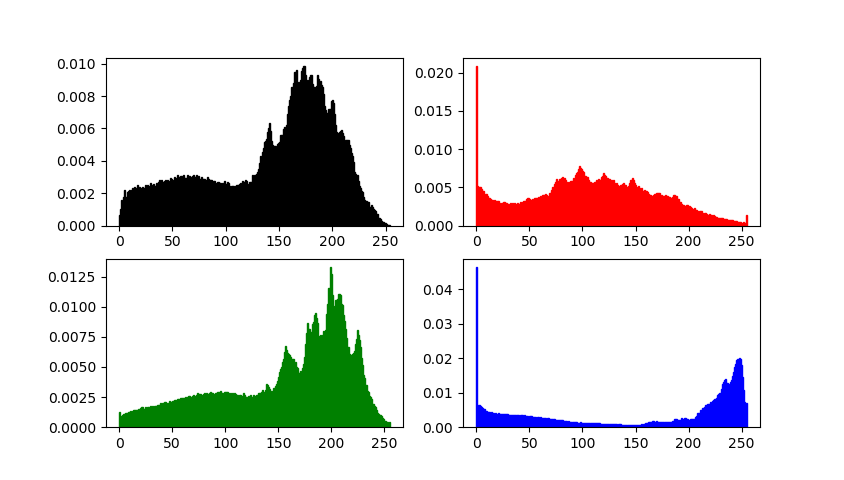
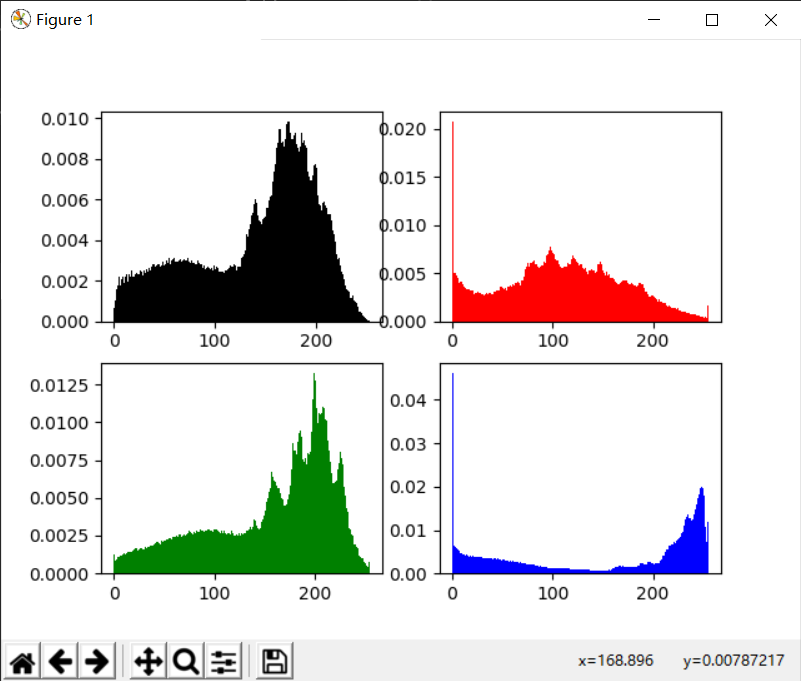
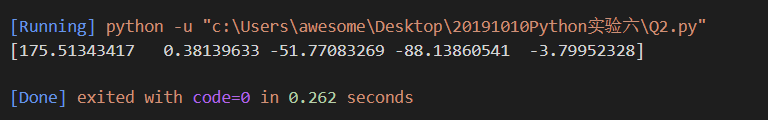
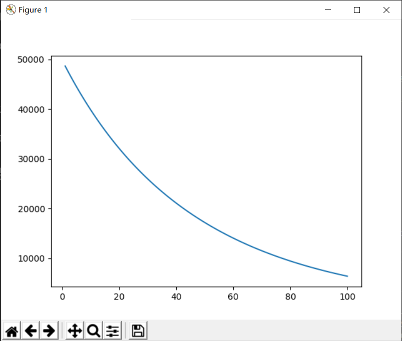

# 20191007Python实验六
## Q1
### 问题描述
1. `Photoshop`中有一个功能可以查看一个图像的直方图，图像的直方图分为灰度直方图以及RGB三原色各一种，反映的是0到255出现的频率。现给定`Q1`文件夹下的`scut.jpg`，请结合`PIL`，`numpy`以及`matplotlib`将四种直方图绘制在四个子图中，请在`image_hist`函数中绘制，参数`img`为`PIL.Image`对象，无返回值。示例(该示例不是`scut.jpg`)效果如下：

### 解题思路
首先构造一个数组imgs，保存灰度图、R、G、B图，再定义一个数组cols指定颜色，再用一个循环分别处理，绘制子图采用plt.subplot，绘制直方图采用plt.hist，直方图数据为单通道图像转换成numpy的array数组再扩展成一维（利用flatten）,设定直方图个数为255，指定density=True（统计频率）和颜色。

### 源代码
```py
from PIL import Image
import numpy as np
import matplotlib.pyplot as plt

def image_hist(img):
    imgs=[img.convert("L")]+list(img.split())
    cols=['black','red','green','blue']
    for i in range(4):
        plt.subplot(2,2,i+1)
        plt.hist(np.array(imgs[i]).flatten(),bins=255,density=True,color=cols[i])
    plt.show()
    

image_hist(Image.open('Q1/scut.jpg'))
```

### 运行结果


## Q2
### 问题描述
2. (线性代数的应用)机器学习中，最简单的回归算法是`LinearRegression`，其优化目标是$\min_w \frac{1}{2m}||Xw-y||^2$，其中$X \in \mathbb{R}^{m \times (d+1)}$，$w \in \mathbb{R}^{(d+1) \times 1}$，$y \in \mathbb{R}^{m \times 1}$，$m$表示样本数量，$d$表示样本特征数量，对$w$求导并令等式为0，得出$w=(X^TX)^{-1}X^Ty$。现利用`numpy`求解$w$，其中会使用到`np.dot`(求矩阵内积)、`np.linalg.pinv`(求矩阵的逆)。请完成`Q2.py`。

### 解题思路
按照公式计算w的值。
### 源代码
```py
import numpy as np
def calculate_w(X):
    """
    X为样本矩阵，维度为m*d
    rtype: 返回w
    """
    X = np.c_[np.ones(X.shape[0]), X]  # 给X第一列增加一列1，X维度变为m*(d+1)
    w = np.dot(np.dot(np.linalg.pinv(np.dot(X.T,X)),X.T),y) # 依据公式求解w
    return w


X = np.array([[2104,5,1,45],[1416,3,2,40],[1534,3,2,30],[852,2,1,36]])
y = np.array([460,232,315,172])
print(calculate_w(X))

```
### 运行结果


## Q3
### 问题描述
3. (线性代数的应用)机器学习中，最简单的回归算法是`LinearRegression`，其优化目标是$\min_w \frac{1}{2m}||Xw-y||^2$，其中$X \in \mathbb{R}^{m \times (d+1)}$，$w \in \mathbb{R}^{(d+1) \times 1}$，$y \in \mathbb{R}^{m \times 1}$，$m$表示样本数量，$d$表示样本特征数量。现在用`梯度下降`的方法来求解$w$，$w$的更新公式为$w(t)=w(t-1)-\eta \cdot \frac{1}{m}\cdot X^T(Xw-y)$，其中$t$为第$t$次迭代。现结合`numpy`和`matplotlib`，按如下要求求解$f(w)$并画图：

   (1) 令$w(0)=np.random.randn(d+1)$，$\eta=0.01$

   (2) $t=1$，$w(1)=w(0)-\eta \cdot \frac{1}{m}\cdot X^{T}(Xw(0)-y)$，计算$f(w(1))=\frac{1}{2m}(Xw(1)-y)^T(Xw(1)-y)$

   (3) $t=2$，$w(2)=w(1)-\eta \cdot \frac{1}{m}\cdot X^{T}(Xw(1)-y)$，计算$f(w(2))=\frac{1}{2m}(Xw(2)-y)^T(Xw(2)-y)$

   ... ...

   直到$t=100$。

   得到横轴$t \in \{1,2,3,4,...,100\}$，纵轴$f(w)=\{f(w(1)),f(w(2)),...,f(w(100))\}$，画出变化曲线。

   请完成`Q3.py`。


### 解题思路
按题目公式计算出迭代100的值存放在一个数组里，最后用plot画图。
### 源代码
```py
import numpy as np
from matplotlib import pyplot as plt

X = np.array([[2104,5,1,45],[1416,3,2,40],[1534,3,2,30],[852,2,1,36]])
X = (X-np.mean(X,axis=0))/np.std(X,axis=0)
X = np.c_[np.ones(X.shape[0]), X]  # 给X第一列增加一列1，X维度变为m*(d+1)
y = np.array([460,232,315,172])

# 请按照题目要求完成代码
m,n = X.shape[0],X.shape[1]
w = np.random.randn(n)  # 初始化w(0)
eta = 0.01  # 步长
f = []  # 用于存储100次迭代的f(w)

for t in range(100):  # 迭代100次
    w=w-eta/m*np.dot(X.T,(np.dot(X,w)-y))
    f.append(1/(2*m)*np.dot((np.dot(X,w)-y).T,np.dot(X,w)-y))
plt.plot(range(1,101),f)
plt.show()
```
### 运行结果

