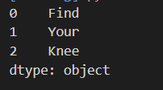
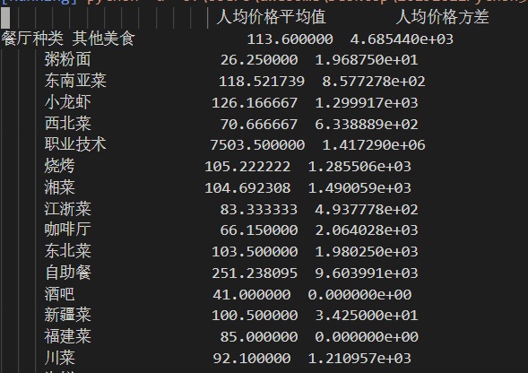

# 20191012Python实验七
## Q1
### 问题描述
1. 给定字符串`'abcdefghijklmnopqrstuvwxyz'`和`1~26`共26个数字，现要求：1.构建两个`Series`，分别为ser1和ser2，ser1的values为上述字符串中的所有字母，ser2的values为上述26个数字；2.将上述两个Series合成一个`DataFrame`，即`DataFrame`的两列为ser1和ser2。
### 解题思路
按照题意构建Series和DateFrame。

### 源代码
```py
import pandas as pd
ser1=pd.Series([chr(x) for x in range(ord('a'),ord('z')+1)])
ser2=pd.Series(range(1,27))
df=pd.DataFrame({'ser1': ser1, 'ser2': ser2})
print(df)
```
### 运行结果

## Q2
2. 给定`Series` `ser=pd.Series(['fInD','yoUR','KNEE'])`，编写程序使`ser`中每个单词的首字母大写。

### 解题思路
通过ser.keys获取键列表，使用for循环遍历，利用字符串切片及lower、upper函数实现单词大小写转换。

### 源代码
```py
import pandas as pd
ser=pd.Series(['fInD','yoUR','KNEE'])
for s in ser.keys():
    ser[s]=ser[s][0].upper()+ser[s][1:].lower()
print(ser)
```

### 运行结果


## Q3
3. 利用`Pandas`重写`实验五`第3题。`Q3`文件夹下有`data.csv`文件，其中有`餐厅名称`、`餐厅种类`、`所在地区`、`餐厅地址`、`点评数量`、`人均价格`、`评分`七个字段，现要求：

1.得出不同`餐厅种类`的`人均价格`的`平均值`和`方差`；
2.得出不同`所在地区`的`人均价格`的`平均值`和`方差`；
3.得出不同`评分`的`人均价格`的`平均值`和`方差`。

将上述结果展示在一个`DataFrame`中。

### 解题思路
考虑到三种情况仅key值不同，因此抽象出一个函数get来处理。
以餐厅种类为例，首先用set提取出不同的餐厅种类保存在keys中，再遍历keys，将餐厅种类构造一个元组保存至index列表，计算每种餐厅种类的平均值和方差，分别放在mean、var列表中。
最终从元组生成多级索引构造Series，再由Series构造DataFrame。

### 源代码
```py
import pandas as pd 
import numpy as np 
cr=pd.read_csv('Q3/data.csv')
index=[]
mean=[]
var=[]
def get(k):
    keys=list(set(cr[k].values))
    for r in keys:
        v=cr[cr[k]==r]['人均价格'].values
        a=list(map(lambda x:int(x[1:]),v))
        index.append((k,r))
        mean.append(np.mean(a))
        var.append(np.var(a))

for _ in ['餐厅种类','所在地区','评分']:get(_)
df=pd.DataFrame({
    '人均价格平均值': pd.Series(mean,index=pd.MultiIndex.from_tuples(index)),
    '人均价格方差': var
})
pd.set_option('display.max_rows',None)
print(df)

```
### 运行结果
部分数据截图：

完整输出数据粘贴如下：
```
                         人均价格平均值        人均价格方差
餐厅种类 其他美食             113.600000  4.685440e+03
     粥粉面               26.250000  1.968750e+01
     东南亚菜             118.521739  8.577278e+02
     小龙虾              126.166667  1.299917e+03
     西北菜               70.666667  6.338889e+02
     职业技术            7503.500000  1.417290e+06
     烧烤               105.222222  1.285506e+03
     湘菜               104.692308  1.490059e+03
     江浙菜               83.333333  4.937778e+02
     咖啡厅               66.150000  2.064028e+03
     东北菜              103.500000  1.980250e+03
     自助餐              251.238095  9.603991e+03
     酒吧                41.000000  0.000000e+00
     新疆菜              100.500000  3.425000e+01
     福建菜               85.000000  0.000000e+00
     川菜                92.100000  1.210957e+03
     海鲜               181.409091  5.854333e+03
     韩国料理             105.727273  9.011074e+02
     茶餐厅               59.750000  8.418750e+01
     日本料理             241.658333  6.114072e+04
     火锅               106.644628  2.922642e+03
     粤菜               120.511111  9.189583e+03
     台湾菜               69.600000  1.503040e+03
     西餐               190.411765  3.395558e+04
     创意菜              153.888889  2.143810e+04
     素菜               163.555556  1.054002e+04
     家常菜               95.000000  0.000000e+00
     小吃快餐              37.666667  1.785556e+02
     私房菜              104.666667  1.470889e+03
     面包甜点              59.551020  2.169390e+03
所在地区 南澳               195.666667  1.533556e+03
     新安               100.500000  1.116250e+03
     沙头                82.000000  0.000000e+00
     火车站              135.166667  3.018472e+03
     岗厦                98.000000  0.000000e+00
     宝安国际机场           233.000000  0.000000e+00
     皇岗               112.272727  2.662744e+03
     桃园                68.600000  3.386400e+02
     布吉               800.555556  3.800817e+06
     黄贝岭               53.500000  1.822500e+02
     天虹汇一城             81.500000  2.250000e+00
     福永                78.000000  0.000000e+00
     草埔               129.000000  0.000000e+00
     白石洲              129.125000  3.721109e+03
     宝安中心区            135.913043  8.405210e+03
     南山区              174.000000  1.795800e+04
     新洲                97.777778  3.495062e+02
     景田                86.000000  6.750000e+01
     坂田                87.500000  2.862500e+02
     益田假日             288.666667  5.035756e+04
     深圳火车北站            80.000000  0.000000e+00
     观澜               128.000000  0.000000e+00
     清湖地铁站           8694.000000  0.000000e+00
     宝安南路沿线           210.181818  4.899233e+04
     南头                93.380952  1.473664e+03
     大鹏               104.500000  9.922500e+02
     华强北               78.694444  1.477823e+03
     石厦               138.875000  7.970609e+03
     宝安区               85.000000  0.000000e+00
     蛇口               161.727273  3.105226e+04
     沙井                65.000000  0.000000e+00
     罗湖区政府             89.333333  3.695556e+02
     八卦岭/园岭           107.000000  1.026167e+03
     华强南               84.000000  4.100000e+01
     KKMAll 京基100大厦   216.428571  5.204367e+04
     壹海城              155.000000  0.000000e+00
     民治                84.500000  8.042500e+02
     南山中心区            187.347826  5.570275e+04
     上沙/下沙            115.692308  5.226059e+03
     文锦渡              145.400000  3.953840e+03
     梅林                90.909091  2.162901e+03
     欢乐海岸             224.846154  6.654598e+04
     福田区               52.000000  7.840000e+02
     海雅缤纷城             84.571429  1.453878e+02
     市中心区             156.395349  1.607429e+04
     车公庙              107.178571  2.792290e+03
     东门商业圈             97.600000  2.035440e+03
     南油               113.393939  3.432360e+03
     海岸城              115.119048  5.524581e+03
     科技园              117.406250  5.220491e+03
     华侨城              293.666667  9.439422e+04
     国贸               159.250000  5.521854e+03
     横岗                22.000000  0.000000e+00
     龙华                81.000000  6.252000e+02
     市民中心             176.000000  5.216000e+03
     上川自由路             84.000000  0.000000e+00
     西丽                89.400000  8.640400e+02
     水库               126.000000  0.000000e+00
     荔枝公园片区           110.333333  8.415556e+02
     龙岗区              111.500000  2.250000e+00
     龙岗中心区             80.000000  3.284000e+02
     福田保税区            159.000000  0.000000e+00
     平湖                10.000000  0.000000e+00
     翠竹路沿线            127.000000  0.000000e+00
     笋岗               139.000000  3.495500e+03
     香蜜湖              289.954545  1.033659e+05
     西乡               140.000000  2.908571e+03
     前海               110.666667  1.088889e+01
     大小梅沙             137.333333  2.688222e+03
评分   四星商户             124.281437  8.587615e+03
     五星商户             470.516129  1.785572e+06
     三星商户             112.333333  9.884222e+03
     该商户暂无星级           72.000000  0.000000e+00
     准五星商户            138.224756  1.535124e+04
     准四星商户             95.612903  3.053140e+03

```