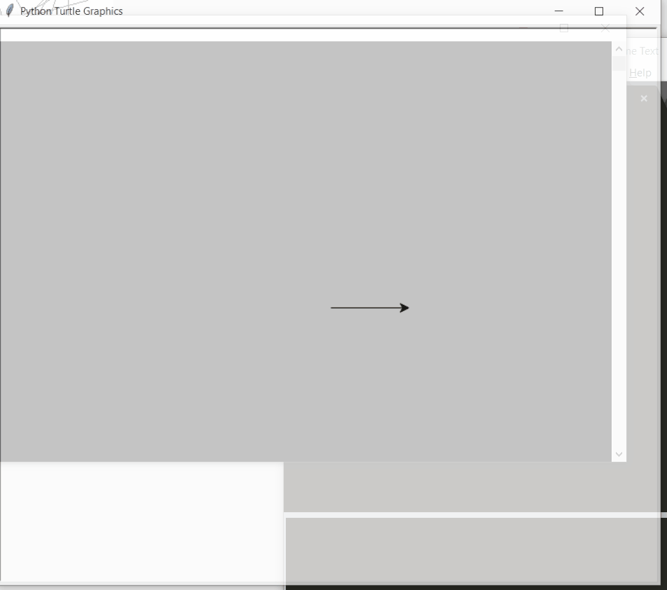
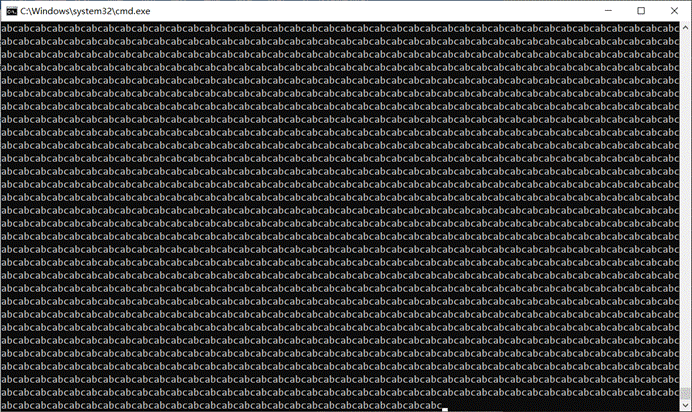

# 20191021Python作业总结1-6
# 实验一报告
## 1
### 问题描述
在编程过程中，遵循一套代码风格是十分必要的。请阅读python代码规范PEP8(https://www.python.org/dev/peps/pep-0008/)。修改如下代码直至其成功运行。源代码文件命名为`Q1.py`。
   ~~~python
   # 如下代码用于判断奇偶数
   numbers = [12, 37, 5, 42, 8, 3];
   even = [];
   odd = [];
   while len(numbers) > 0
       number = numbers.pop();
       if(number % 2 == 0):
       even.append(number);
       else:
       odd.append(number);
   print "even: ", even
   print "odd: ", odd
   ~~~

### 解题思路
主要步骤有：  
* 去除末尾分号
* 添加末尾引号
* 正确缩进
* 添加`print`函数括号

### 源代码
```cpp
# 如下代码用于判断奇偶数
numbers = [12, 37, 5, 42, 8, 3]
even = []
odd = []
while len(numbers) > 0:
    number = numbers.pop();
    if(number % 2 == 0):
        even.append(number)
    else:
        odd.append(number)
print("even: ", even)
print("odd: ", odd)
```
### 运行结果
  

## 2
### 问题描述
使用`if-elif-else`结构，输入一个[0, 100]的成绩，输出该成绩的等级。[90, 100]为A，[80, 90)为B，[70, 80)为C，[0, 70)为D。源代码文件命名为`Q2.py`。
### 解题思路
依次判断A、B、C、D。  

### 源代码
```py
def grade(score):
    """
    score为输入的成绩
    """
    # 补充代码，return该成绩的等级
    if score>=90:
        return 'A'
    elif score>=80:
        return 'B'
    elif score>=70:
        return 'C'
    else:
        return 'D'


print(grade(97))
print(grade(83))
print(grade(77))
print(grade(54))

```
### 运行结果
  


## 3
### 问题描述
python的整数是任意精度的，不会像C/C++/Java存在溢出的问题(只要内存足够)。使用`for`循环对10到100,000进行求和。源代码文件命名为`Q3.py`。
### 解题思路
使用for循环遍历10到100,000，每次将循环变量加到result变量中。  

### 源代码
```py
def for_sum(start=10,end=100000):
    """
    对start到end利用for循环求和，返回求和结果
    """
    result = 0
    # 补充代码完成求和
    for i in range(start,end+1):
        result += i
    return result

print(for_sum(10,100000))

```
### 运行结果
  

## 4
### 问题描述
使用`turtle`模块绘制如下图形。源代码文件命名为`Q4.py`。  
  

### 解题思路
首先定义一个画正方形的函数`rec`，接着每次旋转15度，依次画出24个正方形。  

### 源代码
```py
from turtle import *
def rec(a):
	for _ in range(4):
		forward(a)
		left(90)

a=100
for _ in range(24):
	rec(a)
	left(15)
done()
```
### 运行结果
  

# 20190903Python实验二
            
## 一

###  问题描述

写一段程序得到由0、1、2、3、4、5组成的互不相同的合理的5位数，其中每个数字可以重复出现。

###  解题思路

使用5重循环枚举所有位。

###  源代码
```py
def valid_number():
    """
    :rtype: 结果返回为List[int]
    """
    r=[]
    for a in range(1,6):
    	for b in range(0,6):
    		for c in range(0,6):
    			for d in range(0,6):
    				for e in range(0,6):
    					r.append(a*10000+b*1000+c*100+d*10+e)
    return r
print(valid_number())
```

###  运行结果


## 二

###  问题描述

写一段程序用于移除字符串前端和后端连续的空白，空白包括空格，`\n`，`\t`。请使用字符串的**切片**实现，不能直接调用字符串的`strip`函数。请自行给出满足要求的字符串并验证所写程序。

###  解题思路

设定左右标记，过滤空白字符，再切片返回。

###  源代码
```py
def strip(string):
	"""
	:type string: str
	:rtype: str
	"""
	esp=" \n\t"
	l,r=0,len(string)
	while string[l] in esp:l+=1
	while string[r-1] in esp:r-=1
	if l>=r:return ""
	else:return string[l:r]

a=[
"abcd",
"  adsf",
"  asldkf 	",
"\n sdf\t  \t\n\n",
"\n\nsdf\n\t\n\tsdf\n  \n\t"
]
print(list(map(strip,a)))
```

###  运行结果


## 三.
###  问题描述
`Q3.py`中是一个简单的模拟洗牌发牌程序，请根据要求补全程序。

###  解题思路
使用嵌套的推导式生成所有的扑克牌，先每人发17张牌，再随机选择一个地主发最后三张牌。

###  源代码
```py
import random

def poker_game():
    """
    :rtype: List[List[str]]
    """

    # 红桃, 黑桃, 梅花, 方块
    suit = ['H', 'S', 'C', 'D']
    nums = [str(i) for i in range(1, 11)] + ['J', 'Q', 'K']

    # print(nums)

    # 请使用推导式生成所有的扑克牌，形如[H1, H2, ..., HK, S1, S2, ..., DK]
    all_cards = [str(x+y) for x in suit for y in nums]

    # 加入大小王
    all_cards += ['RJ', "BJ"]

    # 洗牌
    random.shuffle(all_cards)

    # print(all_cards)

    # 请自行设计发牌规则，为3个玩家发牌。
    # 最终结果保存在results中，其中每个list保存一个玩家的扑克牌
    results = [[] for _ in range]

    # 发牌代码写在下方

    # 采用类似斗地主发牌规则，最后三张为底牌
    for i in range:
        results[i]=all_cards[slice(i*17,(i+1)*17)]
    # 随机选择一人为地主
    results[random.randint(0,2)]+=all_cards[-3:]
    return results
print(poker_game())
```

###  运行结果


## 四
###  问题描述
统计文件`Q4.txt`中26个英文字母出现的次数并输出，文件读取代码已给出在`Q4.py`中。

###  解题思路
不区分大小写，因此先用lower转换成小写。使用字典推导式，key是a~z，对于ascii码97~122，统计采用内置函数count

###  源代码
```py
# 统计text中26个英文字母(不区分大小写)出现的次数，并输出。
def count_letter():
    """
    :rtype: 返回一个dict，其中key为英文字母，value为字母出现的次数
    """

    with open("./Q4.txt", "r") as f:
        text = f.read().lower()
        return {chr(x):text.count(chr(x)) for x in range(97,123)}
print(count_letter())
```

###  运行结果


## 五
###  问题描述
水仙花数是指一个3位数，它的每个位上的数字的3次幂之和等于它本身，例如：$1^3+5^3+3^3=153$。请编写程序求出100到999之间的所有水仙花数。代码文件命名为`Q5.py`。

###  解题思路
使用列表推导式，枚举每一位，判断是否符合。

###  源代码
```py
# 求出所有的水仙花数，并输出。
def narcissistic_number():
    """

    rtype: 返回一个list，其中包含了所有的水仙花数
    """
    return [x*100+y*10+z for x in range(1,10)
    					 for y in range(0,10)
    					 for z in range(0,10)
    		if x**3+y**3+z**3==x*100+y*10+z]
print(narcissistic_number())
```

###  运行结果


# 20190909Python实验三            
## 一
### 问题描述
1. 实现一个生成器，参数为一个可迭代对象，生成的是对该可迭代对象无限重复的数据流。比如，以字符串`'abc'`作为参数输入，最终返回的数据流为`a`，`b`，`c`，`a`，`b`，`c`....，无限循环。函数名为`cycle`，已定义在`Q1.py`文件中。
### 解题思路
先用一个无限循环，在内部遍历可迭代对象，使用yield返回
### 源代码
```py
def cycle(iterable):
	"""
	实现一个循环迭代iterable的生成器
	:type iterable: 任何可迭代的对象，可能为字符串、list等
	"""
	while True:
		for i in iterable:
			yield i
a=cycle('abc')
while True:
	print(next(a),end='')
```

### 运行结果


## 二
## 问题描述
2. 重新实现第二次实验中的第二题，定义`strip`函数，要求实现以下功能。

- 由参数`side`控制去除左侧(left)、右侧(right)或者两侧(both)的空白字符，默认为去除两侧空白字符。

- 由参数`blanks`表示哪些字符为空白字符，默认为`\["\t", "\n", " "]`

​ 请自行在`Q2.py`中定义函数，函数名为`strip`，返回对象为字符串，使用样例如下：

```python

strip(" abc ") \# 返回值为"abc"

strip(" abc ", "both") \# 返回值为"abc"

strip(" abc ", "left") \# 返回值为"abc "

strip(" abc ", side="right") \# 返回值为" abc"

strip("aaadefccc ", blanks=\["a", "c", " "\]) \# 返回值为"def"

```
## 解题思路
定义函数，使用三个参数，str、side、blanks，指定默认值。

### 源代码
```py
def strip(str,side='both',blanks=" \n\t"):
	l,r=0,len(str)
	if side=='both' or side=='left':
		while str[l] in blanks:l+=1
	if side=='both' or side=='right':
		while str[r-1] in blanks:r-=1
	return str[l:r]
print(strip("  abc   ")                        	)
print(strip("  abc   ", "both")                	)
print(strip("  abc   ", "left")                	)
print(strip("  abc   ", side="right")          	)
print(strip("aaadefccc  ", blanks=["a", "c", " "])  	)


```

### 运行结果


## 三
### 问题描述
3.运行`Q3.py`中的程序，查看结果，分析结果。
### 解题思路
运行结果：


分析：

一开始我的预期输出是：

[1]
[2]
[2,1]
[3]

运行后发现不对，从结果来看，Python函数使用默认函数参数时一直使用的是同一个。使用id函数查看b的地址：

代码：
```py
def func(a, b=[]):
    print(id(b))
    b.append(a)
    return b

if __name__ == '__main__':
    print(func(1))
    print(func(2))
    print(func(1, \[2\]))
    print(func(3))
```
运行结果：


可以发现，当使用默认参数时，一直会用同一个参数（内存地址不变）
那如何实现开始设想的结果呢？
参考：[https://www.cnblogs.com/crazyrunning/p/6867849.html](https://www.cnblogs.com/crazyrunning/p/6867849.html)
可以使用None参数，在函数内部赋值实现。
代码：
```py
def func(a, b=None):
    if b==None:b=[]
    b.append(a)
    return b
 
if __name__ == '__main__':
    print(func(1))
    print(func(2))
    print(func(1, [2]))
    print(func(3))
```
运行结果：


## 四
### 问题描述
1. 实现一个装饰器，用于计算一个函数的运行时间，并输出。装饰器函数名为`timeit`，已定义在`Q4.py`文件中。使用样例如下：


### 解题思路
分析：定义一个装饰器，内部函数统计func的运行时间，同时处理参数和返回值。
### 源代码
```py
import time

def timeit(func):
	"""
	:type func: 一个函数
	"""
	def inner(num):
		start=time.time()
		ret=func(num)
		end=time.time()
		print('函数执行时间：'+str(end-start)+'秒')
		return ret
	return inner


@timeit
def func(num):
	return sum(range(num))

print(func(1000000))
```

### 运行结果


# 20190918Python实验四
## 实验一
### 问题描述
实现一个二维向量类，类名为`Vector2D`。该类由两个变量`x`、`y`初始化，表示当前向量的坐标。根据以下要求定制`Vector2D`类：

   - 实现`__add__`方法：实现向量的加法
   - 实现`__sub__`方法：实现向量的减法
   - 实现`__mul__`方法：实现向量的数量积
   - 实现`__abs__`方法：返回向量的模长
   - 实现`__str__`方法：返回`Vector2D`对象的字符串表示

   另外`Vector2D`类还应该包含有以下方法：

   - `angle(Vector2D)`：该方法以弧度制返回两个向量的夹角，参数类型为`Vector2d`

### 解题思路
按描述定义类，并设计一些测试数据测试。

### 源代码
```py
import math
class Vector2D:
	def __init__(self,x=0,y=0):
		self.x=x
		self.y=y

	def __add__(self,other):
		return Vector2D(self.x+other.x,self.y+other.y)
	
	def __sub__(self,other):
		return Vector2D(self.x-other.x,self.y-other.y)
	
	def __mul__(self,other):
		return self.x*other.x+self.y*other.y
	
	def __abs__(self):
		return math.sqrt(self.x*self.x+self.y*self.y)

	def __str__(self):
		return '(%.3f, %.3f)'%(self.x,self.y)

	def angle(self,other):
		return math.acos(self*other/abs(self)/abs(other))

a=Vector2D(1,0)
b=Vector2D(0,1)
print(a+b)
print(a-b)
print(a*b)
print(abs(a))
print(a.angle(b))
```

### 运行结果
  

## 实验二
### 问题描述
使用`Collections.Counter`重做第二次实验中的第四题。
### 解题思路
直接用Counter统计所有字符出现次数，再剔除非字母字符。  
### 源代码
```py
from collections import Counter
# 使用Collections.Counter统计text中26个英文字母(不区分大小写)出现的次数，并输出。
def count_letter():
	"""
	:rtype: 返回一个dict，其中key为英文字母，value为字母出现的次数
	"""
	with open("./Q2.txt", "r") as f:
		c=dict(Counter(f.read().lower()))
		return {x:c[x] for x in c if x.isalpha()}
print(count_letter())
```
### 运行结果
  

## 实验三
### 问题描述
使用`PIL`模块将`Q3`文件夹中的图片1-6模拟画出图片`bird.jpg`。效果如下：
  
  

### 解题思路
先读入图片文件，转化为灰度图，再读入6个替换图片文件，将图片转换为numpy数组，将图片按16*16大小分割，计算每一块平均值（使用numpy.mean)，转换到0-5，六个等级上，用对应图片替换。  
### 源代码
```py
import numpy
from PIL import Image
im=Image.open("Q3/bird.jpg").convert(mode='L')
ims=[]
for i in range(6):
	ims.append(Image.open('Q3/'+str(i+1)+'.jpg'))
a=numpy.array(im)
for i in range(0,im.size[0],16):
	for j in range(0,im.size[1],16):
		box=(i,j,i+16,j+16)
		reg=im.crop(box)
		lv=int(5-numpy.mean(numpy.array(reg))//43)
		im.paste(ims[lv],box)
im.save('Q3/convert_bird.jpg')
```

### 运行结果
  

## 实验四
### 问题描述
定义一个`Employee`类，该类有个全局变量`empCount`，有两个基本属性`name`和`salary`，有个`displayCount`函数，用于输出该类实例化对象的个数，有个`displayEmployee`函数，用于输出实例化对象的`name`和`salary`，请补齐`Q4.py`并运行得到结果。

### 解题思路
使用Employee.empCount访问类内全局变量。  
### 源代码
```py
class Employee(object):
    "所有员工的基类"
    empCount = 0  # 全局变量，用于统计实例化的员工总数

    def __init__(self, name, salary):
        # 请补齐该函数，每初始化一个实例，empCount要自增1
        Employee.empCount+=1
        self.name=name
        self.salary=salary

    def displayCount(self):
        print("实例化的员工总数为 %d" % Employee.empCount)  # 输出实例化的员工总数

    def displayEmployee(self):
        print("Name: {0}, Salary: {1}".format(self.name, self.salary))  # 输出实例化对象的信息


# 创建Employee类的第一个对象
emp1 = Employee("Tim", 4000)
# 创建Employee类的第二个对象
emp2 = Employee("Bob", 4640)
# 输出Tim的信息
emp1.displayEmployee()
# 输出Bob的信息
emp2.displayEmployee()
# 输出Employee类实例化的对象总数
emp1.displayCount()
emp2.displayCount()

```

### 运行结果
  

# 20190925Python实验五
## Q1
### 问题描述

1. 可以使用`numpy`直接将`PIL.Image`对象转为像素矩阵，得到的是一个三维矩阵，代码如下：

   ```python
   from PIL import Image
   import numpy as np
   pixel_mat = np.array(Image.open("bird.jpg"))
   ```

   同时也可以将`ndarray`对象转为`Image`对象，

   ```python
   img = Image.fromarray(pixel_mat)
   img.show()
   ```

   读取`Q1`文件夹中的图像`bird.jpg`，转为`ndarray`对象，分别对其进行如下操作，查看图像效果：

   - 对`ndarray`对象执行`sort`函数
   - 对`ndarray`对象执行`transpose((0, 1, 2))`
   - 使用`255`减去`ndarray`对象（反相效果）
   - 等等（自行探索）

### 解题思路
按照提示进行。

### 源代码
```py
from PIL import Image
import numpy as np
pixel_mat=np.array(Image.open("Q1/bird.jpg"))
# pixel_mat.sort()
# pixel_mat.transpose((0,1,2))
img=Image.fromarray(255-pixel_mat)
img.show()
```

### 运行结果
  
  
  


## Q2
### 问题描述
2. 高斯模糊的简单原理可以看作是每一个像素都取周围像素的平均值，如果这个选取的半径越大，得到的效果越模糊。如下图，左边中间的像素值经过高斯模糊计算得到右边的结果。
  


   实现一个函数，可以对图像进行高斯模糊。函数已经定义在`Q2.py`文件中，参数`pixels`是一个表示图像的`ndarray`对象，参数`radius`表示高斯模糊的程度，类型为`int`，要求返回值依然为一个表示图像的`ndarray`对象。

### 解题思路
对矩阵中每一个元素计算平均值。  

### 源代码
```py
from PIL import Image
import numpy as np


def gaussian_blur(pixels, radius):
	ret=pixels.copy()
	area=(2*radius+1)*(2*radius+1)
	for k in range(pixels.shape[2]):
		for i in range(pixels.shape[0]):
			for j in range(pixels.shape[1]):
				s=0
				for rx in range(-radius,radius+1):
					for ry in range(-radius,radius+1):
						try:s=s+pixels[i+rx][j+ry][k]
						except IndexError:pass
				ret[i][j][k]=(s-pixels[i][j][k])//(area-1)
	return ret

img_mat=np.array(Image.open('Q1/bird.jpg'))
Image.fromarray(gaussian_blur(img_mat,1)).show()
```
### 运行结果
![原图_v_images/20190925114343636_6723_1.jpgpg)  

![radius=1_v_images/20190925114036818_5258_1.pngng)  

![radius=5_v_images/20190925114318501_31830_1.pngng)  
![radius=25_v_images/20190925131158960_12858_1.pngng)  

## Q3
### 问题描述
3. `Q3`文件夹下有`data.csv`文件，其中有`餐厅名称`、`餐厅种类`、`所在地区`、`餐厅地址`、`点评数量`、`人均价格`、`评分`七个字段，现要求：
1.输出不同`餐厅种类`的`人均价格`的`平均值`；
2.输出不同`所在地区`的`人均价格`的`平均值`；
3.输出不同`评分`的`人均价格`的`平均值`。

### 解题思路
先构造出不同关键字的集合，再构造对应集合的列表，最后求平均值。  

### 源代码
```py
import csv
with open('Q3/data.csv','r',encoding='utf-8') as f:
	cr=list(csv.DictReader(f))
	l1={r['餐厅种类'] for r in cr} # 餐厅种类
	for i in l1:
		l=[int(r['人均价格'][1:]) for r in cr if r['餐厅种类']==i]
		print(i,'的价格平均值为',sum(l)*1000//len(l)/1000)
```
剩余两问只需把餐厅种类改成所在地区和评分即可。  

### 运行结果
![1_v_images/20190925163637343_11_1.pngng)  


![2_v_images/20190925163847919_21670_1.pngng)  
![3_v_images/20190925163944908_24349_1.pngng)  
# 20191007Python实验六
## Q1
### 问题描述
1. `Photoshop`中有一个功能可以查看一个图像的直方图，图像的直方图分为灰度直方图以及RGB三原色各一种，反映的是0到255出现的频率。现给定`Q1`文件夹下的`scut.jpg`，请结合`PIL`，`numpy`以及`matplotlib`将四种直方图绘制在四个子图中，请在`image_hist`函数中绘制，参数`img`为`PIL.Image`对象，无返回值。示例(该示例不是`scut.jpg`)效果如下：
![Figure_1_v_images/20191002204400459_28966_1.pngng)
### 解题思路
首先构造一个数组imgs，保存灰度图、R、G、B图，再定义一个数组cols指定颜色，再用一个循环分别处理，绘制子图采用plt.subplot，绘制直方图采用plt.hist，直方图数据为单通道图像转换成numpy的array数组再扩展成一维（利用flatten）,设定直方图个数为255，指定density=True（统计频率）和颜色。

### 源代码
```py
from PIL import Image
import numpy as np
import matplotlib.pyplot as plt

def image_hist(img):
    imgs=[img.convert("L")]+list(img.split())
    cols=['black','red','green','blue']
    for i in range(4):
        plt.subplot(2,2,i+1)
        plt.hist(np.array(imgs[i]).flatten(),bins=255,density=True,color=cols[i])
    plt.show()
    

image_hist(Image.open('Q1/scut.jpg'))
```

### 运行结果
_v_images/20191010231744218_8013_1.png.png)

## Q2
### 问题描述
2. (线性代数的应用)机器学习中，最简单的回归算法是`LinearRegression`，其优化目标是$\min_w \frac{1}{2m}||Xw-y||^2$，其中$X \in \mathbb{R}^{m \times (d+1)}$，$w \in \mathbb{R}^{(d+1) \times 1}$，$y \in \mathbb{R}^{m \times 1}$，$m$表示样本数量，$d$表示样本特征数量，对$w$求导并令等式为0，得出$w=(X^TX)^{-1}X^Ty$。现利用`numpy`求解$w$，其中会使用到`np.dot`(求矩阵内积)、`np.linalg.pinv`(求矩阵的逆)。请完成`Q2.py`。

### 解题思路
按照公式计算w的值。
### 源代码
```py
import numpy as np
def calculate_w(X):
    """
    X为样本矩阵，维度为m*d
    rtype: 返回w
    """
    X = np.c_[np.ones(X.shape[0]), X]  # 给X第一列增加一列1，X维度变为m*(d+1)
    w = np.dot(np.dot(np.linalg.pinv(np.dot(X.T,X)),X.T),y) # 依据公式求解w
    return w


X = np.array([[2104,5,1,45],[1416,3,2,40],[1534,3,2,30],[852,2,1,36]])
y = np.array([460,232,315,172])
print(calculate_w(X))

```
### 运行结果
_v_images/20191010233410848_3562_1.png.png)

## Q3
### 问题描述
3. (线性代数的应用)机器学习中，最简单的回归算法是`LinearRegression`，其优化目标是$\min_w \frac{1}{2m}||Xw-y||^2$，其中$X \in \mathbb{R}^{m \times (d+1)}$，$w \in \mathbb{R}^{(d+1) \times 1}$，$y \in \mathbb{R}^{m \times 1}$，$m$表示样本数量，$d$表示样本特征数量。现在用`梯度下降`的方法来求解$w$，$w$的更新公式为$w(t)=w(t-1)-\eta \cdot \frac{1}{m}\cdot X^T(Xw-y)$，其中$t$为第$t$次迭代。现结合`numpy`和`matplotlib`，按如下要求求解$f(w)$并画图：

   (1) 令$w(0)=np.random.randn(d+1)$，$\eta=0.01$

   (2) $t=1$，$w(1)=w(0)-\eta \cdot \frac{1}{m}\cdot X^{T}(Xw(0)-y)$，计算$f(w(1))=\frac{1}{2m}(Xw(1)-y)^T(Xw(1)-y)$

   (3) $t=2$，$w(2)=w(1)-\eta \cdot \frac{1}{m}\cdot X^{T}(Xw(1)-y)$，计算$f(w(2))=\frac{1}{2m}(Xw(2)-y)^T(Xw(2)-y)$

   ... ...

   直到$t=100$。

   得到横轴$t \in \{1,2,3,4,...,100\}$，纵轴$f(w)=\{f(w(1)),f(w(2)),...,f(w(100))\}$，画出变化曲线。

   请完成`Q3.py`。


### 解题思路
按题目公式计算出迭代100的值存放在一个数组里，最后用plot画图。
### 源代码
```py
import numpy as np
from matplotlib import pyplot as plt

X = np.array([[2104,5,1,45],[1416,3,2,40],[1534,3,2,30],[852,2,1,36]])
X = (X-np.mean(X,axis=0))/np.std(X,axis=0)
X = np.c_[np.ones(X.shape[0]), X]  # 给X第一列增加一列1，X维度变为m*(d+1)
y = np.array([460,232,315,172])

# 请按照题目要求完成代码
m,n = X.shape[0],X.shape[1]
w = np.random.randn(n)  # 初始化w(0)
eta = 0.01  # 步长
f = []  # 用于存储100次迭代的f(w)

for t in range(100):  # 迭代100次
    w=w-eta/m*np.dot(X.T,(np.dot(X,w)-y))
    f.append(1/(2*m)*np.dot((np.dot(X,w)-y).T,np.dot(X,w)-y))
plt.plot(range(1,101),f)
plt.show()
```
### 运行结果
_v_images/20191010234947655_9698_1.png.png)

