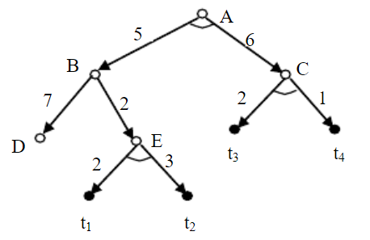

# 人工智能作业三

## 5.2
何谓状态空间？用状态空间法表示问题时，什么是问题的解？什么是最优解？最优解唯一吗？

由表示一个问题的全部状态及一切可用算符构成的集合称为该问题的状态空间。它一般由三部分构成：问题的所有可能初始状态构成的集合 S；算符集合 F；目标状态集合 G。即可用一个三元组（S，F，G）表示问题的状态空间。

由初始状态到达目标状态所用的运算符序列就是该问题的一个解。

总代价最小的解是最优解，最优解可能不唯一。

## 5.7
设有图所示的与或树，请分别按和代价法及最大代价法求解树代价。



和代价法：
h(A)=5+h(B)+6+h(C)
h(B)=min(7, 2+h(E))
h(E)=2+3=5
h(B)=7
h(C)=2+1=3
h(A)=5+7+6+3=21

最大代价法：
h(A)=max(5+h(B), 6+h(C))
h(B)=min(7, 2+h(E))
h(E)=3
h(B)=5
h(C)=2
h(A)=max(5+5, 6+2)=10


## 5.8
```
   甲
   ↓
5  7  11 18 19 
18 22 15 15 6 
19 3  10 5  3 
0  9  37 18 12 
1  12 5  6  14
            ↓
            乙
```
某侦查员要从甲地进入雷场从乙地出来，如图所示。侦查员只能横向走或者纵向走，不能斜着走。图中的数字表示雷场各处的危险指数。请为该侦察员选择一条最安全的路径。要求：
（1）用状态空间法表示本问题。
以二元组(x,y)作为状态变量，表示目前侦察兵所在位置为第x行第y列，行列均从1开始编号。根据图可得1≤x≤5，1≤y≤5。
设C(x, y)表示第x行第y列位置的危险指数。
该问题的所有可能状态如下：

(1, 1) (1, 2) (1, 3) (1, 4) (1, 5) 
(2, 1) (2, 2) (2, 3) (2, 4) (2, 5) 
(3, 1) (3, 2) (3, 3) (3, 4) (3, 5) 
(4, 1) (4, 2) (4, 3) (4, 4) (4, 5) 
(5, 1) (5, 2) (5, 3) (5, 4) (5, 5)

问题的初始状态集为S={(1, 2)}，目标状态集为G={(5, 5)}
由于侦察员只能横向走或者纵向走，定义算符F如下：
U(x, y)，侦查员从x行y列的位置向上走
D(x, y)，侦查员从x行y列的位置向下走
L(x, y)，侦查员从x行y列的位置向左走
R(x, y)，侦查员从x行y列的位置向右走

至此，该问题的状态空间构造完成。

（2）指明使用的搜索方法，并给出完整搜索过程。

使用有界深度优先搜索算法，完整搜索过程如下：

1. 将初始位置$S_0=(x_0, y_0)$放入OPEN表中，置$S_0$的深度$d(S_0)=C(x_0, y_0)$。
2. 如果OPEN表为空，则问题无解，退出。
3. 把OPEN表中的第一个节点（记为结点n）取出放入CLOSED表中。
4. 考察节点n是否为目标节点。若是，则求得了问题的一个解，令$d_m=d(n)$。
5. 如果节点n的深度$d(n)\ge d_m$，则转第2步。
6. 如果节点n不可扩展，则转第2步。
7. 扩展节点n，将其子节点（记为节点m，位置为$(x_m, y_m)$）放入OPEN表的首部，并为其配置指向父节点的指针，置其深度$d(m)=d(n)+C(x_m, y_m)$。然后转第2步。

（3）找出最佳路径，并给出该路径的危险指数之和。

最佳路径为：(1, 2) --> (2, 2) --> (3, 2) --> (3, 3) --> (3, 4) --> (3, 5) --> (4, 5) --> (5, 5)
危险指数之和为76