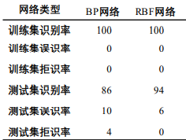

# 人工智能作业五

## 7.1
关于BP算法的学习规则有各种各样的改进方法。请查阅有关文献，试分析3种以上的改进方法，指出它们各自的改进思路以及各自的特点。

由于 BP 神经网络具有表达能力强，模型简单等特点，经过近 30 年的发展，在理论和应用研究上都取得了巨大的进步，然而容易陷入局部最优和泛化能力差等问题却限制了神经网络的发展。针对上面的问题，现已有多种解决方法。

**增加动量项**

 标准的BP算法在调整权值时，只按t时刻误差的梯度方向调整，而没有考虑t时刻以前的梯度方向，从而容易使训练过程发生振荡，收敛缓慢，为了提高网络的训练速度，可以在权值的调整公式增加一动量项，若用W代表某层权矩阵，x代表某层输入向量，则包含动量项的权值调整向量表达式为：$\Delta w(t)=\eta\cdot err\cdot x + \alpha \cdot \Delta w(t-1)$

从上式可以看出，增加动量项即从前一次权值调整中取出一部分叠加到本次权值调整量中，$\alpha$称为动量系数，一般$0< \alpha < 1$。动量项代表的物理意义是反映了以前积累的经验，对于t时刻起到阻尼作用，当权值曲面出现骤然下降时，该动量项可减少振荡趋势，提高训练过程，目前BP算法中都增加了动量项，以至于具有动量项的BP算法称为一种新的标准算法。

**自适应调节学习率$\eta$**

学习率$\eta$也称步长，在标准BP算法中设定为常数，然而在实际中，很难使用一个确定的值为最佳的学习率，如果可以动态调整学习率就很好了，从权值曲面我们希望在平坦区内$\eta$是增大的，因为太小会使得训练次数增加，$\eta$增大会加速脱离平坦区。而在误差变化很大的区域，$\eta$太大会容易跨过较窄的最低点，这个最低点可能是全局最优点，同时会产生振荡，反而是迭代次数增加，因此为了加速收敛，一个较好的解决思路就是让学习率$\eta$根据具体情况进行动态调整。自适应调节学习率的研究是一个领域，最初是从退火算法到最优退火算法进行探索的，最优退火算法提供了在线学习，为在线学习迈开了重要的一步，但是退火方案的缺点是时间常量$\eta_{switch}$为先验的，考虑到实际问题，不同的样本先验会发生改变，因此在1998年Murata首次提出了在线学习算法需要装备内在机制用于学习率的自适应控制，对学习算法的学习进行了适当的修正，第一个修正就是统计特性发生变化的情况，第二个就是增加了在线学习算法的泛化能力。因此解决了退火算法的先验问题。但是它是在考虑学习率参数的退火范围内的次优的解为代价的，其重要的优点在于扩大了在线学习在实际执行方式的适用性。

**引入抖度因子**

导致平坦区有三种可能情况，后两种是因为激活函数的输入进入到了激活函数的饱和区，饱和区的激活函数的表达式如下：$o_k = \frac{1}{1+e^{net_k}}$，加入抖度因子后的表达式为：$o_k = \frac{1}{1+e^{net_k/\lambda }}$。当$\Delta E$接近0时而$d_k - o_k$仍比较大，此时就进入平坦区了，这时令$\lambda > 1$；当退出平坦区后，再令$\lambda =1$，可以看出，随着$\lambda$不断增大，net_k坐标被压缩了 $\lambda$，因此可以有效的增加饱和区的范围，这种方法实际中提高BP收敛的速度十分有效。

## 7.6
请以人脸识别应用为例，对比分析BP网络和径向基函数网络各自的异同点和优缺点。

人脸识别是当前人工智能和计算机视觉研究的重点之一 ,有着十分广泛的应用前景 ,例如身份证识别、信用卡识别以及犯罪嫌疑人的识别等。BP神经网络和 RBF神经网络是应用最广泛的 2种人工神经网络 ,在各门学科领域中都具有很重要的实用价值。为例比较在相同条件下 BP和 RBF网络的识别性能 ,对这 2种网络提供了相同的训练样本和相同的训练策略。实验结果的比较如下表所示。

从上面的数据可以看出 ,在训练样本合适的情况下 ,RBF网络的性能略高于 BP网络 ,当训练样本急剧缩小时 , RBF网络的识别性能略有下降 ,但仍可满足需要。而BP神经网络的识别能力大大下降 ,已经不再能满足实际需要。所以 ,得到的结论是:用于人脸识别时 , RBF网络的性能要优于 BP神经网络 ,在具体应用中可优先予以考虑。

## 8.1
请以支持向量机为例，说明一种学习算法在多种不同模式识别问题中的应用情况。

目前, 支持向量机分类技术已经广泛应用于机器学习、模式识别、模式分类、计算机视觉、工业工程应用、航空应用等各个领域中, 且其分类效果可观. 例如, 在文字检测识别领域应用中, 对于文本文档, 主要针对手写文本, 能够实现文本关键词、特殊意义短语的识别且对于不同语言都有具体的分析研究; 在人体部位识别领域应用中, 可针对于手掌、耳朵、人脸及面部表情进行有效识别; 在车辆交通检测领域应用中, 可针对车牌、车载系统、车辆零件及车辆行驶路况进行可靠检测; 在医疗领域应用中, 可针对骨龄估计、跌倒监测、医疗咨询框架以及依据人脑图像进行痴呆症、抑郁症分类的模式识别. 除了广泛应用于上述领域, 研究人员将该技术投入到其他领域中, 大大扩展了其应用范围.

**文字检测领域**

杨文敏等将SVM分类器应用于基于句子级别的文本检测系统中, 其针对于表达含义不明确的词语的信息抽取分类. 将从文档句子中所提取的词特征作为分类器的输入向量, 实验结果表明, SVM能够快速有效地识别文本不确定信息, 在该方法中, 研究人员可尝试对段落级别的文本进行分析进一步提高分类正确率.

**医疗领域**

Zhu等基于非线性内核SVM提出一种高效安全的在线医疗预测框架(eDiag). 通过轻量级多方随机屏蔽和多项式聚合技术改进非线性SVM, 该实验选取Gauss核函数作为SVM核函数. 确定原非线性SVM的参数后, 通过定义相应的分类标准改进原分类器, 该方法不但确保在线医疗咨询信息的安全性且有效降低服务成本, 但由于其为在线咨询系统, 检测实时性较高因此需提高计算效率.

**人体识别领域**

刘小建对手势进行分区域识别, 利用多分类SVM实现. 从已知手势样本图像细分后的各个区域中提取特征, 将所提取的3个关键特征描述子描述手势. 选取核函数为一个非线性径向基函数(RBF), 采用网格搜索法调整确定SVM参数, 实现高效准确识别手势.

李昆仑等采用基于径向基核函数的SVM分类器中并将其应用于掌纹识别中. 利用改进的PCA算法分别提取训练图像和测试图像的特征, 确定的训练集用来训练最佳SVM分类器, 训练好的SVM分类器识别确定的测试集. 相较于传统特征匹配法, SVM决策既能够缓解样本不足又可以降低计算量.

## 8.3
模式识别的基本过程是什么？

模式识别的基本过程包含以下任务：
1. 模式采集
模式识别研究的是计算机识别，因此事物所包含的各种信息必须通过采集转换成计算机能接受和处理的数据。对于各种物理量，可以通过传感器将其转换成电信号，再由信号变换部件对信号的形式、量程等进行变换，最后经A/D采样转换成对应的数据值。
2. 预处理
经过模式采集获得的数据量，是待识别样本的原始信息，其中可能包含大量的干扰和无用数据。预处理环节通过各种滤波降噪措施，降低干扰的影响，增强有用的信息，在此基础上，生成在分类上具有意义的各种特征。特征生成的方法和思路与待解决的模式识别问题和所采用的模式识别方法密切相关，例如对图像数据，如果要识别的是场景的类型，颜色和纹理特征就很有用；如果要识别出包含的人脸是谁，那么人脸轮廓和关键点特征就很重要。预处理生成的特征可以仍然用数值来表示，也可以用拓扑关系、逻辑结构等其他形式来表示，分别用于不同的模式识别方法。       
3. 特征提取
通常情况下，经过模式采集和预处理获得的模式特征数量是很大的，这给分类器的设计和分类决策都带来了效率和准确率两方面的负面影响。因此，从大量的特征中选取出对分类最有效的有限的特征，降低模式识别过程的计算复杂度，提高分类准确性，是特征选取环节的主要任务。特征选取的方法主要包括特征选择和特征提取。特征选择是从已有的特征中选择一些特征，抛掉其他特征，特征提取是对原始的高维特征映射变换，生成一组维数更少的特征。两种方法虽然不同，但目的都是为了降低特征的维度，提高所选取的特征对分类的有效性。
4. 分类器设计
分类器设计过程就是分类器学习的过程。分类器设计是由计算机根据样本的情况自动进行的，可分为有监督学习和无监督学习。有监督学习是指用于分类器学习的样本已经分好了类，具有类别标签，分类器知道那些样本是属于哪些类的，由此它可以学习到属于某类的样本都具有哪些共同的特征，从而建立起分类决策规则。无监督学习是指用于分类器学习的样本集没有分好类，分类器自主地根据样本与样本之间的相似程度来将样本集划分成不同的类别，在此基础上建立分类决策规则。
5. 分类决策
分类决策是对待分类的样本按照已建立起来的分类决策规则进行分类，分类的结果要进行评估。