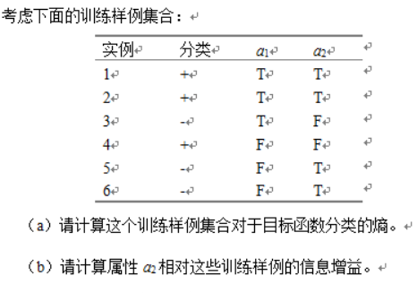
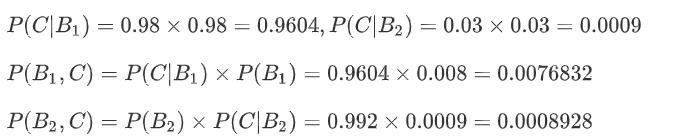
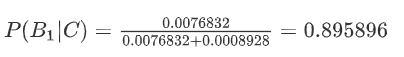
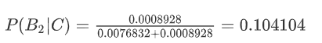

# 人工智能作业四

## 2


（1）概率p=3/6=1/2
根据Entropy(S)=-plog2(p)=1/2

（2）当属性2=T时，熵Entropy(S, a2=T)为1，当属性2=F时，熵Entropy(S, a2=F)为1。

因此信息增益为Entropy(S)-4/6Entropy(S, a2=T)-2/6Entropy(S, a2=F)=-1/2


## 3
（1）假设h1表示患有糖尿病，假设h2表示没有糖尿病。
先验概率P(h1)=0.8%，P(h2)=99.2%
P(d|h1)=98%，P(d|h2)=3%
根据hmap=arg maxP(d|h)P(h)
P(d|h1)P(h1)=0.98×0.008=0.00784
P(d|h2)P(h2)=0.03×0.992=0.02976
根据贝叶斯极大后验假设，具有最大可能性的假设为阳性未得糖尿病，故应给出未得糖尿病的结果。
（2）
用C表示事件“在第一医院测试为阳性且在第二医院测试又为阳性"，用B1表示“得糖尿病”，B2表示"未得糖尿病”。
则有：



阳性得糖尿病的概率：




阳性未得糖尿病的概率：



根据贝叶斯极大后验假设，具有最大可能性的假设为阳性，得糖尿病。故应给出得糖尿病的结果。


## 5

### ID3算法

```py
def createDataSet():
    dataSet=[[1,1,'yes'],[1,1,'yes'],[1,0,'no'],[0,1,'no'],[0,1,'no']]
    labels=['no surfacing','flippers']
    return dataSet,labels

def calcShannonEnt(dataSet):
    numEntries = len(dataSet) #nrows
    #为所有的分类类目创建字典
    labelCounts ={}
    for featVec in dataSet:
        currentLable=featVec[-1] #取得最后一列数据
        if currentLable not in labelCounts.keys():
            labelCounts[currentLable]=0
        labelCounts[currentLable]+=1
    #计算香农熵
    shannonEnt=0.0
    for key in labelCounts:
        prob = float(labelCounts[key]) / numEntries
        shannonEnt -= prob * log(prob, 2)
    return shannonEnt

#定义按照某个特征进行划分的函数splitDataSet
#输入三个变量（待划分的数据集，特征，分类值）
def splitDataSet(dataSet,axis,value):
    retDataSet=[]
    for featVec in dataSet:
        if featVec[axis]==value : 
            reduceFeatVec=featVec[:axis]
            reduceFeatVec.extend(featVec[axis+1:])
            retDataSet.append(reduceFeatVec)
    return retDataSet #返回不含划分特征的子集

#定义按照最大信息增益划分数据的函数
def chooseBestFeatureToSplit(dataSet):
    numFeature=len(dataSet[0])-1
    baseEntropy=calcShannonEnt(dataSet)#香农熵
    bestInforGain=0
    bestFeature=-1
    for i in range(numFeature):
        featList=[number[i] for number in dataSet] #得到某个特征下所有值（某列）
        uniqualVals=set(featList) #set无重复的属性特征值
        newEntropy=0
        for value in uniqualVals:
            subDataSet=splitDataSet(dataSet,i,value)
            prob=len(subDataSet)/float(len(dataSet)) #即p(t)
            newEntropy+=prob*calcShannonEnt(subDataSet)#对各子集香农熵求和
        infoGain=baseEntropy-newEntropy #计算信息增益
        #最大信息增益
        if (infoGain>bestInforGain):
            bestInforGain=infoGain
            bestFeature=i
    return bestFeature #返回特征值

#投票表决代码
def majorityCnt(classList):
    classCount={}
    for vote in classList:
        if vote not in classCount.keys():classCount[vote]=0
        classCount[vote]+=1
    sortedClassCount=sorted(classCount.items,key=operator.itemgetter(1),reversed=True)
    return sortedClassCount[0][0]

def createTree(dataSet,labels):
    classList=[example[-1] for example in dataSet]
    #类别相同，停止划分
    if classList.count(classList[-1])==len(classList):
        return classList[-1]
    #长度为1，返回出现次数最多的类别
    if len(classList[0])==1:
        return majorityCnt(classList)
    #按照信息增益最高选取分类特征属性
    bestFeat=chooseBestFeatureToSplit(dataSet)#返回分类的特征序号
    bestFeatLable=labels[bestFeat] #该特征的label
    myTree={bestFeatLable:{}} #构建树的字典
    del(labels[bestFeat]) #从labels的list中删除该label
    featValues=[example[bestFeat] for example in dataSet]
    uniqueVals=set(featValues)
    for value in uniqueVals:
        subLables=labels[:] #子集合
        #构建数据的子集合，并进行递归
        myTree[bestFeatLable][value]=createTree(splitDataSet(dataSet,bestFeat,value),subLables)
    return myTree

#输入三个变量（决策树，属性特征标签，测试的数据）
def classify(inputTree,featLables,testVec):
    firstStr=list(inputTree.keys())[0] #获取树的第一个特征属性
    secondDict=inputTree[firstStr] #树的分支，子集合Dict
    featIndex=featLables.index(firstStr) #获取决策树第一层在featLables中的位置
    for key in secondDict.keys():
        if testVec[featIndex]==key:
            if type(secondDict[key]).__name__=='dict':
                classLabel=classify(secondDict[key],featLables,testVec)
            else:classLabel=secondDict[key]
    return classLabel
```

###  朴素贝叶斯算法


```py
from numpy import *

def loadDataSet():
    postingList=[['my', 'dog', 'has', 'flea', 'problems', 'help', 'please'],
                 ['maybe', 'not', 'take', 'him', 'to', 'dog', 'park', 'stupid'],
                 ['my', 'dalmation', 'is', 'so', 'cute', 'I', 'love', 'him'],
                 ['stop', 'posting', 'stupid', 'worthless', 'garbage'],
                 ['mr', 'licks', 'ate', 'my', 'steak', 'how', 'to', 'stop', 'him'],
                 ['quit', 'buying', 'worthless', 'dog', 'food', 'stupid']]
    classVec = [0,1,0,1,0,1]    #1 is abusive, 0 not
    return postingList,classVec   

def createVocabList(dataSet):
    vocabSet = set([])  #create empty set
    for document in dataSet:
        vocabSet = vocabSet | set(document) #union of the two sets
    return list(vocabSet)

def setOfWords2Vec(vocabList, inputSet):
    returnVec = [0]*len(vocabList)
    for word in inputSet:
        if word in vocabList:
            returnVec[vocabList.index(word)] = 1
        else: print "the word: %s is not in my Vocabulary!" % word
    return returnVec

def trainNB0(trainMatrix,trainCategory):
    numTrainDocs = len(trainMatrix)
    numWords = len(trainMatrix[0])
    pAbusive = sum(trainCategory)/float(numTrainDocs) #计算某个类发生的概率
    p0Num = ones(numWords); p1Num = ones(numWords) #初始样本个数为1，防止条件概率为0，影响结果       
    p0Denom = 2.0; p1Denom = 2.0  #作用同上                      
    for i in range(numTrainDocs):
        if trainCategory[i] == 1:
            p1Num += trainMatrix[i]
            p1Denom += sum(trainMatrix[i])
        else:
            p0Num += trainMatrix[i]
            p0Denom += sum(trainMatrix[i])
    p1Vect = log(p1Num/p1Denom)         #计算类标签为1时的其它属性发生的条件概率
    p0Vect = log(p0Num/p0Denom)         #计算标签为0时的其它属性发生的条件概率
    return p0Vect,p1Vect,pAbusive       #返回条件概率和类标签为1的概率

def classifyNB(vec2Classify, p0Vec, p1Vec, pClass1):
    p1 = sum(vec2Classify * p1Vec) + log(pClass1)    #element-wise mult
    p0 = sum(vec2Classify * p0Vec) + log(1.0 - pClass1)
    if p1 > p0:
        return 1
    else: 
        return 0

def bagOfWords2VecMN(vocabList, inputSet):
    returnVec = [0]*len(vocabList)
    for word in inputSet:
        if word in vocabList:
            returnVec[vocabList.index(word)] += 1
    return returnVec

def testingNB():
    #step1：加载数据集和类标号
    listOPosts,listClasses = loadDataSet()
    #step2：创建词库
    myVocabList = createVocabList(listOPosts)
    # step3：计算每个样本在词库中的出现情况
    trainMat=[]
    for postinDoc in listOPosts:
        trainMat.append(setOfWords2Vec(myVocabList, postinDoc))
    #step4：调用第四步函数，计算条件概率
    p0V,p1V,pAb = trainNB0(array(trainMat),array(listClasses))
    # step5
    # 测试1 
    testEntry = ['love', 'my', 'dalmation']
    thisDoc = array(setOfWords2Vec(myVocabList, testEntry))
    print testEntry,'classified as: ',classifyNB(thisDoc,p0V,p1V,pAb)
    # 测试2
    testEntry = ['stupid', 'garbage']
    thisDoc = array(setOfWords2Vec(myVocabList, testEntry))
    print testEntry,'classified as: ',classifyNB(thisDoc,p0V,p1V,pAb)


```

### 支持向量机

```py
from numpy import * 

def loadDataSet(filename): #读取数据
    dataMat=[]
    labelMat=[]
    fr=open(filename)
    for line in fr.readlines():
        lineArr=line.strip().split('\t')
        dataMat.append([float(lineArr[0]),float(lineArr[1])])
        labelMat.append(float(lineArr[2]))
    return dataMat,labelMat #返回数据特征和数据类别

def selectJrand(i,m): #在0-m中随机选择一个不是i的整数
    j=i
    while (j==i):
        j=int(random.uniform(0,m))
    return j

def clipAlpha(aj,H,L):  #保证a在L和H范围内（L <= a <= H）
    if aj>H:
        aj=H
    if L>aj:
        aj=L
    return aj

def kernelTrans(X, A, kTup): #核函数，输入参数,X:支持向量的特征树；A：某一行特征数据；kTup：('lin',k1)核函数的类型和参数
    m,n = shape(X)
    K = mat(zeros((m,1)))
    if kTup[0]=='lin': #线性函数
        K = X * A.T
    elif kTup[0]=='rbf': # 径向基函数(radial bias function)
        for j in range(m):
            deltaRow = X[j,:] - A
            K[j] = deltaRow*deltaRow.T
        K = exp(K/(-1*kTup[1]**2)) #返回生成的结果
    else:
        raise NameError('Houston We Have a Problem -- That Kernel is not recognized')
    return K


#定义类，方便存储数据
class optStruct:
    def __init__(self,dataMatIn, classLabels, C, toler, kTup):  # 存储各类参数
        self.X = dataMatIn  #数据特征
        self.labelMat = classLabels #数据类别
        self.C = C #软间隔参数C，参数越大，非线性拟合能力越强
        self.tol = toler #停止阀值
        self.m = shape(dataMatIn)[0] #数据行数
        self.alphas = mat(zeros((self.m,1)))
        self.b = 0 #初始设为0
        self.eCache = mat(zeros((self.m,2))) #缓存
        self.K = mat(zeros((self.m,self.m))) #核函数的计算结果
        for i in range(self.m):
            self.K[:,i] = kernelTrans(self.X, self.X[i,:], kTup)


def calcEk(oS, k): #计算Ek（参考《统计学习方法》p127公式7.105）
    fXk = float(multiply(oS.alphas,oS.labelMat).T*oS.K[:,k] + oS.b)
    Ek = fXk - float(oS.labelMat[k])
    return Ek

#随机选取aj，并返回其E值
def selectJ(i, oS, Ei):
    maxK = -1
    maxDeltaE = 0
    Ej = 0
    oS.eCache[i] = [1,Ei]
    validEcacheList = nonzero(oS.eCache[:,0].A)[0]  #返回矩阵中的非零位置的行数
    if (len(validEcacheList)) > 1:
        for k in validEcacheList:
            if k == i:
                continue
            Ek = calcEk(oS, k)
            deltaE = abs(Ei - Ek)
            if (deltaE > maxDeltaE): #返回步长最大的aj
                maxK = k
                maxDeltaE = deltaE
                Ej = Ek
        return maxK, Ej
    else:
        j = selectJrand(i, oS.m)
        Ej = calcEk(oS, j)
    return j, Ej


def updateEk(oS, k): #更新os数据
    Ek = calcEk(oS, k)
    oS.eCache[k] = [1,Ek]

#首先检验ai是否满足KKT条件，如果不满足，随机选择aj进行优化，更新ai,aj,b值
def innerL(i, oS): #输入参数i和所有参数数据
    Ei = calcEk(oS, i) #计算E值
    if ((oS.labelMat[i]*Ei < -oS.tol) and (oS.alphas[i] < oS.C)) or ((oS.labelMat[i]*Ei > oS.tol) and (oS.alphas[i] > 0)): #检验这行数据是否符合KKT条件 参考《统计学习方法》p128公式7.111-113
        j,Ej = selectJ(i, oS, Ei) #随机选取aj，并返回其E值
        alphaIold = oS.alphas[i].copy()
        alphaJold = oS.alphas[j].copy()
        if (oS.labelMat[i] != oS.labelMat[j]): #以下代码的公式参考《统计学习方法》p126
            L = max(0, oS.alphas[j] - oS.alphas[i])
            H = min(oS.C, oS.C + oS.alphas[j] - oS.alphas[i])
        else:
            L = max(0, oS.alphas[j] + oS.alphas[i] - oS.C)
            H = min(oS.C, oS.alphas[j] + oS.alphas[i])
        if L==H:
            print("L==H")
            return 0
        eta = 2.0 * oS.K[i,j] - oS.K[i,i] - oS.K[j,j] #参考《统计学习方法》p127公式7.107
        if eta >= 0:
            print("eta>=0")
            return 0
        oS.alphas[j] -= oS.labelMat[j]*(Ei - Ej)/eta #参考《统计学习方法》p127公式7.106
        oS.alphas[j] = clipAlpha(oS.alphas[j],H,L) #参考《统计学习方法》p127公式7.108
        updateEk(oS, j)
        if (abs(oS.alphas[j] - alphaJold) < oS.tol): #alpha变化大小阀值（自己设定）
            print("j not moving enough")
            return 0
        oS.alphas[i] += oS.labelMat[j]*oS.labelMat[i]*(alphaJold - oS.alphas[j])#参考《统计学习方法》p127公式7.109
        updateEk(oS, i) #更新数据
        #以下求解b的过程，参考《统计学习方法》p129公式7.114-7.116
        b1 = oS.b - Ei- oS.labelMat[i]*(oS.alphas[i]-alphaIold)*oS.K[i,i] - oS.labelMat[j]*(oS.alphas[j]-alphaJold)*oS.K[i,j]
        b2 = oS.b - Ej- oS.labelMat[i]*(oS.alphas[i]-alphaIold)*oS.K[i,j]- oS.labelMat[j]*(oS.alphas[j]-alphaJold)*oS.K[j,j]
        if (0 < oS.alphas[i]<oS.C):
            oS.b = b1
        elif (0 < oS.alphas[j]<oS.C):
            oS.b = b2
        else:
            oS.b = (b1 + b2)/2.0
        return 1
    else:
        return 0


#SMO函数，用于快速求解出alpha
def smoP(dataMatIn, classLabels, C, toler, maxIter,kTup=('lin', 0)): #输入参数：数据特征，数据类别，参数C，阀值toler，最大迭代次数，核函数（默认线性核）
    oS = optStruct(mat(dataMatIn),mat(classLabels).transpose(),C,toler, kTup)
    iter = 0
    entireSet = True
    alphaPairsChanged = 0
    while (iter < maxIter) and ((alphaPairsChanged > 0) or (entireSet)):
        alphaPairsChanged = 0
        if entireSet:
            for i in range(oS.m): #遍历所有数据
                alphaPairsChanged += innerL(i,oS)
                print("fullSet, iter: %d i:%d, pairs changed %d" % (iter,i,alphaPairsChanged)) #显示第多少次迭代，那行特征数据使alpha发生了改变，这次改变了多少次alpha
            iter += 1
        else:
            nonBoundIs = nonzero((oS.alphas.A > 0) * (oS.alphas.A < C))[0]
            for i in nonBoundIs: #遍历非边界的数据
                alphaPairsChanged += innerL(i,oS)
                print("non-bound, iter: %d i:%d, pairs changed %d" % (iter,i,alphaPairsChanged))
            iter += 1
        if entireSet:
            entireSet = False
        elif (alphaPairsChanged == 0):
            entireSet = True
        print("iteration number: %d" % iter)
    return oS.b,oS.alphas

def testRbf(data_train,data_test):
    dataArr,labelArr = loadDataSet(data_train) #读取训练数据
    b,alphas = smoP(dataArr, labelArr, 200, 0.0001, 10000, ('rbf', 1.3)) #通过SMO算法得到b和alpha
    datMat=mat(dataArr)
    labelMat = mat(labelArr).transpose()
    svInd=nonzero(alphas)[0]  #选取不为0数据的行数（也就是支持向量）
    sVs=datMat[svInd] #支持向量的特征数据
    labelSV = labelMat[svInd] #支持向量的类别（1或-1）
    print("there are %d Support Vectors" % shape(sVs)[0]) #打印出共有多少的支持向量
    m,n = shape(datMat) #训练数据的行列数
    errorCount = 0
    for i in range(m):
        kernelEval = kernelTrans(sVs,datMat[i,:],('rbf', 1.3)) #将支持向量转化为核函数
        predict=kernelEval.T * multiply(labelSV,alphas[svInd]) + b  #这一行的预测结果（代码来源于《统计学习方法》p133里面最后用于预测的公式）注意最后确定的分离平面只有那些支持向量决定。
        if sign(predict)!=sign(labelArr[i]): #sign函数 -1 if x < 0, 0 if x==0, 1 if x > 0
            errorCount += 1
    print("the training error rate is: %f" % (float(errorCount)/m)) #打印出错误率
    dataArr_test,labelArr_test = loadDataSet(data_test) #读取测试数据
    errorCount_test = 0
    datMat_test=mat(dataArr_test)
    labelMat = mat(labelArr_test).transpose()
    m,n = shape(datMat_test)
    for i in range(m): #在测试数据上检验错误率
        kernelEval = kernelTrans(sVs,datMat_test[i,:],('rbf', 1.3))
        predict=kernelEval.T * multiply(labelSV,alphas[svInd]) + b
        if sign(predict)!=sign(labelArr_test[i]):
            errorCount_test += 1
    print("the test error rate is: %f" % (float(errorCount_test)/m))

#主程序
def main():
    filename_traindata='traindata.txt'
    filename_testdata='testdata.txt'
    testRbf(filename_traindata,filename_testdata)

if __name__=='__main__':
    main()
```

### 总结
  
|     算法      |   计算时间    |      分类结果      | 泛化能力 |
| ------------- | ------------- | ------------------ | ------- |
| ID3算法       | 低效          | 易于理解，准确率较高 | 强      |
| 朴素贝叶斯算法 | 较快          | 容易理解           | 略弱     |
| 支持向量机     | 效率并不是很高 | 难以解释，高准确率   | 比较强   |

## 6

高维数据聚类的难点在于：
1、适用于普通集合的聚类算法，在高维数据集合中效率极低
2、由于高维空间的稀疏性以及最近邻特性，高维的空间中基本不存在数据簇。

对于高维数据聚类的聚类算法主要有两种：子空间聚类和基于相似性度量的聚类。