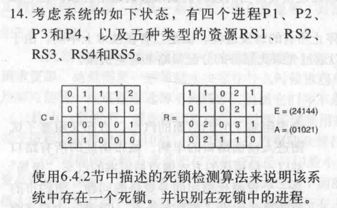
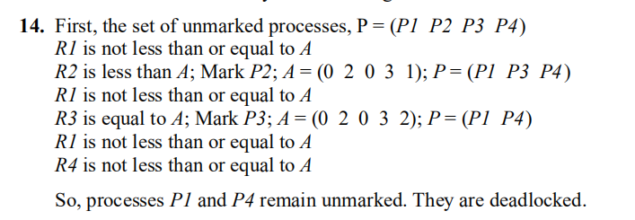
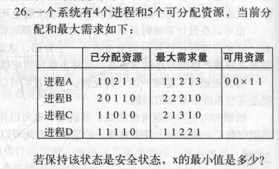
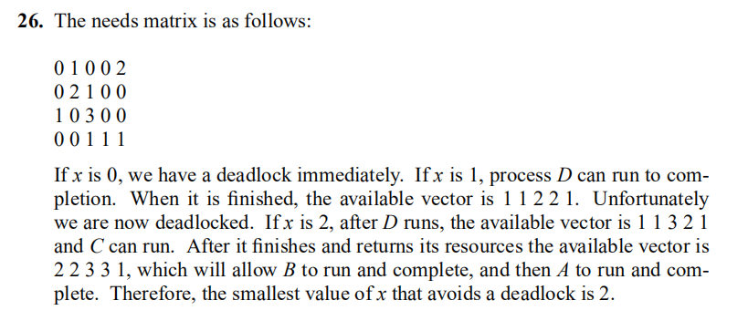
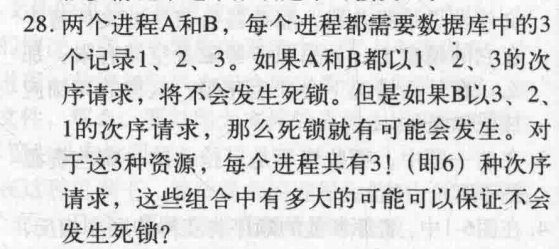
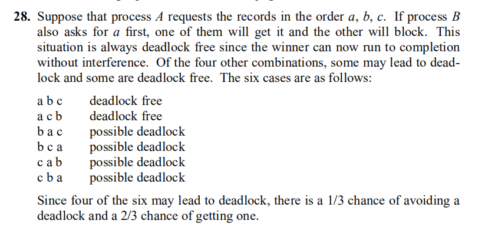

# 操作系统作业五
第五次作业：第6章：第14，26，28题，提交时间：11月9日
[操作系统电子书](http://reader.epubee.com/books/mobile/97/97b10ad47479941333e5f430bbb37310/text00001.html)

## 14

## 26

[【操作系统】一个系统有4个进程和5个可分配资源，当前分配和最大需求如下：若保持该状态是安全状态，那么x的最小值是多少？](https://blog.csdn.net/weixin_43699738/article/details/106580403)

## 28

