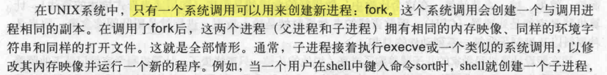
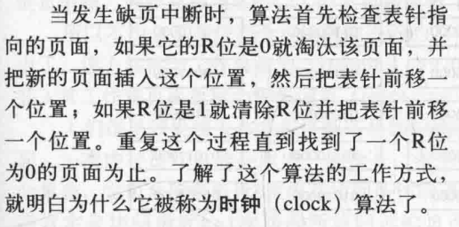

[《操作系统期末复习资料-华南理工》试卷a(答案)](https://www.doc88.com/p-5458408756057.html)
# 引论
操作系统的特征：**并发，共享**，虚拟，异步。

并发：宏观上同时发生，微观上交替发生。
并行：同一时刻，同时发生。

资源共享方式：互斥共享、同时共享。

虚拟技术分为：空间复用技术，时间复用技术。

死锁是指多个进程因竞争系统资源或相互通信而处于永远阻塞状态，若无外力作用，这些进程都无法向前推进。死锁的产生与资源的使用相关，死锁产生的原因之一就是资源竞争，如果系统中只有一个进程在运行，所有资源为一个进程独享，则不会产生死锁现象。

  死锁产生的另外一个原因是进程的推进顺序不当，竞争资源虽然可能导致死锁，但是资源竞争并不等于死锁，只有在进程运行顺序不当的时候才会出现死锁。死锁产生的必要条件包括：**互斥条件、不剥夺条件、请求和保持条件、循环等待条件**，当发生死锁时候，这四个条件必须都满足。
## 周转时间

周转时间=作业完成时间−作业提交时间（周转时间是 作业等待时间和运行时间之和）

# 进程与线程
## 进程

### 创建

### 状态

### 实现

## 线程

## 进程间通信

实现互斥的方案：屏蔽中断、锁变量

## 调度
### 批处理系统中的调度

# 内存管理

## 地址空间

处理内存超载的方法：交换技术、虚拟内存。

空闲区内存管理：位图，链表。

内存分配算法：

首次适配算法：沿着链表找到第一个足够大的空闲区，速度快。
下次适配算法：与首次适配算法类似，区别在于从上次结束的地方继续搜索。性能略低于首次适配算法。
最佳适配算法：搜索整个链表，找出最合适的。速度慢，浪费内存，会产生大量小空闲区。**可以按大小递增顺序排列空白区来提高查找速度**
最差适配算法：每次选最大的。
快速适配算法：为常用大小空闲区维护单独的链表。

## 虚拟内存

缺页中断、缺页错误。

缺页中断的次数是由页面数量，页面置换算法与页面走向三个因素决定的。

## 页面置换算法
**最优页面置换算法**：（难以实现）

**最近未使用（NRU）页面置换算法**：

**先进先出（FIFO）页面置换算法**：

Belady现象是指：在分页式虚拟存储器管理中，发生缺页时的置换算法采用FIFO（先进先出）算法时，如果对一个进程未分配它所要求的全部页面，有时就会出现分配的页面数增多但缺页率反而提高的异常现象。

**第二次机会页面置换算法**：

**时钟页面置换算法**：

**最近最少使用（LRU）页面置换算法**：（代价高）

## 分段
分段与分页。

# 文件系统

## 文件
### 命名

### 结构

### 类型

### 访问

### 属性

### 操作

# 死锁

