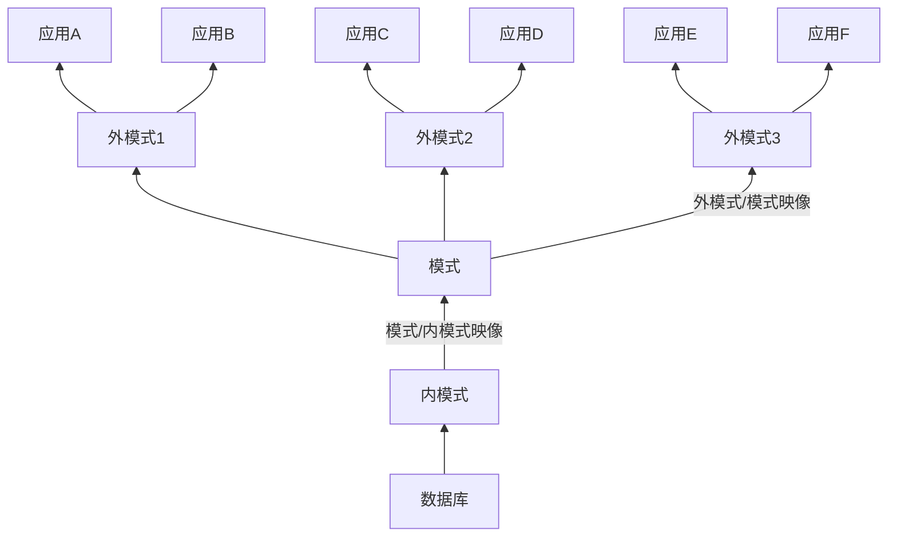

# 数据库复习
## 第一章 绪论

**数据**是数据库中存储的基本对象，描述事物的符号记录称为数据。数据的含义称为数据的语义，数据与其语义是不可分的。**数据库**是长期存储在计算机内、有组织的、可共享的大量数据的集合。数据库数据具有永久存储、有组织和可共享三个基本特点。**数据库管理系统**（DBMS）是计算机的基础软件，主要功能有数据的定义、组织、存储、管理、操纵以及数据库的事务管理、运行管理、建立和维护。数据库管理系统通常提供数据操纵语言（DML）来实现对数据库的基本操作。**数据库系统**（DBS）是由数据库、数据库管理系统、应用程序和数据库管理员（DBA）组成的存储、管理、处理和维护数据的系统。常常把数据库系统简称为数据库。

数据独立性是借助数据库管理数据的一个显著优点，包括数据的物理独立性和逻辑独立性。**物理独立性**是指用户的应用程序与数据库中的数据的物理存储是相互独立的。**逻辑独立性**是指用户的应用程序与数据库的逻辑结构是相互独立的。**数据模型**是对现实世界数据特征的抽象，是数据库系统的核心和基础。第一类数据模型是**概念模型**，是按用户的观点来对数据和信息建模，主要用于数据库设计。第二类数据模型是**逻辑模型和物理模型**，逻辑模型主要用于数据库管理系统的实现，物理模型是对数据最底层的抽象。

信息世界中，客观存在并可相互区别的事物称为**实体**。例如，一个学生、一次选课都是实体。实体所具有的某一特性称为**属性**。例如，学生实体可以由学号、姓名、性别等属性组成。唯一标识实体的属性集称为**码**。例如，学号是学生实体的码。用实体名及其属性名集合来抽象和刻画同类实体，称为**实体型**。例如， 学生（学号，姓名，性别）就是一个实体型。同一类型实体的集合称为实体集。例如，全体学生就是一个实体集。实体之间的联系通常是指不同实体集之间的联系。

**数据模型**通常由数据结构、数据操作和数据的完整性约束条件三部分组成。**数据结构**描述数据库的组成对象以及对象之间的联系，**数据操作**是指对数据库中各种对象的实例允许执行的操作的集合，包括操作及有关的操作规则。**数据的完整性约束条件**是一组完整性规则。完整性规则是给定的数据模型中数据及其联系所具有的制约和依存规则，用以限定符合数据模型的数据库状态以及状态的变化，以保证数据的正确、有效和相容。

| 学号    | 姓名   | 性别 |
| ------- | ------ | ---- |
| 2013004 | 王小明 | 女   |
| 2013006 | 黄大鹏 | 男   |
| 2013008 | 张文斌 | 女   |

**关系模型**是最重要的一种数据模型。一个关系对应通常说的一张表，例如上面这张学生登记表。表中的一行即为一个元组，表中的一列即为一个属性，给每个属性起一个名称即属性名。例如上面的学生登记表有3列，对应3个属性。表中的某个属性组可以唯一确定一个元组，就成为本关系的码。如学号可以唯一确定一个学生，就称为此关系的码。域是一组具有相同数据类型的值的集合，属性的取值范围来自某个域。如性别的域是（男，女）。元组中的一个属性值称为分量，关系的每一个分量必须是一个不可分的数据项。对关系的描述称为关系模式，一般表示为`关系名（属性1，属性2，……，属性n）`。上面的关系可以描述为<code>学生（<u>学号</u>，姓名，性别）</code>。

在数据模型中有“型”（type）和“值”（value）的概念。型是指对某一类数据的结构和属性的说明，值是型的一个具体赋值。例如，学生记录定义为（学号，姓名，性别）记录型，而（2013004，王小明，女）是该记录型的一个记录值。模式（schema）是数据库中全体数据的逻辑结构和特征的描述，它仅仅涉及型的描述，不涉及具体的值。模式的一个具体值称为模式的一个实例。模式是相对稳定的，而实例是相对变动的。

数据库管理系统在体系结构上通常都具有相同的特征，即采用三级模式结构并提供两级映像功能。数据库系统的三级模式结构是指数据库系统是由外模式、模式和内模式三级构成，**模式**也称逻辑模式，是数据库中全体数据的逻辑结构和特征的描述，是所有用户的公共数据视图。**外模式**是数据库用户能够看见和使用的局部数据的逻辑结构和特征的描述，是数据库用户的数据视图，是与某一应用有关的数据的逻辑表示。**内模式**是数据物理结构和存储方式的描述，是数据在数据库内部的组织方式。

三级模式是数据的三个抽象级别，为了能够在系统内部实现这三个抽象层次的联系和转换，数据库管理系统在这三级模式之间提供了两层映像：外模式／模式映像和模式／内模式映像。当模式改变时（例如增加新的关系、新的属性、改变属性的数据类型等），由数据库管理员对各个外模式／模式的映像作相应改变，可以使外模式保持不变。应用程序是依据数据的外模式编写的，从而应用程序不必修改，保证了数据与程序的逻辑独立性，简称**数据的逻辑独立性**。 当数据库的存储结构改变时（例如选用了另一种存储结构），由数据库管理员对模式／内模式映像作相应改变，可以使模式保持不变，从而应用程序也不必改变。保证了数据与程序的物理独立性，简称**数据的物理独立性**。 




## 第二章 关系数据库

从集合论角度给出关系数据结构的形式化定义：

**域**是一组具有相同数据类型的值的集合。例如，自然数、整数都是域。**笛卡儿积**是域上的一种集合运算。 给定一组域 $D_1, D_2, ..., D_n$，它们的笛卡尔积为 $D_1 \times D_2 \times ... \times D_n = \{(d_1, d_2, ..., d_n) | d_i \in D_i, i=1, 2, ..., n\}$ ，其中每一元素叫做一个n元组，元素中的每一个值叫做一个分量。一个域允许的不同取值个数称为这个域的基数。例如，给出两个域，$D_1=\{计算机专业， 信息专业\}$，$D_2=\{男，女\}$，则$D_1$、$D_2$的笛卡尔积为 $D_1 \times D_2 = \{(计算机专业，男), (计算机专业，女), (信息专业，男), (信息专业，女)\}$，该笛卡尔积的基数为4。

$D_1 \times D_2 \times ... \times D_n$的子集叫做在域 $D_1, D_2, ..., D_n$上的关系，表示为 $R(D_1, D_2, ..., D_n)$，R表示关系的名字。若关系中的某一属性组的值能唯一地标识一个元组，而其子集不能，则称该属性组为**候选码**，若一个关系有多个候选码，则选定其中一个为**主码**。 候选码的诸属性称为主属性，不包含在任何候选码中的属性称为非主属性。

关系的描述称为**关系模式**，可以形式化地表示为`R(U, D, DOM, F)`，其中R为关系名，U为组成该关系的属性名集合，D为U中属性所来自的域，DOM为属性向域的映像集合，F为属性间数据的依赖关系集合。关系模式可以简记为`R(U)`或 $R(A_1, A_2, ..., A_n)$，其中R为关系名，$A_1, A_2, ..., A_n$为属性名。**关系是关系模式在某一时刻的状态或内容。**

关系模型中常用的关系操作包括查询 (query) 操作和插入 (insert)、删除 (delete)、 修改 (update) 操作两大部分。查询操作又可以分为选择 (select)、投影 (project)、连接 (join)、除 (divide)、并 (union) 、差 (except)、交 (intersection)、 笛卡儿积等。其中**选择、投影、并、差、笛卡儿积**是 5 种基本操作。

关系数据语言可以分为三类：

$$
关系数据语言
\begin{cases}
关系代数语言（例如ISBL）\\
关系演算语言
\begin{cases}
元组关系演算语言（例如ALPHA、QUEL）\\
域关系演算语言（例如QBE）
\end{cases}\\
具有关系代数和关系演算双重特点的语言（例如SQL）
\end{cases}
$$

关系模型中有三类完整性约束：实体完整性、参照完整性和用户定义的完整性。

**实体完整性**规则：若属性（指一个或一组属性） A 是基本关系 R 的主属性， 则 A 不能取空值 (null value)。所谓空值就是“不知道”或“不存在”或“无意义”的值。例如，学生（<u>学号</u>，姓名，性别）关系中学号为主码，则学号不能取空值。 参照完整性的定义：设 F 是基本关系 R 的一个或一组属性，但不是关系 R 的码，$K_s$是基本关系 S 的主码。如果 F 与$K_s$相对应，则称 F 是 R 的外码 (foreign key), 并称基本关系 R 为参照关系 (referencing relation), 基本关系 S 为被参照关系 (referenced relation) 或目标关系 (target relation)。关系 R 和 S 不一定是不同的关系。例如，学生实体和专业实体用以下关系表示，其中主码用下划线标识。学生（<u>学号</u>，姓名，专业号），专业（<u>专业号</u>，专业名），则“专业号”属性是学生关系的外码，专业关系是被参照关系，学生关系为参照关系。外码并不一定要与相应的主码同名。

**参照完整性**规则：若属性（或属性组） F 是基本关系 R 的外码，它与基本关系 S 的主码 $K_s$ 相对应（基本关系 R 和 S 不一定是不同的关系），则对于 R 中每个元组在 F 上的值必须： 或者取空值（F的每个属性值均为空值），或者等于 S 中某个元组的主码值。 例如，上面的例子中，学生关系中的专业号可以取空值，表示尚未给该学生分配专业，但取非空值时必须取专业关系中存在的值。

**用户定义的完整性**就是针对某一具体关系数据库的约束条件，它反映某一具体应用所涉及的数据必须满足的语义要求。例如某个属性必须取唯一值、某个非主属性不能取空值等。

关系代数是一种抽象的查询语言，它用对关系的运算来表达查询。

关系代数运算符：

|  运算符   |   含义   |
| --------- | ------- |
| $\cup$    | 并      |
| -         | 差      |
| $\cap$    | 交      |
| $\times$  | 笛卡尔积 |
| $\sigma$  | 选择     |
| $\Pi$     | 投影     |
| $\bowtie$ | 连接     |
| $\div$    | 除      |

专门的关系运算包括选择、投影、连接、除运算等 。 以下以实例介绍关系运算符的用法。设有一学生关系如下表所示：

| 学号    | 姓名   | 性别 |
| ------- | ------ | ---- |
| 2013004 | 王小明 | 女   |
| 2013006 | 黄大鹏 | 男   |
| 2013008 | 张文斌 | 女   |

（1）查询性别为女的学生：$\sigma_{性别='女'}(学生)$

（2）查询学号小于2013007的学生：$\sigma_{学号<2013007}(学生)$

（3）查询学生的姓名和性别：$\Pi_{姓名, 性别}(学生)$

（4）查询学生的性别：$\Pi_{性别}(学生)$，注意会取消重复元组。

设还有一选课关系如下表：

| 学号    | 课程号 | 成绩 |
| ------- | ------ | ---- |
| 2013004 | 1      | 92   |
| 2013004 | 2      | 85   |
| 2013006 | 3      | 88   |
| 2013008 | 2      | 80   |

（5）查询至少选修了1号和2号课程的学生学号：先建立一个临时关系K：

<table>
    <tr><th>课程号</th></tr>
    <tr><td>1</td></tr>
    <tr><td>2</td></tr>
</table>

然后求：$\Pi_{学号, 课程号}(选课) \div K$

（6）查询选修了3号课程学生的学号：$\Pi_{学号}(\sigma_{课程号=3}(选课))$

（7）查询选修了2号课程的学生的姓名：$\Pi_{姓名}(\Pi_{学号}(\sigma_{课程号=2}(选课)) \bowtie 学生)$

## 第三章 关系数据库标准语言 SQL

以学生-课程数据库为例来讲解 SQL 的数据定义、数据操纵、数据查询和数据控制语句。

学生-课程数据库包括以下三个表：

学生（学号，姓名，性别，年龄，所在系）

课程（课程号，课程名，先行课，学分）

选课（学号，课程号，成绩）

各个表中的数据如下面的表格所示：

学生表：

| 学号      | 姓名 | 性别 | 年龄 | 所在系 |
| --------- | ---- | ---- | ---- | ------ |
| 201215121 | 李勇 | 男   | 20   | 计算机 |
| 201215122 | 刘晨 | 女   | 19   | 计算机 |
| 201215123 | 王敏 | 女   | 18   | 数学   |
| 201215125 | 张立 | 男   | 19   | 信息   |

课程表：

| 课程号 | 课程名     | 先行课 | 学分 |
| ------ | ---------- | ------ | ---- |
| 1      | 数据库     | 5      | 4    |
| 2      | 数学       |        | 2    |
| 3      | 信息系统   | 1      | 4    |
| 4      | 操作系统   | 6      | 3    |
| 5      | 数据结构   | 7      | 4    |
| 6      | 数据处理   |        | 2    |
| 7      | PASCAL语言 | 6      | 4    |

选课表：

| 学号      | 课程号 | 成绩 |
| --------- | ------ | ---- |
| 201215121 | 1      | 92   |
| 201215121 | 2      | 85   |
| 201215121 | 3      | 88   |
| 201215122 | 2      | 90   |
| 201215122 | 3      | 80   |

### 数据库

以下命令在Windows平台下的PowerShell窗口下运行MySQL monitor。

首先启动MySQL：

```sh
Welcome to the MySQL monitor.  Commands end with ; or \g.
Your MySQL connection id is 10
Server version: 8.0.19 MySQL Community Server - GPL

Copyright (c) 2000, 2020, Oracle and/or its affiliates. All rights reserved.

Oracle is a registered trademark of Oracle Corporation and/or its
affiliates. Other names may be trademarks of their respective
owners.

Type 'help;' or '\h' for help. Type '\c' to clear the current input statement.

mysql>
```

关系数据库系统支持三级模式结构，其模式、外模式和内模式中的基本对象有模式、 表、视图和索引等。因此 SQL 的数据定义功能包括模式定义、表定义、视图和索引的定义，相关SQL语句如下表所示：

| 操作对象 | 创建          | 删除        | 修改        |
| -------- | ------------- | ----------- | ----------- |
| 模式     | CREATE SCHEMA | DROP SCHEMA |             |
| 表       | CREATE TABLE  | DROP TABLE  | ALTER TABLE |
| 视图     | CREATE VIEW   | DROP VIEW   |             |
| 索引     | CREATE INDEX  | DROP INDEX  | ALTER INDEX |

实际中SCHEMA使用DATABASE替代。

例如，创建一个“学生-课程”数据库。

```sql
mysql> CREATE DATABASE `学生-课程`;
Query OK, 1 row affected (0.01 sec)
```

（注意上面的符号为反引号）

查看目前的数据库：

```sql
mysql> SHOW DATABASES;
+--------------------+
| Database           |
+--------------------+
| information_schema |
| mysql              |
| performance_schema |
| sys                |
| 学生-课程          |
+--------------------+
5 rows in set (0.00 sec)
```

删除这个数据库：

```sql
mysql> DROP DATABASE `学生-课程`;
Query OK, 0 rows affected (0.01 sec)
```

重新创建好学生-课程数据库，然后使用该数据库：

```sql
mysql> CREATE DATABASE `学生-课程`;
Query OK, 1 row affected (0.00 sec)

mysql> USE `学生-课程`;
Database changed
```

（注意末尾的分号要在英文模式下输入，半角分号）

### 表

创建学生表：

```sql
mysql> CREATE TABLE 学生 (
    -> 学号 CHAR(9) PRIMARY KEY,
    -> 姓名 CHAR(20) UNIQUE,
    -> 性别 CHAR(2),
    -> 年龄 SMALLINT,
    -> 所在系 CHAR(20)
    -> );
Query OK, 0 rows affected (0.03 sec)
```

创建课程表：

```sql
mysql> CREATE TABLE 课程 (
    -> 课程号 CHAR(4) PRIMARY KEY,
    -> 课程名 CHAR(40) NOT NULL,
    -> 先行课 CHAR(4),
    -> 学分 SMALLINT,
    -> FOREIGN KEY(先行课) REFERENCES 课程(课程号)
    -> );
Query OK, 0 rows affected (0.05 sec)
```

创建选课表：

```sql
mysql> CREATE TABLE 选课 (
    -> 学号 CHAR(9),
    -> 课程号 CHAR(4),
    -> 成绩 SMALLINT,
    -> PRIMARY KEY(学号, 课程号),
    -> FOREIGN KEY(学号) REFERENCES 学生(学号),
    -> FOREIGN KEY(课程号) REFERENCES 课程(课程号)
    -> );
Query OK, 0 rows affected (0.05 sec)
```

（主码由两个属性构成，必须作为表级完整性进行定义）

SQL标准支持很多种数据类型，下表列出了几种常用数据类型：

| 数据类型                                        | 含义                                         |
| ----------------------------------------------- | -------------------------------------------- |
| CHAR(n), CHARACTER(n)                           | 长度为n的定长字符串                          |
| VARCHAR(n), CHARACTERVARYING(n)                 | 最大长度为n的变长字符串                      |
| CLOB                                            | 字符串大对象                                 |
| BLOB                                            | 二进制大对象                                 |
| INT, INTEGER                                    | 长整数（4字节）                              |
| SMALLINT                                        | 短整数（2字节）                              |
| BIGINT                                          | 大整数（8字节）                              |
| NUMERIC(p, d)<br />DECIMAL(p, d)<br />DEC(p, d) | 定点数，有p位有效数字<br />小数点后有d位数字 |
| REAL                                            | 单精度浮点数                                 |
| DOUBLE, PRECISION                               | 双精度浮点数                                 |
| FLOAT(n)                                        | 精度至少为n的浮点数                          |
| BOOLEAN                                         | 布尔量                                       |
| DATE                                            | 日期                                         |
| TIME                                            | 时间                                         |
| TIMESTAMP                                       | 时间戳                                       |
| INTERVAL                                        | 时间间隔类型                                 |

向学生表中增加“入学时间”列，其数据类型为日期型。

```sql
mysql> ALTER TABLE 学生 ADD 入学时间 DATE;
Query OK, 0 rows affected (0.02 sec)
Records: 0  Duplicates: 0  Warnings: 0
```

（不论基本表中原来是否已有数据，新增加的列一律为空值。）

使用DESC可以描述表结构：

```sql
mysql> DESC 学生;
+----------+----------+------+-----+---------+-------+
| Field    | Type     | Null | Key | Default | Extra |
+----------+----------+------+-----+---------+-------+
| 学号     | char(9)  | NO   | PRI | NULL    |       |
| 姓名     | char(20) | YES  | UNI | NULL    |       |
| 性别     | char(2)  | YES  |     | NULL    |       |
| 年龄     | smallint | YES  |     | NULL    |       |
| 所在系   | char(20) | YES  |     | NULL    |       |
| 入学时间 | date     | YES  |     | NULL    |       |
+----------+----------+------+-----+---------+-------+
6 rows in set (0.00 sec)
```

增加课程名称必须取唯一值的约束条件：

```sql
mysql> ALTER TABLE 课程 ADD UNIQUE(课程名);
Query OK, 0 rows affected (0.02 sec)
Records: 0  Duplicates: 0  Warnings: 0
```

删除学生表：

```sql
mysql> DROP TABLE 学生;
ERROR 3730 (HY000): Cannot drop table '学生' referenced by a foreign key constraint '选课_ibfk_1' on table '选课'.
```

（由于学生表受到选课表的外码约束，因此无法删除）

### 索引

当表的数据量比较大时，查询操作会比较耗时。建立索引是加快查询速度的有效手段。 索引虽然能够加速数据库查询，但需要占用一定的存储空间，当基本表更新时，索引要进行相应的维护，这些都会增加数据库的负担，因此要根据实际应用的需要有选择地创建索引。 

为学生-课程数据库中的三个表建立索引，其中学生表按学号升序建唯一索引， 课程表按课程号升序建唯一索引， 选课表按学号升序和课程号降序建唯一索引。

```sql
mysql> CREATE UNIQUE INDEX 学生索引 ON 学生(学号);
Query OK, 0 rows affected (0.02 sec)
Records: 0  Duplicates: 0  Warnings: 0

mysql> CREATE UNIQUE INDEX 课程索引 ON 课程(课程号);
Query OK, 0 rows affected (0.02 sec)
Records: 0  Duplicates: 0  Warnings: 0

mysql> CREATE UNIQUE INDEX 选课索引 ON 选课(学号 ASC, 课程号 DESC);
Query OK, 0 rows affected (0.02 sec)
Records: 0  Duplicates: 0  Warnings: 0
```

将选课表的选课索引重命名为选课表索引：

```sql
mysql> ALTER TABLE 选课 RENAME INDEX 选课索引 TO 选课表索引;
Query OK, 0 rows affected (0.01 sec)
Records: 0  Duplicates: 0  Warnings: 0
```

删除学生索引：

```sql
mysql> DROP INDEX 学生索引 ON 学生;
Query OK, 0 rows affected (0.02 sec)
Records: 0  Duplicates: 0  Warnings: 0
```

### 插入数据

为了方便后续查询，先将已有的数据插入：

（2020年4月21日更新）也可以直接导入sql文件：[学生-课程.sql](_v_attachments/20200421154427652_17620/学生-课程.sql)

插入学生表数据：

```sql
mysql> INSERT INTO 学生 (学号, 姓名, 性别, 年龄, 所在系) VALUES ('201215121', '李勇', '男', 20, '计算机');
Query OK, 1 row affected (0.01 sec)

mysql> INSERT INTO 学生 (学号, 姓名, 性别, 年龄, 所在系) VALUES ('201215122', '刘晨', '女', 19, '计算机');
Query OK, 1 row affected (0.01 sec)

mysql> INSERT INTO 学生 (学号, 姓名, 性别, 年龄, 所在系) VALUES ('201215123', '王敏', '女', 18, '数学');
Query OK, 1 row affected (0.00 sec)

mysql> INSERT INTO 学生 (学号, 姓名, 性别, 年龄, 所在系) VALUES ('201215125', '张立', '男', 19, '信息');
Query OK, 1 row affected (0.00 sec)
```

插入课程表数据：（注意合理安排数据的插入顺序，先行课必须先插入）

```sql
mysql> INSERT INTO 课程 (课程号, 课程名, 先行课, 学分) VALUES ('2', '数学', NULL, 2);
Query OK, 1 row affected (0.00 sec)

mysql> INSERT INTO 课程 (课程号, 课程名, 先行课, 学分) VALUES ('6', '数据处理', NULL, 2);
Query OK, 1 row affected (0.00 sec)

mysql> INSERT INTO 课程 (课程号, 课程名, 先行课, 学分) VALUES ('7', 'PASCAL语言', '6', 4);
Query OK, 1 row affected (0.01 sec)

mysql> INSERT INTO 课程 (课程号, 课程名, 先行课, 学分) VALUES ('4', '操作系统', '6', 3);
Query OK, 1 row affected (0.00 sec)

mysql> INSERT INTO 课程 (课程号, 课程名, 先行课, 学分) VALUES ('5', '数据结构', '7', 4);
Query OK, 1 row affected (0.00 sec)

mysql> INSERT INTO 课程 (课程号, 课程名, 先行课, 学分) VALUES ('1', '数据库', '5', 4);
Query OK, 1 row affected (0.00 sec)

mysql> INSERT INTO 课程 (课程号, 课程名, 先行课, 学分) VALUES ('3', '信息系统', '1', 4);
Query OK, 1 row affected (0.00 sec)
```

插入选课表数据：

```sql
mysql> INSERT INTO 选课 (学号, 课程号, 成绩) VALUES ('201215121', '1', 92);
Query OK, 1 row affected (0.01 sec)

mysql> INSERT INTO 选课 (学号, 课程号, 成绩) VALUES ('201215121', '2', 85);
Query OK, 1 row affected (0.01 sec)

mysql> INSERT INTO 选课 (学号, 课程号, 成绩) VALUES ('201215121', '3', 88);
Query OK, 1 row affected (0.01 sec)

mysql> INSERT INTO 选课 (学号, 课程号, 成绩) VALUES ('201215122', '2', 90);
Query OK, 1 row affected (0.01 sec)

mysql> INSERT INTO 选课 (学号, 课程号, 成绩) VALUES ('201215122', '3', 80);
Query OK, 1 row affected (0.00 sec)
```

### 查询数据

查询全体学生的学号与姓名：

```sql
mysql> SELECT 学号, 姓名 FROM 学生;
+-----------+------+
| 学号      | 姓名 |
+-----------+------+
| 201215122 | 刘晨 |
| 201215125 | 张立 |
| 201215121 | 李勇 |
| 201215123 | 王敏 |
+-----------+------+
4 rows in set (0.00 sec)
```

查询全体学生的详细记录：

```sql
mysql> SELECT * FROM 学生;
+-----------+------+------+------+--------+----------+
| 学号      | 姓名 | 性别 | 年龄 | 所在系 | 入学时间 |
+-----------+------+------+------+--------+----------+
| 201215121 | 李勇 | 男   |   20 | 计算机 | NULL     |
| 201215122 | 刘晨 | 女   |   19 | 计算机 | NULL     |
| 201215123 | 王敏 | 女   |   18 | 数学   | NULL     |
| 201215125 | 张立 | 男   |   19 | 信息   | NULL     |
+-----------+------+------+------+--------+----------+
4 rows in set (0.00 sec)
```

查询全体学生的姓名及其出生年份：

```sql
mysql> SELECT 姓名, YEAR(NOW())-年龄 出生年份 FROM 学生;
+------+----------+
| 姓名 | 出生年份 |
+------+----------+
| 李勇 |     2000 |
| 刘晨 |     2001 |
| 王敏 |     2002 |
| 张立 |     2001 |
+------+----------+
4 rows in set (0.00 sec)
```

查询选修了课程的学生学号：

```sql
mysql> SELECT DISTINCT 学号 FROM 选课;
+-----------+
| 学号      |
+-----------+
| 201215121 |
| 201215122 |
+-----------+
2 rows in set (0.00 sec)
```

#### 比较大小

查询计算机系全体学生的名单：

```sql
mysql> SELECT 姓名 FROM 学生 WHERE 所在系='计算机';
+------+
| 姓名 |
+------+
| 李勇 |
| 刘晨 |
+------+
2 rows in set (0.00 sec)
```

查询所有年龄在 20 岁以下的学生姓名及其年龄：

```sql
mysql> SELECT 姓名, 年龄 FROM 学生 WHERE 年龄<20;
+------+------+
| 姓名 | 年龄 |
+------+------+
| 刘晨 |   19 |
| 王敏 |   18 |
| 张立 |   19 |
+------+------+
3 rows in set (0.00 sec)
```

查询考试成绩不及格的学生的学号：

```sql
mysql> SELECT DISTINCT 学号 FROM 选课 WHERE 成绩<60;
Empty set (0.00 sec)
```

#### 确定范围

查询年龄在 20~23 岁（包括 20 岁和 23 岁）之间的学生的姓名、所在系和年龄：

```sql
mysql> SELECT 姓名, 所在系, 年龄 FROM 学生 WHERE 年龄 BETWEEN 20 AND 23;
+------+--------+------+
| 姓名 | 所在系 | 年龄 |
+------+--------+------+
| 李勇 | 计算机 |   20 |
+------+--------+------+
1 row in set (0.00 sec)
```

查询年龄不在 20~23 岁之间的学生姓名、系别和年龄：

```sql
mysql> SELECT 姓名, 所在系, 年龄 FROM 学生 WHERE 年龄 NOT BETWEEN 20 AND 23;
+------+--------+------+
| 姓名 | 所在系 | 年龄 |
+------+--------+------+
| 刘晨 | 计算机 |   19 |
| 王敏 | 数学   |   18 |
| 张立 | 信息   |   19 |
+------+--------+------+
3 rows in set (0.00 sec)
```

#### 确定集合

查询计算机系、数学系学生的姓名和性别：

```sql
mysql> SELECT 姓名, 性别 FROM 学生 WHERE 所在系 IN ('计算机', '数学');
+------+------+
| 姓名 | 性别 |
+------+------+
| 李勇 | 男   |
| 刘晨 | 女   |
| 王敏 | 女   |
+------+------+
3 rows in set (0.00 sec)
```

查询既不是计算机系也不是信息系的学生的姓名和性别：

```sql
mysql> SELECT 姓名, 性别 FROM 学生 WHERE 所在系 NOT IN ('计算机', '信息');
+------+------+
| 姓名 | 性别 |
+------+------+
| 王敏 | 女   |
+------+------+
1 row in set (0.00 sec)
```

#### 字符匹配

% (百分号）代表任意长度（长度可以为 0) 的字符串；

_ (下横线）代表任意单个字符；

\（反斜杠）用来转义上面的特殊字符。

查询所有姓刘的学生的姓名、学号和性别：

```sql
mysql> SELECT 姓名, 学号, 性别 FROM 学生 WHERE 姓名 LIKE '刘%';
+------+-----------+------+
| 姓名 | 学号      | 性别 |
+------+-----------+------+
| 刘晨 | 201215122 | 女   |
+------+-----------+------+
1 row in set (0.00 sec)
```

查询课程名为4个字且以“系统”结尾的课程名和学分：

```sql
mysql> SELECT 课程名, 学分 FROM 课程 WHERE 课程名 LIKE '__系统';
+----------+------+
| 课程名   | 学分 |
+----------+------+
| 信息系统 |    4 |
| 操作系统 |    3 |
+----------+------+
2 rows in set (0.00 sec)
```

#### 涉及空值

查询所有没有先行课的课程名：

```sql
mysql> SELECT 课程名 FROM 课程 WHERE 先行课 IS NULL;
+----------+
| 课程名   |
+----------+
| 数学     |
| 数据处理 |
+----------+
2 rows in set (0.00 sec)
```

（这里的IS不能用等号代替）

#### 多重条件

查询计算机系年龄在 20 岁以下的学生姓名 ：

```sql
mysql> SELECT 姓名 FROM 学生 WHERE 所在系='计算机' AND 年龄<20;
+------+
| 姓名 |
+------+
| 刘晨 |
+------+
1 row in set (0.00 sec)
```

#### 结果排序

查询全体学生情况，查询结果按所在系升序排列，同一系中的学生按年龄降序排列：

```sql
mysql> SELECT * FROM 学生 ORDER BY 所在系, 年龄 DESC;
+-----------+------+------+------+--------+----------+
| 学号      | 姓名 | 性别 | 年龄 | 所在系 | 入学时间 |
+-----------+------+------+------+--------+----------+
| 201215125 | 张立 | 男   |   19 | 信息   | NULL     |
| 201215123 | 王敏 | 女   |   18 | 数学   | NULL     |
| 201215121 | 李勇 | 男   |   20 | 计算机 | NULL     |
| 201215122 | 刘晨 | 女   |   19 | 计算机 | NULL     |
+-----------+------+------+------+--------+----------+
```

#### 聚集函数

查询学生总人数：

```sql
mysql> SELECT COUNT(*) FROM 学生;
+----------+
| COUNT(*) |
+----------+
|        4 |
+----------+
1 row in set (0.00 sec)
```

查询选修了课程的学生人数：

```sql
mysql> SELECT COUNT(DISTINCT 学号) FROM 选课;
+----------------------+
| COUNT(DISTINCT 学号) |
+----------------------+
|                    2 |
+----------------------+
1 row in set (0.00 sec)
```

计算选修1号课程的学生平均成绩：

```sql
mysql> SELECT AVG(成绩) FROM 选课 WHERE 课程号='1';
+-----------+
| AVG(成绩) |
+-----------+
|   92.0000 |
+-----------+
1 row in set (0.00 sec)
```

查询选修 1 号课程的学生最高分数：

```sql
mysql> SELECT MAX(成绩) FROM 选课 WHERE 课程号='1';
+-----------+
| MAX(成绩) |
+-----------+
|        92 |
+-----------+
1 row in set (0.00 sec)
```

查询学生李勇选修课程的总学分数：

```sql
mysql> SELECT SUM(学分) FROM 选课, 课程, 学生 WHERE 姓名='李勇' AND 选课.课程号=课程.课程号 AND 选课.学号=学生.学号;
+-----------+
| SUM(学分) |
+-----------+
|        10 |
+-----------+
1 row in set (0.00 sec)
```

当聚集函数遇到空值时，除 COUNT(*) 外，都跳过空值而只处理非空值。 

#### 结果分组

求各个课程号及相应的选课人数：

```sql
mysql> SELECT 课程号, COUNT(学号) FROM 选课 GROUP BY 课程号;
+--------+-------------+
| 课程号 | COUNT(学号) |
+--------+-------------+
| 1      |           1 |
| 2      |           2 |
| 3      |           2 |
+--------+-------------+
3 rows in set (0.00 sec)
```

查询选修了两门以上课程的学生学号：

```sql
mysql> SELECT 学号 FROM 选课 GROUP BY 学号 HAVING COUNT(*)>2;
+-----------+
| 学号      |
+-----------+
| 201215121 |
+-----------+
1 row in set (0.00 sec)
```

查询平均成绩大于等于 85 分的学生学号和平均成绩：

```sql
mysql> SELECT 学号, AVG(成绩) FROM 选课 GROUP BY 学号 HAVING AVG(成绩)>=85;
+-----------+-----------+
| 学号      | AVG(成绩) |
+-----------+-----------+
| 201215121 |   88.3333 |
| 201215122 |   85.0000 |
+-----------+-----------+
2 rows in set (0.00 sec)
```

#### 连接查询

查询每个学生及其选修课程的情况：

```sql
mysql> SELECT * FROM 学生, 选课 WHERE 学生.学号=选课.学号;
+-----------+------+------+------+--------+----------+-----------+--------+------+
| 学号      | 姓名 | 性别 | 年龄 | 所在系 | 入学时间 | 学号      | 课程号 | 成绩 |
+-----------+------+------+------+--------+----------+-----------+--------+------+
| 201215121 | 李勇 | 男   |   20 | 计算机 | NULL     | 201215121 | 1      |   92 |
| 201215121 | 李勇 | 男   |   20 | 计算机 | NULL     | 201215121 | 2      |   85 |
| 201215121 | 李勇 | 男   |   20 | 计算机 | NULL     | 201215121 | 3      |   88 |
| 201215122 | 刘晨 | 女   |   19 | 计算机 | NULL     | 201215122 | 2      |   90 |
| 201215122 | 刘晨 | 女   |   19 | 计算机 | NULL     | 201215122 | 3      |   80 |
+-----------+------+------+------+--------+----------+-----------+--------+------+
5 rows in set (0.00 sec)
```

查询选修 2 号课程且成绩在 90 分及以上的所有学生的学号和姓名：

```sql
mysql> SELECT 学生.学号, 姓名 FROM 学生, 选课 WHERE 学生.学号=选课.学号 AND 课程号='2' AND 成绩>=90;
+-----------+------+
| 学号      | 姓名 |
+-----------+------+
| 201215122 | 刘晨 |
+-----------+------+
1 row in set (0.00 sec)
```

查询每一门课的间接先修课（即先修课的先修课）：

```sql
mysql> SELECT 课程.课程号, 先行课程.先行课 间接先行课 FROM 课程, 课程 先行课程 WHERE 课程.先行课=先行课程.课程号;
+--------+------------+
| 课程号 | 间接先行课 |
+--------+------------+
| 3      | 5          |
| 1      | 7          |
| 4      | NULL       |
| 7      | NULL       |
| 5      | 6          |
+--------+------------+
5 rows in set (0.00 sec)
```

查询每个学生的学号、姓名、选修的课程名及成绩：

```sql
mysql> SELECT 学生.学号, 姓名, 课程.课程名, 成绩 FROM 学生, 选课, 课程 WHERE 学生.学号=选课.学号 AND 选课.课程号=课程.课程号;
+-----------+------+----------+------+
| 学号      | 姓名 | 课程名   | 成绩 |
+-----------+------+----------+------+
| 201215121 | 李勇 | 数据库   |   92 |
| 201215121 | 李勇 | 数学     |   85 |
| 201215121 | 李勇 | 信息系统 |   88 |
| 201215122 | 刘晨 | 数学     |   90 |
| 201215122 | 刘晨 | 信息系统 |   80 |
+-----------+------+----------+------+
5 rows in set (0.03 sec)
```

#### 嵌套查询

查询与“刘晨”在同一个系学习的学生。 

先分步查询：确定“刘晨”所在系：

```sql
mysql> SELECT 所在系 FROM 学生 WHERE 姓名='刘晨';
+--------+
| 所在系 |
+--------+
| 计算机 |
+--------+
1 row in set (0.00 sec)
```

再查询计算机系的学生：

```sql
mysql> SELECT 学号, 姓名, 所在系 FROM 学生 WHERE 所在系='计算机';
+-----------+------+--------+
| 学号      | 姓名 | 所在系 |
+-----------+------+--------+
| 201215121 | 李勇 | 计算机 |
| 201215122 | 刘晨 | 计算机 |
+-----------+------+--------+
2 rows in set (0.00 sec)
```

构造嵌套查询：

```sql
mysql> SELECT 学号, 姓名, 所在系 FROM 学生 WHERE 所在系 IN
    -> (SELECT 所在系 FROM 学生 WHERE 姓名='刘晨');
+-----------+------+--------+
| 学号      | 姓名 | 所在系 |
+-----------+------+--------+
| 201215121 | 李勇 | 计算机 |
| 201215122 | 刘晨 | 计算机 |
+-----------+------+--------+
2 rows in set (0.00 sec)
```

子查询的查询条件不依赖千父查询，称为**不相关子查询** 。 

也可用自身连接完成查询：

```sql
mysql> SELECT 学生.学号, 学生.姓名, 学生.所在系 FROM 学生, 学生 学生表 WHERE 学生.所在系=学生表.所在系 AND 学生表.姓名='刘晨';
+-----------+------+--------+
| 学号      | 姓名 | 所在系 |
+-----------+------+--------+
| 201215121 | 李勇 | 计算机 |
| 201215122 | 刘晨 | 计算机 |
+-----------+------+--------+
2 rows in set (0.00 sec)
```

查询选修了课程名为“信息系统”的学生学号和姓名。 

先大概整理一下思路，课程表里有课程名，从中选出“信息系统”的课程号；然后从选课表里选出选了该课程的学生学号（去重）；最后由学号从学生表里选出姓名。构造SQL语句的时候倒过来就行了。

```sql
mysql> SELECT 学号, 姓名 FROM 学生 WHERE 学号 IN (
    ->   SELECT 学号 FROM 选课 WHERE 课程号 IN (
    ->     SELECT 课程号 FROM 课程 WHERE 课程名='信息系统'
    ->   )
    -> );
+-----------+------+
| 学号      | 姓名 |
+-----------+------+
| 201215121 | 李勇 |
| 201215122 | 刘晨 |
+-----------+------+
2 rows in set (0.00 sec)
```

找出每个学生超过他自己选修课程平均成绩的课程号。

```sql
mysql> SELECT 学号, 课程号 FROM 选课 x WHERE 成绩 >= (
    ->   SELECT AVG(成绩) FROM 选课 y WHERE y.学号=x.学号
    -> );
+-----------+--------+
| 学号      | 课程号 |
+-----------+--------+
| 201215121 | 1      |
| 201215122 | 2      |
+-----------+--------+
2 rows in set (0.00 sec)
```

x 是选课表的别名，又称为元组变量，可以用来表示选课表的一个元组。内层查询是求一 个学生所有选修课程平均成绩的，至于是哪个学生的平均成绩要看参数 `x.学号` 的值，而该值是与父查询相关的，因此这类查询称为**相关子查询**。

查询非计算机科学系中比计算机科学系任意一个学生年龄小的学生姓名和年龄。

 
