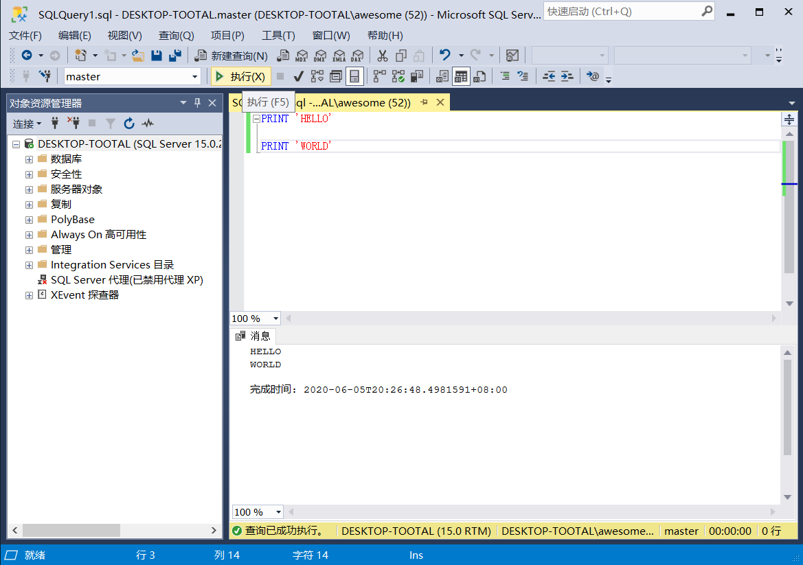
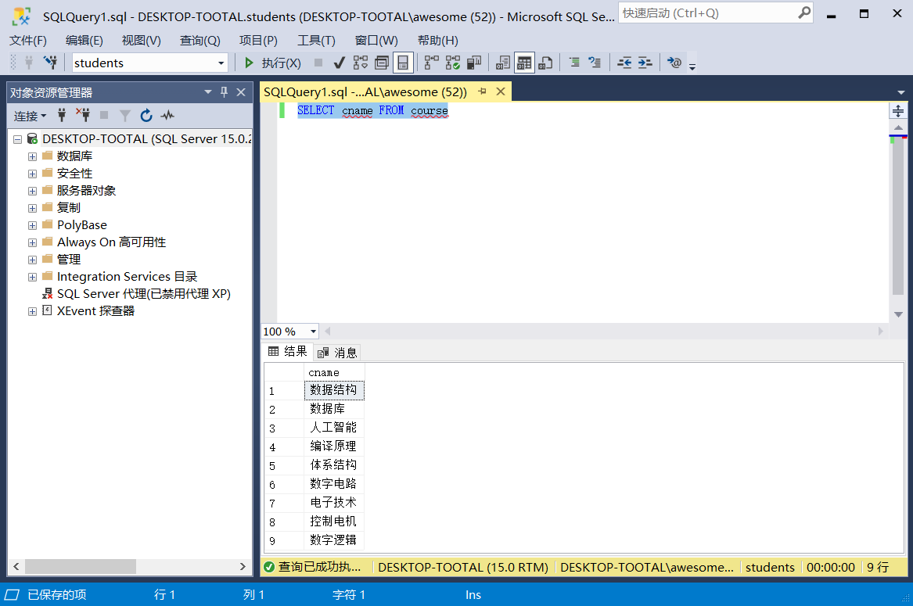
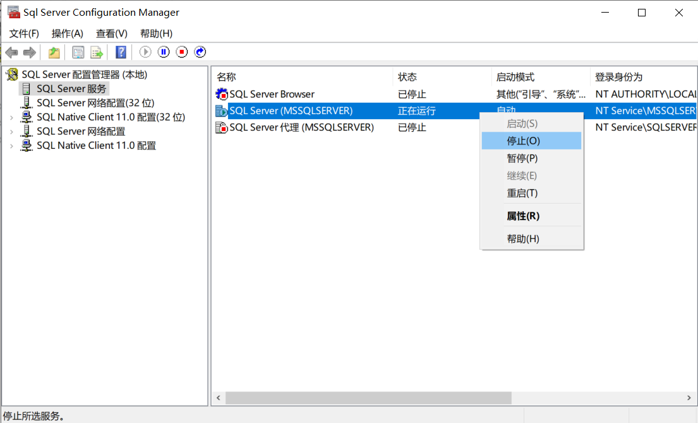

# 数据库实验总结
最近由于数据库课程的需要，做了一些数据库相关的实验，在此做一些总结与记录。

## 版本选择与环境安装
之前用数据库都是选择开源的[MySQL](https://www.mysql.com/)或是轻便的[SQLite](https://www.sqlite.org/index.html)，这次想尝试一下更强大的数据库产品。课程推荐使用的是[Oracle Database](https://www.oracle.com/database/technologies/)或者[SQL Server](https://www.microsoft.com/zh-cn/sql-server)，目前市场上主流也是这两个数据库产品。其中占比更多的是Oracle的产品，但是简单对比了一下我还是选择了SQL Server，主要原因就是SQL Server提供中文的文档，对新手也比较友好。想详细了解一下可以参考：[Oracle的文档](https://docs.oracle.com/en/database/oracle/oracle-database/18/cncpt/sql.html#GUID-DA48618A-A6BB-421A-A10A-02859D8ED9AD)和[Microsoft的文档](https://docs.microsoft.com/zh-cn/sql/t-sql/tutorial-writing-transact-sql-statements?view=sql-server-ver15)。

接下来就是确定安装的数据库版本了，针对学习用途，SQL Server提供了两种版本：

SQL Server 2019 Developer 是一个全功能免费版本，许可在非生产环境下用作开发和测试数据库。[下载链接](https://go.microsoft.com/fwlink/?linkid=866662)


SQL Server 2019 Express 是 SQL Server 的一个免费版本，非常适合用于桌面、Web 和小型服务器应用程序的开发和生产。[下载链接](https://go.microsoft.com/fwlink/?linkid=866658)


上面列出了版本的介绍和安装需要占用的空间以及下载的大小，可以根据自己的需要选择，我选择了Developer版本，下载好后直接双击开始安装。


等待一段时间后就安装好了：


注意这里安装的是一个服务，它并不带有常见软件的界面，是悄悄运行在后台的。如果需要一个界面可以选择安装SSMS。（大小约550M）点击下面的按钮即可跳转到下载页面，[下载链接](https://aka.ms/ssmsfullsetup)，初学者还是比较推荐安装的，当然也可以选择使用命令行操作。后面的操作虽然在SSMS中进行，但主要还是通过SQL语句操作的。


安装好后即可开始使用。


服务器名称一般是计算机名称，可以在计算机--属性中查看。


连接成功！至此SQL Server环境已经安装好了。

## 数据库基本操作
点击新建查询，即可创建一个SQL文件，在此文件里即可输入SQL语句。
### 执行SQL


下面介绍一些执行语句的操作。

点击**执行按钮**即可执行整个SQL文件，也可用F5快捷键。



有时候只想执行一部分的SQL语句。这时可以选中这部分的语句，再点击执行按钮，即可只执行这部分的语句。


接下来涉及比较多的SQL语句，为了统一格式，SQL关键词采用大写模式、数据库名/表名采用小写字母加数字加下划线命名、数据类型使用小写字母。SQL语句尽量简洁，不使用过多的T-SQL特性。SQL语句末尾不使用分号。

### 数据库
* 创建students数据库

`CREATE DATABASE students`

* 删除students数据库

`DROP DATABASE students`

* 使用students数据库（默认是在master数据库）

`USE students`

### 创建表
* 创建student表（学生表）

```sql
CREATE TABLE student
(
	sno varchar(50) PRIMARY KEY,-- 学号
	sname varchar(50) NOT NULL,-- 姓名
	sex varchar(50) NOT NULL,-- 性别
	bdate date NOT NULL,-- 出生日期
	height float NOT NULL,-- 身高/米
	dept varchar(50)--所在系
)
```

其中`--`后面的文字是注释。参考：[数据类型](https://docs.microsoft.com/zh-cn/sql/t-sql/data-types/data-types-transact-sql?view=sql-server-ver15)、[CREATE TABLE](https://docs.microsoft.com/zh-cn/sql/t-sql/statements/create-table-transact-sql?view=sql-server-ver15)

* 创建course表（课程表）

```sql
CREATE TABLE course
(
	cno varchar(50) PRIMARY KEY,--课程号
	cname varchar(50) NOT NULL,--课程名
	lhour varchar(50) NOT NULL,--课时
	credit int NOT NULL,--学分
	semester varchar(50) NOT NULL--学期
)
```

* 创建sc表（选课表）

```sql
CREATE TABLE sc
(
	sno varchar(50),--学号
	cno varchar(50),--课程号
	grade int,--成绩
	PRIMARY KEY(sno, cno),
	FOREIGN KEY(sno) REFERENCES student(sno),
	FOREIGN KEY(cno) REFERENCES course(cno)
)
```

注意此处主码与外码约束的写法。

### 查询数据
SQL语句中最重要的就是查询语句了，为了方便查询，先插入一些数据，这里使用数据库课程提供的[测试数据](_v_attachments/20200605210343365_16011/data.sql)，仅供测试使用。

* 查询所有课程名称

`SELECT cname FROM course`



结果显示非常直观，后面的结果采用文本的方式展现。

* 查询秋季开设的课程名

```sql
SELECT cname FROM course WHERE semester = '秋'
```

```
cname
--------------------------------------------------
数据结构
编译原理
体系结构
数字电路
控制电机
```

* 查询身高大于1.84m的男生的学号和姓名

```sql
SELECT sno, sname FROM student
WHERE height > 1.84 AND sex = '男'
```

```
sno                                                sname
-------------------------------------------------- --------------------------------------------------
201530371763                                       郑佳炜
201530541340                                       何浩宁
201536061248                                       柯皓文

```

* 查询选修计算机系秋季所开课程的杨姓男生的姓名、课程号（计算机系课程的课程号以CS开头）

```sql
SELECT sname, sc.cno FROM student, course, sc
WHERE sc.sno = student.sno AND sc.cno = course.cno 
	AND sc.cno LIKE 'CS%' AND semester = '秋'
	AND sex = '男' AND sname LIKE '杨%'
```

```
sname                                              cno
-------------------------------------------------- --------------------------------------------------
杨晓虹                                                CS4
杨晓虹                                                CS5
杨心语                                                CS1
杨心语                                                CS5

```

* 查询至少选修一门电机系课程的女生的姓名（电机系课程的课程号以EE开头）

```sql
SELECT sname FROM student, sc 
WHERE student.sno = sc.sno 
	AND student.sex = '女'
	AND cno LIKE 'EE%'
GROUP BY sname
```

```
sname
--------------------------------------------------
陈庄智
范港平
冯嘉昌
古超文
何伟健
何盈盈
李研
梁浩赞
刘亚威
孙越
唐仁杰
王锦杰
吴松树
许哲
杨奕彬
游德鸿
赵飞扬

```

* 查询总平均成绩

```sql
SELECT AVG(grade) FROM sc
```

```
73
```

* 查询每门课程的平均成绩

```sql
SELECT course.cno, AVG(grade) AS 平均成绩
FROM course LEFT JOIN sc 
ON course.cno = sc.cno 
GROUP BY course.cno
```

注意这里不能从sc表中直接统计，要考虑所有课程（可能有没人选的课），可以把course表和sc表左连接。

```
cno                                                平均成绩
-------------------------------------------------- -----------
CS1                                                77
CS2                                                73
CS3                                                75
CS4                                                76
CS5                                                71
EE1                                                73
EE2                                                72
EE3                                                73
EE4                                                71

```

* 查询所有课程的成绩都在80分以上的学生的姓名、学号、且按学号升序排列

```sql
SELECT sname, sc.sno FROM student, sc 
WHERE student.sno = sc.sno 
GROUP BY sc.sno, sname 
HAVING MIN(grade) > 80
ORDER BY sc.sno
```

```
sname                                              sno
-------------------------------------------------- --------------------------------------------------
徐映雪                                                201530381885
胡景铨                                                201530541418
刘俊彦                                                201530541807
沈强                                                 201530541937
杨晓虹                                                201530542262
刘亚威                                                201592450587

```

* 查询有一门以上(含一门)三个学分以上课程的成绩低于51分的学生的姓名

```sql
SELECT sname FROM student, sc, course 
WHERE student.sno = sc.sno AND course.cno = sc.cno
	AND credit > 3 AND grade < 51
GROUP BY sname
```

```
sname
--------------------------------------------------
何亿
孙越
许树雄

```


* 查询1984年2月到3月出生的学生的姓名,总平均成绩及已修学分数

```sql
SELECT sname, AVG(grade) AS 总平均成绩, SUM(credit) AS 已修学分数
FROM student, sc, course
WHERE student.sno = sc.sno AND course.cno = sc.cno
	AND bdate >= '1984-02-01' AND bdate <= '1984-3-31'
GROUP BY sname
```

```
sname                                              总平均成绩       已修学分数
-------------------------------------------------- ----------- -----------
李研                                                 74          8
吴伟斌                                                69          9
张朝晖                                                74          9

```

### 插入数据
其实从测试数据里面就可以看到插入数据的格式，下面列出课程数据参考：

```sql
INSERT INTO course VALUES('CS1', '数据结构', '64', 3.0, '秋');
INSERT INTO course VALUES('CS2', '数据库', '64', 4.0, '春');
INSERT INTO course VALUES('CS3', '人工智能', '48', 2.0, '春');
INSERT INTO course VALUES('CS4', '编译原理', '64', 4.0, '秋');
INSERT INTO course VALUES('CS5', '体系结构', '48', 3.0, '秋');
INSERT INTO course VALUES('EE1', '数字电路', '64', 2.0, '秋');
INSERT INTO course VALUES('EE2', '电子技术', '64', 4.0, '春');
INSERT INTO course VALUES('EE3', '控制电机', '64', 4.0, '秋');
INSERT INTO course VALUES('EE4', '数字逻辑', '32', 2.0, '春');
```

### 修改数据

为了不影响测试数据的稳定，添加一个临时的数据。

```sql
INSERT INTO course VALUES('EE5', '电工实习', '48', 1.0, '春');
```

将学分修改为2

```sql
UPDATE course
SET credit = 2
WHERE cno = 'EE5'
```

查询：

```sql
SELECT cno, credit FROM course WHERE cno = 'EE5'
```

```
cno                                                credit
-------------------------------------------------- -----------
EE5                                                2

```

### 删除数据

删除之前插入的临时数据：

```sql
DELETE FROM course
WHERE cno = 'EE5'
```

### 进阶查询

* 统计各系的男生和女生的人数

```sql
SELECT dept,
	COUNT(CASE WHEN sex='男' THEN 1 ELSE NULL END) AS '男生数',
	COUNT(CASE WHEN sex='女' THEN 1 ELSE NULL END) AS '女生数'
FROM student
GROUP BY dept
```

```
dept                                               男生数         女生数
-------------------------------------------------- ----------- -----------
电机系                                                23          17
计算机系                                               25          10
```

* 列出学习过‘编译原理’，‘数据库’或‘体系结构’课程，且这些课程的成绩之一在90分以上的学生的名字。

```sql
SELECT sname FROM student
WHERE sno IN 
	(SELECT sc.sno FROM sc, course
	WHERE sc.cno = course.cno AND sc.grade > 90 AND 
		(cname = '编译原理'
		OR cname = '数据库'
		OR cname = '体系结构'))
```

```
sname
--------------------------------------------------
黄喜全
李心妍
林世畅
刘俊彦
杨晓虹
杨心语
郑晓燕
黄琳
```

* 列出未选修‘电子技术’课程，但选修了‘数字电路’或‘数字逻辑’课程的学生数。

```sql
SELECT COUNT(*) FROM student
WHERE (sno NOT IN 
	(SELECT sc.sno FROM sc, course
	WHERE sc.cno = course.cno AND course.cname = '电子技术'))
	AND (sno IN
	(SELECT sc.sno FROM sc, course
	WHERE sc.cno = course.cno AND
		(course.cname = '数字电路' OR course.cname = '数字逻辑')))
```

```
13
```

* 列出平均成绩最高的学生名字和成绩。（不得使用TOP或LIMIT关键字）

```sql
SELECT sname, avg_grade FROM (
	SELECT sno, AVG(grade) AS avg_grade, RANK() OVER
		(ORDER BY AVG(grade) DESC) AS rk
	FROM sc 
	GROUP BY sno
) ranked_sc, student
WHERE ranked_sc.rk = 1
	AND ranked_sc.sno = student.sno

```

注意这种方式可以查出并列最高的情况。
参考[RANK](https://docs.microsoft.com/zh-cn/sql/t-sql/functions/rank-transact-sql?view=sql-server-ver15)

```
sname                                              avg_grade
-------------------------------------------------- -----------
徐映雪                                                95

```

### 结构化查询
参考如下例题：
对每门课增加“先修课程”的属性，用来表示某一门课程的先修课程，每门课程应可记录多于一门的先修课程。列出有资格选修数据库课程的所有学生。(该学生已经选修过数据库课程的所有先修课，并达到合格成绩。)

* 创建先修课程记录表

```sql
CREATE TABLE precourse
(
	cno VARCHAR(50),--课程号
	pre_cno VARCHAR(50),--先修课程号
	PRIMARY KEY(cno, pre_cno),
	FOREIGN KEY(cno) REFERENCES course(cno),
	FOREIGN KEY(pre_cno) REFERENCES course(cno)
)
```

* 插入测试数据

```sql
INSERT INTO precourse
(cno, pre_cno)
VALUES
('CS2', 'CS5'),
('CS2', 'CS4'),
('CS4', 'CS1')

```

先修关系如下：
数据库--体系结构
     |--编译原理--数据结构

* 创建临时表

```sql
IF EXISTS (
	SELECT name FROM sysobjects
	WHERE name = 'tmp_pre'
)
DROP TABLE tmp_pre
```

* 将数据库课程号插入临时表

```sql
SELECT cno INTO tmp_pre
FROM course WHERE cname = '数据库'
```

* 找出数据库课程所有的先修课、间接先修课……

```sql
WHILE (@@ROWCOUNT > 0)
BEGIN
	INSERT tmp_pre(cno) SELECT pre_cno
	FROM precourse 
	WHERE (cno IN (SELECT cno FROM tmp_pre))
		AND (pre_cno NOT IN (SELECT cno FROM tmp_pre))
END
```

参考：[@@ROWCOUNT](https://docs.microsoft.com/zh-cn/sql/t-sql/functions/rowcount-transact-sql?view=sql-server-ver15)
过程类似于BFS。

* 从中删除数据库本身课程号（从实际情况出发，有资格选数据库的应该是还没选这门课的人）

```sql
DELETE FROM tmp_pre
WHERE cno=(SELECT cno FROM course WHERE cname = '数据库')
```

* 找出选修了所有先修课的人

```sql
SELECT sno FROM sc
WHERE cno IN (SELECT cno FROM tmp_pre)
GROUP BY sno
HAVING COUNT(*) = (SELECT COUNT(*) FROM tmp_pre)
```

* 结果如下

```
sno
--------------------------------------------------
201530471586
201530541128
201530541210
```

* 删除临时表

```
DROP TABLE tmp_pre
```

## 数据库进阶操作
### 视图
创建视图student_grade(sname,cname,grade)，表示学生选修课程及成绩的详细信息。

可以发现之前查询学生的姓名及成绩需要把三个表连接起来，比较麻烦，利用视图可以解决这个问题。

```sql
CREATE VIEW student_grade(sname, cname, grade) AS
SELECT sname, cname, grade FROM student, sc, course 
WHERE sc.cno = course.cno AND sc.sno = student.sno
```

利用视图查询一下：查询所有陈姓同学选了数据库课程的成绩。

```sql
SELECT sname, grade FROM student_grade
WHERE sname LIKE '陈%' AND cname = '数据库'
```

```
sname                                              grade
-------------------------------------------------- -----------
陈浩鑫                                                79
陈海康                                                60
陈嘉健                                                82
陈润森                                                51
陈钊浩                                                80

```

可以看到，利用视图查询非常简洁直观。

### 触发器
新增表credit_stat(sno, sum_credit, no_pass)，表示每个学生已通过选修课程的合计学分数，以及不及格的课程数。

```sql
CREATE TABLE credit_stat
(
	sno VARCHAR(50) PRIMARY KEY,--学号
	sum_credit INT NOT NULL,--已通过课程合计学分数
	no_pass INT NOT NULL,--不及格的课程数
	FOREIGN KEY(sno) REFERENCES student(sno)
)
```

插入已有的数据：

```sql
INSERT INTO credit_stat
SELECT sno, SUM(credit), 
	COUNT(CASE WHEN grade<60 THEN 1 ELSE NULL END)
FROM sc, course 
WHERE sc.cno = course.cno 
GROUP BY sno
```

利用触发器，在sc表中插入数据时自动更新credit_stat

```sql
CREATE TRIGGER update_credit
ON sc AFTER INSERT AS
BEGIN
	IF (SELECT grade FROM inserted) >= 60
	BEGIN
		UPDATE credit_stat SET 
			sum_credit = sum_credit + 
				(SELECT credit FROM course, inserted
				WHERE course.cno = inserted.cno)
		WHERE sno = (SELECT sno FROM inserted)
	END
	ELSE
	BEGIN
		UPDATE credit_stat SET no_pass = no_pass + 1
		WHERE sno = (SELECT sno FROM inserted)
	END
END
```

参考[inserted和deleted](https://docs.microsoft.com/zh-cn/sql/relational-databases/triggers/use-the-inserted-and-deleted-tables?view=sql-server-ver15)、[CREATE TRIGGER](https://docs.microsoft.com/zh-cn/sql/t-sql/statements/create-trigger-transact-sql?view=sql-server-ver15)

* 查看原始数据

```sql
SELECT * FROM credit_stat WHERE sno = '201592450588'
```

```
sno                                                sum_credit  no_pass
-------------------------------------------------- ----------- -----------
201592450588                                       8           0

```

* 更新sc表，查看数据

```sql
INSERT INTO sc VALUES
('201592450588', 'EE3', 59)
```

```
sno                                                sum_credit  no_pass
-------------------------------------------------- ----------- -----------
201592450588                                       8           1

```

可以发现credit_stat表被触发器自动更新了。

### 约束
实际上，创建表时指定的主码、外码就是一种约束。这里演示一下怎么删除约束。

* 查询sc表上的所有约束

```sql
SELECT constraint_name FROM information_schema.key_column_usage
WHERE TABLE_NAME = 'sc'
```

```
constraint_name
---------------------------------------------------
FK__sc__cno__29572725
FK__sc__sno__286302EC
PK__sc__905C05333DE99711
PK__sc__905C05333DE99711

```

当然利用SP_HELP命令也可以。

参考：[SP_HELP](https://docs.microsoft.com/zh-cn/sql/relational-databases/system-stored-procedures/sp-help-transact-sql?view=sql-server-ver15)、[系统信息架构视图](https://docs.microsoft.com/zh-cn/sql/relational-databases/system-information-schema-views/system-information-schema-views-transact-sql?view=sql-server-ver15)、[KEY_COLUMN_USAGE](https://docs.microsoft.com/zh-cn/sql/relational-databases/system-information-schema-views/key-column-usage-transact-sql?view=sql-server-ver15)

* 删除约束

```sql
ALTER TABLE sc
DROP CONSTRAINT FK__sc__cno__29572725
```

### 过程
有时候有一些重复的操作可以抽象出来，创建一个过程。例如下面这个过程可以输出问候语句。

```sql
CREATE PROC welcome 
@name varchar(50)
AS
BEGIN
	PRINT 'hello ' + @name
END
```

执行

```sql
EXEC welcome tootal
```

就会输出：

```
hello tootal
```

参考：[CREATE PROCEDURE](https://docs.microsoft.com/zh-cn/sql/t-sql/statements/create-procedure-transact-sql?view=sql-server-ver15)

### 用户
用户权限控制是保证数据库安全的一个重要措施。在SQL Server里，登录名和用户名是分开来的，需要分别创建。

例：创建一个学生用户，可以查询所有的课程信息，可以根据学号和课程号来查询成绩。但不允许修改任何数据。

* 创建登录名和用户

```sql
CREATE LOGIN student_user
WITH PASSWORD = '123456',
DEFAULT_DATABASE = students,
CHECK_POLICY = OFF 
CREATE USER student_user FOR LOGIN student_user
```

参考：[CREATE LOGIN](https://docs.microsoft.com/zh-cn/sql/t-sql/statements/create-login-transact-sql?view=sql-server-ver15)

接下来配置一下SQL Server，允许使用用户名登录。


在对象资源管理器上右键点击已连接的实例，选择属性。


在安全性板块中切换到“SQL Server和Windows身份验证模式”，确定后会弹出提示：

::: alert-info

直到重新启动 SQL Server 后，您所做的某些配置更改才会生效。

:::

注意，需要重启的是SQL Server而不是SSMS，把窗口关闭再打开是没有用的。可以先关闭SSMS，在开始菜单中找到SQL Server 2019配置管理器，



在这里把SQL Server停止后再启动即可。注意在这里还可以更改服务的启动模式，如果你不想电脑启动时自动运行SQL Server服务，可以把启动模式改为手动。（不推荐）


当然此过程也可以使用命令完成，由于不是SQL相关内容，就不加赘述了。参考[sc查询](https://docs.microsoft.com/zh-cn/windows-server/administration/windows-commands/sc-query)。

重新启动之后就可以输入用户名和密码登录了，为了方便演示，我这里同时登录两个用户。


注意切换到SQL身份验证。


### 授权

登录好后新建查询，注意右下角状态栏的标识（student_user），可以用来区分当前的用户。


可以尝试查询一下数据，默认是没有任何权限的。

```sql
SELECT * FROM course
```

```
消息 229，级别 14，状态 5，第 1 行
拒绝了对对象 'course' (数据库 'students'，架构 'dbo')的 SELECT 权限。
```

切换到管理员账户（切换查询即可，不同的查询会对应不同的账户，利用状态栏可以分辨），对学生用户授权。

```sql
GRANT SELECT ON course TO student_user
```

再次使用学生账户查询：

```sql
SELECT * FROM course
```

已经可以查询到结果了。

参考：[配置数据库对象的权限](https://docs.microsoft.com/zh-cn/sql/t-sql/lesson-2-configuring-permissions-on-database-objects?view=sql-server-ver15)


注意之前的要求是：根据学号和课程号来查询成绩，显然不能直接授予SELECT权限，这样学生可以查出所有的成绩。可以使用过程封装查询步骤。

```sql
CREATE PROC query_grade
@sno VARCHAR(50),
@cno VARCHAR(50)
AS
BEGIN
	SELECT * FROM sc
	WHERE sno = @sno AND cno = @cno
END
```

测试一下：

```sql
EXEC query_grade '201530311042', 'CS2'
```

```
sno                                cno                            grade
---------------------------------- ------------------------------ -----------
201530311042                       CS2                            79

```

接下来就容易了，只要把query_grade的执行权限授予student_user就行了。

```sql
GRANT EXECUTE ON query_grade TO student_user
```

切换到学生用户测试一下：

```sql
EXEC query_grade '201530311042', 'CS2'
```

```
sno                                cno                            grade
---------------------------------- ------------------------------ -----------
201530311042                       CS2                            79

```

可以查询，尝试查询所有成绩：

```sql
SELECT * FROM sc
```

```
消息 229，级别 14，状态 5，第 1 行
拒绝了对对象 'sc' (数据库 'students'，架构 'dbo')的 SELECT 权限。

```

提示没有权限。

## 说明

这篇文章只是对我近期进行的一些数据库实验的总结，其中列出的语句不一定正确，仅供参考。