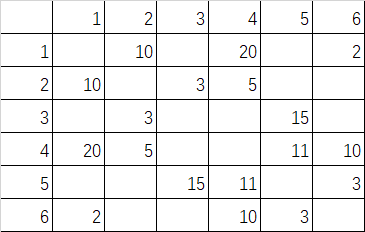
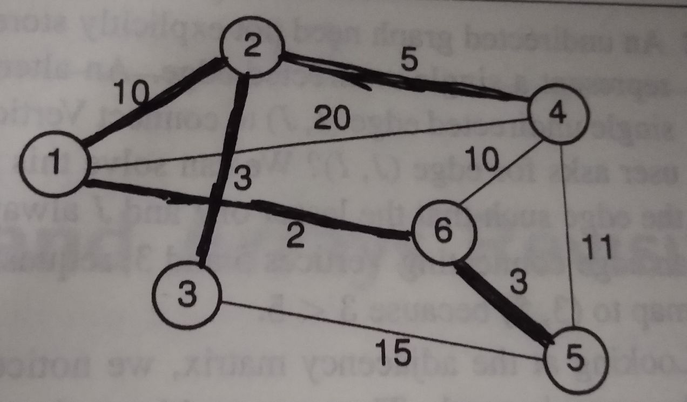
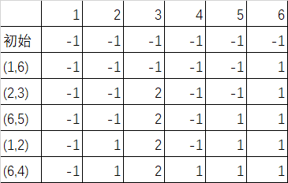

# 数据结构十一章作业
## 11.3
### (a)

### (b)
1. 2(10)-->4(20)-->6(3)
2. 1(10)-->3(3)-->4(5)
3. 2(3)-->5(15)
4. 1(20)-->2(5)-->5(11)-->6(10)
5. 3(15)-->4(11)-->6(3)
6. 1(2)-->4(10)-->5(3)

### (c)
邻接矩阵：72
邻接表：168
### (d)
邻接矩阵：72
邻接表：150

## 11.4
1-->2-->3-->5-->4-->6

## 11.6
1-->2-->3
|-->4-->5
|-->6

## 11.15
```cpp
void DFS(Graph *G , int v){
	PreVisit(G,v);
	G->setMark(v,visited);
	for(int w=G->first(v);w<G->n();w=G->next(v,w))
		if(G->getMark(w)==unvisited)
			DFS(G,w);
		else if(G->getMark(w)==visited)
			cout<<”有回路”<<endl;
			return;
	PostVisit(G,v);
}
```

## 11.17
(3,2)-->(2,4)-->(2,1)-->(1,6)-->(6,5)


## 11.18
(1,6)-->(2,3)-->(5,6)-->(2,4)-->(1,2)


