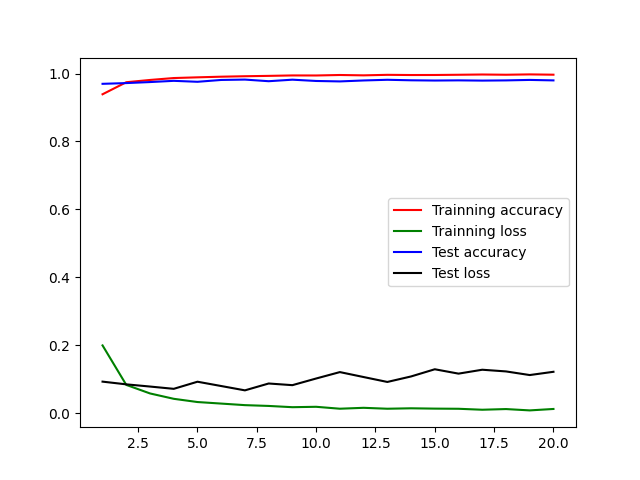
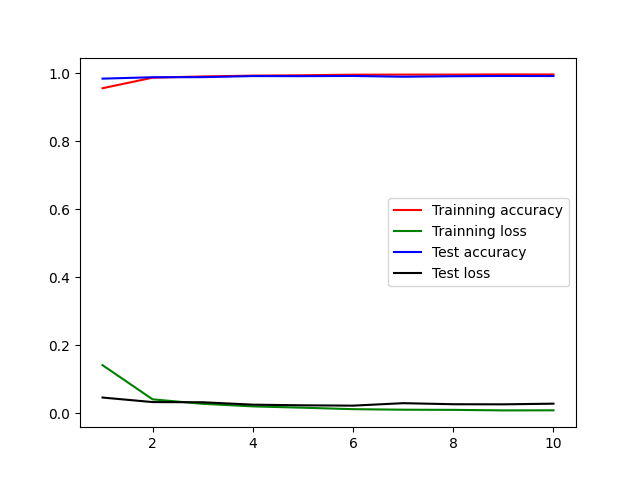
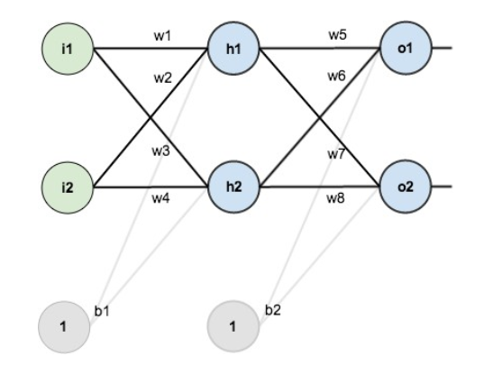

# 深度学习实验二

实验环境：
python@3.8.6
tensorflow@2.3.1

## 一
多层感知机用于MNIST 手写数字数据集分类（提交实现步骤描述以及下面要求提交的结果）

1. 获取MNIST 数据集，每张图片像素为28 × 28
2. 模型架构为包含两个隐含层的多层感知机模型

输入层维度：28 × 28 = 784
第一层隐含单元数：256 
第二层隐含单元数：256
输出层维度：10（MNIST 数据集类别数，分别为0 到9）

3. 画出训练和测试过程的准确率随迭代次数变化图，画出训练和测试过程的损失随迭代次数变化图。
（提交最终分类精度、分类损失以及两张变化图）


```py
from os import environ
environ['TF_CPP_MIN_LOG_LEVEL'] = '1'
import tensorflow as tf
import matplotlib.pyplot as plt

mnist = tf.keras.datasets.mnist

(x_train, y_train), (x_test, y_test) = mnist.load_data()
x_train, x_test = x_train / 255.0, x_test / 255.0

model = tf.keras.Sequential([
    tf.keras.layers.Flatten(input_shape=(28, 28)),
    tf.keras.layers.Dense(256, activation='relu'),
    tf.keras.layers.Dense(256, activation='relu'),
    tf.keras.layers.Dense(10)
])

model.compile(optimizer='adam',
              loss=tf.keras.losses.SparseCategoricalCrossentropy(from_logits=True),
              metrics=['accuracy'])

history = model.fit(x_train, y_train,
                    validation_data=(x_test, y_test),
                    epochs=20).history

test_loss, test_acc = model.evaluate(x_test, y_test, verbose=2)

print('Test accuracy: ', test_acc)
print('Test loss: ', test_loss)

epochs = range(1,len(history['accuracy']) + 1)
plt.figure()
plt.plot(epochs, history['accuracy'], 'r', label='Trainning accuracy')
plt.plot(epochs, history['loss'], 'g', label='Trainning loss')
plt.plot(epochs, history['val_accuracy'], 'b', label='Test accuracy')
plt.plot(epochs, history['val_loss'], 'k', label='Test loss')
plt.legend()
plt.show()
```

运行输出：

```
Epoch 1/20
1875/1875 [==============================] - 3s 2ms/step - loss: 0.1996 - accuracy: 0.9389 - val_loss: 0.0929 - val_accuracy: 0.9697
Epoch 2/20
1875/1875 [==============================] - 3s 2ms/step - loss: 0.0833 - accuracy: 0.9744 - val_loss: 0.0849 - val_accuracy: 0.9719
Epoch 3/20
1875/1875 [==============================] - 3s 2ms/step - loss: 0.0582 - accuracy: 0.9811 - val_loss: 0.0785 - val_accuracy: 0.9749
Epoch 4/20
1875/1875 [==============================] - 3s 2ms/step - loss: 0.0424 - accuracy: 0.9867 - val_loss: 0.0717 - val_accuracy: 0.9785
Epoch 5/20
1875/1875 [==============================] - 3s 2ms/step - loss: 0.0329 - accuracy: 0.9888 - val_loss: 0.0927 - val_accuracy: 0.9757
Epoch 6/20
1875/1875 [==============================] - 3s 2ms/step - loss: 0.0283 - accuracy: 0.9907 - val_loss: 0.0800 - val_accuracy: 0.9811
Epoch 7/20
1875/1875 [==============================] - 3s 2ms/step - loss: 0.0237 - accuracy: 0.9920 - val_loss: 0.0673 - val_accuracy: 0.9822
Epoch 8/20
1875/1875 [==============================] - 3s 2ms/step - loss: 0.0214 - accuracy: 0.9931 - val_loss: 0.0875 - val_accuracy: 0.9774
Epoch 9/20
1875/1875 [==============================] - 3s 2ms/step - loss: 0.0177 - accuracy: 0.9944 - val_loss: 0.0826 - val_accuracy: 0.9819
Epoch 10/20
1875/1875 [==============================] - 3s 2ms/step - loss: 0.0189 - accuracy: 0.9943 - val_loss: 0.1022 - val_accuracy: 0.9781
Epoch 11/20
1875/1875 [==============================] - 3s 2ms/step - loss: 0.0132 - accuracy: 0.9957 - val_loss: 0.1210 - val_accuracy: 0.9768
Epoch 12/20
1875/1875 [==============================] - 3s 2ms/step - loss: 0.0159 - accuracy: 0.9947 - val_loss: 0.1065 - val_accuracy: 0.9796
Epoch 13/20
1875/1875 [==============================] - 3s 2ms/step - loss: 0.0132 - accuracy: 0.9962 - val_loss: 0.0920 - val_accuracy: 0.9816
Epoch 14/20
1875/1875 [==============================] - 3s 2ms/step - loss: 0.0144 - accuracy: 0.9956 - val_loss: 0.1082 - val_accuracy: 0.9801
Epoch 15/20
1875/1875 [==============================] - 3s 2ms/step - loss: 0.0135 - accuracy: 0.9957 - val_loss: 0.1294 - val_accuracy: 0.9794
Epoch 16/20
1875/1875 [==============================] - 3s 2ms/step - loss: 0.0130 - accuracy: 0.9964 - val_loss: 0.1165 - val_accuracy: 0.9799
Epoch 17/20
1875/1875 [==============================] - 3s 2ms/step - loss: 0.0102 - accuracy: 0.9971 - val_loss: 0.1280 - val_accuracy: 0.9792
Epoch 18/20
1875/1875 [==============================] - 3s 2ms/step - loss: 0.0122 - accuracy: 0.9964 - val_loss: 0.1230 - val_accuracy: 0.9798
Epoch 19/20
1875/1875 [==============================] - 3s 2ms/step - loss: 0.0083 - accuracy: 0.9974 - val_loss: 0.1123 - val_accuracy: 0.9812
Epoch 20/20
1875/1875 [==============================] - 3s 2ms/step - loss: 0.0125 - accuracy: 0.9966 - val_loss: 0.1219 - val_accuracy: 0.9798
313/313 - 0s - loss: 0.1219 - accuracy: 0.9798
Test accuracy:  0.9797999858856201
Test loss:  0.12192590534687042
```

变化图：




## 二
卷积神经网络用于MNIST 手写数字数据集分类（提交实现步骤描述以及下面要求提交的结果）
1、获取MNIST 数据集，每张图片像素为28 × 282、模型架构：

输入层维度：28 × 28（卷积层和池化层的padding 都是用‘SAME’）
卷积层1：卷积核大小为5× 5，卷积核个数为32（输出维度为28× 28× 32）
池化层1：使用最大池化，核大小的2 × 2，stride为2（输出维度为14× 14 × 32）
卷积层2：卷积核大小为5× 5，卷积核个数为64（输出维度为14× 14× 64）
池化层2：使用最大池化，核大小的2× 2，stride为2（输出维度为7× 7× 64）
（将池化层2的输出展平作为全连接层的输入，输入维度为7× 7 × 64= 3136）
全连接层：隐含单元数为1024 
Dropout 层：Dropout 率为0.25
输出层维度：10（MNIST 数据集类别数，分别为0 到9）

3、画出训练和测试过程的准确率随迭代次数变化图，画出训练和测试过程的损失随迭代次数变化图。（提交最终分类精度、分类损失以及两张变化图）


代码：

```py
from os import environ
environ['TF_CPP_MIN_LOG_LEVEL'] = '1'
import tensorflow as tf
import matplotlib.pyplot as plt

mnist = tf.keras.datasets.mnist

(x_train, y_train), (x_test, y_test) = mnist.load_data()
x_train, x_test = x_train / 255.0, x_test / 255.0

x_train = x_train.reshape(x_train.shape[0], 28, 28, 1)
x_test = x_test.reshape(x_test.shape[0], 28, 28, 1)
y_train = tf.keras.utils.to_categorical(y_train, 10)
y_test = tf.keras.utils.to_categorical(y_test, 10)

model = tf.keras.Sequential()
model.add(tf.keras.layers.Conv2D(32, kernel_size=(5,5), activation='relu', padding='same', input_shape=(28, 28, 1)))
model.add(tf.keras.layers.MaxPool2D(pool_size=(2,2), strides=2, padding='same'))
model.add(tf.keras.layers.Conv2D(64, kernel_size=(5,5), activation='relu', padding='same'))
model.add(tf.keras.layers.MaxPool2D(pool_size=(2,2), strides=2, padding='same'))
model.add(tf.keras.layers.Flatten())
model.add(tf.keras.layers.Dense(1024, activation='relu'))
model.add(tf.keras.layers.Dropout(0.25))
model.add(tf.keras.layers.Dense(10, activation='softmax'))

model.compile(optimizer='adam',
              loss='categorical_crossentropy',
              metrics=['accuracy'])

history = model.fit(x_train, y_train,
                    validation_data=(x_test, y_test),
                    batch_size=128,
                    epochs=10).history

test_loss, test_acc = model.evaluate(x_test, y_test, verbose=2)

print('Test accuracy: ', test_acc)
print('Test loss: ', test_loss)

epochs = range(1,len(history['accuracy']) + 1)
plt.figure()
plt.plot(epochs, history['accuracy'], 'r', label='Trainning accuracy')
plt.plot(epochs, history['loss'], 'g', label='Trainning loss')
plt.plot(epochs, history['val_accuracy'], 'b', label='Test accuracy')
plt.plot(epochs, history['val_loss'], 'k', label='Test loss')
plt.legend()
plt.show()
```

运行结果：

```
Epoch 1/10
469/469 [==============================] - 7s 14ms/step - loss: 0.1413 - accuracy: 0.9566 - val_loss: 0.0460 - val_accuracy: 0.9848
Epoch 2/10
469/469 [==============================] - 6s 14ms/step - loss: 0.0407 - accuracy: 0.9876 - val_loss: 0.0327 - val_accuracy: 0.9889
Epoch 3/10
469/469 [==============================] - 6s 14ms/step - loss: 0.0275 - accuracy: 0.9912 - val_loss: 0.0321 - val_accuracy: 0.9892
Epoch 4/10
469/469 [==============================] - 6s 14ms/step - loss: 0.0200 - accuracy: 0.9937 - val_loss: 0.0251 - val_accuracy: 0.9923
Epoch 5/10
469/469 [==============================] - 6s 14ms/step - loss: 0.0161 - accuracy: 0.9948 - val_loss: 0.0231 - val_accuracy: 0.9921
Epoch 6/10
469/469 [==============================] - 6s 14ms/step - loss: 0.0118 - accuracy: 0.9965 - val_loss: 0.0222 - val_accuracy: 0.9927
Epoch 7/10
469/469 [==============================] - 6s 14ms/step - loss: 0.0102 - accuracy: 0.9967 - val_loss: 0.0294 - val_accuracy: 0.9904
Epoch 8/10
469/469 [==============================] - 6s 14ms/step - loss: 0.0098 - accuracy: 0.9967 - val_loss: 0.0263 - val_accuracy: 0.9919
Epoch 9/10
469/469 [==============================] - 6s 14ms/step - loss: 0.0082 - accuracy: 0.9973 - val_loss: 0.0260 - val_accuracy: 0.9927
Epoch 10/10
469/469 [==============================] - 6s 14ms/step - loss: 0.0084 - accuracy: 0.9970 - val_loss: 0.0280 - val_accuracy: 0.9924
313/313 - 1s - loss: 0.0280 - accuracy: 0.9924
Test accuracy:  0.9923999905586243
Test loss:  0.027992071583867073
```

变化图：



## 三
多层感知机实现异或运算（提交实现步骤描述、源代码以及最后的测试误差）
要求：不允许使用Tensorflow 等深度学习框架，使用Python 实现网络的前向传播和反向传播过程。源代码文件命名为“班级_学号_姓名_BP.py”。

数据集：[[[0,0], [0]],[[0, 1],[1]],[[1, 0],[1]],[[1, 1],[0]]]

BP 算法实现



可供参考的实现过程：

单个神经元操作：
1、定义参数矩阵、定义激活函数、定义损失函数
2、计算神经元输出
3、计算误差

实现前向传播：
1、定义神经元个数
2、计算层中每个神经元的输出

实现反向传播：
1、计算误差
2、计算每一层中权重的梯度
3、更新输出层权重
4、更新隐含层权重


实现步骤：

定义参数，使用随机数初始化权重矩阵：

```py
X = np.array([[0, 0], [0, 1], [1, 0], [1, 1]])
y = np.array([[0], [1], [1], [0]])
theta1 = np.random.rand(2, 3)
theta2 = np.random.rand(1, 3)
learning_rate = 0.5
```

定义激活函数：

```py
def sigmoid(x):
    return 1.0 / (1.0 + np.exp(-x))

def sigmoid_gradient(z):
    g = np.multiply(sigmoid(z), (1 - sigmoid(z)))
    return g
```

前向传播部分：

```py
# 前向传播
# 输入层-->隐藏层
a_1 = np.vstack((np.array([[1]]), X[t:t + 1, :].T))  # 列向量
z_2 = np.dot(theta1, a_1)
# 隐藏层-->输出层
a_2 = np.vstack((np.array([[1]]), sigmoid(z_2)))
z_3 = np.dot(theta2, a_2)
a_3 = sigmoid(z_3)
```

反向传播计算误差：

```py
# 反向传播
y_pred[t, 0] = a_3
delta_3 = a_3 - y[t:t + 1, :].T  # 最后一层每一个单元的误差
delta_2 = np.multiply(np.dot(theta2[:, 1:].T, delta_3), sigmoid_gradient(z_2))  # 第二层每一个单元的误差（不包括偏置单元）
D_2 = D_2 + np.dot(delta_3, a_2.T)  # 第二层所有参数的误差
D_1 = D_1 + np.dot(delta_2, a_1.T)  # 第一层所有参数的误差
```

更新权值：

```py
# 更新权值
theta1 -= learning_rate * (1.0 / m) * D_1
theta2 -= learning_rate * (1.0 / m) * D_2
```

损失函数使用交叉熵计算：

```py
cost = (1.0 / m) * np.sum(-y * np.log(y_pred) - (np.array([[1]]) - y) * np.log(1 - y_pred))
```


迭代训练100000次，每隔10000次输出当前损失。


运行结果：

```
Epoch  10000
Cost:  0.0022428969816806745
Epoch  20000
Cost:  0.001014832094742643
Epoch  30000
Cost:  0.0006542956317658224
Epoch  40000
Cost:  0.00048239006441904634
Epoch  50000
Cost:  0.0003818676479534111
Epoch  60000
Cost:  0.0003159414678068724
Epoch  70000
Cost:  0.00026938670225979804
Epoch  80000
Cost:  0.00023476549079365374
Epoch  90000
Cost:  0.0002080141378120684
Epoch  100000
Cost:  0.00018672515238089165
```

完整代码：

```py
import numpy as np

X = np.array([[0, 0], [0, 1], [1, 0], [1, 1]])
y = np.array([[0], [1], [1], [0]])
theta1 = np.random.rand(2, 3)
theta2 = np.random.rand(1, 3)
learning_rate = 0.5

def sigmoid(x):
    return 1.0 / (1.0 + np.exp(-x))

def sigmoid_gradient(z):
    g = np.multiply(sigmoid(z), (1 - sigmoid(z)))
    return g

for i in range(100000):
    m = X.shape[0]  # m=4
    # 计算所有参数的偏导数（梯度）
    D_1 = np.zeros(theta1.shape)
    D_2 = np.zeros(theta2.shape)
    y_pred = np.zeros((m, 1))  # 样本预测值
    for t in range(m):
        # 前向传播
        # 输入层-->隐藏层
        a_1 = np.vstack((np.array([[1]]), X[t:t + 1, :].T))  # 列向量
        z_2 = np.dot(theta1, a_1)
        # 隐藏层-->输出层
        a_2 = np.vstack((np.array([[1]]), sigmoid(z_2)))
        z_3 = np.dot(theta2, a_2)
        a_3 = sigmoid(z_3)

        # 反向传播
        y_pred[t, 0] = a_3
        delta_3 = a_3 - y[t:t + 1, :].T  # 最后一层每一个单元的误差
        delta_2 = np.multiply(np.dot(theta2[:, 1:].T, delta_3), sigmoid_gradient(z_2))  # 第二层每一个单元的误差（不包括偏置单元）
        D_2 = D_2 + np.dot(delta_3, a_2.T)  # 第二层所有参数的误差
        D_1 = D_1 + np.dot(delta_2, a_1.T)  # 第一层所有参数的误差
    # 更新权值
    theta1 -= learning_rate * (1.0 / m) * D_1
    theta2 -= learning_rate * (1.0 / m) * D_2
    # 交叉熵
    cost = (1.0 / m) * np.sum(-y * np.log(y_pred) - (np.array([[1]]) - y) * np.log(1 - y_pred))
    if (i + 1) % 10000 == 0:
        print('Epoch ', i + 1)
        print('Cost: ', cost)
```
