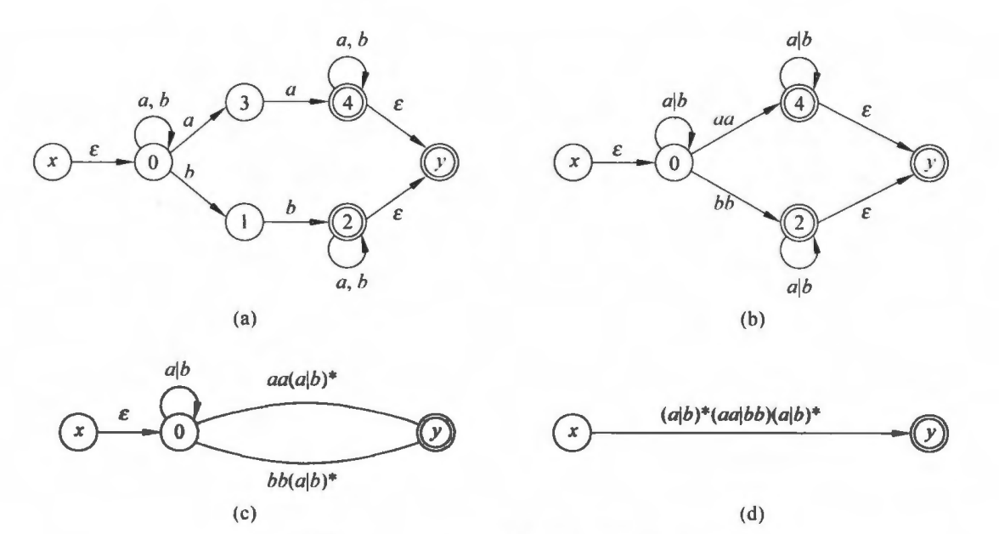
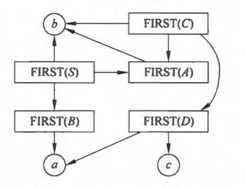

# 编译原理期末复习

## 编译过程

编译过程主要分为哪几个主要阶段？每个阶段的主要内容？

* 词法分析：对构成源程序的字符流进行扫描和分解，从而识别出一个个单词。
* 语法分析：将单词序列分解成各类语法短语，确定整个输入串是否构成一个正确的程序。
* 语义分析：审查源程序是否有语义错误，为代码生成阶段收集类型信息。
* 中间代码生成：将源程序变成一种内部表示形式，叫做中间代码，如四元式。
* 代码优化：对中间代码进行变换使得生成的目标代码更高效。
* 目标代码生成：把中间代码变换成特定机器上的绝对指令代码或可重定位的指令代码或汇编指令代码。

## 文法和语言

符号串x中有m个符号，表示为$|x|=m$，空符号串用$\varepsilon$表示，$|\varepsilon|=0$。$x^n$表示把符号串重复写n次。$\Sigma^*$表示字母表$\Sigma$上所有有穷长的串的集合，称为$\Sigma$的闭包。（若除去空，则为正闭包）
**产生式（规则）** 是形如$\alpha \rightarrow \beta$的$(\alpha, \beta)$有序对。

**文法**G定义为四元组$(V_N, V_T, P, S)$，依次代表非终结符集，终结符集，产生式集合，开始符。一般只写出产生式，第一条产生式的左部是开始符，大写字母（或尖括号内）是非终结符。

**直接推导**，只使用了一次产生式进行推导。

设G[S]是一个文法，如果符号串x是从开始符号推导出来的，则称x是文法G[S]的**句型**。若x**仅由终结符号组成**，则称x是**句子**。

L(G)表示文法G所产生的语言，即该文法一切句子的集合。

若L(G1)=L(G2)，则称文法G1和G2是**等价**的。

### 文法的类型

每条产生式$\alpha \rightarrow \beta$，满足$\alpha \in (V_N \cup V_T)^*$，且至少含有一个非终结符，而$\beta \in (V_N \cup V_T)^*$，称为**0型文法**。

每条产生式$\alpha \rightarrow \beta$，除$S\rightarrow \varepsilon$外均满足$|\beta|\ge|\alpha|$，称为**1型文法**或上下文有关的。

每条产生式$\alpha \rightarrow \beta$，满足$\alpha$是一个非终结符，而$\beta \in (V_N \cup V_T)^*$，称为**2型文法**或上下文无关的。

每条产生式的形式都是$A\rightarrow aB$或$A\rightarrow a$，称为**3型文法**或正规文法。

后续的文法一词，若无特别说明，均指上下文无关文法。

**语法树**（推导树）：

每个节点到其所有孩子节点的边代表一个产生式，上面的语法树是句子aabbaa的语法树。

如果在推导的每一步，都是对最左边的非终结符进行替换，称为**最左推导**，推导得出的句型称为左句型。最右推导也成为**规范推导**，右句型也成为规范句型。

如果一个文法存在某个句子对应两个不同的语法树，则说这个文法是二义的。

### 句型

1. 短语要能从非终结符推导出来
2. 整个句型也要能推导出来

从语法树上可以很容易找出句型的短语和直接短语。

一个句型的语法树中任一子树叶结点所组成的符号串都是该句型的短语。

如果一个子树不包含其它子树（直接子树），则它的叶节点所组成的符号串是该句型的直接短语。

最左边的直接子树对应的短语称为**句柄**。

## 词法分析

单词的形式化描述工具：正规文法、正规式和有穷自动机。

正规文法：

即每条产生式右部开头必须是终结符。

正规式（正则表达式）：

### 有穷自动机
确定的有穷自动机：

例如：

对应的状态图为：

不确定的有穷自动机：

### NFA转DFA
DFA M所能接受的符号串的全体记为L(M).

状态转换矩阵对比：

子集法
参考：[非确定的自动机NFA确定化为DFA](https://www.cnblogs.com/lzhdonald/p/11762837.html)

子集构造算法：

以下图为例进行转换：

### NFA转正规式

## 自顶向下分析

### 定义

FIRST集合表示可能的起始符号。
FOLLOW集合表示可能的后跟符号。
SELECT集合表示选择这条**产生式**后可能的起始符号。利用这个有时可以直接求SELECT集合，而不必先求FIRST和FOLLOW集合。

LL(1)文法表示，对于一个给定的输入串可以无歧义地选择产生式进行推导，即可以使用确定的自顶向下分析方法。

### 关系图法求FIRST

关系图为：

不能把空节点放入关系图中。

### 等价变换

非LL(1)文法变成LL(1)文法的方法：提取左公因子、消除（直接或间接的）左递归。

**提取左公因子**：

注：并不是所有文法的左公因子都能在有限步骤内替换。

**消除左递归**：

### LL(1)分析

构造预测分析表：

首先消除左递归：

求出每条产生式的SELECT集合：

判断是否为LL(1)文法。

构造预测分析表：

进行分析，以`i+i*i#`为例。

关键步骤：对所选用的产生式，将分析栈中的产生式左部弹出，产生式右部**反序入栈**。

## 自底向上分析

以`abbcde#`为例进行自底向上分析：

简单优先分析法
算符优先分析法

## LR分析

动作：移进、规约、接收acc、报错。

### LR(0)分析

例如：

对应的LR(0)分析表：

分析过程：（对输入串`abbcde#`）

上面的ACTIONS中的S表示**移进**，S2即表示转移到状态2，r表示**归约**，r2即表示用第二条产生式规约。

注意归约时不仅要改符号栈，还要改状态栈。

规约过程：

**每次都是选取句柄进行向上规约，从语法树上看会比较清晰。**

### 活前缀

**可归前缀**：

可归前缀的前缀称为**活前缀**。

这样可以求出所有的可归前缀，展开后就得到了所有活前缀。

### LR(0)项目集规范族

项目分类：

求闭包：

由此可以求出项目集的初态。

## 代码优化

优化方法：窥孔优化、局部优化、超局部优化、循环优化、过程内全局优化、过程间优化。

**窥孔优化**：删除冗余的存取、常量合并、常量传播、代数化简、控制流优化、死代码删除、强度削弱。

**局部优化**：常量合并、常量传播，删除公共子表达式、复写传播、删除无用赋值、代数化简。

**循环优化**：代码外提、归纳变量的删除