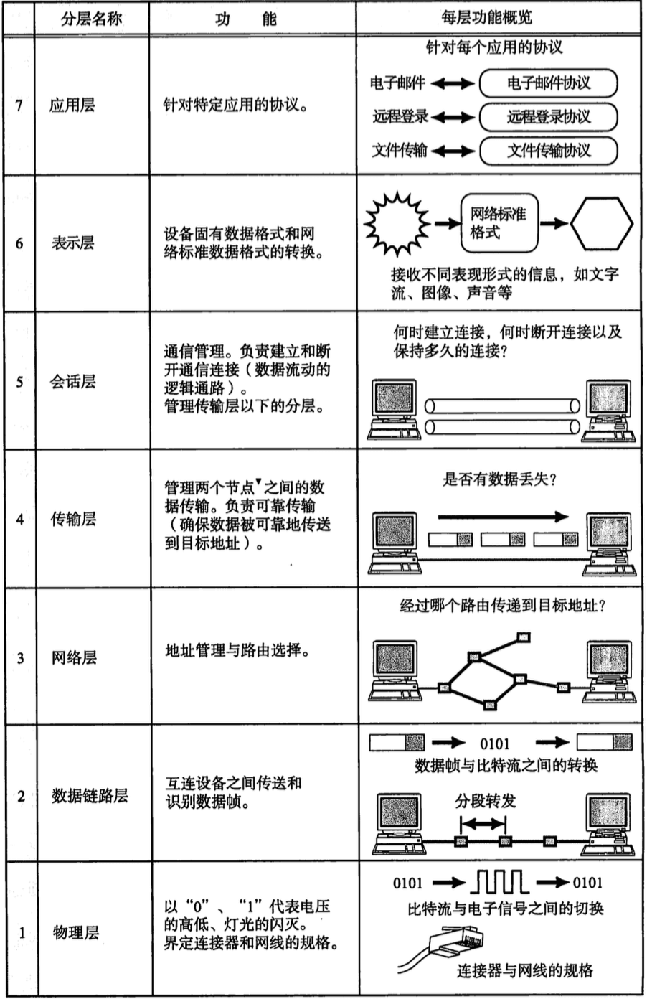
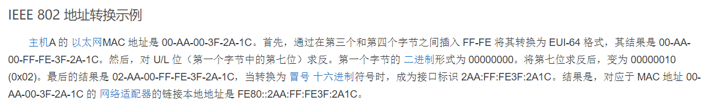

# 引言
## PAN, LAN, MAN, WAN

PAN：个域网
LAN：局域网
MAN：城域网
WAN：广域网

## 网络拓扑结构

总线拓扑结构所有设备连接到一条连接介质上。总线结构所需要的电缆数量少，线缆长度短，易于布线和维护。多个结点共用一条传输信道，信道利用率高。但不利于诊断故障。

星型拓扑结构是一个中心，多个分节点。它结构简单，连接方便，管理和维护都相对容易，而且扩展性强。网络延迟时间较小，传输误差低。中心无故障，一般网络没问题。中心故障，网络就出问题，同时共享能力差，通信线路利用率不高。

环形拓扑结构是节点形成一个闭合环。工作站少，节约设备。当然，这样就导致一个节点出问题，网络就会出问题，而且不好诊断故障。

树形拓扑结构从总线拓扑演变而来。形状像一棵倒置的树,顶端是树根，树根以下带分支，每个分支还可再带子分支，树根接收各站点发送的数据，然后再广播发送到全网。好扩展，容易诊断错误，但对根部要求高。

网形拓扑结构是应用最广泛的，它的优点是不受瓶颈问题和失效问题的影响，一旦线路出问题，可以做其他线路，但太复杂，成本高。

## OSI参考模型

## TCP/IP模型

## EUI-64

三四字节间插入FFFE，第七位求反，转换为冒号十六进制。

## 路由器内存

ROM：       只读内存（不能修改其存放的代码），主要用于系统初始化；
FLASH：    闪存，可读可写，存放着当前使用中的IOS（互联网操作系统），若容量足够大，甚至可以存放多个操作系统；
NVRAM：   非易失性(Nonvolatile)RAM，可读可写，仅保存启动配置文件，通常大小为32KB~128KB，速度快，成本高；
RAM：        随机存储器，可读可写，但存储内容在系统重启、关机后将被清除（上两个都可以保存），运行速度高于前三个；RAM运行时，包含路由表项目，ARP缓冲项目，日志项目，队列中排队等待发送的分组；除此之外，还包括运行配置文件（Running-config）、正在执行的代码、IOS操作系统程序和一些临时数据信息。

## 公共交换电话网络（PSTN）
本地回路、交换局、干线

## 常见各层设备
物理层：中继器，集线器
数据链路层：网桥，交换机
网络层：路由器

一些特殊设备：

网卡：物理层（主要）、数据链路层
网关：传输层及以上，处理协议的转换

# 物理层

## 信道的最大传输速率

**​尼奎斯特定理**
2Blog2(V)

B为带宽

V为信号等级

**​香农定理**

最大传输比特率=B log2(1+S/N)

**​信噪比**

信噪比10=10dB，100=20dB，1000=30dB

## 比特率与波特率

比特率是数字信号的传输速率，单位时间内所传输的二进制代码的有效位数。单位比特每秒（bps）或（kbps）
波特率是调制速率，线路中每秒传送的波形的个数，单位波特（band）

比特率=log2(n) × 波特率

## UTP
非屏蔽双绞线。

只要是4对双绞线，不管是几类，最大传输距离都被业内标准设定为100米。

## 光纤

光缆包括光纤，是光缆的一部分。光纤是光缆中的玻璃纤维

## T1载波
T1载波的帧结构中,包含24个信道数据(每个8bit),1bit帧同步数据,共193bit每帧，其中有25bit用于控制和同步等开销

# 数据链路层
## PPP帧格式

PPP协议的验证分为两种：一种是PAP，一种是CHAP。相对来说PAP的认证方式安全性没有CHAP高。PAP在传输password是明文的，而CHAP在传输过程中不传输密码，取代密码的是hash（哈希值）。PAP认证是通过两次握手实现的，而CHAP则是通过3次握手实现的。

# 网络层

对应关系：

无连接服务——数据报网络
面向连接的服务——虚电路网络

## BGP、OSPF、RIP
BGP采用的是路径向量路由选择协议。 OSPF是分布式状态路由算法的代表，使用的是洪泛法。 RIP是一种分布式的基于距离向量的路由选择算法。

## IPv4

地址分类：

# 传输层
## TCP

建立连接：

连接释放：

# 应用层

## 电子邮件协议
SMTP，用于发送电子邮件。
MIME，邮件扩展，用于发送更多格式的邮件内容。
POP3，用于下载电子邮件到本地。
IMAP，用于本地和邮箱进行**双向同步**。

# 疑惑题
假设在一个内容源和三个内容消费者的正中间有一个装有副本的主机。通过使用副本分发目录，相比通过分别向三个消费者单独地分发目录，节约了多少网络资源？

A.
50%

B.
25%

C.
66%

D.
33%

D:33%

服务和协议是完全相分离的。（对）

5 个用户使用 TDM 或 FDM 共享1 Mbps 链路。使用 TDM的每个用户都要以一个固定的顺序轮流完全占据链接 1  ms (毫秒)。使用FDM的每个用户在所有时间中获得 1/5 的链路。

当用户传输一个1250 字节的消息时，哪个方法具有最低的可能延迟，且该延迟时间是多少？

A.
TDM, 46 ms  

B.
TDM, 10 ms

C.
FDM, 12.5 ms

D.
TDM 和 FDM, 50 ms

A:TDM, 46 ms  