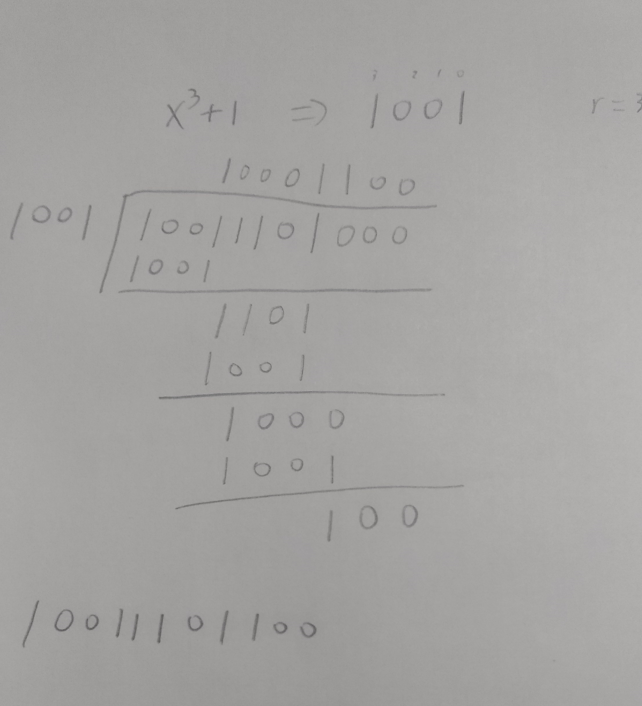

# 计算机网络第三章作业
## 1( 17分 )
利用本章中介绍的标准 CRC 方法来传输位流 10011101。生成多项式为X3+1。（解题时，请列出除法过程，无过程，不给分。）

（1）试问实际被传输的位串是什么？

原始比特流：10011101
生成器：1001
传输字符串：10011101100

（2）
假设在传输过程中从左边数第三位变反了。请说明这个错误可以在接收端能否被检测出来。

接收到的比特流：10111101100

余数不为0，说明出现错误。

（3）给出一个该比特流传输错误的实例,使得接受方无法检测出该错误。

若从左往右数第6位和第9位同时变反，即变成10011001000。

余数为0，无法检测到错误。

## 2( 17分 )
使用协议5 在一条3000公里长的T1骨干线路被用来传输64字节的帧。如果传播速度为6微妙/千米，试问序列号应该有多少位？

为了有效运行，发送窗口大小必须足够大，以允许发送发在收到第一个确认应答之前可以不断发送。信号在线路上的传播时间为6×3000=18000us=18ms。T1线路的速率为：1.536 Mbps。传输时间为：(64×8)/1.536=0.33ms，故一帧从发送出去到返回确认需要的时间为：18×2+0.33=36.33 ms
因此帧数为36.33/0.33=110 ，序列号应该有7位。

## 3( 17分 )
考虑在一个无错的 64kbps 卫星信道上单向发送 512 字节长的数据帧,来自另一个方向的确认帧非常短。对于窗口大小为1、7、15和127的情形，试问最大的吞吐量分别是多少?从地卫星信道的单向传播延迟为 270毫秒。

假设传输开始时间t=0，第一个帧发送时间为512×8/64kbps=64ms，t=64+270=334ms时到达。t=334+270=604ms时，应答信号（ACK） 返回。这里数据吞吐量为512×8/604ms=6781bps(窗口大小为1)。 若窗口大小为7，发送出去的时间为448ms，在604ms内，可以传输7×512×8=28672bit，吞吐量为28672/604ms=47470.2 bps。 若窗口大小为15、127则超过了卫星通信全速，所以速度为64kbps。

## 4( 15分 )
利用地球同步卫星在一个 1Mbps 的信道上发送 1000  位的帧,该信道的传播延迟为270毫秒。确认帧很短（传输时间可忽略），序号使用了3 位。试问，在下面的协议中,可获得的最大信道利用率是多少?

(a)  停-等协议？

(b)  协议 5 ？

(c)  协议 6 ？

对应三种协议的窗口大小分别是1、7和4。
根据题意，1000bit的帧需要1ms发送完，设t=0开始传输，t=1ms时，第一帧发送完毕，t=271ms时接收方收到第一帧，开始发送确认帧，t=272ms时，确认帧发送完毕，t=542时确认帧到达。因此一个发送周期为542ms，因此信道利用率为k/542，带入k值可分别算出信道利用率为0.18%、1.29%、0.74%。

## 5( 15分 )
试计算带字节填充的帧界标记法的最大开销率是多少？

帧的一般格式包括FLAG、payload field、FLAG。假设payload字段有x个字节，则最坏的情况就是x个字节都是帧界FLAG或ESC，那么发送方需要发送2x个字节，所以最大开销率为x/(2x+2)，理论最大值为50%

## 6( 19分 )
一个待传送的位串是 10101111，采用纠一位错的海明码，且校验集合用奇校验，那么，编码后的码字是什么？

由公式$(m+r+1)\le 2^r$可知，m=8，r=4。

设编码后的码字是：??1?010?1111

P1=[1,3,5,7,9,11]=(?,1,0,0,1,1)=0
P2=[2,3,6,7,10,11]=(?,1,1,0,1,1)=1
P4=[4,5,6,7,12]=(?,0,1,0,1)=1
P8=[8,9,10,11,12]=(?,1,1,1,1)=1

因此编码后的码字是：011101011111