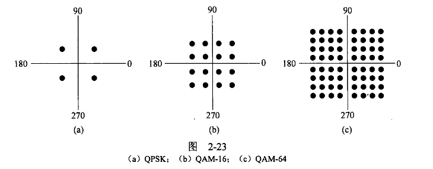
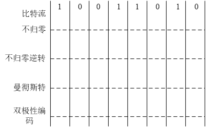
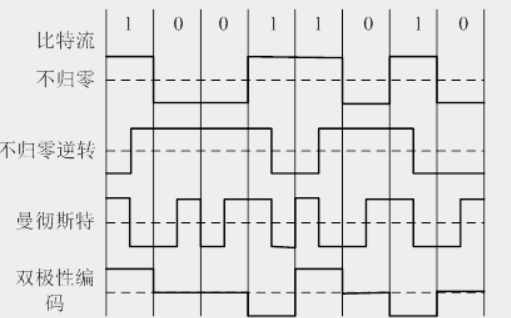

# 计算机网络第二章作业
## 1
一个类似于图2-23（a） 的调制解调器星座图有以下几个数据点: (1, 1)、(1 ，-1) 、(-1 ，1)和(-1 ，-1)。（1）一个具备这些参数的调制解调器以1200 符号/秒的速率能获得多少bps?（2）如果按照（b）进行调制，传输速率可以达到多少？（3）如果按照（c）图的信号星座进行调制，其中的一半信号点被用来检查错误，请问，可以达到多大的传输速率？（波特率都采用1200符号/秒，要求解题过程）

（1）由图可知比特率是波特率的两倍（lg4=2），所以1200符号/秒的速率能获得2400bps（$1200*2$）。
（2）图b的比特率是波特率的四倍（lg16=4），所以传输速率可以达到4800bps（$1200*4$）。
（3）图c的有效信号点为32个，比特率为波特率的五倍（lg32=5），所以传输速率为6000bps（$1200*5$）

## 2
试问T1载波的百分比开销为多少?也就是说， 1.544 Mbps中有百分之多少没有给端用户使用? OC-l 或OC-768 线路的百分比开销又是多少?

（1）按T1载波的一帧计算，共计$24*8=192$个bit，其中有25bit用于控制和同步等开销，所以开销百分比为25/192=13.02%，所以有0.201Mbps（即13.02%）没有给端用户使用。
（2）OC-I的百分比开销为(51.84-49.536)/51.84=3.63%
（3）0C-768的百分比开销为(39813.12-38043.648)/39813.112=4.44%

## 3
假设一个CDMA系统有3个工作站，码片序列由4位构成，三个工作站A、B 和 C的码片序列分别是： (1,1,1,1),(1,-1,1,-1) and (1,1,-1,-1)。如果工作站 C 连续收到了一个复用信号： (2,0,2,0,0,-2,0,-2,0,2,0,2)，请用计算结果回答：工作站C从工作站A收到了什么信号？

设工作站C收到的复用信号为C1=(2,0,2,0), C2=(0,-2,0,-2),C3=(0,2,0,2)
则$C1\cdot A=1,C2\cdot A=-1,C3=\cdot A=1$，故工作站C收到的信号为1，-1，1，对应的比特流为1，0，1

## 4
请在下图中画出各种编码的编码后图形：

如下图所示：

## 5
假定有一种双绞线的衰减是0.7dB/km(在 1 kHz时)，若容许有20dB的衰减，试问使用这种双绞线的链路的工作距离有多长？如果要双绞线的工作距离增大到100公里，应当使衰减降低到多少（每公里多少分贝）？

（1）工作距离为20/0.7=28.57km
（2）衰减应降低到20/100=0.2db/km

## 6
主机A和B每个都通过10Mbps链路连接到交换机S。在每条链路上的传播延迟都是20微秒。S是一个存储转发设备，在它接收完一个分组后到转发完成需要35微秒。请计算把10000比特从A发送到B所需要的总时间（（单位是微秒））。（1）采用单个数据分组传输；（2）分成两个数据分组传输，每个分组5000比特。

（1）A-S传输时间10000bit/10Mbps=1000us，延迟20us，存储转发时间35us，S-B传输时间同样为1020us，总计2075us。
（2）考虑到总时间由分组2到达B的时间决定，因此仅考虑分组2情况。500us时A开始发送分组2，1020us时分组2完全到达S，1055us时开始从S发送到B，1575us时B完全接收到分组2，因此总时间为1575us。
