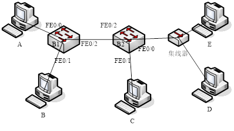

# 计算机网络第四章作业
## 1
试问在下列两种情况下CSMA/CD的竞争时间槽长度（冲突窗口）是多少？（请写出中间过程，直接写答案可不给分；中间过程正确，最后答案错误，可酌情给分）

（1）一个2千米长的双导电缆（twin-lead cable）（信号的传播速度是信号在真空中传播速度的82%）？

（2）40千米长的多模光纤（信号的传播速度是信号在真空中传播速度的65%）

注意：光速是$3×10^8$m/s

(1) 传播速度为$3×10^8×0.82=2.46×10^8$m/s
传播时间：$2000/(2.46×10^8)=8.13×10^{-6}$s
竞争时间槽长度：$1.626×10^{-5}$s。

(2) 传播速度：$3×10^8×0.65=1.95×10^8$m/s
传播时间：$40000/(1.95×10^8)=2.05×10^{-4}$s
竞争时间槽长度：$4.10×10^{-4}$s。

## 2
（10年考研真题）某局域网采用CSMA/CD协议实现介质访问控制，数据传输速率为10Mbps，主机甲和主机乙之间的距离为2km，信号传播速度是200 000km/s。请回答下列问题，并给出计算过程（没有过程，不给分；如果有过程，但计算和答案错误，酌情给分）。

（1）若主机甲和主机乙发送数据时发生冲突，则从开始发送数据时刻起，到两台主机均检测到冲突时刻止，最短需经多长时间？最长需经过多长时间？（假设主机甲和主机乙发送数据过程中，其他主机不发送数据）

（2）若网络不存在任何冲突与差错，主机甲总是以标准的最长以大网数据帧（1518字节）向主机乙发送数据，主机乙每成功收到一个数据帧后，立即发送下一个数据帧，此时主机甲的有效数据传输速率是多少？（不考虑以太网帧的前导码）

（1）当甲乙同时向对方发送数据时，两台主机均检测到冲突所需时间最短，为1/200000×2=$1\times 10^{-5}$s。
当一方发送数据马上要到达另一方时，另一方开始发送数据，两台主机均检测到冲突所需时间最长，为2/2000000×2=$2\times 10^{-5}$s。

（2）发送一帧所需时间：((1518×8b)÷10Mb/s)+((2km÷200 000km/s)×2)+((64×8b)÷10Mb/s)=1.2856ms
有效数据传输率：(1500×8b)÷1.2856ms=9.33Mbps。

## 3
假定1km长的CSMA/CD网络的数据率为1Gb/s。设信号在网络上的传播速率为200000km/s。求能够使用此协议的最短帧长。

单程传播时间：1/200000=5us，来回时间：10us
发送比特数：$10\times \frac{10^{-6}}{10^{-9}}=10000$。

因此最短帧长为10000位。

## 4
如图所示，两台交换机连接了5台工作站，刚启动。

当发生了以下三个事件时：

（1）工作站D发送一个帧给工作站E；

（2）工作站A发送一个帧给工作站D

（3）工作站D发送一个帧给工作站B

请回答并作简要解释：

发生每个事件的时候，交换机B2和集线器分别采取什么动作处理接收到的帧？事件发生后，交换机B2的MAC地址表发生了什么变化？

集线器均进行泛洪操作。

（1）B2泛洪
B2内部的MAC地址表增加了一条记录D--FE0/0

（2）B2直接转发
B2的MAC地址表也增加一条记录A--FE0/2

（3）B2泛洪
B2的MAC地址表不增加记录，但是会刷新时间戳