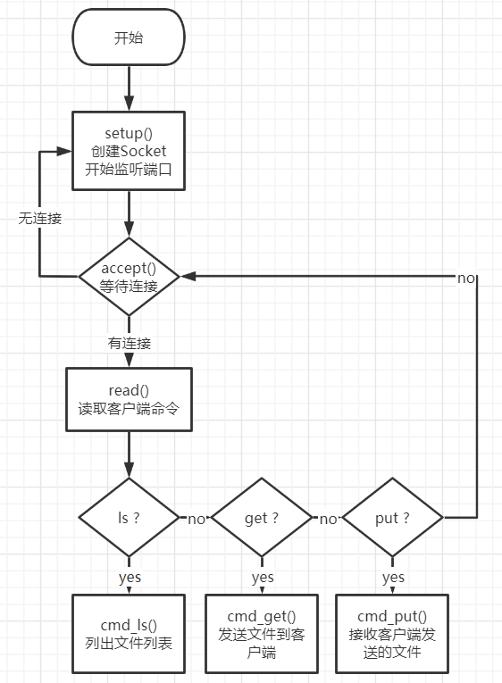
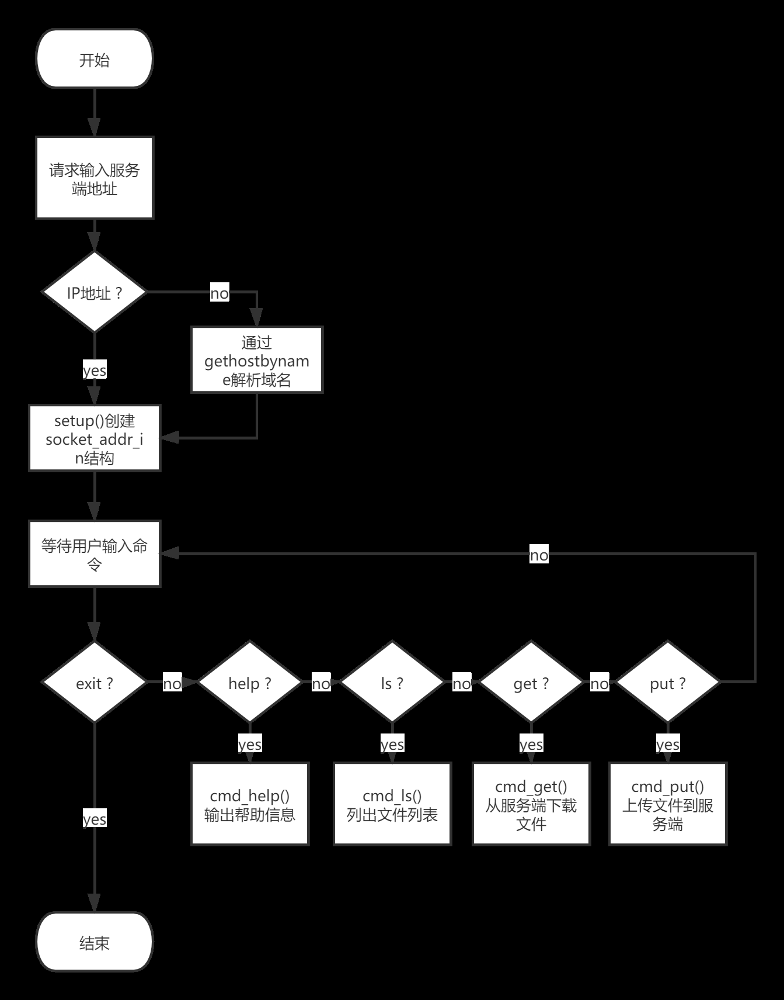
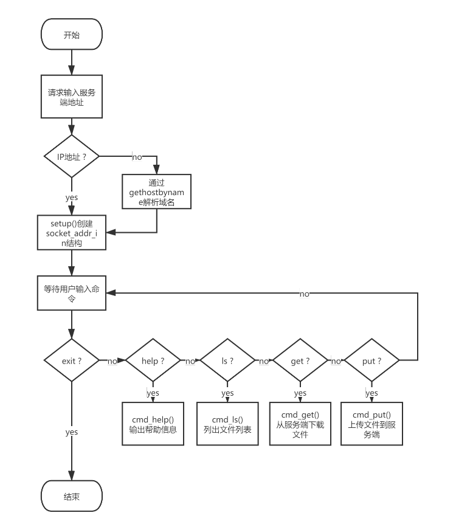

# 计算机网络编程测试

## 验证大端序与小端序

```c
#include <stdio.h>
int main()
{
    union {
        short s;
        char c[sizeof(short)];
    }un;
    un.s = 0x0102;
    if ((un.c[0] == 1) && (un.c[1] == 2))
    {
        puts("big endian");
    }
    else if ((un.c[0] == 2) && (un.c[1] == 1))
    {
        puts("little endian");
    }
    
}
```

## 字节序转换
网络序为大端序。

头文件`<arpa/inet.h>`

在主机序与网络序之间进行转换，不需要关心大小端。
hton表示host to network
ntoh表示network to host
后缀s表示short（16位），l表示long（32位）

例如htons，将一个16位的数据从主机序转换为网络序。

```c
#include <stdio.h>
#include <arpa/inet.h>

int main() 
{
    int a = 0x01020304;
    int b = htonl(a);
    printf("%x\n", b);
}
```

输出：`4030201`

## 常用结构体定义

头文件`<netinet/in.h>`

定义如下：

```c
/* Internet address.  */
typedef uint32_t in_addr_t;
struct in_addr
  {
    in_addr_t s_addr;
  };

```

就是一个结构体包装了一下32位整数表示IPv4地址。

顺带看一下ipv6的吧。

```c
/* IPv6 address */
struct in6_addr
  {
    union
      {
	uint8_t	__u6_addr8[16];
	uint16_t __u6_addr16[8];
	uint32_t __u6_addr32[4];
      } __in6_u;
```

struct套union应该是为了方便访问吧。总之就是一个128位的数据。

在网络上通信，光知道ip地址是不够的，还需要知道通信协议，端口号等信息。

接下来是端口号结构体：（16位）

```c
/* Type to represent a port.  */
typedef uint16_t in_port_t;
```


```c

/* Structure describing an Internet socket address.  */
struct sockaddr_in
  {
    __SOCKADDR_COMMON (sin_);
    in_port_t sin_port;			/* Port number.  */
    struct in_addr sin_addr;		/* Internet address.  */

    /* Pad to size of `struct sockaddr'.  */
    unsigned char sin_zero[sizeof (struct sockaddr)
			   - __SOCKADDR_COMMON_SIZE
			   - sizeof (in_port_t)
			   - sizeof (struct in_addr)];
  };

```

用了一些宏所以看上去比较复杂，第一个展开是sin_family表示通信协议，最后一个没啥用（用于内存对齐，所以大小是精心计算得出的）

ipv6的也是类似的。

```c
/* Ditto, for IPv6.  */
struct sockaddr_in6
  {
    __SOCKADDR_COMMON (sin6_);
    in_port_t sin6_port;	/* Transport layer port # */
    uint32_t sin6_flowinfo;	/* IPv6 flow information */
    struct in6_addr sin6_addr;	/* IPv6 address */
    uint32_t sin6_scope_id;	/* IPv6 scope-id */
  };
```

为了在不用格式间进行地址转换，定义了通用套接字结构。

```c

/* Structure describing a generic socket address.  */
struct sockaddr
  {
    __SOCKADDR_COMMON (sa_);	/* Common data: address family and length.  */
    char sa_data[14];		/* Address data.  */
  };

```


## 地址转换

统一使用`inet_`前缀。

p代表presentation（表达）也就是"127.0.0.1"这种形式。
n代表numeric（数值）表示二进制的值。
a代表in_addr结构体

**注意**：转换后的数值是用于网络传输，字节序和本地机器的可能不一样。


```c

/* Convert Internet number in IN to ASCII representation.  The return value
   is a pointer to an internal array containing the string.  */
extern char *inet_ntoa (struct in_addr __in) __THROW;

/* Convert from presentation format of an Internet number in buffer
   starting at CP to the binary network format and store result for
   interface type AF in buffer starting at BUF.  */
extern int inet_pton (int __af, const char *__restrict __cp,
		      void *__restrict __buf) __THROW;

/* Convert a Internet address in binary network format for interface
   type AF in buffer starting at CP to presentation form and place
   result in buffer of length LEN astarting at BUF.  */
extern const char *inet_ntop (int __af, const void *__restrict __cp,
			      char *__restrict __buf, socklen_t __len)
     __THROW;


/* Convert Internet host address from numbers-and-dots notation in CP
   into binary data and store the result in the structure INP.  */
extern int inet_aton (const char *__cp, struct in_addr *__inp) __THROW;


```

01111111000000000000000000000001
从点分十进制（字符串表示）转成32位无符号整数。

例如`127.0.0.1`对应的二进制表示是`01111111.00000000.00000000.00000001`对应的32位无符号整数是`2130706433`。

程序验证：

```c
#include <stdio.h>
#include <arpa/inet.h>

int main() 
{
    unsigned r = 0;
    inet_pton(AF_INET, "127.0.0.1", &r);
    printf("%d\n", ntohl(r));
    return 0;
}
```

输出结果：2130706433


## 解析器

首先看下怎么描述一个网络上的主机：

```c

/* Description of data base entry for a single host.  */
struct hostent
{
  char *h_name;			/* Official name of host.  */
  char **h_aliases;		/* Alias list.  */
  int h_addrtype;		/* Host address type.  */
  int h_length;			/* Length of address.  */
  char **h_addr_list;		/* List of addresses from name server.  */
#ifdef __USE_MISC
# define	h_addr	h_addr_list[0] /* Address, for backward compatibility.*/
#endif
};

```

gethostbyname

通过域名获取ip

试试我的服务器。www.tootal.xyz，ip是120.79.171.171

简单的程序验证一下：

```c
#include <stdio.h>
#include <netdb.h>
#include <arpa/inet.h>

void print(struct hostent *h) 
{
    printf("host name: %s\n", h->h_name);
    for (char **p = h->h_aliases; *p != NULL; p++)
        printf("alias: %s\n", *p);
    for (char **p = h->h_addr_list; *p != NULL; p++)
    {
        char s[32];
        inet_ntop(h->h_addrtype, *p, s, sizeof(s));
        printf("address: %s\n", s);
    }
}
int main() 
{
    print(gethostbyname("www.tootal.xyz"));
    return 0;
}
```

结果：

```
host name: www.tootal.xyz
address: 120.79.171.171
```

还是挺准的。

再来查查我的博客blog.tootal.xyz，配置了cname，应该有别名。

结果：

```
host name: tinyglobalcdnweb.qiniu.com.w.kunlunar.com
alias: blog.tootal.xyz
alias: blog-tootal-xyz-idveaku.qiniudns.com
alias: tinyglobal002.qiniudns.com
address: 183.57.82.207
```

查了一下百度，这hostname是什么情况。。。

```
host name: www.a.shifen.com
alias: www.baidu.com
address: 182.61.200.6
address: 182.61.200.7
```

gethostbyaddr也是类似的，不过换成了通过地址来找主机。

getservbyname就有点不一样了。

先看看怎么定义一个服务。

前面是hostent，这个就是servent。

```c

/* Description of data base entry for a single service.  */
struct servent
{
  char *s_name;			/* Official service name.  */
  char **s_aliases;		/* Alias list.  */
  int s_port;			/* Port number.  */
  char *s_proto;		/* Protocol to use.  */
};

```

感觉还是有点不懂，看看man。

```
The getservent() function reads the next entry from the services database (see services(5)) and returns a servent structure containing the broken-out fields from the
       entry.  A connection is opened to the database if necessary.

       The getservbyname() function returns a servent structure for the entry from the database that matches the service name using protocol proto.  If proto is  NULL,  any
       protocol will be matched.  A connection is opened to the database if necessary.

       The  getservbyport()  function  returns  a  servent structure for the entry from the database that matches the port port (given in network byte order) using protocol
       proto.  If proto is NULL, any protocol will be matched.  A connection is opened to the database if necessary.

       The setservent() function opens a connection to the database, and sets the next entry to the first entry.  If stayopen is nonzero, then the connection to  the  data‐
       base will not be closed between calls to one of the getserv*() functions.
```

参考：

一个端口代表一个服务（服务进程），因此可以使用服务名来代替端口的使用
像主机一样，服务也通常靠名字来认知
如果我们在程序代码中通过其名字而不是其端口号来指代一个服务，而且从名字到端口号的映射关系保存在一个文件中（通常是/etc/services），那么即使端口号发生变动，我们需修改的仅仅是/etc/services文件中的某 一行，而不必重新编译应用程序。getservbyname函数用于根据给定名字查找相应服务

## FTP
好，找到一个现成的，准备就照着这个改改了。

[用C语言实现FTP](https://www.cnblogs.com/qrxqrx/articles/8034790.html)

写的还是很详细的。


## 文件夹读取

```c

struct dirent
  {
#ifndef __USE_FILE_OFFSET64
    __ino_t d_ino;
    __off_t d_off;
#else
    __ino64_t d_ino;
    __off64_t d_off;
#endif
    unsigned short int d_reclen;
    unsigned char d_type;
    char d_name[256];		/* We must not include limits.h! */
  };

#ifdef __USE_LARGEFILE64
struct dirent64
  {
    __ino64_t d_ino;
    __off64_t d_off;
    unsigned short int d_reclen;
    unsigned char d_type;
    char d_name[256];		/* We must not include limits.h! */
  };
#endif
```


## FTP测试

```
tootal@DESKTOP-TOOTAL:~/ftp$ ./bin/client
[客户端] 启动成功
[客户端] 请输入服务端地址（直接按回车连接本地服务器）：
[客户端] 尝试解析主机：127.0.0.1
[客户端] 解析成功！
[客户端] 输入help查看帮助菜单。
[客户端] 请输入命令: help
[客户端] ------------------------------------
[客户端] 这里是FTP客户端
[客户端] 支持如下命令： 
[客户端] help: 查看帮助
[客户端] exit: 退出
[客户端] ls: 显示服务器文件列表
[客户端] get <file>: 从服务器下载文件<file>
[客户端] put <file>: 上传文件<file>到服务器
[客户端] ------------------------------------
[客户端] 请输入命令: put hello
[客户端] 准备上传文件 hello, 大小： 12 字节
[客户端] 发送文件数据 12 字节。
[客户端] 上传文件 hello 成功。
[客户端] 请输入命令: ls
[客户端] 服务端文件列表：
[客户端] hello 
[客户端] 请输入命令: get hello
[客户端] 准备下载文件 hello。
[客户端] 接收文件成功！
[客户端] 下载文件 hello 成功，文件大小 12 字节。
[客户端] 请输入命令: put README.md
[客户端] 准备上传文件 README.md, 大小： 1473 字节
[客户端] 发送文件数据 1473 字节。
[客户端] 上传文件 README.md 成功。
[客户端] 请输入命令: ls
[客户端] 服务端文件列表：
[客户端] README.md hello 
[客户端] 请输入命令: exit
```


```
tootal@DESKTOP-TOOTAL:~/ftp$ ./bin/server
[服务端] 启动成功，正在监听 2121 端口...
[服务端] 连接成功！
[服务端] 接收到命令：put hello
[服务端] 客户端请求上传文件 hello
[服务端] 接收到文件数据 12 字节
[服务端] 上传文件 hello 成功。
[服务端] 连接成功！
[服务端] 接收到命令：ls
[服务端] 正在执行ls命令...
[服务端] 发送数据：hello
[服务端] 连接成功！
[服务端] 接收到命令：get hello
[服务端] 客户端请求下载文件 hello
[服务端] 发送数据 13 字节
[服务端] 连接成功！
[服务端] 接收到命令：put README.md
[服务端] 客户端请求上传文件 README.md
[服务端] 接收到文件数据 1473 字节
[服务端] 上传文件 README.md 成功。
[服务端] 连接成功！
[服务端] 接收到命令：ls
[服务端] 正在执行ls命令...
[服务端] 发送数据：README.md hello
```

## 流程图










