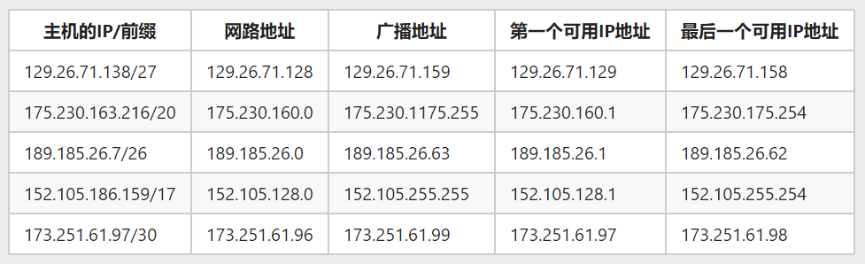

# 计算机网路第五章主观题

[网址](https://www.icourse163.org/spoc/learn/SCUT-1003042005?tid=1461379441#/learn/hw?id=1236440991)
## 1

关于逆向地址转发

请根据下面的图（左：网络拓扑；右：对应的汇集树），按照逆向地址转发（RPF）的思想，绘制出从广播源I出发的数据分组，泛滥到全网的转发途径。考虑F和G之间增加一条新的路径，但是汇集树不发生变化，请问采用了逆向路径转发的广播路径图是否发生变化

[link](https://sxbb.me/RvRuE)

## 2
[https://blog.csdn.net/qq_44761480/article/details/90743938](https://blog.csdn.net/qq_44761480/article/details/90743938)

## 3
[https://blog.csdn.net/qq_44761480/article/details/90743938](https://blog.csdn.net/qq_44761480/article/details/90743938)

## 5
|    主机的IP/前缀    |    网路地址    |     广播地址      | 第一个可用IP地址 | 最后一个可用IP地址 |
| ------------------ | ------------- | ---------------- | --------------- | ----------------- |
| 129.26.71.138/27   | 129.26.71.128 | 129.26.71.159    | 129.26.71.129   | 129.26.71.158     |
| 175.230.163.216/20 | 175.230.160.0 | 175.230.1175.255 | 175.230.160.1   | 175.230.175.254   |
| 189.185.26.7/26    | 189.185.26.0  | 189.185.26.63    | 189.185.26.1    | 189.185.26.62     |
| 152.105.186.159/17 | 152.105.128.0 | 152.105.255.255  | 152.105.128.1   | 152.105.255.254   |
| 173.251.61.97/30   | 173.251.61.96 | 173.251.61.99    | 173.251.61.97   | 173.251.61.98     |

## 6

| 所需主机数 |            二进制子网掩码            |  十进制子网掩码  | 前缀记法 |
| --------- | ----------------------------------- | --------------- | -------- |
| 25        | 11111111.11111111.11111111.11100000 | 255.255.255.224 | /27      |
| 1000      | 11111111.11111111.11111100.00000000 | 255.255.252.0   | /22     |
| 75        | 11111111.11111111.11111111.10000000 | 255.255.255.128 | /25     |
| 10        | 11111111.11111111.11111111.11110000 | 255.255.255.240 | /28     |
| 500       | 11111111.11111111.11111110.00000000 | 255.255.254.0   | /23     |

## 11

| 序号 | 报文消息类型 | 描述 |
| --- | --- | --- |
| 1 | HELLO（1分） | 用来发现所有的邻居，以及维护双边关系（1分） |
| 2 | LINK STATE UPDATE（1分） | 封装LSA，可作为LSR的应答，也可主动发送（1分） |
| 3 | LINK STATE ACK（1分） | 对链路状态更新消息的确认（1分） |
| 4 | DATABASE DESCRIPTION（1分） | 声明发送者的链路状态更新情况，封装LSA的摘要信息（1分） |
| 5 | LINK STATE REQUEST（1分） | 请求链路状态信息，完整的LSA（1分） |

HELLO：用来发现所有的邻居，以及维护双边关系
LINK STATE UPDATE：封装LSA，可作为LSR的应答，也可主动发送
LINK STATE ACK：对链路状态更新消息的确认
DATABASE DESCRIPTION：声明发送者的链路状态更新情况，封装LSA的摘要信息
LINK STATE REQUEST：请求链路状态信息，完整的LSA

