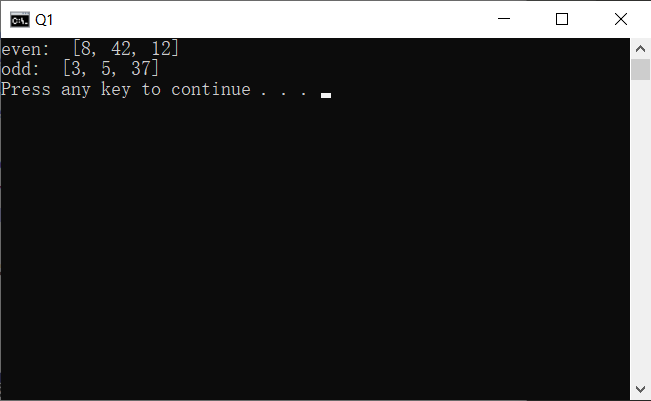
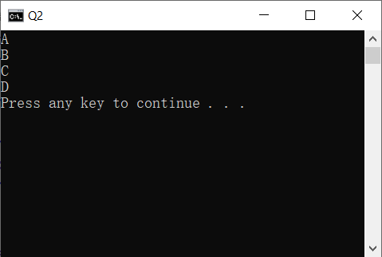
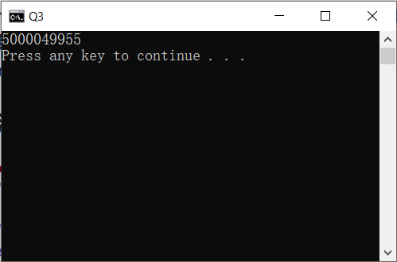

# 实验一报告
## 1
### 问题描述
在编程过程中，遵循一套代码风格是十分必要的。请阅读python代码规范PEP8(https://www.python.org/dev/peps/pep-0008/)。修改如下代码直至其成功运行。源代码文件命名为`Q1.py`。
   ~~~python
   # 如下代码用于判断奇偶数
   numbers = [12, 37, 5, 42, 8, 3];
   even = [];
   odd = [];
   while len(numbers) > 0
       number = numbers.pop();
       if(number % 2 == 0):
       even.append(number);
       else:
       odd.append(number);
   print "even: ", even
   print "odd: ", odd
   ~~~

### 解题思路
主要步骤有：  
* 去除末尾分号
* 添加末尾引号
* 正确缩进
* 添加`print`函数括号

### 源代码
```cpp
# 如下代码用于判断奇偶数
numbers = [12, 37, 5, 42, 8, 3]
even = []
odd = []
while len(numbers) > 0:
    number = numbers.pop();
    if(number % 2 == 0):
        even.append(number)
    else:
        odd.append(number)
print("even: ", even)
print("odd: ", odd)
```
### 运行结果
  

## 2
### 问题描述
使用`if-elif-else`结构，输入一个[0, 100]的成绩，输出该成绩的等级。[90, 100]为A，[80, 90)为B，[70, 80)为C，[0, 70)为D。源代码文件命名为`Q2.py`。
### 解题思路
依次判断A、B、C、D。  

### 源代码
```py
def grade(score):
    """
    score为输入的成绩
    """
    # 补充代码，return该成绩的等级
    if score>=90:
        return 'A'
    elif score>=80:
        return 'B'
    elif score>=70:
        return 'C'
    else:
        return 'D'


print(grade(97))
print(grade(83))
print(grade(77))
print(grade(54))

```
### 运行结果
  


## 3
### 问题描述
python的整数是任意精度的，不会像C/C++/Java存在溢出的问题(只要内存足够)。使用`for`循环对10到100,000进行求和。源代码文件命名为`Q3.py`。
### 解题思路
使用for循环遍历10到100,000，每次将循环变量加到result变量中。  

### 源代码
```py
def for_sum(start=10,end=100000):
    """
    对start到end利用for循环求和，返回求和结果
    """
    result = 0
    # 补充代码完成求和
    for i in range(start,end+1):
        result += i
    return result

print(for_sum(10,100000))

```
### 运行结果
  

## 4
### 问题描述
使用`turtle`模块绘制如下图形。源代码文件命名为`Q4.py`。  
  

### 解题思路
首先定义一个画正方形的函数`rec`，接着每次旋转15度，依次画出24个正方形。  

### 源代码
```py
from turtle import *
def rec(a):
	for _ in range(4):
		forward(a)
		left(90)

a=100
for _ in range(24):
	rec(a)
	left(15)
done()
```
### 运行结果
  

