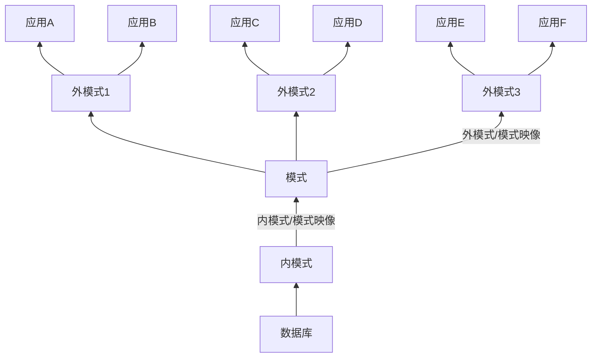

# 20200331数据库系统概论前三章复习
前三章内容为绪论、关系数据库、关系数据库标准语言SQL。

## 第一章 绪论
**数据**是数据库中存储的基本对象，描述事物的符号记录称为数据。数据的含义称为数据的语义，数据与其语义是不可分的。**数据库**是长期存储在计算机内、有组织的、可共享的大量数据的集合。数据库数据具有永久存储、有组织和可共享三个基本特点。**数据库管理系统**（DBMS）是计算机的基础软件，主要功能有数据的定义、组织、存储、管理、操纵以及数据库的事务管理、运行管理、建立和维护。数据库管理系统通常提供数据操纵语言（DML）来实现对数据库的基本操作。数据库系统（DBS）是由数据库、数据库管理系统、应用程序和数据库管理员（DBA）组成的存储、管理、处理和维护数据的系统。常常把数据库系统简称为数据库。

数据独立性是借助数据库管理数据的一个显著优点，包括**数据的物理独立性和逻辑独立性**。物理独立性是指用户的应用程序与数据库中的数据的物理存储是相互独立的。逻辑独立性是指用户的应用程序与数据库的逻辑结构是相互独立的。

数据模型是对现实世界数据特征的抽象，是数据库系统的核心和基础。第一类数据模型是**概念模型**，是按用户的观点来对数据和信息建模，主要用于数据库设计。第二类数据模型是**逻辑模型和物理模型**，逻辑模型主要用于数据库管理系统的实现，物理模型是对数据最底层的抽象。

信息世界中，客观存在并可相互区别的事物称为**实体**，实体所具有的某一特性称为**属性**，唯一标识实体的属性集称为**码**。用实体名及其属性名集合来抽象和刻画同类实体，称为实体型。同一类型实体的集合称为实体集。实体之间的联系通常是指不同实体集之间的联系。

数据模型通常由数据结构、数据操作和数据的完整性约束条件三部分组成。**数据结构**描述数据库的组成对象以及对象之间的联系，**数据操作**是指对数据库中各种对象的实例允许执行的操作的集合，包括操作及有关的操作规则。**数据的完整性约束条件**是一组完整性规则。完整性规则是给定的数据模型中数据及其联系所具有的制约和依存规则，用以限定符合数据模型的数据库状态以及状态的变化，以保证数据的正确、有效和相容。

关系模型是最重要的一种数据模型。一个关系对应通常说的一张表，表中的一行即为一个元组，表中的一列即为一个属性，给每个属性起一个名称即属性名。表中的某个属性组可以唯一确定一个元组，就成为本关系的码。域是一组具有相同数据类型的值的集合，属性的取值范围来自某个域。元组中的一个属性值称为分量，关系的每一个分量必须是一个不可分的数据项。对关系的描述称为关系模式，一般表示为`关系名(属性1，属性2，……，属性n)`。

在数据模型中有“型”（type）和“值”（value）的概念。模式（schema）是数据库中全体数据的逻辑结构和特征的描述，它仅仅涉及型的描述，不涉及具体的值。模式的一个具体值称为模式的一个实例。模式是相对稳定的，而实例是相对变动的。

数据库系统的三级模式结构是指数据库系统是由外模式、模式和内模式三级构成。

外模式是数据库用户能够看见和使用的局部数据的逻辑结构和特征的描述，是数据库用户的数据视图，是与某一应用有关的数据的逻辑表示。内模式是数据物理结构和存储方式的描述，是数据在数据库内部的组织方式。为了能够在系统内部实现这三个抽象层次的联系和转换，数据库管理系统在这三级模式之间提供了两层映像：外模式/模式映像和模式/内模式映像，这两层映像保证了数据库系统中的数据具有较高的逻辑独立性和物理独立性。

## 关系数据库
关系数据库系统是支持关系模型的数据库系统，关系模型由关系数据结构、关系操作集合和关系完整性约束三部分组成。关系数据结构只包含单一的数据结构——关系。接下来从集合论角度给出关系数据结构的形式化定义。

域是一组具有相同数据类型的值的集合，笛卡儿积是域上的一种集合运算。给定一组域 $D_1, D_2, ..., D_n$，它们的笛卡尔积为 $D_1 \times D_2 \times ... \times D_n = \{(d_1, d_2, ..., d_n) | d_i \in D_i, i=1, 2, ..., n\}$，其中每一元素叫做一个n元组，元素中的每一个值叫做一个分量。一个域允许的不同取值个数称为这个域的基数。$D_1 \times D_2 \times ... \times D_n$的子集叫做在域 $D_1, D_2, ..., D_n$上的关系，表示为 $R(D_1, D_2, ..., D_n)$，R表示关系的名字。若关系中的某一属性组的值能唯一地标识一个元组，而其子集不能，则称该属性组为**候选码**，若一个关系有多个候选码，则选定其中一个为**主码**。 候选码的诸属性称为主属性，不包含在任何候选码中的属性称为非主属性。

**关系的描述称为关系模式**，可以形式化地表示为`R(U, D, DOM, F)`，R为关系名，U为组成该关系的属性名集合，D为U中属性所来自的域，DOM为属性向域的映像集合，F为属性间数据的依赖关系集合。关系模式可以简记为`R(U)`或 $R(A_1, A_2, ..., A_n)$，其中R为关系名，$A_1, A_2, ..., A_n$为属性名。**关系是关系模式在某一时刻的状态或内容。**

选择、投影、并、差、笛卡尔积是关系的5种基本操作。关系操作的对象和结果都是集合。关系数据语言可以分为三类：

$$
关系数据语言
\begin{cases}
关系代数语言（例如ISBL）\\
关系演算语言
\begin{cases}
元组关系演算语言（例如ALPHA、QUEL）\\
域关系演算语言（例如QBE）
\end{cases}\\
具有关系代数和关系演算双重特点的语言（例如SQL）
\end{cases}
$$

关系模型中有三类完整性约束：实体完整性、参照完整性和用户定义的完整性。**实体完整性**规则：若属性（指一个或一组属性） A 是基本关系 R 的主属性， 则 A 不能取空值 (null value)。所谓空值就是“不知道”或“不存在”或“无意义”的值。 **参照完整性**的定义：设 F 是基本关系 R 的一个或一组属性，但不是关系 R 的码，$K_s$是基本关系 S 的主码。如果 F 与$K_s$相对应，则称 F 是 R 的外码 (foreign key), 并称基本关系 R 为参照关系 (referencing relation), 基本关系 S 为被参照关系 C referenced relation) 或目标关系 (target relation)。关系 R 和 S 不一定是不同的关系。

关系代数是一种抽象的查询语言，它用对关系的运算来表达查询。

|  运算符   |   含义   |
| --------- | ------- |
| $\cup$    | 并      |
| -         | 差      |
| $\cap$    | 交      |
| $\times$  | 笛卡尔积 |
| $\sigma$  | 选择     |
| $\Pi$     | 投影     |
| $\bowtie$ | 连接     |
| $\div$    | 除      |

