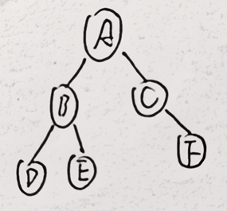
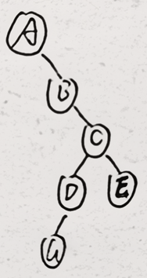
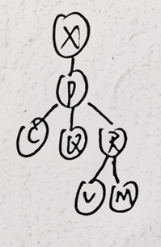
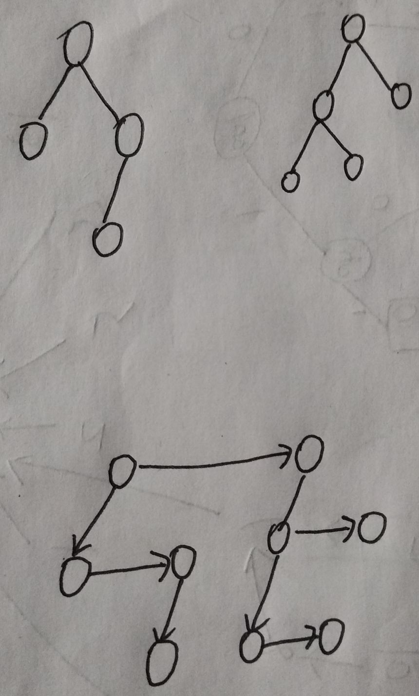

# 数据结构第六章作业
## 6.7


## 6.8


## 6.15
(a) $\frac{k+1}{k+2}$
(b) $\frac{k}{k+4}$
(c) $\frac{1}{2}$
(d) $\frac{k}{3k-2}$

## 6.16
(a) CA/BG///FED///H/I//
(b) C'A'/B'G/F'E'D/H'/I

## 6.17


## 6.18


## 6.19

## 附加题


## 思考题
6.1
```cpp
template<class Elem>
bool Compare(GTNode<Elem>* t1, GTNode<Elem>* t2){
    GTNode<Elem> *c1,*c2;
    if(((t1==NULL)&&(T2!=NULL))||((t1!=NULL)&&(t2==NULL)))
        return false;
    if((t1==NULL)&&(t2==NULL))return true;
    if(t1->val()!=t2->val())return false;
    cl=t1->leftmost_child();
    c2=t2->leftmost_child();
    while(!((c1==NULL)&&(c2==NULL))){
        if(!Compare(c1,c2))return false;
        if(c1!=NULL)c1=c1->right_sibling();
        if(c2!=NULL)c2=c2->right_sibling();
    }
} 
```
6.2
```cpp
template<class Elem>
bool CompareBin(BinNode<Elem>* t1, BinNode<Elem>* t2){
    BinNode<Elem> *c1,*c2;
    if(((t1==NULL)&&(T2!=NULL))||((t1!=NULL)&&(t2==NULL)))
        return false;
    if((t1==NULL)&&(t2==NULL))return true;
    if(t1->val()!=t2->val())return false;
    if(CompareBin(t1->leftchild(),t2->leftchild()))
    	if(CompareBin(t1->rightchild(),t2->rightchild()))
    		return true;
    if(CompareBin(t1->leftchild(),t2->rightchild()))
    	if(CompareBin(t1->rightchild(),t2->leftchild()))
    		return true;
    return false;
} 
```