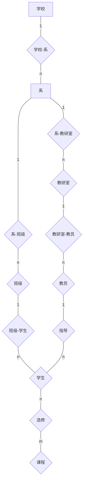

# 数据库作业7

### 1

试述数据库设计过程。

* 需求分析

* 概念结构设计
* 逻辑结构设计
* 物理结构设计
* 数据库实施
* 数据库运行和维护

### 7

学校中有若干系，每个系有若干班级和教研室，每个教研室有若干教员，其中有的教授和副教授每人各带若干研究生，每个班有若干学生，每个学生选修若干课程，每门课可由若干学生选修。请用 E-R 图画出此学校的概念模型。

### 10

试把习题 7 和习题 8 中的 E-R 图转换为关系模型。

#### 习题7关系模型：

系（<u>系编号</u>，系名，学校名）

班级（<u>班级编号</u>，班级名，系编号）

教研室（<u>教研室编号</u>，教研室，系编号）

学生（<u>学号</u>，姓名，学历，班级编号，导师职工号）

课程（<u>课程编号</u>，课程名）

教员（<u>职工号</u>，姓名，职称，教研室编号）

选课（<u>学号</u>，<u>课程编号</u>，成绩）

#### 习题8关系模型：

产品（<u>产品号</u>，产品名，仓库号）

零件（<u>零件号</u>，零件名）

原材料（<u>原材料号</u>，原材料名，类别，仓库号，存放量）

仓库（<u>仓库号</u>，仓库名）

产品组成（<u>产品号</u>，<u>零件号</u>，使用零件量）

零件组成（<u>零件号</u>，<u>原材料号</u>，使用原材料量）

零件储存（<u>零件号</u>，<u>仓库号</u>，存储量）

### 11

试用规范化理论中有关范式的概念分析习题 7 设计的关系模型中各个关系模式的候选码，它们属于第几范式？会产生什么更新异常？

由10可知，习题7中关系模式均存在唯一决定的码，属于BCNF，不会产生更新异常。