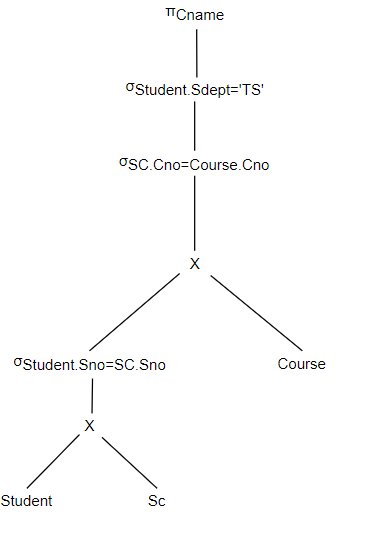
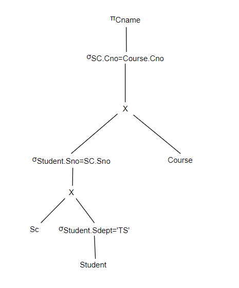

# 数据库作业9
## 3
对学生－课程数据库，查询信息系学生选修了的所有课程名称。

```sql
SELECT Cname 
FROM Student, Course, SC 
WHERE Student.Sno=SC.Sno AND SC.Cno=Course.Cno AND Student.Sdept='IS';
```

试画出用关系代数表示的语法树，并用关系代数表达式优化算法对原始的语法树进行优化处理，画出优化后的标准语法树。

用关系代数表示的语法树：



优化后的语法树：




## 7
试述关系数据库管理系统查询优化的一般步骤。

* 将查询变换为语法树
* 进行代数优化
* 进行物理优化
* 生成查询计划