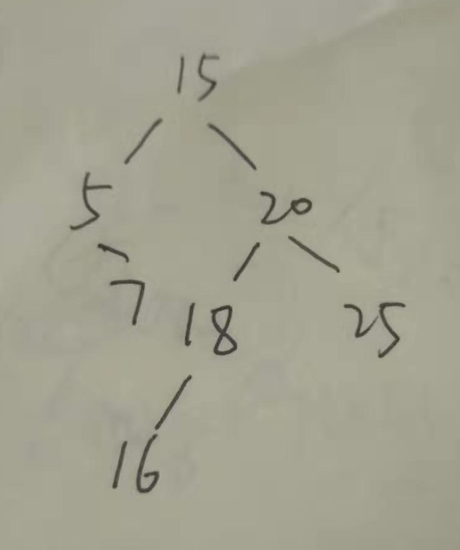
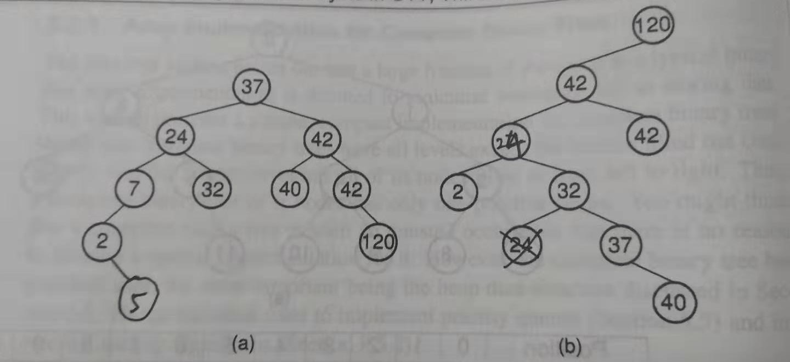
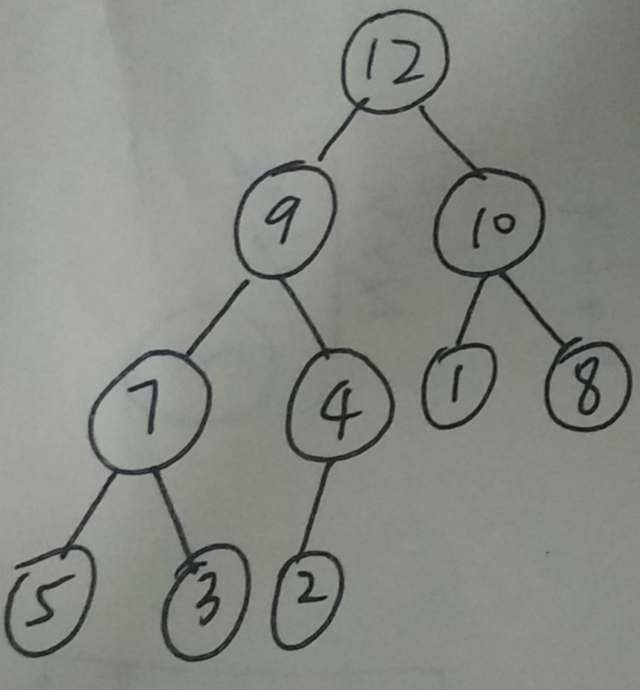
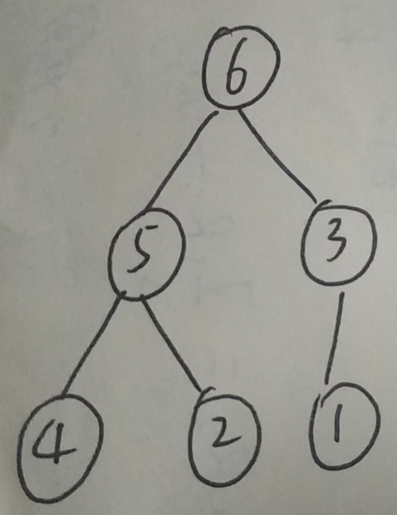
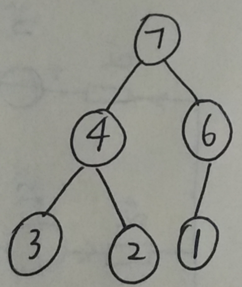
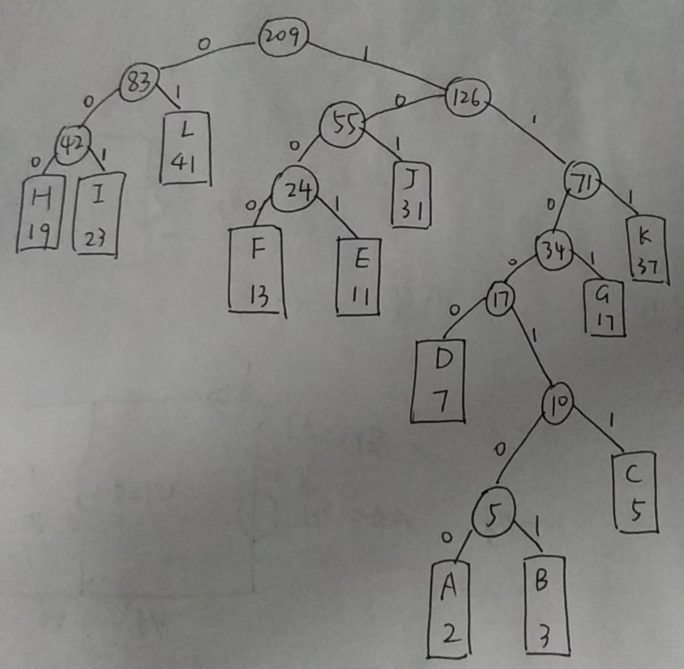
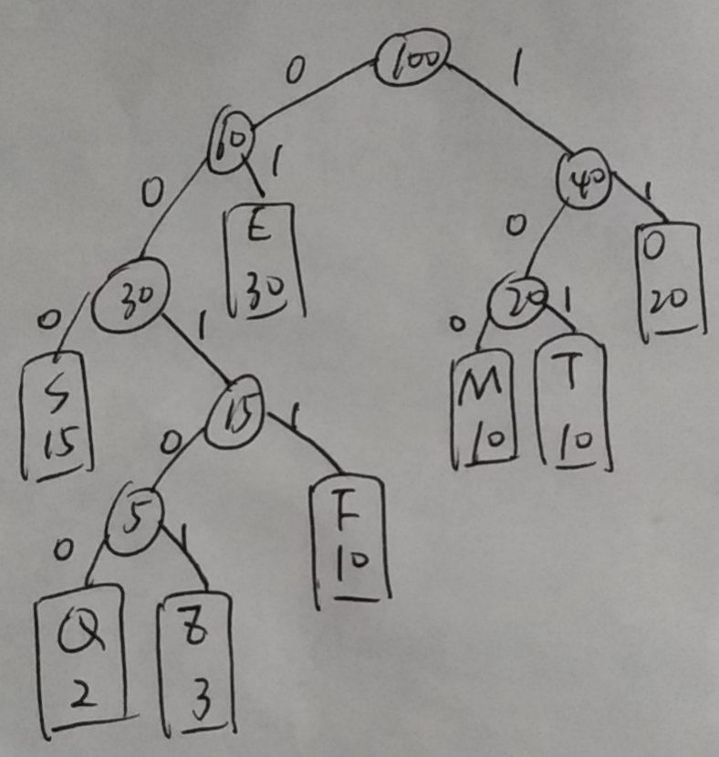
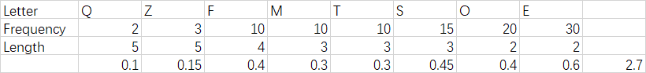
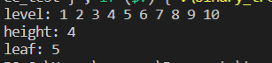

# 数据结构第五章作业
## 5.2
1. 当度数为2的结点数目为1时，显然叶结点数目为2，符合条件。
2. 当度数为2的结点数目为n时，假设叶结点数目为n+1。（1）
3. 当度数为2的结点数目为n+1时，假设此时为树T，取一个左右子结点均为叶结点的分支结点I，去掉I的两个子结点，则I成为叶结点，把新树记为T'，T'有n个度数为2的结点，由（1）知，此时有n+1个叶结点。现在把两个叶结点归还给I，又得到树T有n+3个度数为2的结点，但是在T'中结点I被计算为叶结点，而现在I则是度数为2的结点，所以有n+2个叶结点，得证。

## 5.13
(a) 3/4
(b) 1/3
(c) 1/2
(d) 1/2
## 5.15
(a) 

(b)
前序遍历：15 5 7 20 18 16 25
中序遍历：5 7 15 16 18 20 25
后序遍历：7 5 16 18 25 20 15

## 5.16 5.17

## 5.25
12 9 10 7 4 1 8 5 3 2


## 5.26
(a) 

(b)

## 5.28

## 5.31


(a) 5n，只包含Q和Z的字符串。
(b) 2n，只包含O和E的字符串。
(c) 

答案为2.7

## 上机作业 5.7 5.8 5.9
```
#include<iostream>
#include<cstdio>
#include <assert.h>
#include<queue>
using namespace std;
template <typename E>class BinNode {
private:
	int k;
	E it;
	BinNode* lc;
	BinNode* rc;
public:
	BinNode() { lc = rc = NULL; }
	BinNode(int K, E e, BinNode* l = NULL, BinNode* r = NULL) {
		k = K;it = e;lc = l;rc = r;
	}
	~BinNode(){}
	E& element() { return it; }
	void setElement(const E& e) { it = e; }
	int Key(){
		return k;
	}
	void setKey(const int& K) { k = K; }
	inline BinNode* left() const { return lc; }
	inline BinNode* right()const { return rc; }
	void setLeft(BinNode<E>* b) { lc = (BinNode*)b; }
	void setRight(BinNode<E>* b) { rc = (BinNode*)b; }
	bool isLeaf() { return (lc == NULL) && (rc == NULL); }
	void level(BinNode<E>* subroot) {
		queue<BinNode<E>*> Q;
		Q.push(subroot);
		while (!Q.empty()) {
			BinNode<E>* temp= Q.front();
			Q.pop();
			cout << temp->element() << endl;
			if(temp->left()!= NULL) {
				Q.push(temp->left());
			}
			if (temp->right() != NULL) {
				Q.push(temp->right());
			}
		}
	}
	int height(BinNode<E>* subroot) {
		if (subroot == NULL)return 0;
		return 1 + max(height(subroot->left()), height(subroot->right()));
	}
	int count(BinNode<E>* subroot) {
		if (subroot == NULL)return 0;
		if (subroot->isLeaf())return 1;
		return 1 + count(subroot->left()) + count(subroot->right());
	}
};
int main() {
	BinNode<int>* BN[11];
	for (int i = 1;i <= 10;i++) {
		BN[i] = new BinNode<int>();
		BN[i]->setElement(i);
	}
	BN[1]->setLeft(BN[2]);
	BN[1]->setRight(BN[3]);
	BN[2]->setLeft(BN[4]);
	BN[2]->setRight(BN[5]);
	BN[3]->setLeft(BN[6]);
	BN[3]->setRight(BN[7]);
	BN[4]->setLeft(BN[8]);
	BN[4]->setRight(BN[9]);
	BN[5]->setLeft(BN[10]);
	BN[1]->level(BN[1]);
}
```
测试用例：
            1 
        2       3
    4     5   6    7
 8  9  10

输出结果：  


