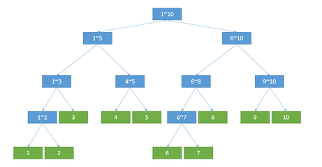

# 数据结构

## 树状数组（BIT）

原理：数组a[x]记录了的是右端点为x、长度为lowbit(x)的区间的区间和。
扩展：下标从0开始，`i |= (i+1)`，`i = (i & (i+1)) - 1`

### 区间加、区间和查询
[LOJ132](https://loj.ac/problem/132)
维护两个树状数组，一个差分数组`d[i]`，另一个`i×d[i]`，利用$S=(i+1)\times \sum\limits_{j=0}^{i}d[j]-\sum\limits_{j=0}^{i}j\times d[j]$求和。

```cpp
#include <bits/stdc++.h>
using namespace std;
int main() {
    int n, q;
    cin >> n >> q;
    vector<int> a(n+1);
    typedef long long ll;
    vector<ll> d(n+1), di(n+1);
    auto lowbit = [](int x) { return x&-x; };
    auto add = [&](int x, ll v) {
        for (int i = x; i <= n; i += lowbit(i))
            d[i] += v, di[i] += x*v;
    };
    auto range_add = [&](int l, int r, ll v) { add(l, v), add(r+1, -v); };
    auto sum = [&](int x) {
        ll ans = 0;
        for (int i = x; i > 0; i -= lowbit(i)) ans += (x+1)*d[i]-di[i];
        return ans;
    };
    auto range_sum = [&](int l, int r) { return sum(r)-sum(l-1); };
    for (int i = 1; i <= n; i++) {
        cin >> a[i];
        add(i, a[i]-a[i-1]);
    }
    while (q--) {
        int op, l, r, x;
        cin >> op >> l >> r;
        if (op == 1) { cin >> x; range_add(l, r, x); }
        else cout << range_sum(l, r) << '\n';
    }
    return 0;
}
```

### 二维区间加，区间和查询
[LOJ135](https://loj.ac/problem/135)

基本原理：a[x][y]记录的是右下角为(x,y)，高为 lowbit(x)，宽为 lowbit(y) 的区间的区间和。

```cpp
#include <bits/stdc++.h>
using namespace std;
typedef long long ll;
int main() {
    int n, m;
    cin >> n >> m;
    vector<vector<ll>> d(n+1, vector<ll>(m+1)), dx(n+1, vector<ll>(m+1)),
                       dy(n+1, vector<ll>(m+1)), dxy(n+1, vector<ll>(m+1));
    auto add=[&](int x, int y, ll v) {
        for (int i = x; i <= n; i += i&-i) 
            for (int j = y; j <= m; j += j&-j)
                d[i][j] += v, dx[i][j] += v*x,
                dy[i][j] += v*y, dxy[i][j] += v*x*y;
    };
    auto range_add=[&](int x1, int y1, int x2, int y2, ll v) {
        add(x1, y1, v), add(x1, y2+1, -v);
        add(x2+1, y1, -v), add(x2+1, y2+1, v);
    };
    auto sum=[&](int x, int y) {
        ll ans = 0;
        for (int i = x; i > 0; i -= i&-i)
            for (int j = y; j > 0; j -= j&-j)
                ans += (x+1)*(y+1)*d[i][j] - (y+1)*dx[i][j] 
                     - (x+1)*dy[i][j] + dxy[i][j];
        return ans;
    };
    auto range_sum=[&](int x1, int y1, int x2, int y2) {
        return sum(x2,y2)-sum(x2,y1-1)-sum(x1-1,y2)+sum(x1-1,y1-1);
    };
    int op, A, B, C, D, X;
    while (cin >> op >> A >> B >> C >> D) {
        if (op == 1) {
            cin >> X;
            range_add(A, B, C, D, X);
        } else cout << range_sum(A, B, C, D) << '\n';
    }
    return 0;
}
```


## 线段树


* 线段树每个节点的左右边界有两种实现方法：利用函数参数实时计算，这样更节省空间，缺点就是大多数线段树相关的函数都要传三个初始参数`(1, 1, n)`，分别表示当前节点标号，当前区间左端点、右端点（左右均包含）。另一种方式就是单独保存。
* 线段树每个节点的左右孩子节点的标号也有多种实现，通常采用完全二叉树的方法，即节点p的左儿子为`p*2`，右儿子为`p*2+1`，这样线段树的空间需要开4倍。另一种方法是采用dfs序标号，节点p的左孩子为`p+1`，右孩子为`p+2*(m-l+1)`，常用写法`int m = (l+r)/2, z = p+2*(m-l+1);`，空间需要2倍。


## 可持久化线段树


原理：对于线段树的每次修改，新建一条链，同时维护好左右孩子的链接关系。

### 静态区间第k小
[Luogu P3834](https://www.luogu.com.cn/problem/P3834)


```cpp
#include <bits/stdc++.h>
using namespace std;
#define all(x) (x).begin(), (x).end()
int main() {
    // 可持久化线段树节点，线段树中存的是权值
    struct Node {
        int sum, ls, rs; // 记录左右孩子以及区间和
    };
    vector<Node> tree;
    auto pull = [&](int p) {
        int ls = tree[p].ls, rs = tree[p].rs;
        tree[p].sum = tree[ls].sum + tree[rs].sum;
    };
    function<int(int, int)> build = [&](int l, int r) { // 建空树
        int p = tree.size();
        tree.push_back(Node{});
        if (l == r) {
            tree[p].sum = 0;
            return p;
        }
        int m = (l + r) >> 1;
        tree[p].ls = build(l, m);
        tree[p].rs = build(m+1, r);
        pull(p);
        return p;
    };
    function<int(int, int, int, int)> // 在以p为根的线段树的x位置+1
    add = [&](int p, int l, int r, int x) {
        int q = tree.size();
        tree.push_back(tree[p]);
        if (l == r) {
            tree[q].sum++;
            return q;
        }
        int m = (l + r) >> 1;
        if (x <= m) tree[q].ls = add(tree[q].ls, l, m, x);
        else tree[q].rs = add(tree[q].rs, m+1, r, x);
        pull(q);
        return q;
    };
    function<int(int, int, int, int, int)> //在第y棵线段树-第x棵线段树中找第k大
    query = [&](int x, int y, int l, int r, int k) { // 即区间[x+1, y]的权值线段树
        if (l == r) return l; // 返回权值
        int t = tree[tree[y].ls].sum - tree[tree[x].ls].sum; // 新树的左孩子
        int m = (l + r) >> 1;
        if (k <= t) return query(tree[x].ls, tree[y].ls, l, m, k);
        else return query(tree[x].rs, tree[y].rs, m+1, r, k-t);
    };
    int n, m;
    cin >> n >> m;
    build(1, n);
    vector<int> root(n+1); // 记录每个版本的根
    vector<int> a(n);
    for (int i = 0; i < n; i++) cin >> a[i];
    vector<int> b(a);
    sort(all(b)); // 离散化
    b.erase(unique(all(b)), b.end());
    for (int i = 0; i < n; i++) {
        int t = lower_bound(all(b), a[i])-b.begin()+1; //从1开始
        root[i+1] = add(root[i], 1, n, t);
    }
    while (m--) {
        int l, r, k;
        cin >> l >> r >> k;
        cout << b[query(root[l-1], root[r], 1, n, k)-1] << '\n';
    }
    return 0;
}
```

