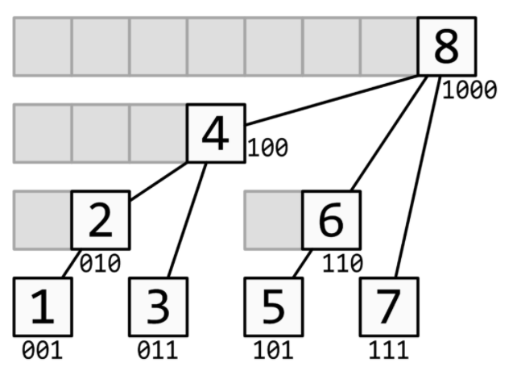

# 数据结构

## 树状数组（BIT）


### [LOJ132](https://loj.ac/problem/132)

区间加、区间和查询。维护两个树状数组，一个差分数组`d[i]`，另一个`i×d[i]`，利用$S=(i+1)\times \sum\limits_{j=0}^{i}d[j]-\sum\limits_{j=0}^{i}j\times d[j]$求和。

```cpp
#include <bits/stdc++.h>
using namespace std;
int main() {
    int n, q;
    cin >> n >> q;
    vector<int> a(n+1);
    typedef long long ll;
    vector<ll> d(n+1), di(n+1);
    auto lowbit = [](int x) { return x&-x; };
    auto add = [&](int x, ll v) {
        for (int i = x; i <= n; i += lowbit(i))
            d[i] += v, di[i] += x*v;
    };
    auto range_add = [&](int l, int r, ll v) { add(l, v), add(r+1, -v); };
    auto sum = [&](int x) {
        ll ans = 0;
        for (int i = x; i > 0; i -= lowbit(i)) ans += (x+1)*d[i]-di[i];
        return ans;
    };
    auto range_sum = [&](int l, int r) { return sum(r)-sum(l-1); };
    for (int i = 1; i <= n; i++) {
        cin >> a[i];
        add(i, a[i]-a[i-1]);
    }
    while (q--) {
        int op, l, r, x;
        cin >> op >> l >> r;
        if (op == 1) { cin >> x; range_add(l, r, x); }
        else cout << range_sum(l, r) << '\n';
    }
    return 0;
}
```

### [LOJ135](https://loj.ac/problem/135)
二维树状数组，区间修改，区间查询。

基本原理：a[x][y]记录的是右下角为(x,y)，高为 lowbit(x)，宽为 lowbit(y) 的区间的区间和。

```cpp
#include <bits/stdc++.h>
using namespace std;
typedef long long ll;
int main() {
    int n, m;
    cin >> n >> m;
    vector<vector<ll>> d(n+1, vector<ll>(m+1)), dx(n+1, vector<ll>(m+1)),
                       dy(n+1, vector<ll>(m+1)), dxy(n+1, vector<ll>(m+1));
    auto add=[&](int x, int y, ll v) {
        for (int i = x; i <= n; i += i&-i) 
            for (int j = y; j <= m; j += j&-j)
                d[i][j] += v, dx[i][j] += v*x,
                dy[i][j] += v*y, dxy[i][j] += v*x*y;
    };
    auto range_add=[&](int x1, int y1, int x2, int y2, ll v) {
        add(x1, y1, v), add(x1, y2+1, -v);
        add(x2+1, y1, -v), add(x2+1, y2+1, v);
    };
    auto sum=[&](int x, int y) {
        ll ans = 0;
        for (int i = x; i > 0; i -= i&-i)
            for (int j = y; j > 0; j -= j&-j)
                ans += (x+1)*(y+1)*d[i][j] - (y+1)*dx[i][j] 
                     - (x+1)*dy[i][j] + dxy[i][j];
        return ans;
    };
    auto range_sum=[&](int x1, int y1, int x2, int y2) {
        return sum(x2,y2)-sum(x2,y1-1)-sum(x1-1,y2)+sum(x1-1,y1-1);
    };
    int op, A, B, C, D, X;
    while (cin >> op >> A >> B >> C >> D) {
        if (op == 1) {
            cin >> X;
            range_add(A, B, C, D, X);
        } else cout << range_sum(A, B, C, D) << '\n';
    }
    return 0;
}
```