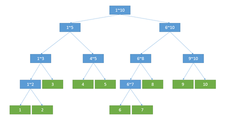

# 2020CCPC模板总结
## 树状数组


### 基础
原理：数组a[x]记录了的是右端点为x、长度为lowbit(x)的区间的区间和。

```cpp
const int N = 5e4 + 5;
int n, a[N];
int lowbit(int x) { return x & -x; }
void update(int x, int v) {
    for (int i = x; i <= n; i += lowbit(i)) a[i] += v;
}
int query(int x) {
    int res = 0;
    for (int i = x; i > 0; i -= lowbit(i)) res += a[i];
    return res;
}
```

### 0-index
下标从零开始的树状数组，适合配合STL容器封装。


```cpp
template <typename T>
struct fenwick {
    vector<T> a;
    fenwick(int n) : a(n) {}
    void add(int x, T v) {
        for (int i = x; i < (int)a.size(); i |= (i+1))
            a[i] += v;
    }
    T get(int x) {
        T v{};
        for (int i = x; i >= 0; i = (i & (i+1)) - 1)
            v += a[i];
        return v;
    }
};
```

### 区间修改+区间查询
原理：$S(i)=(i+1)\times \sum\limits_{j=0}^{i}d[j]-\sum\limits_{j=0}^{i}j\times d[j]$
d表示差分数组，di表示d×i。
```cpp
ll d[N], di[N];
int lowbit(int x) {
    return x & -x;
}
void add(int x, ll v) {
    for (int i = x; i <= n; i += lowbit(i)) {
        d[i] += v;
        di[i] += x * v;
    }
}
void add(int l, int r, ll v) {
    add(l, v);
    add(r+1, -v);
}
ll sum(int x) {
    ll ans = 0;
    for (int i = x; i > 0; i -= lowbit(i))
        ans += (x+1)*d[i] - di[i];
    return ans;
}
ll sum(int l, int r) { return sum(r) - sum(l-1); }
```

初始化调用add添加差分值即可：

```cpp
for (int i = 1; i <= n; i++) {
    cin >> a[i];
    add(i, a[i] - a[i-1]);
}
```

### 二维
基本原理：a[x][y]记录的是右下角为(x,y)，高为 lowbit(x)，宽为 lowbit(y) 的区间的区间和。

仅记录二维**区间修改+区间查询**的模板。

```cpp
ll d[N][N], dx[N][N], dy[N][N], dxy[N][N];
int lowbit(int x) { return x&-x; }
void add(int x, int y, ll v){
    for(int i = x; i <= n; i += lowbit(i)) {
        for(int j = y; j <= m; j += lowbit(j)) {
            d[i][j] += v;
            dx[i][j] += v * x;
            dy[i][j] += v * y;
            dxy[i][j] += v * x * y;
        }
    }
}
void add(int xa, int ya, int xb, int yb, ll v) {
    add(xa, ya, v);
    add(xa, yb + 1, -v);
    add(xb + 1, ya, -v);
    add(xb + 1, yb + 1, v);
}
ll sum(int x, int y) {
    ll res = 0;
    for(int i = x; i; i -= lowbit(i))
        for(int j = y; j; j -= lowbit(j))
            res += (x+1)*(y+1)*d[i][j]
                - (y+1)*dx[i][j]
                - (x+1)*dy[i][j]
                + dxy[i][j];
    return res;
}
ll sum(int xa, int ya, int xb, int yb) {
    return sum(xb, yb) - sum(xb, ya-1) - sum(xa-1, yb) + sum(xa-1, ya-1);
}
```

## 线段树


### 基础
以维护区间最大值为例。

* 采用实时计算下标的方法，大多数线段树相关的函数都要传三个初始参数`(1, 1, n)`，分别表示当前节点标号，当前区间左端点、右端点（左右均包含）
* p节点的左儿子为`p<<1`，右儿子为`p<<1|1`

定义：a表示原数组，Max记录区间最大值，lazy记录区间延迟更新的标记。

```cpp
const int N = 5e5 + 5;
int n, a[N], Max[N*4], lazy[N*4];
```

建树：`push_up`表示从子节点的信息更新当前节点。

```cpp
void push_up(int p) {
    int m = (l+r)/2;
    Max[p] = max(Max[p<<1], Max[p<<1|1]);
}
void build(int p, int l, int r) {
    if (l == r) {
        Max[p] = a[l];
        return ;
    }
    int m = (l+r)/2;
    build(p<<1, l, m);
    build(p<<1|1, m+1, r);
    push_up(p, l, r);
}
```

区间更新操作（以区间`[L, R]`范围内的值都改成`V`为例。
`lazy[p]`表示p节点代表的区间已经更新，但他的子节点还没更新。（注意lazy的含义以及特殊值）
`push_down`表示把当前节点的lazy标记下传，同时更新子节点。（在更新、查询前都需要下传标记）

```cpp
void push_down(int p) {
    if (lazy[p] == -1) return ;
    Max[p<<1] = lazy[p];
    Max[p<<1|1] = lazy[p];
    lazy[p<<1] = lazy[p];
    lazy[p<<1|1] = lazy[p];
    lazy[p] = -1;
}
void update(int p, int l, int r, int L, int R, int V) {
    if (L <= l && r <= R) {
        Max[p] = V;
        lazy[p] = V;
        return ;
    }
    push_down(p);
    int m = (l+r)/2;
    if (L <= m) update(p<<1, l, m, L, R, V);
    if (R > m) update(p<<1|1, m+1, r, L, R, V);
    push_up(p, l, r);
}
```

区间查询：

```cpp
int query(int p, int l, int r, int L, int R) {
    if (L <= l && r <= R) return Max[p];
    int m = (l+r)/2;
    int ans = -1;
    push_down(p);
    if (L <= m) ans = max(ans, query(p<<1, l, m, L, R));
    if (R > m) ans = max(ans, query(p<<1|1, m+1, r, L, R));
    return ans;
}
```

### dfs序
相比普通线段树的优势在于：dfs序线段树空间只需要2n，而普通写法的线段树需要4n，写法基本上差不多。

p节点的左儿子为p+1，右儿子为z。

```cpp
int m = (l+r)/2, z = p+2*(m-l+1);
Max[p] = max(Max[p+1], Max[z]);
```

### 可持久化

```cpp
#include <bits/stdc++.h>
using namespace std;
const int N=2e5+5;
int n,m,cnt,a[N],b[N],rt[N],tr[N<<5],ls[N<<5],rs[N<<5];
void push_up(int p){
    tr[p]=tr[ls[p]]+tr[rs[p]];
}
int build(int l,int r){
    int p=cnt++;
    if(l==r){
        tr[l]=0;
        return p;
    }
    int m=(l+r)>>1;
    ls[p]=build(l,m);
    rs[p]=build(m+1,r);
    push_up(p);
    return p;
}
int update(int p,int l,int r,int x){
    int q=cnt++;
    ls[q]=ls[p],rs[q]=rs[p],tr[q]=tr[p];
    if(l==r){
        tr[q]++;
        return q;
    }
    int m=(l+r)>>1;
    if(x<=m)ls[q]=update(ls[q],l,m,x);
    else rs[q]=update(rs[q],m+1,r,x);
    push_up(q);
    return q;
}
int query(int x,int y,int l,int r,int k){
    // printf("query(%d,%d,%d,%d,%d)\n",x,y,l,r,k);
    if(l==r)return l;
    int t=tr[ls[y]]-tr[ls[x]],m=(l+r)>>1;
    if(k<=t)return query(ls[x],ls[y],l,m,k);
    else return query(rs[x],rs[y],m+1,r,k-t);
}
int main(){
    scanf("%d%d",&n,&m);
    for(int i=1;i<=n;i++){
        scanf("%d",&a[i]);
        b[i]=a[i];
    }
    sort(b+1,b+1+n);
    int bn=unique(b+1,b+1+n)-b-1;
    rt[0]=build(1,n);
    for(int i=1;i<=n;i++){
        int t=lower_bound(b+1,b+1+bn,a[i])-b;
        rt[i]=update(rt[i-1],1,n,t);
    }
    for(int i=1;i<=m;i++){
        int l,r,k;
        scanf("%d%d%d",&l,&r,&k);
        int t=query(rt[l-1],rt[r],1,n,k);
        printf("%d\n",b[t]);
    }
    return 0;
}
```

## trie树

```cpp
const int N=1e6+5;
const int M=26;
int ch[N][M],v[N],sz;
void insert(char *s){
    int p=0,n=strlen(s);
    for(int i=0;i<n;i++){
        int c=s[i]-'a';
        if(!ch[p][c]){
            v[sz]=0;
            ch[p][c]=sz++;
        }
        p=ch[p][c];
        v[p]++;
    }
}
int query(char *s){
    int p=0,n=strlen(s);
    for(int i=0;i<n;i++){
        int c=s[i]-'a';
        if(!ch[p][c])return 0;
        p=ch[p][c];
    }
    return v[p];
}
```

## Dijkstra算法

```cpp
#include <bits/stdc++.h>
using namespace std;
int main() {
    ios::sync_with_stdio(false), cin.tie(0);
    int n, m;
    cin >> n >> m;
    vector<vector<pair<int, int>>> G(n);
    while (m--) {
        int u, v, w;
        cin >> u >> v >> w;
        u--, v--;
        G[u].emplace_back(v, w);
        G[v].emplace_back(u, w);
    }
    vector<long long> dis(n, 1ll<<60);
    vector<int> pre(n, -1);
    priority_queue<pair<long long, int>> Q;
    dis[0] = 0;
    Q.emplace(0, 0);
    while (!Q.empty()) {
        int u = Q.top().second;
        long long d = -Q.top().first;
        Q.pop();
        if (u == n - 1) break;
        if (d != dis[u]) continue;
        for (auto &e : G[u]) {
            int v = e.first, w = e.second;
            if (d + w < dis[v]) {
                dis[v] = d + w;
                pre[v] = u;
                Q.emplace(-(d + w), v);
            }
        }
    }
    if (~pre.back()) {
        vector<int> path{n - 1};
        for (int u = n - 1; u; u = pre[u]) {
            path.push_back(pre[u]);
        }
        for (int i = path.size() - 1; i >= 0; i--) {
            cout << path[i] + 1 << ' ';
        }
    } else cout << -1;
    return 0;
}
```

## Tarjan算法

### 强连通分量

```cpp
int cnt = 0, scc = 0;
vector<int> dfn(n), low(n), belong(n);
stack<int> st;
vector<bool> inst(n);
function<void(int)> dfs = [&](int u) {
    dfn[u] = low[u] = ++cnt;
    st.push(u);
    inst[u] = true;
    for (auto v : G[u]) {
        if (!dfn[v]) {
            dfs(v);
            low[u] = min(low[u], low[v]);
        } else if (inst[v]) {
            low[u] = min(low[u], dfn[v]);
        }
    }
    if (low[u] == dfn[u]) {
        int v;
        do {
            v = st.top();
            st.pop();
            inst[v] = false;
            belong[v] = scc;
        } while (v != u);
        scc++;
    }
};
```

### 割点

```cpp
#include <bits/stdc++.h>
using namespace std;
typedef long long ll;
int main() {
    int n, m;
    cin >> n >> m;
    vector<vector<int>> G(n);
    for (int i = 0; i < m; i++) {
        int u, v;
        cin >> u >> v;
        u--, v--;
        G[u].push_back(v);
        G[v].push_back(u);
    }
    int cnt = 0;
    vector<int> dfn(n), low(n);
    vector<bool> cut(n);
    function<void(int, bool)> dfs = [&](int u, bool is_root) {
        // fprintf(stderr, "dfs(%d)\n", u+1);
        dfn[u] = low[u] = ++cnt;
        int children = 0;
        for (auto v : G[u]) {
            if (dfn[v]) {
                low[u] = min(low[u], dfn[v]);
            } else {
                dfs(v, false);
                low[u] = min(low[u], low[v]);
                if (dfn[u] <= low[v]) {
                    cut[u] = true;
                    children++;
                }
            }
        }
        if (is_root && children == 1) cut[u] = false;
    };
    for (int i = 0; i < n; i++) {
        if (!dfn[i]) {
            dfs(i, true);
        }
    }
    vector<int> ans;
    for (int i = 0; i < n; i++) {
        if (cut[i]) ans.push_back(i);
    }
    cout << ans.size() << '\n'; 
    for (auto a : ans) {
        cout << (a+1) << ' ';
    }
    cout << '\n';
    return 0;
}
```

### 桥

```cpp
#include <bits/stdc++.h>
using namespace std;
typedef long long ll;
bool solve() {
    int n, m;
    cin >> n >> m;
    if (n == 0 && m == 0) return false;
    vector<vector<pair<int, int>>> G(n);
    const int INF = 1e5;
    auto add_edge = [&](int u, int v, int w) {
        for (auto &e : G[u]) {
            if (e.first == v) {
                e.second = INF;
                return ;
            }
        }
        G[u].emplace_back(v, w);
    };
    for (int i = 0; i < m; i++) {
        int u, v, w;
        cin >> u >> v >> w;
        u--, v--;
        add_edge(u, v, w);
        add_edge(v, u, w);
    }
    int cnt = 0, ans = INF;
    vector<int> dfn(n), low(n);
    function<void(int, int)> dfs = [&](int u, int fa) {
        dfn[u] = low[u] = ++cnt;
        for (auto e : G[u]) {
            int v = e.first, w = e.second;
            if (!dfn[v]) {
                dfs(v, u);
                low[u] = min(low[u], low[v]);
                if (low[v] > dfn[u]) {
                    ans = min(ans, w);
                }
            } else if (v != fa) {
                low[u] = min(low[u], dfn[v]);
            }
        }
    };
    int scc = 0;
    for (int i = 0; i < n; i++) {
        if (!dfn[i]) {
            scc++;
            dfs(i, -1);
        }
    }
    int res = ans;
    if (scc > 1) res = 0;
    else if (ans == INF) res = -1;
    else if (ans == 0) res = 1;
    cout << res << '\n';
    return true;
}
int main() {
    while (solve()) ;
    return 0;
}
```

