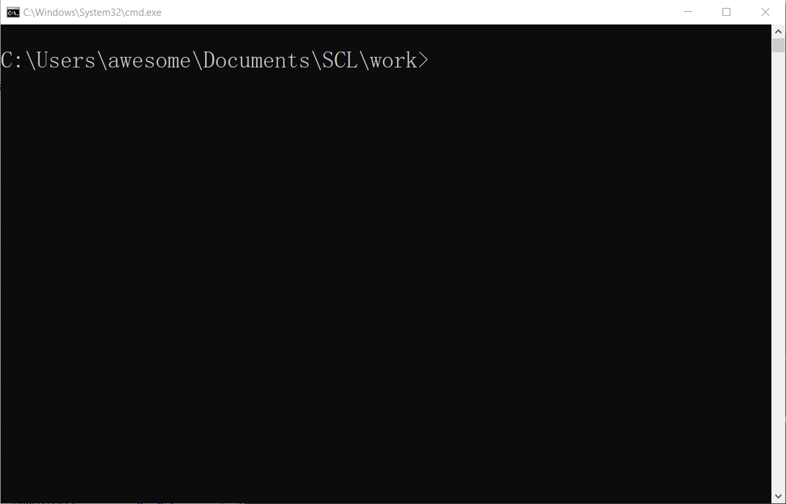
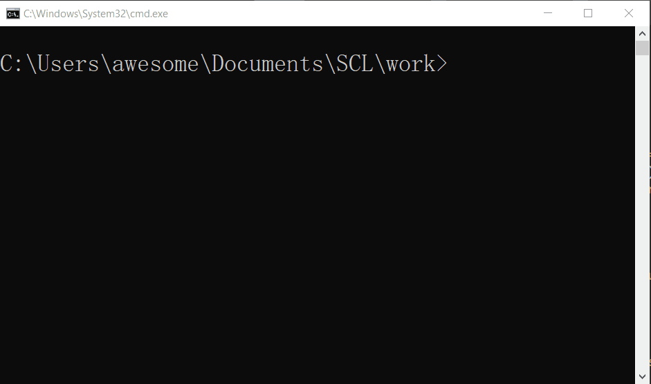
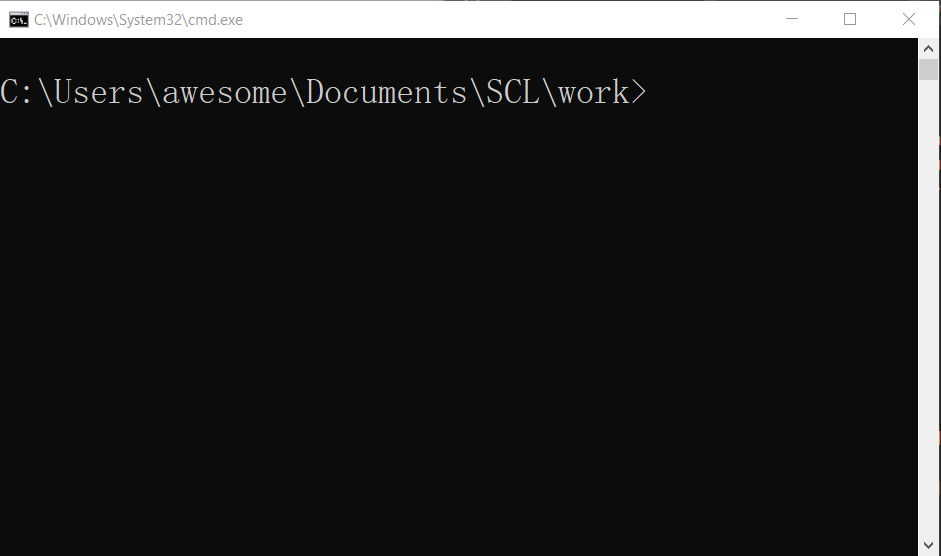

# 测试
## 参考
[给大家整理了一篇 ACM在线测评系统评测程序设计与python实现](https://www.jianshu.com/p/617e72971536)  
[OnlineJudge的监测程序](http://www.cppblog.com/Onway/archive/2012/08/20/187707.html)  

## 写在前面
有时候不仅仅是想[对拍](对拍.md)，更希望精确地评测一下程序。这时候就有如下选择啦：

* 改进对拍脚本，使之支持更多高级功能
* 使用在线服务（[洛谷](https://www.luogu.org/)、[Vijos](https://vijos.org/)），上传题目与数据
* 使用本地评测软件（[NOI评测系统Atbiter](http://www.noi.cn/newsview.html?id=690&hash=9A0662&type=11)、[Cena](https://files.cnblogs.com/files/shiningrise/Cena评测系统.zip)、[Lemon Judge](https://blog.csdn.net/OoLuoChenoO/article/details/75669563)）

## 改进脚本
若要实现一些高级功能，使用系统的脚本就不太合适了。  
这里采用Python实现。  

### 基础
和对拍脚本的功能是一样的。  

```py
import os
while True:
	os.system('python test.py > input.txt')
	os.system('std.exe < input.txt > answer.txt')
	os.system('main.exe < input.txt > output.txt')
	ret=os.system('fc output.txt answer.txt')
	if ret!=0:break
```

### 测量时间、多组数据、信息提示
从这个版本开始就有点类似OJ了。  

```py
import os
import time

print('Queuing',end='');
TestCases=50
MaxTime=0
for cas in range(1,TestCases):
	print('\rRunning on test %d'%(cas),end='',flush=True)
	os.system('python test.py > input.txt')
	os.system('std.exe < input.txt > answer.txt')


	# Running and Count Time
	start=time.perf_counter_ns()
	os.system('main.exe < input.txt > output.txt')
	end=time.perf_counter_ns()
	last=(end-start)/(10**9)
	if last>MaxTime:MaxTime=last
	if last>1.0:
		print('\rTime Limit Exceeded on test %d'%(cas),end='',flush=True)
	# print('Running time: %s Seconds'%())

	# Judge
	ret=os.system('fc output.txt answer.txt > nul')
	if ret!=0:
		print('\rWrong Answer on test %d'%(cas),flush=True)
		break

	if cas==TestCases-1:
		print('\rAccepted (Time: %.3f s)      '%(MaxTime))
```

下面是演示，测试代码来自[拓展KMP](../算法/扩展KMP算法.md)。  

  

  



### 下一步计划

- [ ] 到指定时间自动终止程序
- [ ] 测试special judge
- [ ] 测试交互题
- [ ] 限制并检测内存使用量