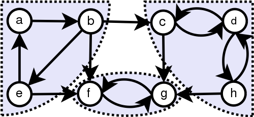

# 图论
## Dijkstra算法
[CF20C](https://codeforces.com/contest/20/problem/C)
Dijkstra算法是单源最短路径算法，适用于无负边权的情况，堆优化下复杂度为$O(V^2+E)$。

```cpp
#include <bits/stdc++.h>
using namespace std;
int main() {
    ios::sync_with_stdio(false), cin.tie(0);
    int n, m;
    cin >> n >> m;
    vector<vector<pair<int, int>>> G(n);
    while (m--) {
        int u, v, w;
        cin >> u >> v >> w;
        u--, v--;
        G[u].emplace_back(v, w);
        G[v].emplace_back(u, w);
    }
    vector<long long> dis(n, 1e18);
    vector<int> pre(n, -1);
    priority_queue<pair<long long, int>> Q;
    dis[0] = 0;
    Q.emplace(0, 0);
    while (!Q.empty()) {
        auto [d, u] = Q.top();
        d = -d; // 优先队列中保存的是距离的负值
        Q.pop();
        if (u == n-1) break; // 已经找到终点
        if (d != dis[u]) continue; // 重复入队的点
        for (auto [v, w] : G[u]) {
            if (d + w < dis[v]) {
                dis[v] = d + w;
                pre[v] = u;
                Q.emplace(-(d+w), v);
            }
        }
    }
    if (~pre.back()) { // 打印路径
        vector<int> path{n-1};
        for (int u = n-1; u; u = pre[u]) {
            path.push_back(pre[u]);
        }
        reverse(path.begin(), path.end());
        for (auto p : path) cout << p+1 << ' ';
        cout << '\n';
    } else cout << -1 << '\n';
    return 0;
}
```

## Tarjan算法

### 求强连通分量


注意：强连通分量是**有向图**中的概念，无向图中求连通分量不需要Tarjan算法，直接dfs或者并查集即可。
原理：如果结点u是某个强连通分量在搜索树中遇到的第一个结点，那么这个强连通分量的其余结点肯定是在搜索树中以u为根的子树中。u被称为这个强连通分量的根。

[Luogu P2341](https://www.luogu.com.cn/problem/P2341)
关键思路：对于一个有向无环图来说，其中有且仅有一个点出度为零，那么这个特殊的点，可以由其他任何点到达。

```cpp
#include <bits/stdc++.h>
using namespace std;
int main() {
    int n, m;
    cin >> n >> m;
    vector<vector<int>> G(n);
    while (m--) {
        int u, v;
        cin >> u >> v;
        u--, v--;
        G[u].push_back(v);
    }
    int cnt = 0, scc = 0; // cnt为当前dfs序，scc为强连通分量个数
    // dfn记录dfs序，low记录回溯值，belong记录所属的强连通分量
    vector<int> dfn(n), low(n), belong(n);
    stack<int> st; // 记录之前搜索过的节点
    vector<bool> inst(n); // 判断节点是否在栈中
    function<void(int)> dfs=[&](int u) {
        dfn[u] = low[u] = ++cnt;
        st.push(u);
        inst[u] = true;
        for (auto v : G[u]) {
            if (!dfn[v]) { // 如果没有访问过
                dfs(v); // 先访问子节点
                low[u] = min(low[u], low[v]); // 再更新回溯值
            } else if (inst[v]) { // 如果v被访问过并在栈中
                // 这里不能用low[v]去更新，因为以v为根的子树还没有遍历完
                low[u] = min(low[u], dfn[v]);
            }
        }
        if (dfn[u] == low[u]) { // 强连通分量的树根
            // 栈中u上面的节点构成一个强连通分量
            int v;
            do {
                v = st.top(); st.pop(); inst[v] = false;
                belong[v] = scc;
            } while (v != u);
            scc++;
        }
    };
    for (int i = 0; i < n; i++) {
        if (!dfn[i]) dfs(i);
    }
    // 缩点后的图的出度outd以及每个点代表的实际点数val
    vector<int> out(scc), val(scc);
    for (int i = 0; i < n; i++) {
        int u = belong[i];
        val[u]++;
        for (auto j : G[i]) {
            int v = belong[j];
            if (u != v) out[u]++;
        }
    }
    int out0 = 0, outi; // 出度为0的点的个数及其下标
    for (int i = 0; i < scc; i++) {
        if (out[i] == 0) {
            outi = i;
            out0++;
        }
    }
    if (out0 == 1) cout << val[outi] << '\n';
    else cout << "0\n";
    return 0;
}
```

### 求割点
注意：求连通分量的Tarjan算法与求割点的Tarjan算法类似但不完全相同。


基本原理：当u为非根节点，`low[v]>=dfn[u]`时，u为割点。

[Luogu 3388](https://www.luogu.com.cn/problem/P3388)

```cpp
#include <bits/stdc++.h>
using namespace std;
typedef long long ll;
int main() {
    int n, m; cin >> n >> m;
    vector<vector<int>> G(n);
    for (int i = 0; i < m; i++) {
        int u, v; cin >> u >> v;
        u--, v--;
        G[u].push_back(v);
        G[v].push_back(u);
    }
    int cnt = 0;
    // dfn记录dfs序,low表示追溯值
    // (即以当前结点为根搜索时能访问的最小dfn值,不通过父节点)
    vector<int> dfn(n), low(n);
    // cut表示节点是否为割点
    vector<bool> cut(n);
    function<void(int, bool)> dfs = [&](int u, bool is_root) {
        dfn[u] = low[u] = ++cnt;
        int children = 0;
        for (auto v : G[u])
            // 判断v是否访问过
            if (dfn[v]) low[u] = min(low[u], dfn[v]); 
            else {
                dfs(v, false);
                low[u] = min(low[u], low[v]); // 更新追溯值
                if (dfn[u] <= low[v]) {
                    cut[u] = true;
                    children++; // 统计子树个数
                }
            }
        // 对于根节点,如果有2棵及以上子树就为割点,否则不是
        if (is_root && children == 1) cut[u] = false;
    };
    for (int i = 0; i < n; i++) if (!dfn[i]) dfs(i, true);
    vector<int> ans;
    for (int i = 0; i < n; i++) if (cut[i]) ans.push_back(i);
    cout << ans.size() << '\n'; 
    for (auto a : ans) cout << (a+1) << ' '; cout << '\n';
    return 0;
}
```

### 求桥
原理：对于一条边u->v，如果low[v]<=dfn[u]，说明v可以不通过u的情况下访问到u本身或其祖先结点，那么u->v显然就不是桥。反之low[v]>dfn[u]，说明u->v是桥。

HDU4738，题意：求桥的最小权值，有一些特殊情况。

```cpp
#include <bits/stdc++.h>
using namespace std;
typedef long long ll;
bool solve() {
    int n, m;
    cin >> n >> m;
    if (n == 0 && m == 0) return false;
    vector<vector<pair<int, int>>> G(n);
    const int INF = 1e5;
    auto add_edge = [&](int u, int v, int w) {
        // 重边处理,把重复边赋值为INF
        for (auto &e : G[u]) {
            if (e.first == v) {
                e.second = INF;
                return ;
            }
        }
        G[u].emplace_back(v, w);
    };
    for (int i = 0; i < m; i++) {
        int u, v, w;
        cin >> u >> v >> w;
        u--, v--;
        add_edge(u, v, w);
        add_edge(v, u, w);
    }
    int cnt = 0, ans = INF;
    vector<int> dfn(n), low(n);
    function<void(int, int)> dfs = [&](int u, int fa) {
        dfn[u] = low[u] = ++cnt;
        for (auto e : G[u]) {
            int v = e.first, w = e.second;
            if (!dfn[v]) {
                dfs(v, u);
                low[u] = min(low[u], low[v]);
                if (low[v] > dfn[u]) { // u->v为桥
                    ans = min(ans, w);
                }
            } else if (v != fa) {
                low[u] = min(low[u], dfn[v]);
            }
        }
    };
    int cc = 0; // 连通分量数
    for (int i = 0; i < n; i++) {
        if (!dfn[i]) {
            cc++;
            dfs(i, -1);
        }
    }
    int res = ans;
    if (cc > 1) res = 0; // 已经完成目标
    else if (ans == INF) res = -1; // 重边不可能为桥
    else if (ans == 0) res = 1; // 即使边权为0也需要派1人(考虑实际意义)
    cout << res << '\n';
    return true;
}
int main() {
    while (solve()) ;
    return 0;
}
```


## 最近公共祖先（LCA）

### 倍增法
[【模板】最近公共祖先（LCA）](https://www.luogu.org/problem/P3379)  
容易写挂，注意要把$f[i][j]$的处理放在$dfs$里面，否则容易超时！


```cpp
#include <bits/stdc++.h>
using namespace std;
const int N=5e5+5;
int n,m,s,d[N],lg[N],f[N][20];
vector<int> G[N];
bool vis[N];
void dfs(int x){
	for(auto i:G[x]){
		if(!vis[i]){
			vis[i]=true;
			d[i]=d[x]+1;
			f[i][0]=x;
			for(int j=1;(1<<j)<=d[i]-1;j++){
				f[i][j]=f[f[i][j-1]][j-1];
			}
			// printf("d[%d]=%d\n",i,d[i]);
			dfs(i);
		}
	}
}
int query(int x,int y){
	if(d[x]<d[y])swap(x,y);
	for(int i=lg[d[x]-d[y]];i>=0;i--){
		// printf("d[%d]=%d\n",f[x][i],d[f[x][i]]);
		if(d[f[x][i]]>=d[y]){
			x=f[x][i];
		}
	}
	if(x==y)return x;
	for(int i=lg[d[x]-1];i>=0;i--){
		if(f[x][i]!=f[y][i]){
			x=f[x][i];
			y=f[y][i];
		}
	}
	return f[x][0];
}
int main(){
	scanf("%d%d%d",&n,&m,&s);
	for(int i=1;i<n;i++){
		int u,v;
		scanf("%d%d",&u,&v);
		G[u].push_back(v);
		G[v].push_back(u);
	}
	d[s]=1;
	vis[s]=true;
	dfs(s);
	for(int i=2;i<=n;i++){
		lg[i]=lg[i-1]+(2<<lg[i-1]==i);
	}
	for(int i=1;i<=m;i++){
		int u,v;
		scanf("%d%d",&u,&v);
		printf("%d\n",query(u,v));
	}
	return 0;
}

```


## 树链剖分

**树上每个节点都属于且仅属于一条重链** 。

重链开头的结点不一定是重子节点（因为重边是对于每一个结点都有定义的）。

所有的重链将整棵树 **完全剖分** 。

在剖分时 **重边优先遍历** ，最后树的 DFN 序上，重链内的 DFN 序是连续的。按 DFN 排序后的序列即为剖分后的链。

一颗子树内的 DFN 序是连续的。

可以发现，当我们向下经过一条 **轻边** 时，所在子树的大小至少会除以二。

因此，对于树上的任意一条路径，把它拆分成从 lca 分别向两边往下走，分别最多走 lgn 次，因此，树上的每条路径都可以被拆分成不超过 lgn 条重链。

### 求LCA

不断向上跳重链，当跳到同一条重链上时，深度较小的结点即为 LCA。

向上跳重链时需要先跳所在重链顶端深度较大的那个。

```cpp
#include <bits/stdc++.h>
using namespace std;
int main() {
    ios::sync_with_stdio(false), cin.tie(0);
#ifdef LOCAL
    freopen("input.txt", "r", stdin);
#endif
    int n, m, s;
    cin >> n >> m >> s;
    struct Node {
        vector<int> son;
        int fa, size, depth, hson;
        int dfn, top;
    };
    vector<Node> G(n+1);
    for (int i = 1; i < n; i++) {
        int u, v;
        cin >> u >> v;
        G[u].son.push_back(v);
        G[v].son.push_back(u);
    }
    G[s].depth = 1;
    function<void(int)> dfs = [&](int u) {
        G[u].size = 1;
        int hson = 0;
        for (auto v : G[u].son) {
            if (v == G[u].fa) continue;
            G[v].depth = G[u].depth + 1;
            G[v].fa = u;
            dfs(v);
            G[u].size += G[v].size;
            if (G[v].size > G[hson].size) hson = v;
        }
        G[u].hson = hson;
    };
    dfs(s);
    vector<int> rank{0};
    function<void(int, int)> dfs2=[&](int u, int top) {
        // cerr << "dfs(" << u << ")\n";
        G[u].dfn = rank.size();
        rank.push_back(u);
        G[u].top = top;
        if (G[u].hson == 0) return ;
        dfs2(G[u].hson, top);
        for (auto v : G[u].son) {
            if (v == G[u].hson || v == G[u].fa) continue;
            dfs2(v, v);
        }
    };
    dfs2(s, s);
    // for (int i = 1; i <= n; i++) {
    //     fprintf(stderr, "Node[%d]: fa=%d, size=%d, depth=%d, hson=%d, dfn=%d, top=%d\n",
    //         i, G[i].fa, G[i].size, G[i].depth, G[i].hson, G[i].dfn, G[i].top);
    // }
    auto lca = [&](int x, int y) {
        while (G[x].top != G[y].top) {
            int tx = G[x].top, ty = G[y].top;
            if (G[tx].depth > G[ty].depth) x = G[tx].fa;
            else y = G[ty].fa;
        }
        return G[x].depth < G[y].depth ? x : y;
    };
    for (int i = 1; i <= m; i++) {
        int u, v;
        cin >> u >> v;
        cout << lca(u, v) << '\n';
    }
    return 0;
}
```


### 维护树上路径

[#10138. 「一本通 4.5 例 1」树的统计](https://loj.ac/problem/10138)

用线段树维护节点的dfs序列。

```cpp
#include <bits/stdc++.h>
using namespace std;
struct Node {
    vector<int> son;
    int w, fa, size, hson, dep;
    int top, dfn;
};
vector<Node> G;
void dfs(int u) {
    G[u].size = 1;
    int hson = 0;
    for (auto v : G[u].son) {
        if (v == G[u].fa) continue;
		G[v].fa = u;
        G[v].dep = G[u].dep + 1;
        dfs(v);
        G[u].size += G[v].size;
        if (G[v].size > G[hson].size) hson = v;
    }
    G[u].hson = hson;
}
vector<int> rnk;
void dfs2(int u, int top) {
    G[u].dfn = rnk.size();
    rnk.push_back(u);
    G[u].top = top;
    if (G[u].hson == 0) return;
    dfs2(G[u].hson, top);
    for (auto v : G[u].son) {
        if (v==G[u].fa || v==G[u].hson) continue;
        dfs2(v, v);
    }
}
struct TNode {
    int sum, max;
};
vector<TNode> st;
#define def_mz int m = (l+r)/2, z = p+2*(m-l+1)
void pull(int p, int l, int r) {
    def_mz;
    st[p].sum = st[p+1].sum + st[z].sum;
    st[p].max = max(st[p+1].max, st[z].max);
}
void build(int p, int l, int r) {
    if (l == r) {
        st[p].sum = st[p].max = G[rnk[l]].w;
        return ;
    }
    def_mz;
    build(p+1, l, m);
    build(z, m+1, r);
    pull(p, l, r);
}
void update(int p, int l, int r, int x, int v) {
    if (l == r) {
        G[rnk[l]].w = st[p].sum = st[p].max = v;
        return ;
    }
    def_mz;
    if (x <= m) update(p+1, l, m, x, v);
    else update(z, m+1, r, x, v);
    pull(p, l, r);
}
int query_sum(int p, int l, int r, int L, int R) {
    // fprintf(stderr, "query_sum(%d, %d, %d, %d, %d)\n", p, l, r, L, R);
    if (L > R) swap(L, R);
    if (L <= l && r <= R) return st[p].sum;
    def_mz;
    int sum = 0;
    if (L <= m) sum += query_sum(p+1, l, m, L, R);
    if (R > m) sum += query_sum(z, m+1, r, L, R);
    return sum;
}
int n;
int query_max(int p, int l, int r, int L, int R) {
    if (L > R) swap(L, R);
    if (L <= l && r <= R) return st[p].max;
    def_mz;
    int mx = -3e4;
    if (L <= m) mx=max(mx, query_max(p+1,l,m,L,R));
    if (R > m) mx=max(mx, query_max(z,m+1,r,L,R));
    return mx;
}
int qmax(int u, int v) {
    int mx = -3e4;
    while(G[u].top != G[v].top) {
        int topu = G[u].top, topv=G[v].top;
        if(G[topu].dep > G[topv].dep) {
            mx = max(mx, query_max(1,1,n,G[topu].dfn, G[u].dfn));
            u = G[topu].fa;
        } else {
            auto t = query_max(1,1,n,G[topv].dfn, G[v].dfn);
            // cerr << "t = " << t << '\n';
            mx = max(mx, t);
            v = G[topv].fa;
        }
    }
    return max(mx, query_max(1, 1, n, G[u].dfn, G[v].dfn));
}

int qsum(int u, int v) {
    int sum = 0;
    while(G[u].top != G[v].top) {
        int topu = G[u].top, topv=G[v].top;
        if(G[topu].dep > G[topv].dep) {
            sum += query_sum(1,1,n,G[topu].dfn, G[u].dfn);
            u = G[topu].fa;
        } else {
            sum += query_sum(1,1,n,G[topv].dfn, G[v].dfn);
            v = G[topv].fa;
        }
    }
    return sum + query_sum(1, 1, n, G[u].dfn, G[v].dfn);
}
int main() {
    // freopen("count1.in", "r", stdin);
    cin >> n;
    G.resize(n+1);
    rnk.resize(1);
    st.resize(2*n);
    for (int i = 1; i < n; i++) {
        int a, b;
        cin >> a >> b;
        G[a].son.push_back(b);
        G[b].son.push_back(a);
    }
    for (int i = 1; i <= n; i++) {
        cin >> G[i].w;
    }
    G[1].dep = 1;
    dfs(1);
    dfs2(1, 1);
	// for (int i = 1; i <= n; i++) {
	// 	cerr << "i = " << i << '\n';
	// 	cerr << "dfn = " << G[i].dfn << '\n';
	// 	cerr << "rnk = " << rnk[i] << '\n';
	// }
    // cerr << "dfs finished!\n";
	build(1, 1, n);
    int q;
    cin >> q;
    while(q--) {
        string op;
        cin >> op;
        if (op == "CHANGE") {
            int u, t;
            cin >> u >> t;
            update(1, 1, n, G[u].dfn, t);
        } else if (op == "QMAX") {
            int u, v;
            cin >> u >> v;
            cout << qmax(u, v) << '\n';
        } else if (op == "QSUM") {
            int u, v;
            cin >> u >> v;
            cout << qsum(u, v) << '\n';
        }
    }
    return 0;
}
```

## 树上启发式合并（dsu on tree）
用于解决需要**对每个子树进行统计答案**的问题。
基本原理：暴力枚举答案时，最后一个子树的答案不用清空，因此可以最后枚举重子树的答案。
小技巧：第一遍dfs时记录子树的dfs序范围，后面可以利用dfs序**用循环遍历子树**。

[CF600E](https://codeforces.com/problemset/problem/600/E)
题意：n个节点的一棵树，1为根节点，每个节点有一个颜色1~n，若一种颜色在子树的出现次数最多，则称这种颜色掌控了这棵子树，求每个子树的掌控颜色之和。

```cpp
#include <bits/stdc++.h>
using namespace std;
int main() {
    int n;
    cin >> n;
    vector<int> c(n+1);
    for (int i = 1; i <= n; i++) cin >> c[i];
    struct Node {
        vector<int> son;
        // fa记录父节点编号，size记录子树大小
        // hson记录重子节点编号
        // L记录子树起始dfs序，R记录终止dfs序
        int fa, size, hson, L, R;
    };
    vector<Node> G(n+1);
    for (int i = 1; i < n; i++) {
        int u, v; cin >> u >> v;
        G[u].son.push_back(v);
        G[v].son.push_back(u);
    }
    vector<int> dfn{0}; // dfn[i]记录dfs序为i的节点编号
    function<void(int)> dfs=[&](int u) {
        G[u].L = (int)dfn.size();
        dfn.push_back(u);
        G[u].size = 1;
        int hson = 0;
        for (auto v : G[u].son) {
            if (v == G[u].fa) continue;
            G[v].fa = u;
            dfs(v);
            G[u].size += G[v].size;
            if (G[v].size > G[hson].size) hson = v;
        }
        G[u].hson = hson;
        G[u].R = (int)dfn.size()-1;
    };
    dfs(1);
    vector<int> Max(n+1); // 表示子树i中出现最多的颜色次数
    vector<long long> Ans(n+1); // 表示子树i中出现最多的颜色和
    vector<int> Num(n+1); // 统计颜色i出现次数（共用）
    function<void(int, bool)> sol=[&](int u, bool is_hson) {
        int hson = G[u].hson, fa = G[u].fa;
        for (auto v : G[u].son) {
            if (v == hson || v == fa) continue;
            sol(v, false); // 先处理所有轻儿子
        }
        if (hson != 0) sol(hson, true); // 再处理重儿子
        Ans[u] = Ans[hson], Max[u] = Max[hson]; // 利用重儿子的答案更新当前节点的答案
        auto update_ans=[&](int col) {
            Num[col]++;
            if (Num[col] > Max[u]) Max[u] = Num[col], Ans[u] = col;
            else if (Num[col] == Max[u]) Ans[u] += col;
        };
        for (auto v : G[u].son) { // 重新计算所有轻儿子的答案
            if (v == hson || v == fa) continue;
            // 利用dfs序范围遍历子树
            for (int j = G[v].L; j <= G[v].R; j++) update_ans(c[dfn[j]]);
        }
        update_ans(c[u]); // 统计当前节点的答案
        // 消除计算轻儿子答案时产生的数据
        if (!is_hson) for (int j = G[u].L; j <= G[u].R; j++) Num[c[dfn[j]]] = 0;
    };
    sol(1, false);
    for (int i = 1; i <= n; i++) cout << Ans[i] << ' ';
    cout << '\n';
    return 0;
}
```

