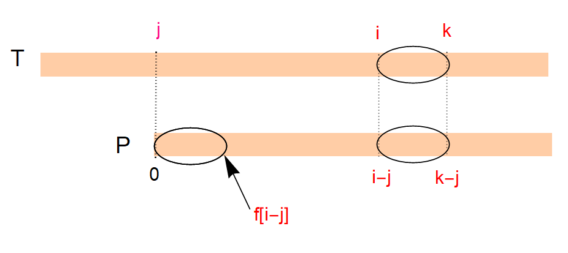

# 字符串

## Manacher算法
Manacher算法可以在$O(n)$的时间复杂度内求出以第i个字符为中心的最长回文子串的长度。

模板（来自kuangbin）

```cpp
int manacher(string &s) {
    int n = s.length(), m = n * 2 + 2;
    string t(m, '#');
    for (int i = 0; i < n; i++)
        t[i * 2 + 2] = s[i];
    t[0] = '$';
    vector<int> p(m);
    int mx = 0, id = 0;
    for (int i = 0; i < m; i++) {
        p[i] = mx > i ? min(p[2 * id - i], mx - i) : 1;
        while (t[i + p[i]] == t[i - p[i]]) p[i]++;
        if (i + p[i] > mx) mx = i + p[i], id = i;
    }
    return *max_element(p.begin(), p.end()) - 1;
}
```

测试题目：[P3805 【模板】manacher算法](https://www.luogu.com.cn/problem/P3805)

添加冗余字符的方法，在每个字符后添加一个`#`，最后在前面添加`$#`，总长度变为2n+2，n为原始字符串长度。
p[i]表示以i为中心的最长回文子串的半径（包括自身）。

例如：`abba`变成`$#a#b#b#a#`，最后p数组的值为`[1, 1, 2, 1, 2, 5, 2, 1, 2, 1]`，最长回文串的长度是p中最大值减一。

## 扩展KMP算法
有时候我们不仅仅想精确地找模式串$P$。  
比如对于文本串 `ABCDFGAB`，模式串`ABCDE`，我们发现虽然$P$不存在，但它的前缀`ABCD`、`AB`出现了。  
确切地说，我们想知道对于每一个$i$，$T_{i..n}$与$P$的最长公共前缀是多少。  

模板：  

```cpp
#include <bits/stdc++.h>
using namespace std;
const int N=1e5+5;
char T[N],P[N];
int f[N],g[N];
int main(){
    while(~scanf(" %s %s",T,P)){
        int n=strlen(T),m=strlen(P);
        f[0]=0;
        int j=0,k=0;
        for(int i=1;i<m;i++){
            if(k<i)k=i;
            if(k<=i+f[i-j]){
                while(k<m&&P[k]==P[k-i])k++;
                f[i]=k-i;
                j=i;
            }else{
                f[i]=f[i-j];
            }
        }
        j=0,k=0;
        for(int i=0;i<n;i++){
            if(k<i)k=i;
            if(k<=i+f[i-j]){
                while(k<n&&k-i<m&&T[k]==P[k-i])k++;
                g[i]=k-i;
                j=i;
            }else{
                g[i]=g[i-j];
            }
        }
        printf("next: ");
        for(int i=0;i<m;i++){
            printf("%d%c",f[i]," \n"[i==m-1]);
        }
        printf("extend: ");
        for(int i=0;i<n;i++){
            printf("%d%c",g[i]," \n"[i==n-1]);
        }
    }
    return 0;
}
```  

比较难理解，记录分析一下。  
$T$表示文本串，$P$表示模式串，$f$表示$next$数组，但它的含义与KMP算法中的$next$不同。  
$next[i]$的含义是，$P$与$P[i..n]$的最大前缀长度。  
$g$表示$extend$数组，$extend[i]$表示$T[i..n]$与$P$的最大前缀长度。  

模板代码中$i$表示当前正在匹配的位置，$k$表示$T$串中匹配到的最右端，即$max\{j+g[j]\}$。  
下面图是关键。  




## 字典树

[Luogu P2580](https://www.luogu.com.cn/problem/P2580)

```cpp
#include <bits/stdc++.h>
using namespace std;
int main() {
    const int ALPHA = 26;
    // Trie树，初始有一个根节点，孩子均指向-1
    vector<vector<int>> G(1, vector<int>(ALPHA, -1));
    vector<int> cnt(1);
    int n; cin >> n;
    while (n--) {
        string s; cin >> s;
        int u = 0; // 往trie里插入字符串
        for (auto c : s) {
            int i = c - 'a';
            if (G[u][i] == -1) { // 新建Trie节点
                G[u][i] = G.size();
                G.emplace_back(ALPHA, -1);
                cnt.push_back(0);
            }
            u = G[u][i];
        }
        cnt[u]++; // 标记单词末尾
    }
    cin >> n;
    auto check = [&](string &s) {
        int u = 0; // 在Trie树上查找
        for (auto c : s) {
            int i = c - 'a';
            if (G[u][i] == -1) return "WRONG";
            else u = G[u][i];
        }
        if (cnt[u] == 1) {
            cnt[u]++;
            return "OK";
        } else if (cnt[u] > 1) return "REPEAT";
        else return "WRONG";
    };
    while (n--) {
        string s; cin >> s;
        cout << check(s) << '\n';
    }
    return 0;
}
```