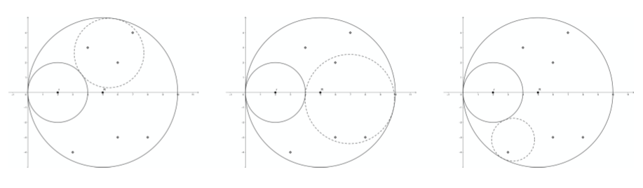
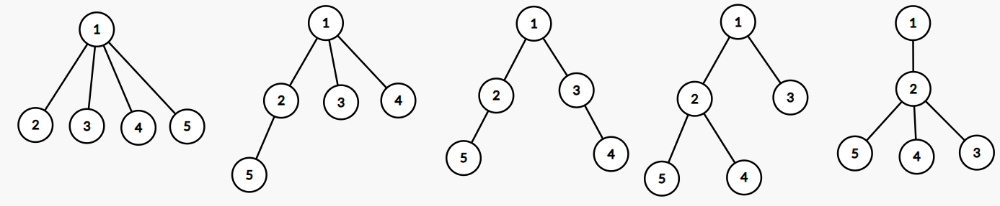

# 20191117ICPC沈阳
榜单：[Scoreboard - DOMjudge.html](_v_attachments/20201103103348838_9320/Scoreboard%20-%20DOMjudge.html)
牛客重现（缺少DFM题）：[2020牛客国庆集训派对day3](https://ac.nowcoder.com/acm/contest/7830)
参考题解：[2019-ICPC沈阳（部分题解）](https://www.yinxiang.com/everhub/note/75d94e76-c158-417e-8cd2-0de4b168a4d7)
知乎：[如何评价2019年ACM/ICPC沈阳区域赛现场赛？](https://www.zhihu.com/question/355837417)

## [A - Leftbest](https://ac.nowcoder.com/acm/contest/7830/A)
### 题意
给一列数表示假值，真值为前面的假值中比他大的最小的那个，求所有的真值和。

### 分析
用set模拟即可。注意lower_bound/upper_bound要用成员函数。

### 代码
[提交记录](https://ac.nowcoder.com/acm/contest/view-submission?submissionId=45138914)

```cpp
#include <bits/stdc++.h>
using namespace std;
int main() {
    ios::sync_with_stdio(false);cin.tie(0);
    int n;
    cin >> n;
    set<int> st;
    long long ans = 0;
    for (int i = 0; i < n; i++) {
        int x;
        cin >> x;
        auto p = st.upper_bound(x);
        if (p != st.end()) ans += (*p);
        st.insert(x);
    }
    cout << ans << '\n';
    return 0;
}

```

## [B - First Date](https://ac.nowcoder.com/acm/contest/7830/B)
### 题意
给一个图，图中的边有一个x和y值，实际边权为x+ay，其中a为均匀分布在0~1的随机小数。求从S到T的期望最小距离。

### 分析
求最短路径可以用[Dijkstra算法](../算法/Dijkstra算法.md)。考虑怎么求期望。

注意到只有200个点，400条边，以及精度要求1e-4，dijkstra一次复杂度n^2=4e4，可以考虑随机1e4次。（其实大概1500次就可以了）

注意：此题的均匀随机数不能使用rand或者uniform_real_distribution，一定要在范围内**均匀撒点**。

### 代码
[提交记录](https://ac.nowcoder.com/acm/contest/view-submission?submissionId=45150072)

```cpp
#include <bits/stdc++.h>
using namespace std;
int main() {
    int n, m, s, t;
    cin >> n >> m >> s >> t;
    s--, t--;
    vector<vector<tuple<int, int, int>>> G(n);
    while (m--) {
        int u, v, x, y;
        cin >> u >> v >> x >> y;
        u--, v--;
        G[u].emplace_back(v, x, y);
        G[v].emplace_back(u, x, y);
    }
    double ans = 0;
    const int epochs = 1500;
    for (int ep = 0; ep <= epochs; ep++) {
        double a = double(ep) / epochs;
        vector<double> dis(n, 1e18);
        priority_queue<pair<double, int>> Q;
        dis[s] = 0;
        Q.emplace(0, s);
        while (!Q.empty()) {
            int u = Q.top().second;
            double d = -Q.top().first;
            Q.pop();
            if (u == t) break;
            if (d != dis[u]) continue;
            for (auto &e : G[u]) {
                int v = get<0>(e), x = get<1>(e), y = get<2>(e);
                double w = x + a * y;
                if (d + w < dis[v]) {
                    dis[v] = d + w;
                    Q.emplace(-(d + w), v);
                }
            }
        }
        ans += dis[t];
    }
    cout << ans / (epochs + 1) << '\n';
    return 0;
}
```

## [C - Sequence](https://ac.nowcoder.com/acm/contest/7830/C)


## D - Quickpow
### 题意
给定序列a，定义$b_i=\frac{e^{a_i}}{\sum\limits_{j=1}^{n} e^{a_j}}$
保证a极差不超过10，求b

### 分析
上下约去$e^{a_{min}}$，直接带入e=2.718281828即可。

### 代码
**代码未测试**

```cpp
#include <bits/stdc++.h>
using namespace std;
typedef long double DB;
const DB e = 2.718281828;
long double E[11];
int main() {
    ios::sync_with_stdio(false), cin.tie(0);
    E[0] = 1;
    for (int i = 1; i <= 10; i++) E[i] = E[i-1] * e;
    int n;
    cin >> n;
    vector<int> a(n);
    for (int i = 0; i < n; i++) cin >> a[i];
    int amin = *min_element(a.begin(), a.end());
    DB q = 0;
    for (int i = 0; i < n; i++) q += E[a[i] - amin];
    for (int i = 0; i < n; i++) {
        DB p = E[a[i] - amin];
        cout << p / q << ' ';
    }
    cout << '\n';
    return 0;
}
```

## [E - Capture Stars](https://ac.nowcoder.com/acm/contest/7830/D)
### 题意

固定一个大圆R和小圆r，虚线圆在两圆之间转动，给出n个点的坐标。问最多有多少个点在虚线圆内。

### 分析
参考题解：[【计算几何】【圆反演】2019 ICPC区域赛沈阳站E.Capture Stars](https://www.luogu.com.cn/blog/AEMShana/post-ji-suan-ji-he-yuan-fan-yan-2019-icpc-ou-yu-sai-chen-yang-zhan-post)

圆的[反演](../算法/反演.md)。

类似题目：hdu 6158 The Designer

> 将整个图形以两个大圆的切点为反演中心，任意长为半径反演，那么两个大圆就变成了两条平行直线，小圆就变成了若干个大小相等的、与两条直线相切、相邻两个相切的圆。把图划出来之后就可以利用反演的比例关系很简单地计算出小圆的半径，进而计算出面积了。


### 代码


## F - Crossroads

## [G - Triangulation](https://ac.nowcoder.com/acm/contest/7830/E)

## [H - Points](https://ac.nowcoder.com/acm/contest/7830/F)
### 题意
统计度数为1的点的个数。

### 代码

[提交记录](https://ac.nowcoder.com/acm/contest/view-submission?submissionId=45138553)

```cpp
#include<bits/stdc++.h>

using namespace std;
const int maxn = 20000000;
int d[maxn];
int main()
{
    int n;
    cin >> n;
    for(int i = 1;i <= n-1;i++){
        int x,y;
        cin >> x >>y;
        d[x]++;
        d[y]++;
    }
    int ans = 0;
    for(int i = 1;i <= n;i++){
        if(d[i] == 1){
            ans++;
        }
    }
    cout << ans << endl;

    return 0;
}

```

## [I - Parallel Network Analysis](https://ac.nowcoder.com/acm/contest/7830/G)

## [J - Graph](https://ac.nowcoder.com/acm/contest/7830/H)

## [K - Rooted Tree](https://ac.nowcoder.com/acm/contest/7830/I)
### 题意
统计有n个节点，深度不超过2的不同构的有根树的个数。

例如当n=5时有以下5种。





### 分析

除去根节点外还有4个节点，上面的情况列举如下：
4=1+1+1+1
4=2+1+1
4=2+2
4=3+1
4=4

会发现这是一个整数划分问题！

题目转换为将n划分成若干正整数之和的划分数。

参考：[划分数问题](https://blog.nowcoder.net/n/3437cfbaaf62412985ff7241d0da985e)

例题：[Partition](http://acm.hdu.edu.cn/showproblem.php?pid=4651)

注意此题的范围的Partition的5倍，而时间只有1/3

可以使用各种骚操作优化卡过去。

### 代码【超时】

kuangbin模板42页有代码，本机实测需要2.59s

```cpp
#include <bits/stdc++.h>
using namespace std;
const int M = 998244353;
const int N = 5e5 + 5;
int f[N];
int main() {
    auto st = clock();
    f[0] = 1;
    for (int i = 1; i < N; i++) {
        for (int j = 1, r = 1; i-(3*j*j-j)/2 >= 0; j++, r*=-1) {
            f[i] += f[i-(3*j*j-j)/2]*r;
            f[i] = (f[i] % M + M) % M;
            if (i - (3*j*j+j)/2 >= 0) {
                f[i] += f[i-(3*j*j+j)/2] * r;
                f[i] = (f[i] % M + M) % M;
            }
        }
    }
    int n = 5;
    // cin >> n;
    cout << f[n-1] << '\n';
    fprintf(stderr, "Time: %.2f\n", double(clock() - st) / CLK_TCK);
}
```

### 代码【常数优化】
一个最显著的优化是：利用long long的范围，把mod**移到外层循环**。
此优化过后可以AC。

```cpp
#include <bits/stdc++.h>
using namespace std;
const int M = 998244353;
const int N = 5e5 + 5;
long long f[N];
int main() {
    f[0] = 1;
    for (int i = 1; i < N; i++) {
        for (int j = 1, r = 1; i-(3*j*j-j)/2 >= 0; j++, r*=-1) {
            f[i] += f[i-(3*j*j-j)/2]*r;
            if (i - (3*j*j+j)/2 >= 0) {
                f[i] += f[i-(3*j*j+j)/2] * r;
            }
        }
        f[i] %= M;
        if (f[i] < 0) f[i] += M;
    }
    int n = 5;
    cin >> n;
    cout << f[n-1] << '\n';
}
```


## [L - Flowers](https://ac.nowcoder.com/acm/contest/7830/J)
### 题意
有N种花，每种$a_i$支，已知M支不同种花可以组成一束，请问最多能组多少束？

### 分析
显然答案具有单调性，考虑二分答案。
假设最多能组成x束花。考虑第i种花有$a_i$支。如果$a_i \ge x$，那么超出x的部分是没有用的，因为只有不同种花才可以组成一束。$a_i\lt x$的花不会引起冲突。最后只要判断总支数是否满足Mx。

### 代码
[提交记录](https://ac.nowcoder.com/acm/contest/view-submission?submissionId=45140308)

```cpp
#include <bits/stdc++.h>
using namespace std;
typedef long long ll;
const int N = 3e5 + 5;
int n, m, a[N];
bool check(ll x) {
     ll sum = 0;
     for (int i = 1; i <= n; i++) {
        sum += min(x, (ll)a[i]);
     }
     return sum >= x * m;
}
int main() {
    ios::sync_with_stdio(false);cin.tie(0);
    int T;
    cin >> T;
    while (T--) {
        cin >> n >> m;
        ll sum = 0;
        for (int i = 1; i <= n; i++) {
            cin >> a[i];
            sum += a[i];
        }
        ll l = 0, r = 2e14, ans = 0;
        while (l <= r) {
            ll m = (l + r) / 2;
            if (check(m)) l = m + 1, ans = m;
            else r = m - 1;
        }
        cout << ans << '\n';
    }
    return 0;
}

```

## M - Interesting Strings
### 题意
给定一个串S，求其中三个不相交的回文子串的长度和最大值。
例如：`saicpcilicpcqici`的三个回文子串是`cpcilicpc`、`q`、`ici`，答案为13

### 分析

[CF932G](https://codeforces.com/contest/932/problem/G)
