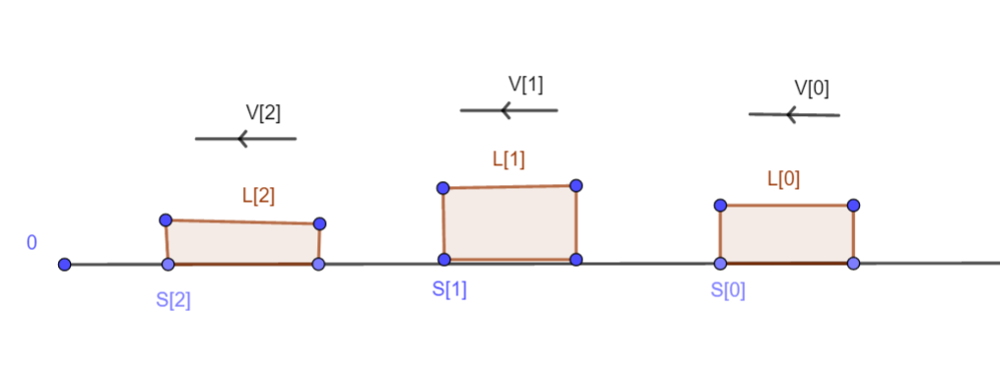

# 杭电多校第一场
[HDU题目](http://acm.hdu.edu.cn/search.php?field=problem&key=2019+Multi-University+Training+Contest+1&source=1&searchmode=source)
[Vjudge比赛](https://vjudge.net/contest/313417)
[PDF题解](2019杭电多校第一场题解.pdf)

## A
[题目](http://acm.hdu.edu.cn/showproblem.php?pid=6578)

## B
[题目](http://acm.hdu.edu.cn/showproblem.php?pid=6579)

## C
[题目](http://acm.hdu.edu.cn/showproblem.php?pid=6580)

## D
[题目](http://acm.hdu.edu.cn/showproblem.php?pid=6581)

### 题意
有$n+1$辆(编号由远到近从零开始)长度为$l_i$，位置为$s_i$，最大速度为$v_i$(负方向)的车在数轴上，从$t=0$时刻同时开动，不能超车，问0号车车头通过零点的时刻？

  

### 分析
显然答案具有单调性，可以二分时间。对于一个确定的时间$t$，从前往后依次考虑每一辆车的位置，注意后面的车的位置不能超过前面的车的位置，最后判断0号车是否通过即可。

## E
[题目](http://acm.hdu.edu.cn/showproblem.php?pid=6582)

## F
[题目](http://acm.hdu.edu.cn/showproblem.php?pid=6583)

## G
[题目](http://acm.hdu.edu.cn/showproblem.php?pid=6584)

## H
[题目](http://acm.hdu.edu.cn/showproblem.php?pid=6585)

## I
[题目](http://acm.hdu.edu.cn/showproblem.php?pid=6586)

## J
[题目](http://acm.hdu.edu.cn/showproblem.php?pid=6587)

## K
[题目](http://acm.hdu.edu.cn/showproblem.php?pid=6588)

## L
[题目](http://acm.hdu.edu.cn/showproblem.php?pid=6589)

## M
[题目](http://acm.hdu.edu.cn/showproblem.php?pid=6590)
