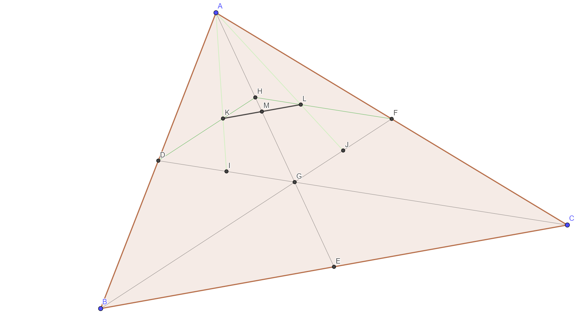

# 牛客多校第一场
[题目](https://ac.nowcoder.com/acm/contest/881#question)
[PDF题解](2019牛客多校第一场题解.pdf)
[讲解视频](https://www.nowcoder.com/study/live/247)
[多校题解汇总帖](https://www.nowcoder.com/discuss/208642)

数学题比较多，而我数学又比较菜，结果就是自闭了一下午。  
/(ㄒoㄒ)/~~  


## A
[题目](https://ac.nowcoder.com/acm/contest/881/A)

### 题意
若两个数组任意区间的最小值的位置相同，则称这两个数组等价。给定两个数组，求等价的前缀数组最大长度。
> 5
> 3 1 5 2 4
> 5 2 4 3 1

> 4

### 分析
显然答案具有单调性，可以二分答案。【1，n】  
接下来考虑如何判断两个数组是否等价。利用ST算法预处理得到任意区间的最小值下标，若两个数组最小值下标不相同，则一定不等价；若相同，则包含该下标的所有区间的最小值下标均相同，因此以此下标为界分割区间递归判断。
### 代码
```cpp
#include <bits/stdc++.h>
using namespace std;
 
const int N=1e5+10,inf=0x3f3f3f3f;
 
int n;
int a[N],b[N],ma[N][25],mb[N][25];
 
void prec(int f[][25],int x[]){
    for(int i=1;i<=n;i++){
        f[i][0]=i;
    }
    for(int j=1;j<25;j++){
        for(int i=1;(i+(1<<j)-1)<=n;i++){
            if(x[f[i][j-1]]<x[f[i+(1<<(j-1))][j-1]]){
                f[i][j]=f[i][j-1];
            }else{
                f[i][j]=f[i+(1<<(j-1))][j-1];
            }
        }
    }
}
 
int query(int f[][25],int x[],int l,int r){
    int k=int(log2(r-l+1));
    if(x[f[l][k]]<x[f[r-(1<<k)+1][k]])
        return f[l][k];
    else
        return f[r-(1<<k)+1][k];
}
 
bool exam(int l,int r){
    if(l>=r)return true;
    int mina=query(ma,a,l,r);
    int minb=query(mb,b,l,r);
    if(mina==minb){
        return exam(l,mina-1)&&exam(mina+1,r);
    }else{
        return false;
    }
}
 
bool check(int ans){
    return exam(1,ans);
}
 
int main(){
    //cout<<log2(4)<<endl;
    while(~scanf("%d",&n)){
        for(int i=1;i<=n;++i)scanf("%d",&a[i]);
        for(int i=1;i<=n;++i)scanf("%d",&b[i]);
        prec(ma,a);
        prec(mb,b);
        int left=1,right=n,ans;
        while(left<=right){
            int mid=(left+right)>>1;
            //printf("left=%d,right=%d\n",left,right);
            //printf("check(%d)=%d\n",mid,check(mid));
            if(check(mid)){
                ans=mid;
                left=mid+1;
            }else{
                right=mid-1;
            }
        }
        printf("%d\n",ans);
    }
}
```
## B
[题目](https://ac.nowcoder.com/acm/contest/881/B)

### 题意
给定$\{a_n\}$，求  

$$
\frac{1}{\pi}\int_{0}^{\infty}\frac{dx}{\prod\limits_{i=1}^n (a_i^2+x^2)}
$$
### 分析

参考[午夜阳光_xy的题解](https://blog.nowcoder.net/n/01372c5f542b4169a39b9fd48c7427cb)  

显然要进行裂项，假设：

$$
\frac{1}{\prod\limits_{i=1}^n (a_i^2+x^2)}=\sum_{i=1}^n \frac{c_i}{a_i^2+x^2}
$$

右端通分可得：

$$
\sum_{i=1}^n c_i \prod_{j\neq i}(a_j^2+x^2)=1
$$

代入n=2，n=3，找规律，再加上一点想象力，推测：

$$
c_i=\frac{1}{\prod\limits_{j\neq i}(a_j^2-a_i^2)}
$$

将上式代入积分，可得：

$$
ans=\sum_{i=1}^n \frac{1}{2a_i \prod\limits_{j\neq i}(a_j^2-a_i^2)}
$$
其他注意点：
1. 取模需要求逆元（可用费马小定理）
2. 注意不要出现负数取模

### 代码
```cpp
#include <bits/stdc++.h>
using namespace std;
typedef long long ll;
const ll mod=1e9+7;
const int N=1e3+5;
ll n,a[N];
ll qpow(ll x,ll y){
    ll ans=1;
    while(y){
        if(y&1)
            ans=(ans*x)%mod;
        x=x*x%mod;
        y>>=1;
    }
    return ans;
}
ll inv(ll a){
    return qpow(a,mod-2);
}
int main(){
    while(~scanf("%lld",&n)){
        ll ans=0;
        for(int i=1;i<=n;i++){
            scanf("%lld",&a[i]);
        }
        for(int i=1;i<=n;i++){
            ll temp=2*a[i];
            for(int j=1;j<=n;j++){
                if(j==i)continue;
                temp=(temp*(a[j]*a[j]%mod-a[i]*a[i]%mod+mod))%mod;
            }
            ans=(ans+inv(temp))%mod;
        }
        printf("%lld\n",(ans+mod)%mod);
    }
    return 0;
}
```


## C
[题目](https://ac.nowcoder.com/acm/contest/881/C)

## D
[题目](https://ac.nowcoder.com/acm/contest/881/D)


## E
[题目](https://ac.nowcoder.com/acm/contest/881/E)

## F
[题目](https://ac.nowcoder.com/acm/contest/881/F)

### 题意
P为三角形ABC内一点，求$max\{S_{PAB},S_{PBC},S_{PAC}\}$的期望。  
### 分析
参考[2019牛客多校第一场F – Random Point in Triangle](http://www.cfzhao.com/2019/07/19/2019牛客多校第一场f-random-point-in-triangle/)
  
如图，D、E、F、H、I、J、M分别为边AB、BC、AC、AG、DG、GF、KL中点，G、K、L分别为三角形ABC、ADG、AFG重心，M为四边形ADGF重心。  
当P落在区域ADGF内时，三角形PBC面积最大，此时三角形面积的期望为三角形MBC的面积。  


由重心是三等分点的比例关系可知$S_{MBC}=\frac{11}{18}S_{ABC}$。  
根据面积公式$S_{ABC}=\frac12(\vec{AB}\times\vec{AC})$得：  


$$
ans=11[(x_3-x_1)(y_2-y_1)-(x_2-x_1)(y_3-y_1)]
$$

注意整型溢出！   

### 代码
```cpp
#include <bits/stdc++.h>
using namespace std;
int main(){
    int x1,x2,x3,y1,y2,y3;
    while(cin>>x1>>y1>>x2>>y2>>x3>>y3){
        cout<<11*abs(1ll*(x3-x1)*(y2-y1)-1ll*(x2-x1)*(y3-y1))<<endl;
    }
    return 0;
}
```

## G
[题目](https://ac.nowcoder.com/acm/contest/881/G)

## H
[题目](https://ac.nowcoder.com/acm/contest/881/H)

## I
[题目](https://ac.nowcoder.com/acm/contest/881/I)

## J
[题目](https://ac.nowcoder.com/acm/contest/881/J)

### 题意
比较x/a与y/b。
### 分析
考虑到数据范围，有如下几种做法：
1. 转换为乘法，使用Python自带高精度
2. 转换为乘法，使用GCC内置的`__int128`
3. 先比较商，再对分子求余，再转换成乘法比较
### 代码
Python自带高精度
```py
try:
    while True:
        x,a,y,b=map(int,input().split())
        res=b*x-a*y
        if(res==0):
            print('=')
        elif(res>0):
            print('>')
        else:
            print('<')
except:
    pass
```
GCC `__int128`
```cpp
#include <bits/stdc++.h>
using namespace std;
int main(){
	long long x,a,y,b;
	while(cin>>x>>a>>y>>b){
		__int128 res=(__int128)b*x-(__int128)a*y;
		if(res==0)putchar('=');
		else if(res<0)putchar('<');
		else putchar('>');
		putchar('\n');
	}
	return 0;
}
```
先比较商
```cpp
#include <bits/stdc++.h>
using namespace std;
int main(){
    long long x,a,y,b,p,q;
    while(cin>>x>>a>>y>>b){
    	p=x/a,q=y/b;
        if(p==q){
        	x%=a,y%=b;
            if(x*b==y*a)puts("=");
            else if(x*b<y*a)puts("<");
            else puts(">");
        }else if(p<q)puts("<");
        else puts(">");
    }
}
```

