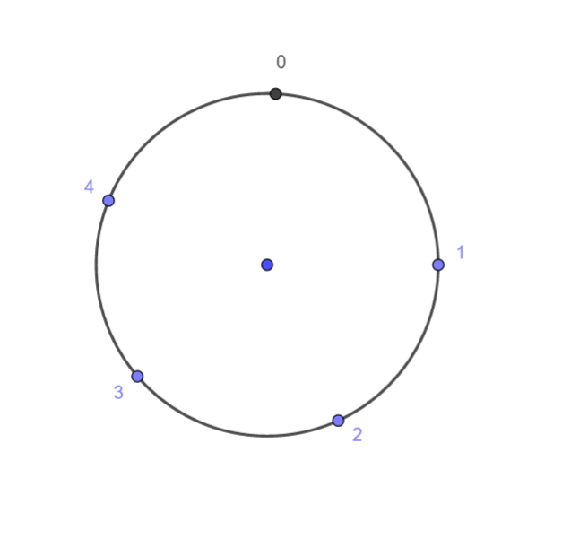
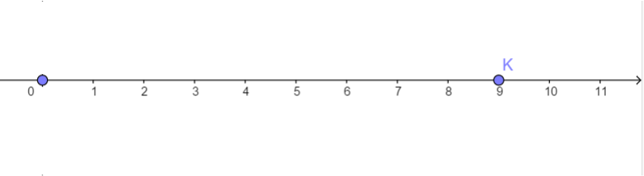
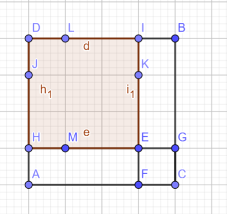
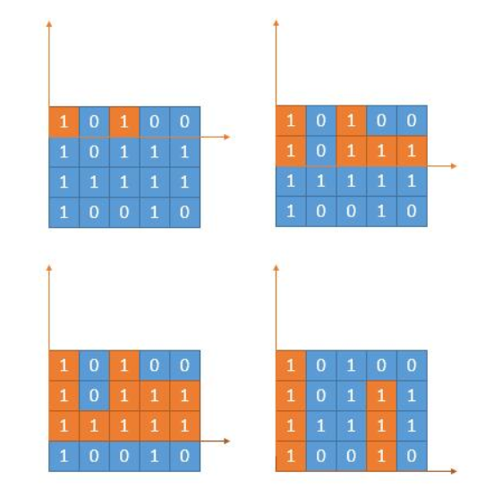
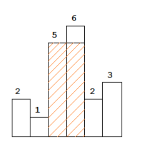

# 牛客多校第二场
[题目](https://ac.nowcoder.com/acm/contest/882#question)
[PDF题解](2019牛客多校第二场题解.pdf)
[讲解视频](https://www.nowcoder.com/study/live/247)
[多校题解汇总帖](https://www.nowcoder.com/discuss/208642)


## A
[题目](https://ac.nowcoder.com/acm/contest/882/A)

### 题意
  
n个点形成一个环，初始时在0，每次随机顺时针或逆时针走一步，一旦你走到一个点后，环上所有点都被经过至少一次后，你就必须停下来。 求最后停在m点的概率。
### 分析
猜想对于每个n，m会存在一个数学公式计算出概率。可以写个小程序模拟验证一下。  
C++打表代码可以参考[这里](https://blog.nowcoder.net/n/e73e0ca1240342e1a73f52c89bf37e7c)或[这里](https://blog.nowcoder.net/n/684fb7782ca84e8588c7af34a151a03b)。  


```py
from random import *
n,m=5,0
times=1000000

cnt=0
for _ in range(times):
	pos=0
	vis=[0]*n
	vis[0]=1
	while True:
		pos=(pos+choice([-1,1])+n)%n
		vis[pos]=1
		if vis==[1]*n:
			break
	if pos==m:
		cnt+=1
print(cnt/times)

```
先不断改变m的值观察结果。  
对于n=5时：  

|  m  |   ans    |
| :-: | :------: |
|  0  |    0     |
|  1  | 0.250662 |
|  2  | 0.249963 |
|  3  | 0.249787 |
|  4  | 0.249218 |

容易发现对于所有m答案均相差无几，观察答案接近$\frac 1 4$。猜想$ans=\frac 1 {n-1}$
再多试几对n，m可以验证答案。同时注意到m=0和n=1时为特殊情况。容易想到m=0时ans=0，因为一开始就到达了0点。当n=1时显然答案为1。  

显然存在一个美妙的想法证明这个结论，但是这里空间太小，写不下。  
参考[2019多校练习赛第二场补题 ](https://blog.nowcoder.net/n/95f1fe2b38aa4befaba3750128a12786)  


> **Precisely, you are going to compute the probability that first i scenarios will happen sequentially for each i.**  

这句很坑的话告诉你答案要输出前缀积！  

### 代码

```cpp
#include <bits/stdc++.h>
using namespace std;
typedef long long ll;
const int M=1e9+7;
int qpow(int x,int y){
	int ans=1;
	while(y){
		if(y&1)ans=(1ll*ans*x)%M;
		x=(1ll*x*x)%M;
		y>>=1;
	}
	return ans;
}
int inv(int x){
	return qpow(x,M-2);
}
int main(){
	int T;
	scanf("%d",&T);
	int ans=1;
	while(T--){
		int n,m;
		scanf("%d%d",&n,&m);
		if(n==1)ans*=1;
		else if(m==0)ans*=0;
		else ans=(1ll*ans*inv(n-1))%M;
		printf("%d\n",ans);
	}
	return 0;
}

```


## B
[题目](https://ac.nowcoder.com/acm/contest/882/B)

### 题意
  
一开始在0点处，开始走，步长为1、2、、K，等可能，即走一步后到达1、2、、K的概率均为$\frac 1 K$。问停在N处的概率。N=-1表示停在无穷远处。  

### 分析
设想已经走了K步，期望走过的距离为$1+2+...+K=\frac{K(1+K)}{2}$。  

可以想象在无穷远处，停在每一步的概率是相等的，概率均为：

$$
\frac{K}{\frac{K(1+K)}{2}}=\frac{2}{K+1}
$$

设停在$i$处的概率为$f[i]$，可得转移方程式：

$$
f[i]=\left\{
\begin{array}{}
\frac{\sum\limits_{j=1}^K f[i-j]}{K} \\
0 & i\lt 0\\
\frac{2}{K+1} & i \rightarrow \infty
\end{array}
\right.
$$
由于$f[i]$仅与前$K$项有关，容易想到**矩阵快速幂**加速递推。  
大概这样？  

$$
\begin{eqnarray}
\left(
  \begin{array}{c}
    \frac{1}{K} & \frac{1}{K} & \frac{1}{K} & \ldots & \frac{1}{K} & \frac{1}{K} \\
    1 & 0 & 0 & \ldots & 0 & 0\\
    0 & 1 & 0 & \ldots & 0 & 0\\
    0 & 0 & 1 & \ldots & 0 & 0 \\
    \vdots & \vdots & \vdots & \ddots & \vdots & \vdots \\
    0 & 0 & 0 & \ldots & 1 & 0
  \end{array}
\right)
\cdot
\left(
  \begin{array}{c}
    f[n-1] \\ f[n-2] \\ f[n-3] \\ f[n-4] \\ \vdots \\ f[n-k]
  \end{array}
\right)
=
\left(
  \begin{array}{c}
    f[n]  \\ f[n-1] \\ f[n-2] \\ f[n-3] \\ \vdots \\ f[n-k+1]
  \end{array}
\right)
\end{eqnarray}
$$


然而$K\le 1021$，需要构造一个$K\times K$的矩阵，复杂度$O(K^3\lg N)$仍然会超时。  

参考[这里](https://zerol.me/2018/02/06/linearly-recurrent-sequence/)  

构造前2k项，代入BM线性递推模板即可。复杂度$O(K^2 \lg N)$。  
模板可以参考[这里](https://blog.nowcoder.net/n/684fb7782ca84e8588c7af34a151a03b)。  

### 代码

```py
#include <bits/stdc++.h>
using namespace std;
typedef vector<int> vint;
typedef long long ll;
const ll mod=1e9+7;
const int N=10010;
ll n,k,res[N],base[N],_c[N],_md[N];
vint Md;
ll qpow(ll a,ll b){
    ll res=1;
    a%=mod;
    while(b){
        if(b&1)res=res*a%mod;
        a=a*a%mod;
        b>>=1;
    }
    return res;
}
void mul(ll *a,ll *b,int k){
    for(int i=0;i<k+k;i++)_c[i]=0;
    for(int i=0;i<k;i++)if(a[i])
        for(int j=0;j<k;j++)_c[i+j]=(_c[i+j]+a[i]*b[j])%mod;
    for (int i=k+k-1;i>=k;i--)if(_c[i])
        for(int j=0;j<Md.size();j++)
            _c[i-k+Md[j]]=(_c[i-k+Md[j]]-_c[i]*_md[Md[j]])%mod;
    for(int i=0;i<k;i++)a[i]=_c[i];
}
int solve(ll n,vint a,vint b){
    ll ans=0,pnt=0;
    int k=a.size();
    for(int i=0;i<k;i++)_md[k-1-i]=-a[i];_md[k]=1;
    Md.clear();
    for(int i=0;i<k;i++)if(_md[i]!=0)Md.push_back(i);
    for(int i=0;i<k;i++)res[i]=base[i]=0;
    res[0]=1;
    while((1ll<<pnt)<=n)pnt++;
    for (int p=pnt;p>=0;p--){
        mul(res,res,k);
        if((n>>p)&1){
            for (int i=k-1;i>=0;i--) res[i+1]=res[i];res[0]=0;
            for(int j=0;j<Md.size();j++)res[Md[j]]=(res[Md[j]]-res[k]*_md[Md[j]])%mod;
        }
    }
    for(int i=0;i<k;i++)ans=(ans+res[i]*b[i])%mod;
    if(ans<0) ans+=mod;
    return ans;
}
vint BM(vint s){
    vint C(1,1),B(1,1);
    int L=0,m=1,b=1;
    for(int n=0;n<s.size();n++){
        ll d=0;
        for(int i=0;i<L+1;i++)d=(d+(ll)C[i]*s[n-i])%mod;
        if(d==0) ++m;
        else if(2*L<=n){
            vint T=C;
            ll c=mod-d*qpow(b,mod-2)%mod;
            while (C.size()<B.size()+m) C.push_back(0);
            for(int i=0;i<B.size();i++)C[i+m]=(C[i+m]+c*B[i])%mod;
            L=n+1-L; B=T; b=d; m=1;
        }else{
            ll c=mod-d*qpow(b,mod-2)%mod;
            while (C.size()<B.size()+m) C.push_back(0);
            for(int i=0;i<B.size();i++)C[i+m]=(C[i+m]+c*B[i])%mod;
            ++m;
        }
    }
    return C;
}
int gao(ll n,vint a){
    vint c=BM(a);
    c.erase(c.begin());
    for(int i=0;i<c.size();i++)c[i]=(mod-c[i])%mod;
    return solve(n,c,vint(a.begin(),a.begin()+c.size()));
}
int main(){
    int T;
    scanf("%d",&T);
    while(T--){
        scanf("%lld%lld",&k,&n);
        vint t(2*k+1);
        t[0]=1;
        for(int i=1;i<=2*k;i++){
    		for(int j=1;j<=k;j++){
    			if(i>=j)t[i]=(t[i]+t[i-j])%mod;
    		}
    		t[i]=t[i]*qpow(k,mod-2)%mod;
        }
        if(n==-1)printf("%lld\n",2*qpow(k+1,mod-2)%mod);
        else printf("%lld\n",gao(n,t));
    }
}
```


## C
[题目](https://ac.nowcoder.com/acm/contest/882/C)

## D
[题目](https://ac.nowcoder.com/acm/contest/882/D)


## E
[题目](https://ac.nowcoder.com/acm/contest/882/E)

## F
[题目](https://ac.nowcoder.com/acm/contest/882/F)

### 题意
给$2n$个人，以及它们两两之间的$value$，求一种方法均分，使得$value$和最大。（同一部分$value$为零）  

### 分析
暴力枚举，每确定一个人即计算答案的增量，而不是所有人都确定了再两两枚举统计答案。  


### 代码
记住：边搜索边计算时，循环次数要尽可能小，否则会超时。  
```cpp
#include <bits/stdc++.h>
using namespace std;
typedef long long ll;
const int N=35;
int n,v[N][N],a[N],b[N],ta,tb;
ll now,ans;
void dfs(int x){
    if(x==2*n+1){
        if(now>ans)ans=now;
        return ;
    }
    if(ta<n){
        ll temp=0;
        for(int i=0;i<tb;i++)
            temp+=v[x][b[i]];
        now+=temp;
        a[ta++]=x;
        dfs(x+1);
        now-=temp;
        ta--;
    }
    if(tb<n){
        ll temp=0;
        for(int i=0;i<ta;i++)
            temp+=v[x][a[i]];
        now+=temp;
        b[tb++]=x;
        dfs(x+1);
        now-=temp;
        tb--;
    }
}
int main(){
    scanf("%d",&n);
    for(int i=1;i<=2*n;i++){
        for(int j=1;j<=2*n;j++){
            scanf("%d",&v[i][j]);
        }
    }
    dfs(1);
    printf("%lld\n",ans);
    return 0;
}
```

## G
[题目](https://ac.nowcoder.com/acm/contest/882/G)

## H
[题目](https://ac.nowcoder.com/acm/contest/882/H)

### 题意
给定一个N行M列的矩阵，元素为0或1，求**第二大**的全为1的子矩阵大小。

### 分析
先考虑一个简化的问题[求最大的全1正方形](https://leetcode.com/problems/maximal-square/)。  
  
设$f(i,j)$表示以坐标$(i,j)$为右下角的最大的全1正方形，显然$(i-1,j)$、$(i,j-1)$、$(i-1,j-1)$作为右下角也同时构成了一个较小的全1正方形。反之若$f(i,j)=1$，可得 $f(i,j)=min\{f(i-1,j),f(i,j-1),f(i-1,j-1)\}+1$。容易得到$O(nm)$的dp解法。  
进一步拓展，考虑[最大的全1矩形](https://leetcode.com/problems/maximal-rectangle/)。  
一种方法是考虑每一层的高度：  
  
转换为求直方图的最大矩形：  
  
此问题可以利用单调栈[求解](https://blog.csdn.net/Zolewit/article/details/88863970#commentBox)，复杂度$O(nm)$。  
接着考虑动态规划的方法。想象一个位于$(i,j)$的值为1的点，尽可能向上扩展，再往左右扩展，形成一个全1矩形。显然最大的全1矩形必定可以按照这种方法形成。  参考[Share my DP solution](https://leetcode.com/problems/maximal-rectangle/discuss/29054/Share-my-DP-solution)。  
若最大矩形面积为$a\times b$，则次大的矩形面积为$max\{(a-1)\times b,a\times (b-1)\}$。
注意要去除**重复**的矩形!

### 代码

```cpp
#include <bits/stdc++.h>
using namespace std;
const int N=1005;
char a[N][N];
int l[N],r[N],h[N];
struct mark{
	int s,i,l,r,h;
	mark(int s=0,int i=0,int l=0,int r=0,int h=0)
	:s(s),i(i),l(l),r(r),h(h){}
	bool operator==(mark it){
		return s==it.s&&i==it.i&&l==it.l&&r==it.r;
	}
}m1,m2;
void update(int ss,int ii,int jj){
	mark it(ss,ii,l[jj],r[jj],h[jj]);
	if(it.s>m1.s){
		m2=m1;
		m1=it;
	}else if(it.s>m2.s&&!(it==m1)){
		m2=it;
	}
}
int main(){
	int n,m;
	cin>>n>>m;
	for(int i=1;i<=n;i++){
		for(int j=1;j<=m;j++){
			cin>>a[i][j];
			// printf("a[%d][%d]=%c\n",i,j,a[i][j]);
		}
		getchar();
	}
	for(int j=1;j<=m;j++)r[j]=m;
	for(int i=1;i<=n;i++){
		int left=0;
		for(int j=1;j<=m;j++){
			if(a[i][j]=='1'){
				h[j]++;
				l[j]=max(l[j],left);
				// printf("[%d][%d](l,h)=(%d,%d)\n",i,j,l[j],h[j]);
			}else{
				h[j]=l[j]=0;
				left=j;
			}
		}
		int right=m;
		for(int j=m;j>=1;j--){
			if(a[i][j]=='1'){
				r[j]=min(r[j],right);
				// printf("(l,r,h)[%d][%d]=(%d,%d,%d) S(%d)\n",i,j,l[j],r[j],h[j],(r[j]-l[j])*h[j]);
				if(j==m||a[i][j+1]=='0'||r[j]!=r[j+1]||l[j]!=l[j+1]||h[j]!=h[j+1]){
					update((r[j]-l[j])*h[j],i,j);
					update((r[j]-l[j])*(h[j]-1),i,j);
					update((r[j]-l[j]-1)*h[j],i,j);
				}
				
			}else{
				right=j-1;
				r[j]=m;
			}
		}
	}
	cout<<m2.s<<endl;
	return 0;
}
```

## I
[题目](https://ac.nowcoder.com/acm/contest/882/I)

## J
[题目](https://ac.nowcoder.com/acm/contest/882/J)

