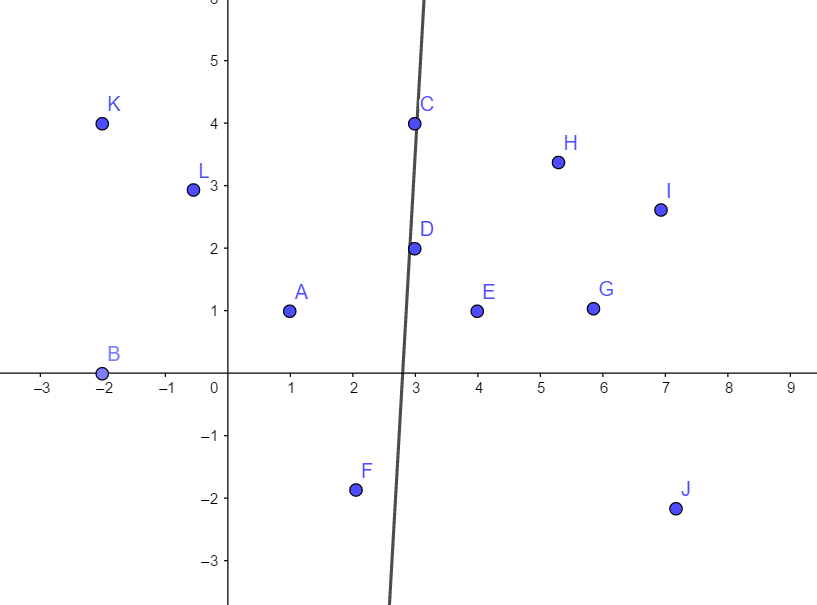

# 牛客多校第三场
[题目](https://ac.nowcoder.com/acm/contest/883#question)
[PDF题解](2019牛客多校第三场题解.pdf)
[讲解视频](https://www.nowcoder.com/study/live/247)
[多校题解汇总帖](https://www.nowcoder.com/discuss/208642)

## A
[题目](https://ac.nowcoder.com/acm/contest/883/A)

## B
[题目](https://ac.nowcoder.com/acm/contest/883/B)


## C
[题目](https://ac.nowcoder.com/acm/contest/883/C)

## D
[题目](https://ac.nowcoder.com/acm/contest/883/D)


## E
[题目](https://ac.nowcoder.com/acm/contest/883/E)

## F
[题目](https://ac.nowcoder.com/acm/contest/883/F)


## G
[题目](https://ac.nowcoder.com/acm/contest/883/G)

## H
[题目](https://ac.nowcoder.com/acm/contest/883/H)

### 题意
给出平面上$n$个点，坐标为整数，求一条线（不经过任何点）将点集划分成相等的两部分，输出这条线上的两个点的坐标（整数）。
### 分析
要确定一条直线，首先容易想到先确定一个点。但是这样会造成共线的情况很难处理。  
若所有点横坐标均不相同，容易想到在中间竖直画一条线，再考虑有横坐标相同的情况。  
这种情况呃，把中间的竖直线微微斜一些就好了。  
线仍然要画在中间。  



### 代码
```cpp
#include <bits/stdc++.h>
using namespace std;
const int N=1005;
const int k=-8e8;
int x[N],y[N];
struct point{
    int x,y;
    bool operator<(point o){
        if(x==o.x){
            return y<o.y;
        }else return x<o.x;
    }
}p[N];
int main(){
    int T;
    scanf("%d",&T);
    while(T--){
        int n;
        scanf("%d",&n);
        for(int i=0;i<n;i++){
            scanf("%d%d",&p[i].x,&p[i].y);
        }
        sort(p,p+n);
        int x=p[n/2].x,y=p[n/2].y;
        //printf("x=%d,y=%d\n",x,y);
        printf("%d %d %d %d\n",x-1,y-k,x+1,y+k-1);
    }
    return 0;
}
```
## I
[题目](https://ac.nowcoder.com/acm/contest/883/I)

## J
[题目](https://ac.nowcoder.com/acm/contest/883/J)

