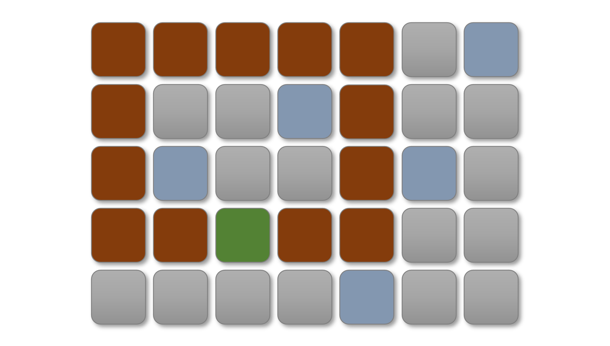
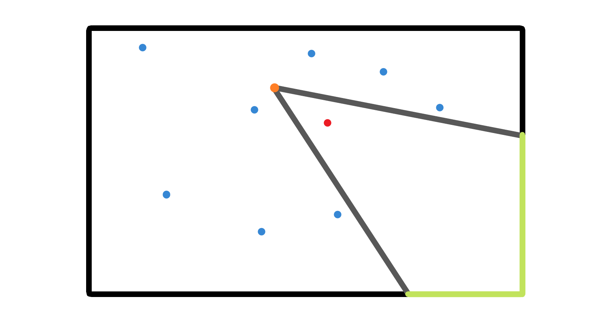

# CCPC2020-第六届中国大学生程序设计竞赛（秦皇岛）正式赛
[比赛链接](https://pintia.cn/problem-sets/1316552220767801344)  
[榜单链接](https://pintia.cn/problem-sets/1316552220767801344/rankings)  
获奖名单：[2020CCPC秦皇岛获奖名单.pdf](_v_attachments/20201018225557766_12847/2020CCPC秦皇岛获奖名单.pdf)

## [1 - A Greeting from Qinhuangdao](https://pintia.cn/problem-sets/1316552220767801344/problems/1317628186663440384)
Code Size Limit: 50 KB  
Time Limit: 2000 ms  
Memory Limit: 524288 KB  
Stack Size Limit: 131072 KB  


> A rainstorm sweeps down on this northern land,
> 
> White breakers leap to the sky.
> 
> No fishing boats off Chinwangtao
> 
> Are seen on the boundless ocean. 
> 
> Where are they gone? 
> 
> ---
> Peitaiho To the tune of Lang Tao Sha
> 
> Mao Zedong, Summer 1954


Welcome to the CCPC Qinhuangdao Site!

Qinhuangdao is a beautiful coastal city full of charm, integrating historical heritage and modern civilization. It was named after the Emperor QinShiHuang's east tour in 215 BC for seeking immortals.

The infiltration of more than 2000 years of history has left a rich cultural treasure here. Bo Yi, Shu Qi, Qi Jiguang, Cao Cao, and Mao Zedong, Many Heroes throughout the ages have endowed Qinhuangdao with the thousand-year cultural context, the unique and precious heritage, and the profound historical memory.


	
Pleasant natural scenery has shaped her beautiful appearance. Thousands of miles of Yan Mountains, the Great Wall, and the vast seas are miraculously met here. The blue sky, green land, blue sea, and golden sand gather together to welcome guests.

To toast your arrival, Alex prepared a simple problem to help you warm up.

Alex has $r$ red balls and $b$ blue balls. Then, Alex randomly chose two of these balls with equal probability. What is the probability that he chose two red balls?

Output the required probability in the form of irreducible fraction. 
	
### Input

The first line of input gives the number of test cases, $T (1 \le T \le 10)$. $T$ test cases follow.

For each test case, the only line contains two integers $r,b (1 \le r,b \le 100)$, where $r$ is the number of red balls and $b$ is the number of blue balls.

### Output

For each test case, output one line containing "$\texttt{Case #x: y}$", where $\texttt{x}$ is the test case number (starting from $1$), and $\texttt{y}$ is the answer in the form of irreducible fraction in format $\texttt{A/B}$.

If the required probability equals to zero, output $\texttt{0/1}$. If the required probability equals to $1$, output $\texttt{1/1}$.


### Sample Input

```in
3
1 1
2 1
8 8
```

### Sample Output

```out
Case #1: 0/1
Case #2: 1/3
Case #3: 7/30
```

### Accepted Code

```cpp
#include <bits/stdc++.h>
using namespace std;
int main() {
    int n;
    cin >> n;
    for (int i = 1; i <= n; i++) {
        int r, b;
        cin >> r >> b;
        int p = (r - 1) * r, q = (r + b - 1) * (r + b);
        cout << "Case #" << i << ": ";
        int t = __gcd(p, q);
        if (p == 0) cout << "0/1";
        else cout << p / t << '/' << q / t; 
        cout << "\n";
    }
    return 0;
}
```

## [2 - Bounding Wall](https://pintia.cn/problem-sets/1316552220767801344/problems/1317628186663440385)
Code Size Limit: 50 KB  
Time Limit: 3000 ms  
Memory Limit: 524288 KB  
Stack Size Limit: 131072 KB  


Alex is a professional computer game player.

These days, Alex is playing a war strategy game. His land is a rectangular grid with $n$ rows by $m$ columns of cells. He wants to build a bounding wall to protect some vital materials.

The bounding wall is a frame of $a \times b$ rectangle whose width is $1$. It occupies $a$ rows and $b$ columns, and its coverage area is $a\cdot b$. Note that $a=1$ or $b=1$ is also allowed. Each cell has a state, wet or dry. It is impossible to build a bounding wall across a wet cell.





He will also have several queries about building a bounding wall. The only two possible formats about queries are listed as follows.

- $\texttt{1 x y}$ : the state of cell $(x,y)$ changes. 

- $\texttt{2 x y}$ : Alex wants to build a bounding wall across the cell $(x,y)$ such that the coverage  area is as large as possible. Answer the maximum coverage area.

### Input

The first line of the input gives the number of test cases, $T (1 \le T \le 1000)$. $T$ test cases follow.

For each test case, the first line contains three integers $n,m$ and $Q (1 \le n,m,Q \le 10^3)$, representing his land has $n$ rows and $m$ columns, and he will have $Q$ queries.

Each of the following $n$ lines contains a string $s_{i,1}s_{i,2}\cdots s_{i,m} (s_{i,j} = \texttt{`#' or `.'})$, describing the initial state of his land. If $s_{x,y} = \texttt{`#'}$, the cell $(x,y)$ will be dry, otherwise, it will be wet.

Each of the following $Q$ lines contains three integers $t_i (1 \le t_i \le 2)$, $x_i (1 \le x_i \le n)$ and $y_i (1 \le y_i \le m)$, representing a query.

The sum of $\max\{n,m,Q\}$ in all test cases doesn't exceed $2 \times 10^4$.

### Output

For each test case, the output starts with a line containing "$\texttt{Case #x:}$", where $\texttt{x}$ is the test case number (starting from $1$). For each queries with $t_i = 2$, answer the maximum possible coverage area. If it is impossible to build a bounding wall, print $0$.

### Sample Input

```in
2
2 3 2
###
##.
2 2 2
2 1 3
4 3 3
###
#.#
#.#
###
2 3 2
1 3 2
2 3 2
```

### Sample Output

```out
Case #1:
4
3
Case #2:
0
9
```


## [3 - Cameraman](https://pintia.cn/problem-sets/1316552220767801344/problems/1317628186663440386)
Code Size Limit: 50 KB  
Time Limit: 2000 ms  
Memory Limit: 524288 KB  
Stack Size Limit: 131072 KB  


Alex is a famous senior cameraman.

His friend, Bob, invites Alex to take a photo of himself. Bob's house can be regarded as a rectangle on the Cartesian plane. Its lower-left corner is $(0,0)$, and its upper-right corner is $(w,h)$. Bob is standing on point $(x,y)$.

If Alex stands on point $(u,v)$, the scope must be an angle of which the vertex is $(u,v)$. Since photos can be spliced, the degree of angle can exceed $180^{\circ}$. Bob must be inside this angle (including the boundary).

Bob has $n$ private objects in his house, and the $i^{\rm th}$ object is located at point $(a_i,b_i)$.  Those private objects must be out of the scope of the camera. Bob and his objects are strictly inside his house, and they are located at different position.




	
Bob has another strange demand, that the total length of the wall being photographed is as long as possible.  Please output the maximum length.

### Input

The first line of the input gives the number of test cases, $T (1 \le T \le 10^4)$. $T$ test cases follow.

For each test case, the first line contains two integers $w,h (2 \le w,h \le 10^4)$, representing the size of Bob's house.

The second line contains two integers $x,y (1 \le x \le w-1, 1 \le y \le h-1)$, describing Bob's position.

The third line contains an integer $n (1 \le n \le 10^5)$, where $n$ is the number of Bob's private objects.

Each of the following $n$ lines contains two integers $a_i,b_i (1 \le a_i \le w -1, 1 \le b_i \le h-1)$, describing the position of the $i^{\rm th}$ object.

The sum of $n$ in all test cases doesn't exceed $5 \times 10^5$.

### Output

For each test case, output one line containing "$\texttt{Case #x: y}$", where $\texttt{x}$ is the test case number (starting from $1$), and $\texttt{y}$ is the maximum length.

Your answers should have absolute or relative errors of at most $10^{-6}$.


### Sample Input

```in
2
8 8
3 7
3
5 6
2 7
2 5
6 6
3 2
5
5 4
2 4
5 5
2 3
1 4
```

### Sample Output

```out
Case #1: 13.50000000
Case #2: 16.00000000
```


## [4 - Defend City](https://pintia.cn/problem-sets/1316552220767801344/problems/1317628186663440387)
Code Size Limit: 50 KB  
Time Limit: 2000 ms  
Memory Limit: 524288 KB  
Stack Size Limit: 131072 KB  


Alex is a professional computer game player.

These days, Alex is playing a war strategy game. His city can be regarded as a rectangle on the Cartesian plane. Its lower-left corner is $(0,0)$, and its upper-right corner is $(n+1,n+1)$. 

Alex builds $n$ defensive towers to protect the city. The defensive tower $i$ is located at $(x_i,y_i)$, and its direction is $d_i$. The defensive towers with different directions protect different areas:

- if $d_i  = 1$, the defensive tower $i$ can protect area $\{(a,b)\mid a \ge x_i, b \ge y_i\}$;

-  if $d_i  = 2$, the defensive tower $i$ can protect area $\{(a,b)\mid a \le x_i, b \ge y_i\}$;

- if $d_i  = 3$, the defensive tower $i$ can protect area $\{(a,b)\mid a \le x_i, b \le y_i\}$;
	
- if $d_i  = 4$, the defensive tower $i$ can protect area $\{(a,b)\mid a \ge x_i, b \le y_i\}$.

If Alex launches $e$ defensive towers, he will consume $e$ energy per hour. He wants to launch as few defensive towers as possible so that all points $(x,y) (x,y\in \mathbb{R},0 \le x,y \le n+1)$ in his city can be protected. Can you find the optimal strategy?

### Input

The first line of the input gives the number of test cases, $T (1 \le T \le 10^4)$. $T$ test cases follow.

For each test case, the first line contains an integer $n (1 \le n \le 10^6)$, where $n$ is the number of defensive towers.

Each of the following $n$ lines contains three integers $x_i,y_i (1 \le x_i, y_i \le n)$ and $d_i (1 \le d_i \le 4)$, representing the position and direction of defensive tower $i$.

The sum of $n$ in all test cases doesn't exceed $5 \times 10^6$.

### Output

For each test case, output one line containing "$\texttt{Case #x: y}$", where $\texttt{x}$ is the test case number (starting from $1$), and $\texttt{y}$ is the minimum number of defensive towers. If it is impossible to protect all the city, output "$\texttt{Impossible}$" (without quote).

### Sample Input

```in
2
3
1 1 1
2 2 2
3 3 3
4
1 1 1
2 2 3
2 1 2
1 2 4
```

### Sample Output

```out
Case #1: Impossible
Case #2: 4
```


## [5 - Exam Results](https://pintia.cn/problem-sets/1316552220767801344/problems/1317628186663440388)
Code Size Limit: 50 KB  
Time Limit: 2000 ms  
Memory Limit: 524288 KB  
Stack Size Limit: 131072 KB  


Professor Alex is preparing an exam for his students now.

There will be $n$ students participating in this exam. If student $i$ has a good mindset, he/she will perform well and get $a_i$ points. Otherwise, he/she will get $b_i$ points. So it is impossible to predict the exam results. Assume the highest score of these students is $x$ points. The students with a score of no less than $x \cdot p\%$ will pass the exam.

Alex needs to know what is the maximum number of students who can pass the exam in all situations. Can you answer his question?

### Input

The first line of the input gives the number of test cases, $T (1 \le T \le 5\times 10^3)$. $T$ test cases follow.

For each test case, the first line contains two integers $n (1 \le n \le 2 \times 10^5)$ and $p (1 \le p \le 100)$, where $n$ is the number of students and $p\%$ is the ratio.

Each of the following $n$ lines contains two integers $a_i, b_i (1 \le b_i \le a_i \le 10^9)$, representing the scores of student $i$.

The sum of $n$ in all test cases doesn't exceed $5 \times 10^5$.


### Output

For each test case, output one line containing "$\texttt{Case #x: y}$", where $\texttt{x}$ is the test case number (starting from $1$), and $\texttt{y}$ is the maximum number of students.


### Sample Input

```in
2
2 50
2 1
5 1
5 60
8 5
9 3
14 2
10 8
7 6
```

### Sample Output

```out
Case #1: 2
Case #2: 4
```


## [6 - Friendly Group](https://pintia.cn/problem-sets/1316552220767801344/problems/1317628186663440389)
Code Size Limit: 50 KB  
Time Limit: 1000 ms  
Memory Limit: 524288 KB  
Stack Size Limit: 131072 KB  


Professor Alex will organize students to attend an academic conference.

Alex has $n$ excellent students, and he decides to select some of them (possibly none) to attend the conference. They form a group. Some pairs of them are friends.

The friendly value of the group is initially $0$. For each couple of friends $(x,y)$, if both of them attend the conference, the friendly value of the group will increase $1$, and if only one of them attends the conference, the friendly value of the group will decrease $1$. If $k$ students attend the conference, the friendly value of the group will decrease $k$.

Alex wants to make the group more friendly. Please output the maximum friendly value of  the group.

### Input

The first line of the input gives the number of test cases, $T (1 \le T \le 10^4)$. $T$ test cases follow.

For each test case, the first line contains two integers $n (1 \le n \le 3 \times 10^5)$ and $m (1 \le m \le 10^6)$, where $n$ is the number of students and $m$ is the number of couples of friends.

Each of the following $m$ lines contains two integers $x_i,y_i (1 \le x_i ,y_i \le n, x_i \not= y_i)$, representing student $x_i$ and student $y_i$ are friends. It guaranteed that unordered pairs $(x_i,y_i)$ are distinct.

The sum of $n$ in all test cases doesn't exceed $10^6$, and the sum of $m$ in all test cases doesn't exceed $2 \times 10^6$.

### Output

For each test case, output one line containing "$\texttt{Case #x: y}$", where $\texttt{x}$ is the test case number (starting from $1$), and $\texttt{y}$ is the maximum friendly value of the group.

### Sample Input

```in
2
4 5
1 2
1 3
1 4
2 3
3 4
2 1
1 2
```

### Sample Output

```out
Case #1: 1
Case #2: 0
```


## [7 - Good Number](https://pintia.cn/problem-sets/1316552220767801344/problems/1317628186663440390)
Code Size Limit: 50 KB  
Time Limit: 2000 ms  
Memory Limit: 524288 KB  
Stack Size Limit: 131072 KB  


Alex loves numbers.

Alex thinks that a positive integer $x$ is good if and only if $\lfloor \sqrt[k]{x} \rfloor$ divides $x$.

Can you tell him the number of good positive integers which do not exceed $n$ ?


### Input

The first line of the input gives the number of test cases, $T (1 \le T \le 10)$. $T$ test cases follow.

For each test case, the only line contains two integers $n$ and $k (1 \le n,k \le 10^9)$.


### Output

For each test cases, output one line containing "$\texttt{Case #x: y}$", where $\texttt{x}$ is the test case number (starting from $1$), and $\texttt{y}$ is the answer.

### Sample Input

```in
2
233 1
233 2
```

### Sample Output

```out
Case #1: 233
Case #2: 43
```

### Code Mark
数据生成器：

```py
from random import randint
t = 10
print(t)
for _ in range(t):
    print(randint(1, 10**9), randint(1, 10**9))
```

暴力版本：

```cpp
#include <bits/stdc++.h>
using namespace std;
typedef long long ll;
const double eps = 1e-5;
int main() {
    int t;
    cin >> t;
    for (int i = 1; i <= t; i++) {
        ll n, k, ans = 0;
        cin >> n >> k;
        cout << "Case #" << i << ": ";
        for (int i = 1; i <= n; i++) {
            if ((i % (ll)(pow(i, 1.0 / k) + eps)) == 0) {
                ans ++;
            }
        }
        cout << ans << '\n';
    }
    return 0;
}
```

Wrong Answer版本：

```cpp
#include <bits/stdc++.h>
using namespace std;
typedef long long ll;
const ll INF = 1e9 + 9;
ll qpow(ll x, ll y) {
    if (y >= (ll)(log(INF) / log(x))) return INF;
    ll ans = 1;
    while (y) {
        if (y & 1) ans = ans * x;
        x = x * x;
        y >>= 1;
    }
    return ans;
}
int main() {
    int t;
    cin >> t;
    for (int i = 1; i <= t; i++) {
        ll n, k, v = 0, ans = 0;
        cin >> n >> k;
        cout << "Case #" << i << ": ";
        if (k == 1) {
            cout << n << '\n';
            continue;
        }
        for (ll l = 1, r; l <= n; l = r) {
            v++;
            r = qpow(v + 1, k);
            r = min(r, n + 1);
            ll tmp = (r - l - 1) / v + 1;
            // cerr << l << ' ' << r << ' ' << v << ' ' << tmp << '\n';
            ans += tmp;
        }
        cout << ans << '\n';
    }
    return 0;
}
```

Accepted版本：

```cpp
#include <bits/stdc++.h>
using namespace std;
typedef long long ll;
const ll INF = 1e9 + 9;
ll qpow(ll x, ll y) {
    if (y >= log(INF) / log(x)) return INF;
    ll ans = 1;
    while (y) {
        if (y & 1) ans = ans * x;
        x = x * x;
        y >>= 1;
    }
    return ans;
}
int main() {
    int t;
    cin >> t;
    for (int i = 1; i <= t; i++) {
        ll n, k, v = 0, ans = 0;
        cin >> n >> k;
        cout << "Case #" << i << ": ";
        if (k == 1 || k >= 100) {
            cout << n << '\n';
            continue;
        }
        for (ll l = 1, r; l <= n; l = r) {
            v++;
            r = qpow(v + 1, k);
            r = min(r, n + 1);
            ll tmp = (r - l - 1) / v + 1;
            // cerr << l << ' ' << r << ' ' << v << ' ' << tmp << '\n';
            ans += tmp;
        }
        cout << ans << '\n';
    }
    return 0;
}
```

对拍脚本：

```cmd
@echo off
:ag
python gen.py > input.txt
sol.exe < input.txt > output.txt
std.exe < input.txt > answer.txt
fc output.txt answer.txt
if not errorlevel 1 goto ag

```

经过对拍，尚未找到Wrong Answer版本的错误之处。

找到原因了，问题就出在下面这句：

```cpp
if (y >= (ll)(log(INF) / log(x))) return INF;
```

改成double比较就可以。

```cpp
if (y >= log(INF) / log(x)) return INF;
```

对拍都无法发现，也真是奇妙。

## [8 - Holy Sequence](https://pintia.cn/problem-sets/1316552220767801344/problems/1317628186663440391)
Code Size Limit: 50 KB  
Time Limit: 2000 ms  
Memory Limit: 524288 KB  
Stack Size Limit: 131072 KB  


Alex is proud of the holy sequence.

Alex thinks that a sequence $a_1,a_2,\cdots, a_n$ is $n$-holy if and only if

- For each $i \in [1,n]$, $a_i \in \{1,2,\cdots, n\}$ ;

- For each $i \in [1,n]$, $p_i - p_{i-1} \le 1$ ($p_k = \max\{a_1,a_2,\cdots, a_k\}$, $p_0=0$).

For each $t = 1,2, \cdots, n$, Alex wants to know


$$
\sum_{p \in S_n} \mathrm{cnt}(p,t)^2
$$

where $S_n$ is the set of all $n$-holy sequences and $\mathrm{cnt}(p,t)$ is the occurrence number of $t$ in sequence $p$. 


As the results can be very large, output it modulo $m$.


### Input

The first line of the input gives the number of test cases, $T (1 \le T \le 10)$. $T$ test cases follow.

For each test case, the only line contains two integers $n (1 \le n \le 3000)$ and $m (1 \le m \le 10^9)$, where $n$ is the length of holy sequences and $m$ is the modulus.

The sum of $n$ in all test cases doesn't exceed $10^4$.

### Output

For each test case, the output starts with a line containing "$\texttt{Case #x:}$", where $\texttt{x}$ is the test case number (starting from $1$). The second line contains $n$ numbers, the answer for each $t = 1,2,\cdots, n$, modulo $m$.


### Sample Input

```in
2
3 998
10 998
```

### Sample Output

```out
Case #1:
19 7 1
Case #2:
996 713 406 353 206 275 175 936 49 1
```


## [9 - Interstellar Hunter](https://pintia.cn/problem-sets/1316552220767801344/problems/1317628186663440392)
Code Size Limit: 50 KB  
Time Limit: 2000 ms  
Memory Limit: 524288 KB  
Stack Size Limit: 131072 KB  


Alex is a professional computer game player.

These days, Alex is playing an interstellar game. This game is played in an infinite 2D universe, and Alex's spaceship starts at $(0,0)$ in the beginning. Because the distances between different galaxies are too long (conventional thrusters cannot reach the destination in an acceptable amount of time), movement can only be done by "jump". If his spaceship has jump skill $(a,b)$ and he is located at $(x,y)$, he can reach $(x+a,y+b)$ or $(x-a,y-b)$ immediately. He can use jump skills continuously at any time, and the jump skills will not disappear.

In the game, the following $Q$ events, which have two types, will happen in order.

- $1 x_i y_i$: Alex will acquire jump skill $(x_i,y_i)$.

- $2 x_i y_i w_i$: There will be a reward mission in $(x_i,y_i)$. Alex can decide to go there immediately for $w_i$ rewards or just ignore it.

Alex wonders how many rewards he can get if he plays optimally.

### Input

The first line of the input gives the number of test cases, $T (1 \le T \le 10^4)$. $T$ test cases follow.

For each test case, the first line contains a integer $Q (1 \le Q \le 10^5)$, where $Q$ is the number of the following events.

Each of the following $Q$ lines contains three or four integers $t_i (1\le t_i \le 2)$, $x_i,y_i (0 \le x_i,y_i \le 10^6)$ and maybe $w_i (1 \le w_i \le 10^9)$, describing the following events.

The sum of $Q$ in all test cases doesn't exceed $10^6$.

### Output


For each test case, output one line containing "$\texttt{Case #x: y}$", where $\texttt{x}$ is the test case number (starting from $1$), and $\texttt{y}$ is the maximum rewards Alex can get.


### Sample Input

```in
2
4
1 1 1
2 3 1 1
1 1 3
2 3 1 2
3
1 1 1
1 2 1
2 3 2 3
```

### Sample Output

```out
Case #1: 2
Case #2: 3
```


## [10 - Jewel Splitting](https://pintia.cn/problem-sets/1316552220767801344/problems/1317628186663440393)
Code Size Limit: 50 KB  
Time Limit: 3000 ms  
Memory Limit: 524288 KB  
Stack Size Limit: 131072 KB  


Alex is a private jewel collector.

Recently, he purchased a piece of jewelry, a bunch of $n$ gemstones. The gemstones have  $26$ different types, labeled from $\texttt{a}$ to $\texttt{z}$. He wants to split the jewelry and combine them into a jewel matrix.


Alex will choose $d \in \{1,2,\cdots, n\}$, the width of the jewel matrix. Then, he will split the jewelry and get $\left\lfloor \frac{n}{d} \right\rfloor$ bunches of gemstones with length $d$ and a bunch of length $n \bmod d$ if $d$ doesn't divide $n$. All $\left\lfloor \frac{n}{d} \right\rfloor$ bunches with length $d$ will be permuted as rows of the jewel matrix.


Alex wonders how many different jewel matrix he can get. Two jewel matrix are considered different if and only if they have different width, or it is at least one row different.

As the results can be very large, output it modulo $998244353$.


### Input

The first line of the input gives the number of test cases, $T (1\le T \le 1000)$. $T$ test cases follow.

For each test case, the only line contains a string $s_1s_2\cdots s_n (1\le n \le 3 \times 10^5, s_i \in \{\texttt{a,b,c},\cdots,\texttt{z}\})$, representing the jewelry.

The sum of $n$ in all test cases doesn't exceed $10^6$.


### Output


For each test case, output one line containing "$\texttt{Case #x: y}$", where $\texttt{x}$ is the test case number (starting from $1$), and $\texttt{y}$ is the answer modulo $998244353$.


### Sample Input

```in
2
ababccd
aab
```

### Sample Output

```out
Case #1: 661
Case #2: 6
```


## [11 - Kingdom's Power](https://pintia.cn/problem-sets/1316552220767801344/problems/1317628186663440394)
Code Size Limit: 50 KB  
Time Limit: 2000 ms  
Memory Limit: 524288 KB  
Stack Size Limit: 131072 KB  


Alex is a professional computer game player.

These days, Alex is playing a war strategy game. The kingdoms in the world form a rooted tree. Alex's kingdom $1$ is the root of the tree. With his great diplomacy and leadership, his kingdom becomes the greatest empire in the world. Now, it's time to conquer the world!

Alex has almost infinite armies, and all of them are located at $1$ initially. Every week, he can command one of his armies to move one step to an adjacent kingdom. If an army reaches a kingdom, that kingdom will be captured by Alex instantly.

Alex would like to capture all the kingdoms as soon as possible. Can you help him?


### Input

The first line of the input gives the number of test cases, $T (1 \le T \le 10^5)$. $T$ test cases follow.

For each test case, the first line contains an integer $n (1 \le n \le 10^6)$, where $n$ is the number of kingdoms in the world.

The next line contains $(n-1)$ integers $f_2,f_3,\cdots,f_n (1 \le f_i < i)$, representing there is a road between $f_i$ and $i$.

The sum of $n$ in all test cases doesn't exceed $5 \times 10^6$.


### Output

For each test case, output one line containing "$\texttt{Case #x: y}$", where $\texttt{x}$ is the test case number (starting from $1$), and $\texttt{y}$ is the minimum time to conquer the world.


### Sample Input

```in
2
3
1 1
6
1 2 3 4 4
```

### Sample Output

```out
Case #1: 2
Case #2: 6
```


## [12 -  Lost Temple](https://pintia.cn/problem-sets/1316552220767801344/problems/1317628186663440395)
Code Size Limit: 50 KB  
Time Limit: 3000 ms  
Memory Limit: 524288 KB  
Stack Size Limit: 131072 KB  


Professor Alex is an expert in the study of ancient buildings.

When he was surveying an ancient temple, he found ruins containing several fallen stone pillars. There are $n$ stone pillars in the ruins, numbered $1,2,\cdots,n$. For each $i \in \{1,2,\cdots,n-1\}$, the $(i+1)^\mathrm{th}$ stone pillar is next to the $i^\mathrm{th}$ stone pillar from west to east.  As time went on, some stone pillars were badly destroyed. 

Each stone pillar can be regarded as a series of continuous cubic stones, and we label the cubic stones $1,2,3,\cdots,10^9$ from south to north. Every two east-west adjacent cubic stones have the same label. The $i^{\rm th}$ stone pillar remains cubic stones $l_i,l_i+1,\cdots,r_i$. 

Here is an example: $n = 4, \{l_i\} = \{4,2,3,3\}, \{r_i\} = \{5,5,6,4\}$,


Whenever a year goes by, the outer cubic stone will be destroyed by acid rain.  In the above example, those blue squares will disappear one year later. Alex wants to know when the all of cubic stones of the $i^{\rm th}$ stone pillar will disappear for each $i = 1,2,\cdots, n$. Assume that the $i^{\rm th}$ stone pillar will disappear $f_i$ years later. You need to output the answer:


$$
\mathrm{answer} = \sum_{i=1}^{n} f_i \cdot 3^{i-1} \bmod 998244353
$$
	

Since the number of stone pillars can be very large, we generate the test data in a special way. We will provide five parameters $L,X,Y,A,B$, and please refer to the code (written in C++) below:

```c++
typedef unsigned long long u64;

u64 xorshift128p(u64 &A, u64 &B) {
	u64 T = A, S = B;
	A = S;
	T ^= T << 23;
	T ^= T >> 17;
	T ^= S ^ (S >> 26);
	B = T;
	return T + S;
}
	
void gen(int n, int L, int X, int Y, u64 A, u64 B, int l[], int r[]) {
	for (int i = 1; i <= n; i ++) {
		l[i] = xorshift128p(A, B) % L + X;
		r[i] = xorshift128p(A, B) % L + Y;
		if (l[i] > r[i]) swap(l[i], r[i]);
	}
}
```

### Input

The first line of the input gives the number of test cases, $T (1 \le T \le 10^4)$. $T$ test cases follow.

For each test case, the first line contains two integers $n (1 \le n \le 5 \times 10^6)$ and $L (1 \le L \le 5 \times 10^8)$, where $n$ is the number of stone pillars and $L$ is the number of possible value of $l_i$ and $r_i$.

The second line contains two integers $X$ and $Y (1 \le X,Y \le 5 \times 10^8)$, where $X$ is the minimum possible value of  $l_i$ and $Y$ is the minimum possible value of $r_i$.

The last line contains two integers $A$ and $B (0 \le A,B < 2^{64})$, representing the initial seed.

The sum of $n$ in all test cases doesn't exceed $1.2 \times 10^7$.


### Output

For each test case, output one line containing "$\texttt{Case #x: y}$", where $\texttt{x}$ is the test case number (starting from $1$), and $\texttt{y}$ is the answer modulo $998244353$. 

### Sample Input

```in
2
4 6
1 1
43 123
13 10
6 1
4 5
```

### Sample Output

```out
Case #1: 52
Case #2: 798322
```


# Handle

```py
from requests import get
from json import loads
from re import sub
from os.path import exists
headers = {
    'Accept': 'application/json;charset=UTF-8',
    'User-Agent': 'Mozilla/5.0 (Windows NT 10.0; Win64; x64) AppleWebKit/537.36 (KHTML, like Gecko) Chrome/86.0.4240.80 Safari/537.36 Edg/86.0.622.43',
    'Cookie': 'secret'
}
url = 'https://pintia.cn/api/problem-sets/1316552220767801344/problems/13176281866634403'
purl = 'https://pintia.cn/problem-sets/1316552220767801344/problems/13176281866634403'
imgurl = 'https://images.ptausercontent.com/'

def img(s):
    picname = s.group(1)[2:]
    if not exists(picname):
        durl = imgurl + picname
        with open(picname, 'wb') as f:
            f.write(get(durl).content)
    return ''.format(picname)

def pre(s):
    s = s.replace('$$', '$')
    s = s.replace('\\#', '#')
    s = s.replace('\\ ', ' ')
    s = s.replace('<center>', '')
    s = s.replace('</center>', '')
    s = sub('', img, s)
    return s

def write(i, f, s):
    f.write('## [{} - {}]({})\n'.format(i-83, s['title'], purl + str(i)))
    s1 = s['problemConfig']['programmingProblemConfig']
    f.write('Code Size Limit: {} KB  \n'.format(s1['codeSizeLimit']))
    f.write('Time Limit: {} ms  \n'.format(s1['timeLimit']))
    f.write('Memory Limit: {} KB  \n'.format(s1['memoryLimit']))
    f.write('Stack Size Limit: {} KB  \n'.format(s1['stackSizeLimit']))
    f.write('\n\n')
    f.write(pre(s['content']))
    f.write('\n\n')

with open('problems.md', 'w', encoding='utf-8') as f:
    f.write('# CCPC2020-第六届中国大学生程序设计竞赛（秦皇岛）正式赛\n')
    f.write('[比赛链接](https://pintia.cn/problem-sets/1316552220767801344)  \n')
    f.write('[榜单链接](https://pintia.cn/problem-sets/1316552220767801344/rankings)  \n\n')
    for i in range(84, 96):
        r = get(url + str(i), headers=headers)
        s = loads(r.text)
        write(i, f, s['problemSetProblem'])
```