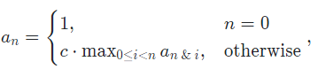
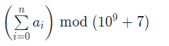
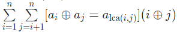

# 20201108CCPC长春
讲题视频：[CCPC2020-第六届中国大学生程序设计竞赛（长春） 讲题视频](https://www.bilibili.com/video/BV1uD4y1R7rk)
题解链接：[CCPC2020长春赛区题解](https://zhuanlan.zhihu.com/p/279287505)
GYM链接：[2020 China Collegiate Programming Contest Changchun Onsite](https://codeforces.com/gym/102832)
题面PDF：[2020CCPC长春statements.pdf](_v_attachments/20201109174832832_1413/2020CCPC长春statements.pdf)

## [A - Krypton](https://pintia.cn/problem-sets/1325328163585343488/problems/1325343094703611904)

## [D - Meaningless Sequence](https://pintia.cn/problem-sets/1325328163585343488/problems/1325343094703611907)
### 题意
已知：

求：

### 分析

## [F - Strange Memory](https://pintia.cn/problem-sets/1325328163585343488/problems/1325343094703611909)
### 题意

给一颗树，求

