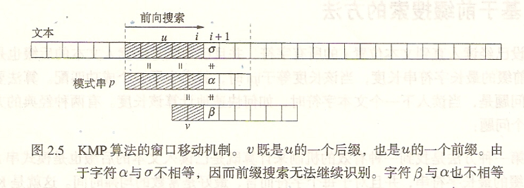

# KMP算法
每读入一个字符，KMP算法就更新既是模式串的前缀、同时也是已读入文本的后缀的最长字符串长度。
如果$v$既是$u$的一个后缀，也是$u$的一个前缀，称$v$是$u$的一个边界。  

  

假设现在已经匹配到了$i$位置，目前已经匹配字符串$u$，$u$既是已读入文本串的后缀，也是模式串的前缀，现在继续读入$u_{i+1}$，即比较$\sigma$和$\alpha$，若相等则继续读入比较，若不相等，则向右滑动模式串，如何确定这个滑动的距离呢？不妨假设模式串向右滑动了若干距离，目前$v$满足既是已读入文本串的后缀，也是模式串的前缀的性质，当前需要比较的就是$\beta$和$\sigma$，容易发现$v$既是$u$的一个前缀，又是$u$的一个后缀，即 **$v$是$u$的一个最长边界** ，这个边界的确定只与模式串有关，因此可以先计算出模式串的每个前缀$u$的最长边界$b(u)$。  

Knuth提出了一个改进，如上图，匹配时已知$\sigma\neq\alpha$，则显然要满足$\alpha\neq\beta$，这个性质也是模式串本身的性质，可以在预处理时考虑进去。  


> 在实际应用中，只有当模式串长度小于8时，KMP才比基于后缀和基于子串的搜索方法有效。而在这个范围内，Shift-And算法和Shift-Or算法能够在所有的机器上运行，速度至少是KMP的两倍，并且更易于实现。  

虽然书上对KMP算法一顿鄙视，但在竞赛中仍然十分重要。在《算法竞赛入门经典训练指南》中提到：尽管最坏情况下朴素匹配算法表现不佳，但实际上对于随机数据，它的表现**非常好**。然而算法竞赛中就（普遍）存在出题人刻意构造数据的情况，因此还是需要掌握，至于Knuth的优化其实也无关紧要，因为MP算法已经足够使用。  


下面来实现一下模板：  
MP算法：  
```cpp
int pre(char *T,int n,char *P,int m,int *f){
    f[0]=0;
    int ans=0,i=(T==P),j=0;
    for(;i<n;i++){
        while(j&&T[i]!=P[j])j=f[j-1];
        if(T[i]==P[j]){
            j++;
            if(T==P)f[i]=j;
        }else if(T==P)f[i]=0;
        if(j==m)ans++,j=0;//pos=i-m+1
    }
    return ans;
}
```


```cpp
#include <bits/stdc++.h>
using namespace std;
const int N=1e5+5;
char T[N],P[N];
int f[N];
int main(){
    while(~scanf(" %s %s",T,P)){
        int n=strlen(T),m=strlen(P);
        f[0]=0;
        for(int i=1;i<m;i++){
            int j=f[i-1];
            while(j&&P[i]!=P[j])j=f[j-1];
            if(P[i]==P[j])f[i]=j+1;
            else f[i]=0;
        }
        for(int i=0,j=0;i<n;i++){
            while(j&&T[i]!=P[j])j=f[j-1];
            if(T[i]==P[j])j=j+1;
            if(j==m){
                printf("%d\n",i-m+1);
            }
        }
    }
    return 0;
}
```
## 例题
### [HDU1711-Number Sequence](http://acm.hdu.edu.cn/showproblem.php?pid=1711)
需要对模板进行简单修改。  

```cpp
#include <cstdio>
#include <cstring>
int pre(int *T,int n,int *P,int m,int *f){
    f[0]=0;
    int i=(T==P),j=0;
    for(;i<n;i++){
        while(j&&T[i]!=P[j])j=f[j-1];
        if(T[i]==P[j]){
            j++;
            if(T==P)f[i]=j;
        }else if(T==P)f[i]=0;
        if(T!=P&&j==m){
            return i-m+2;
        }
    }
    return -1;
}
const int N=1e6+5;
int a[N],b[N],f[N];
int main(){
    int T;
    scanf("%d",&T);
    while(T--){
        int n,m;
        scanf("%d%d",&n,&m);
        for(int i=0;i<n;i++){
            scanf("%d",&a[i]);
        }
        for(int i=0;i<m;i++){
            scanf("%d",&b[i]);
        }
        pre(b,m,b,m,f);
        printf("%d\n",pre(a,n,b,m,f));
    }
    return 0;
}
```
### [HDU2087-剪花布条](http://acm.hdu.edu.cn/showproblem.php?pid=2087)
统计模式串在文本串中出现了多少次（不可重叠）。  

```cpp
#include <bits/stdc++.h>
using namespace std;
int pre(char *T,int n,char *P,int m,int *f){
    f[0]=0;
    int ans=0,i=(T==P),j=0;
    for(;i<n;i++){
        while(j&&T[i]!=P[j])j=f[j-1];
        if(T[i]==P[j]){
            j++;
            if(T==P)f[i]=j;
        }else if(T==P)f[i]=0;
        if(j==m)ans++,j=0;//pos=i-m+1
    }
    return ans;
}
const int N=1005;
char a[N],b[N];
int f[N];
int main(){
    for(;;){
        scanf(" %s",a);
        if(a[0]=='#')break;
        scanf(" %s",b);
        int n=strlen(a),m=strlen(b);
        pre(b,m,b,m,f);
        printf("%d\n",pre(a,n,b,m,f));
    }
    return 0;
}
```

```cpp
#include <bits/stdc++.h>
using namespace std;
const int N=1005;
char a[N],b[N];
int f[N];
int main(){
    for(;;){
        scanf(" %s",a);
        if(a[0]=='#')break;
        scanf(" %s",b);
        int n=strlen(a),m=strlen(b);
        f[0]=0;
        for(int i=1;i<m;i++){
            int j=f[i-1];
            while(j&&b[i]!=b[j])j=f[j-1];
            if(b[i]==b[j])f[i]=j+1;
            else f[i]=0;
        }
        int ans=0;
        for(int i=0,j=0;i<n;i++){
            while(j&&a[i]!=b[j])j=f[j-1];
            if(a[i]==b[j])j++;
            if(j==m){
                ans++;
                j=0;
            }
        }
        printf("%d\n",ans);
    }
    return 0;
}
```

### [HDU1686-Oulipo](http://acm.hdu.edu.cn/showproblem.php?pid=1686)
统计模式串在文本串中出现了多少次（可重叠）。   
只要把模板中匹配成功的`j=0`改成`j=f[j-1]`即可。  

```cpp
#include <bits/stdc++.h>
using namespace std;
int pre(char *T,int n,char *P,int m,int *f){
    f[0]=0;
    int ans=0,i=(T==P),j=0;
    for(;i<n;i++){
        while(j&&T[i]!=P[j])j=f[j-1];
        if(T[i]==P[j]){
            j++;
            if(T==P)f[i]=j;
        }else if(T==P)f[i]=0;
        if(j==m)ans++,j=f[j-1];//pos=i-m+1
    }
    return ans;
}
const int N=1e6+5;
char a[N],b[N];
int f[N];
int main(){
    int T;
    scanf("%d",&T);
    while(T--){
        scanf(" %s",a);
        scanf(" %s",b);
        int n=strlen(a),m=strlen(b);
        pre(a,n,a,n,f);
        printf("%d\n",pre(b,m,a,n,f));
    }
    return 0;
}
```
### [POJ2752-Seek the Name, Seek the Fame](http://poj.org/problem?id=2752)
即从小到大输出**前后缀相同子串**长度的可能值。  
利用next数组加速。  

```cpp
#include <cstdio>
#include <cstring>
using namespace std;
int pre(char *T,int n,char *P,int m,int *f){
    f[0]=0;
    int ans=0,i=(T==P),j=0;
    for(;i<n;i++){
        while(j&&T[i]!=P[j])j=f[j-1];
        if(T[i]==P[j]){
            j++;
            if(T==P)f[i]=j;
        }else if(T==P)f[i]=0;
        if(j==m)ans++,j=0;//pos=i-m+1
    }
    return ans;
}
const int N=4e5+5;
char s[N];
int f[N],a[N],ta=0;
int main(){
    while(~scanf(" %s",s)){
        int n=strlen(s);
        pre(s,n,s,n,f);
        ta=0;
        a[ta++]=n;
        int j=f[n-1];
        while(j){
            a[ta++]=j;
            j=f[j-1];
        }
        for(int i=ta-1;i>=0;i--){
            printf("%d%c",a[i]," \n"[i==0]);
        }
    }
    return 0;
}
```

```cpp
#include <cstdio>
#include <cstring>
const int N=4e5+5;
char s[N];
int f[N],ans[N];
int main(){
    while(~scanf(" %s",s)){
        int n=strlen(s);
        f[0]=0;
        for(int i=1;i<n;i++){
            int j=f[i-1];
            while(j&&s[i]!=s[j])j=f[j-1];
            if(s[i]==s[j])f[i]=j+1;
            else f[i]=0;
        }
        int j=f[n-1],ta=0;
        ans[ta++]=n;
        while(j){
            ans[ta++]=j;
            j=f[j-1];
        }
        for(int i=ta-1;i>=0;i--){
            printf("%d%c",ans[i]," \n"[i==0]);
        }
    }
    return 0;
}
```

### [POJ2406-Power Strings](http://poj.org/problem?id=2406)
用到了$next$数组的一个[性质](https://www.cnblogs.com/wuwangchuxin0924/p/5977503.html)，可以用来判断最小循环节。  

```cpp
#include <cstdio>
#include <cstring>
int pre(char *T,int n,char *P,int m,int *f){
    f[0]=0;
    int ans=0,i=(T==P),j=0;
    for(;i<n;i++){
        while(j&&T[i]!=P[j])j=f[j-1];
        if(T[i]==P[j]){
            j++;
            if(T==P)f[i]=j;
        }else if(T==P)f[i]=0;
        if(j==m)ans++,j=0;//pos=i-m+1
    }
    return ans;
}
const int N=1e6+5;
char s[N];
int f[N];
int main(){
    while(true){
        scanf(" %s",s);
        if(s[0]=='.')break;
        int n=strlen(s);
        pre(s,n,s,n,f);
        if(n%(n-f[n-1]))puts("1");
        else printf("%d\n",n/(n-f[n-1]));
    }
    return 0;
}
```

```cpp
#include <cstdio>
#include <cstring>
const int N=1e6+5;
char s[N];
int f[N];
int main(){
    while(true){
        scanf(" %s",s);
        if(s[0]=='.')break;
        int n=strlen(s);
        f[0]=0;
        for(int i=1;i<n;i++){
            int j=f[i-1];
            while(j&&s[i]!=s[j])j=f[j-1];
            if(s[i]==s[j])f[i]=j+1;
            else f[i]=0;
        }
        if(n%(n-f[n-1]))puts("1");
        else printf("%d\n",n/(n-f[n-1]));
    }
    return 0;
}
```
