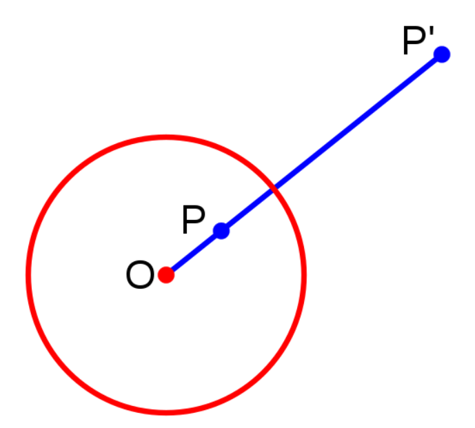
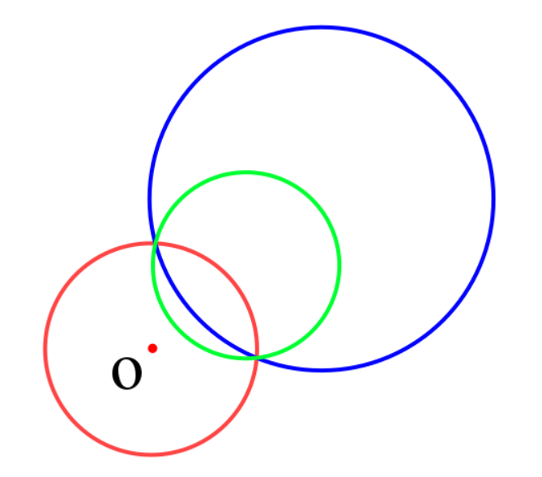
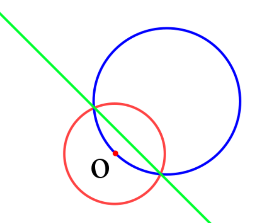

# 反演
[OI-Wiki](https://oi-wiki.org/geometry/inverse/)

> 反演变换适用于题目中存在多个圆/直线之间的相切关系的情况。利用反演变换的性质，在反演空间求解问题，可以大幅简化计算。

满足OP·OP'=R·R，则P与P'互为反演点。

反演点的性质：

1. 圆内的点反演点在圆外，反之亦然。
2. 圆上的点反演点为自身。

蓝绿圆互为反演。

当蓝圆过点O是，反演为不过点O的直线。

**两个图形相切，则他们的反演图形也相切。**

