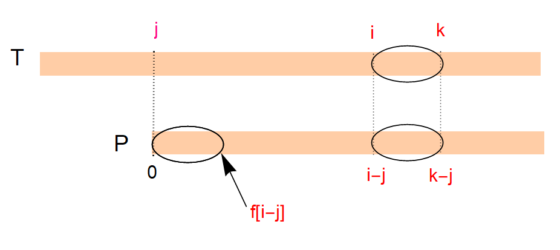
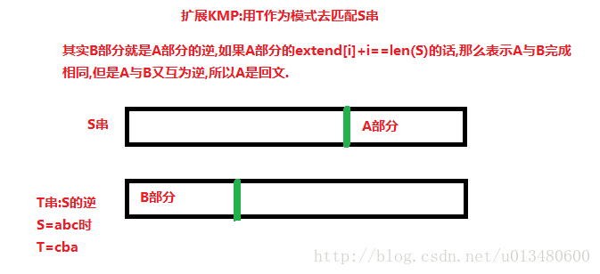

# 扩展KMP算法
有时候我们不仅仅想精确地找模式串$P$。  
比如对于文本串 `ABCDFGAB`，模式串`ABCDE`，我们发现虽然$P$不存在，但它的前缀`ABCD`、`AB`出现了。  
确切地说，我们想知道对于每一个$i$，$T_{i..n}$与$P$的最长公共前缀是多少。  

模板：  

```cpp
#include <bits/stdc++.h>
using namespace std;
const int N=1e5+5;
char T[N],P[N];
int f[N],g[N];
int main(){
    while(~scanf(" %s %s",T,P)){
        int n=strlen(T),m=strlen(P);
        f[0]=0;
        int j=0,k=0;
        for(int i=1;i<m;i++){
            if(k<i)k=i;
            if(k<=i+f[i-j]){
                while(k<m&&P[k]==P[k-i])k++;
                f[i]=k-i;
                j=i;
            }else{
                f[i]=f[i-j];
            }
        }
        j=0,k=0;
        for(int i=0;i<n;i++){
            if(k<i)k=i;
            if(k<=i+f[i-j]){
                while(k<n&&k-i<m&&T[k]==P[k-i])k++;
                g[i]=k-i;
                j=i;
            }else{
                g[i]=g[i-j];
            }
        }
        printf("next: ");
        for(int i=0;i<m;i++){
            printf("%d%c",f[i]," \n"[i==m-1]);
        }
        printf("extend: ");
        for(int i=0;i<n;i++){
            printf("%d%c",g[i]," \n"[i==n-1]);
        }
    }
    return 0;
}
```  

比较难理解，记录分析一下。  
$T$表示文本串，$P$表示模式串，$f$表示$next$数组，但它的含义与KMP算法中的$next$不同。  
$next[i]$的含义是，$P$与$P[i..n]$的最大前缀长度。  
$g$表示$extend$数组，$extend[i]$表示$T[i..n]$与$P$的最大前缀长度。  

模板代码中$i$表示当前正在匹配的位置，$k$表示$T$串中匹配到的最右端，即$max\{j+g[j]\}$。  
下面图是关键。  

  


[Revolving Digits](http://acm.hdu.edu.cn/showproblem.php?pid=4333)  
[Revolving Digits（hdu 4333）题解](https://www.cnblogs.com/harden/p/6250054.html)  

```cpp
#include <bits/stdc++.h>
using namespace std;
const int N=2e5+5;
char s[N];
int f[N],g[N];
int main(){
    int T;
    scanf("%d",&T);
    for(int t=1;t<=T;t++){
        scanf(" %s",s);
        int n=strlen(s);
        f[0]=0;
        for(int i=1;i<n;i++){
            int j=f[i-1];
            while(j&&s[i]!=s[j])j=f[j-1];
            if(s[i]==s[j])f[i]=j+1;
            else f[i]=0;
        }
        if(n%(n-f[n-1])==0)n=n-f[n-1];
        for(int i=0;i<n;i++){
            s[n+i]=s[i];
        }
        s[n<<1]=0;
        g[0]=0;
        int j=0,k=0;
        for(int i=1;i<2*n;i++){
            if(k<i)k=i;
            if(k<=i+g[i-j]){
                while(k<2*n&&s[k]==s[k-i])k++;
                g[i]=k-i;
                j=i;
            }else{
                g[i]=g[i-j];
            }
        }
        int L=0,G=0;
        for(int i=1;i<n;i++){
            if(s[i+g[i]]>s[g[i]])G++;
            else if(s[i+g[i]]<s[g[i]])L++;
        }
        printf("Case %d: %d 1 %d\n",t,L,G);
    }
    return 0;
}
```

出现的问题记录：  
（早上本来要写出来的，结果一直WA，晚上对拍一下才找出问题。:sob:）  

1. 这题要将字符串重复一遍，结果我`n`和`2n`傻傻分不清。  
2. 要比较的字符串，两个都要偏移！


[Best Reward](http://acm.hdu.edu.cn/showproblem.php?pid=3613)  
[题解](https://blog.csdn.net/u013480600/article/details/23041391)  

  

准备写一个接口将处理$next$数组和$extend$数组统一起来。  

通过代码：  

```cpp
#include <bits/stdc++.h>
using namespace std;
const int N=5e5+5;
int n,v[26],a[N],sn[N],tn[N],se[N],te[N];
char s[N],t[N];
void preN(char *P,int *f){
    //printf("pre(%s)\n",P+1);
    int j=1,k=1;
    for(int i=2;i<=n;i++){
        if(k<i)k=i;
        if(k<=i+f[i-j+1]){
            while(k<=n&&P[k]==P[k-i+1])k++;
            f[i]=k-i;
            j=i;
        }else f[i]=f[i-j+1];
        //printf("f[%d]=%d\n",i,f[i]);
    }
}
void preE(char *T,char *P,int *f,int *g){
    int j=1,k=1;
    for(int i=2;i<=n;i++){
        if(k<i)k=i;
        if(k<=i+f[i-j+1]){
            while(k<=n&&T[k]==P[k-i+1])k++;
            g[i]=k-i;
            j=i;
        }else g[i]=f[i-j+1];
    }
}
int main(){
    int T;
    scanf("%d",&T);
    while(T--){
        for(int i=0;i<26;i++)
            scanf("%d",&v[i]);
        scanf(" %s",s+1);
        n=strlen(s+1);
        for(int i=1;i<=n;i++){
            a[i]=a[i-1]+v[s[i]-'a'];
        }
        for(int i=1;i<=n;i++){
            t[i]=s[n-i+1];
        }
        preN(s,sn);
        preN(t,tn);
        preE(s,t,tn,se);//suffix palindrom
        preE(t,s,sn,te);//prefix palindrom
        long long ans=0,sum;
        for(int i=1;i<n;i++){
            //printf("se[%d]=%d,te[%d]=%d\n",i+1,se[i+1],n-i+1,te[n-i+1]);
            sum=0;
            if(i+se[i+1]==n)sum+=a[n]-a[i];
            if(te[n-i+1]==i)sum+=a[i];
            if(sum>ans)ans=sum;
        }
        printf("%lld\n",ans);
    }
    return 0;
}
```
**记住要更新j值**  
写了挺久的，主要是我作死从1开始读入字符串，（一开始以为求前缀要预留一个空位）。  
接下来改一改代码，整理出一份指针版的模板来。  

合并后代码：  
```cpp
#include <bits/stdc++.h>
using namespace std;
const int N=5e5+5;
int n,v[26],a[N],sn[N],tn[N],se[N],te[N];
char s[N],t[N];
void pre(char *T,char *P,int *f,int *g){
    char *j=T,*k=T;
    for(char *i=T+1;*i!=0;i++){
        if(k<i)k=i;
        if(k<=i+f[i-j]){
            while(*k!=0&&*k==*(P+(k-i)))k++;
            *(g+(i-T))=k-i;
            j=i;
        }else *(g+(i-T))=*(f+(i-j));
    }
}
int main(){
    int T;
    scanf("%d",&T);
    while(T--){
        for(int i=0;i<26;i++)
            scanf("%d",&v[i]);
        scanf(" %s",s+1);
        n=strlen(s+1);
        for(int i=1;i<=n;i++){
            a[i]=a[i-1]+v[s[i]-'a'];
        }
        for(int i=1;i<=n;i++){
            t[i]=s[n-i+1];
        }
        pre(s+1,s+1,sn+1,sn+1);
        pre(t+1,t+1,tn+1,tn+1);
        pre(s+1,t+1,tn+1,se+1);//suffix palindrom
        pre(t+1,s+1,sn+1,te+1);//prefix palindrom
        long long ans=0,sum;
        for(int i=1;i<n;i++){
            sum=0;
            if(i+se[i+1]==n)sum+=a[n]-a[i];
            if(te[n-i+1]==i)sum+=a[i];
            if(sum>ans)ans=sum;
        }
        printf("%lld\n",ans);
    }
    return 0;
}
```

指针版模板：  
```cpp
void pre(char *T,char *P,int *f,int *g){
    char *j=T,*k=T;
    for(char *i=T+1;*i!=0;i++){
        if(k<i)k=i;
        if(k<=i+f[i-j]){
            while(*k!=0&&*k==*(P+(k-i)))k++;
            *(g+(i-T))=k-i;
            j=i;
        }else *(g+(i-T))=*(f+(i-j));
    }
}
```

调用方法：  
* 预处理$next$数组，`pre(P,P,next,next);`
* 匹配，`pre(T,P,next,extend);`
* 若读入字符串下标从1开始，在参数处+1即可，注意$next$和$extend$也要加

