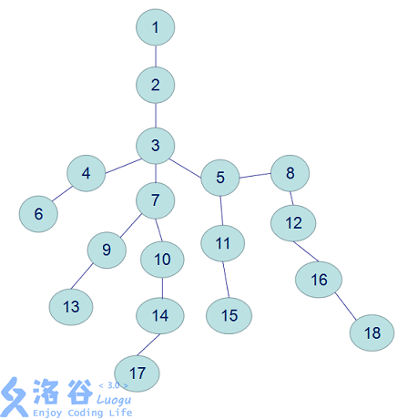

# 最近公共祖先
> 最近公共祖先（LCA），是指在有根树中，找出某两个结点u和v最近的公共祖先。

例如17 和 8 的LCA就是 3。

## 暴力

从u点往上直到根节点，沿途做标记。再从v点往上碰到的第一个标记过的节点即为LCA。

当树退化成一条链时，复杂度为O(n)。

## 倍增

设$fa[i][j]$表示i节点的$2^j$级祖先，`depth[i]`表示节点i的深度。

先把两个点提到同一高度，再统一开始跳。
在跳的时候不能直接跳到它们的LCA，因为这可能会误判。所以我们要跳到它们LCA的下面一层，然后输出它们的父节点，这样就不会误判了。

例题：[How far away ？](http://acm.hdu.edu.cn/showproblem.php?pid=2586)

题意是求树上两点间距离。

