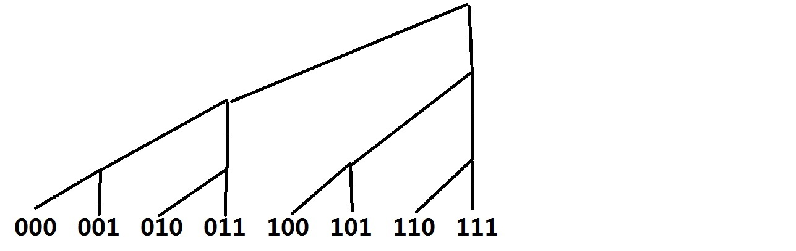

# 树状数组

::: alert-info
树状数组能做的，线段树都能做，但代码量、时间、空间都会大很多，要根据实际情况选择。
:::

## 原理
使用最广泛的一种树状数组原理图：


其中每个结点保存了其所有子节点的值之和。

假设lowbit操作表示取最后一个1，例如lowbit(110)=010

显然一个结点的父节点可以通过不断加lowbit得到。
而要求下标比当前结点小的所有结点值可以不断减lowbit得到。

实际上不了解lowbit也没要紧，只要知道树状数组的原理加上一些位运算的知识也可以。

例如，add操作要不断加上最后一个1，写成位运算就是`x = (x|(x-1))+1`
而get操作是不断减去最后一个1，写成位运算就是`x = x&(x-1)`
这种方式好处是更加灵活，不再拘泥于lowbit。

## 0-index
如果需要适配STL，可以考虑下标从0开始。
参考：[树状数组 （从下标0计数）](https://blog.csdn.net/qq_30080829/article/details/77199475)



容易发现add操作就变成了**将最后一个0变成1**，写成位运算就是`x=x|(x+1)`
get操作比较难看出来，可以看成更新为当前子树的最小子节点的前一个位置，就是**将末尾连续的1变为0再减一**，写成位运算是`x=(&(x+1))-1`

## 单点更新、单点查询
这个标题放在这是为了完备性，用一个数组维护即可。

## 单点更新、区间查询
（这是最基础的树状数组版本）
给定$\{a_n\}$，支持两种操作：修改单个元素（$a_x=a_x+d$），求一段区间和（$a_l+a_{l+1}+\dots+a_r$）。  

[敌兵布阵](http://acm.hdu.edu.cn/showproblem.php?pid=1166)  

```cpp
#include <bits/stdc++.h>
using namespace std;
const int N=5e4+5;
int n,a[N];
int lowbit(int x){
	return x&-x;
}
void update(int x,int v){
	while(x<=n){
		a[x]+=v;
		x+=lowbit(x);
	}
}
int query(int x){
	int s=0;
	while(x>0){
		s+=a[x];
		x-=lowbit(x);
	}
	return s;
}
int main(){
	int T;
	scanf("%d",&T);
	for(int t=1;t<=T;t++){
		memset(a,0,sizeof(a));
		scanf("%d",&n);
		for(int i=1;i<=n;i++){
			int v;
			scanf("%d",&v);
			update(i,v);
		}
		printf("Case %d:\n",t);
		while(true){
			char op[8];
			int x,y;
			scanf(" %s",op);
			if(op[0]=='E')break;
			scanf("%d%d",&x,&y);
			if(op[0]=='Q')printf("%d\n",query(y)-query(x-1));
			if(op[0]=='A')update(x,y);
			if(op[0]=='S')update(x,-y);
		}
	}
	return 0;
}
```

0-index版本：

```cpp
#include <bits/stdc++.h>
using namespace std;
template <typename T>
struct fenwick {
    vector<T> a;
    fenwick(int n) : a(n) {}
    void add(int x, T v) {
        for (int i = x; i < (int)a.size(); i |= (i+1))
            a[i] += v;
    }
    T get(int x) {
        T v{};
        for (int i = x; i >= 0; i = (i & (i+1)) - 1)
            v += a[i];
        return v;
    }
};
int main(){
	int T;
	scanf("%d",&T);
	for(int t=1;t<=T;t++){
        int n;
		scanf("%d",&n);
        fenwick<int> a(n);
		for(int i=0;i<n;i++){
			int v;
			scanf("%d",&v);
            a.add(i, v);
		}
		printf("Case %d:\n",t);
		while(true){
			char op[8];
			int x,y;
			scanf(" %s",op);
			if(op[0]=='E')break;
			scanf("%d%d",&x,&y);
			if(op[0]=='Q')printf("%d\n",a.get(y-1)-a.get(x-2));
			if(op[0]=='A')a.add(x-1,y);
			if(op[0]=='S')a.add(x-1,-y);
		}
	}
	return 0;
}
```

## 区间更新、单点查询
利用[差分](差分.md)，将问题转换为基础版本。

树状数组由维护原始数组变成维护差分数组，其余不变。

[1268. 简单题](https://www.acwing.com/problem/content/1270/)

```cpp
#include <bits/stdc++.h>
using namespace std;
template <typename T>
struct fenwick {
    vector<T> a;
    fenwick(int n) : a(n) {}
    void add(int x, T v) {
        for (int i = x; i < (int)a.size(); i |= (i+1))
            a[i] += v;
    }
    T get(int x) {
        T v{};
        for (int i = x; i >= 0; i = (i & (i+1)) - 1)
            v += a[i];
        return v;
    }
};
int main(){
    ios::sync_with_stdio(false), cin.tie(0);
    int n, m;
    cin >> n >> m;
    fenwick<int> st(n);
    while (m--) {
        int t;
        cin >> t;
        if (t == 1) {
            int l, r;
            cin >> l >> r;
            l--, r--;
            st.add(l, 1);
            st.add(r+1, -1);
        } else {
            int i;
            cin >> i;
            i--;
            cout << (st.get(i) & 1) << '\n';
        }
    }
    return 0;
}
```

## 区间更新、区间查询
可以发现上面已经实现了区间更新，问题是如何实现区间查询。

上面可以快速求出差分数组的前缀和，而我们要求的是原数组的前缀和。

简单推导一下：

设原数组为`a[0..(n-1)]`，差分数组`d[0..(n-1)]`，其中`d[0]=a[0]`，`d[i]=a[i]-a[i-1]`。

现在要求S=a[0]+...+a[i]，而a[i]=d[0]+...+d[i]，代入得S=(i+1)×d[0]+i×d[1]+(i-1)×d[2]+...+d[i]

整理一下让下标统一，可得$S=(i+1)\times \sum\limits_{j=0}^{i}d[j]-\sum\limits_{j=0}^{i}j\times d[j]$

现在思路就很清晰了，维护两个树状数组，一个是差分数组d[i]，另一个是i×d[i]。

这种方法需要一点点推导不过很好理解，在线段树中需要实现相同的功能需要lazy_tag，代码量较大。


## 权值树状数组
树状数组的一个经典应用。  已知$\{a_n\}$，设$c_i=k$表示$i$在$\{a_n\}$中出现了$k$次。（$\{a_n\}$可能要离散化）  
依次插入$\{a_n\}$（更新$c_i$）。则$c_{a_i}$的前缀和即表示$a_i$前面小于$a_i$的数的个数。用树状数组维护即可。  
用此方法同样可以求逆序对。  

[Ping pong](https://vjudge.net/problem/UVALive-4329)  
注意树状数组的大小！  

```cpp
#include <bits/stdc++.h>
using namespace std;
const int N=2e4+5;
const int M=1e5+5;
int n,m,a[N],b[M],c[N],d;
int lowbit(int x){
	return x&-x;
}
void update(int x){
	while(x<M){
		b[x]++;
		x+=lowbit(x);
	}
}
int query(int x){
	int s=0;
	while(x>0){
		s+=b[x];
		x-=lowbit(x);
	}
	return s;
}
int main(){
	int T;
	scanf("%d",&T);
	while(T--){
		memset(b,0,sizeof(b));
		scanf("%d",&n);
		for(int i=1;i<=n;i++){
			scanf("%d",&a[i]);
			c[i]=query(a[i]-1);
			update(a[i]);
		}
		memset(b,0,sizeof(b));
		long long ans=0;
		for(int i=n;i>=1;i--){
			d=query(a[i]-1);
			update(a[i]);
			// printf("c[%d]=%d,d=%d\n",i,c[i],d);
			ans+=1ll*c[i]*(n-i-d)+1ll*d*(i-1-c[i]);
		}
		printf("%lld\n",ans);
	}
	return 0;
}

```  

[Ultra-QuickSort](https://vjudge.net/problem/POJ-2299)  
求逆序对数。需要离散化。  
```cpp
// #include <bits/stdc++.h>
#include <utility>
#include <algorithm>
#include <cstdio>
#include <cstring>
using namespace std;
typedef pair<int,int> pii;
const int N=5e5+5;
int n,v,b[N];
pii a[N];
int lowbit(int x){
	return x&-x;
}
void update(int x){
	while(x<N){
		b[x]++;
		x+=lowbit(x);
	}
}
int query(int x){
	int s=0;
	while(x>0){
		s+=b[x];
		x-=lowbit(x);
	}
	return s;
}
int main(){
	while(~scanf("%d",&n)&&n){
		for(int i=1;i<=n;i++){
			scanf("%d",&v);
			a[i]=pii(v,i);
		}
		sort(a+1,a+1+n);
		long long ans=0;
		memset(b,0,sizeof(b));
		for(int i=1;i<=n;i++){
			ans+=i-1-query(a[i].second-1);
			update(a[i].second);
		}
		printf("%lld\n",ans);
	}
	return 0;
}
```


[树状数组详解](https://www.cnblogs.com/xenny/p/9739600.html)  
[OI-Wiki](https://oi-wiki.org/ds/fenwick/)
[树状数组（Binary Indexed Tree）](https://qoogle.top/binary-indexed-tree/)
